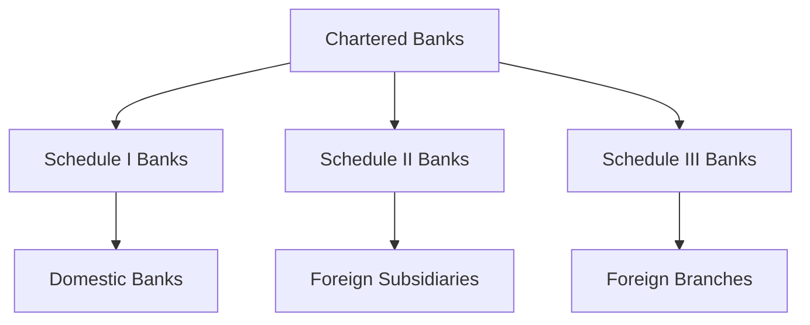

## 1.10 Chartered Banks in Canada

Chartered banks are pivotal to the Canadian economy, serving as the backbone of the financial system. They facilitate economic growth by providing essential services such as accepting deposits, offering loans, and managing payment systems. Understanding the structure and regulation of chartered banks is crucial for anyone involved in the Canadian securities industry.

### Defining Chartered Banks

A **Chartered Bank** is a financial institution licensed under the [Bank Act](https://laws-lois.justice.gc.ca/eng/acts/B-1.01/) to operate in Canada. These banks are authorized to conduct a wide range of financial activities, including accepting deposits, providing loans, and offering investment products. Chartered banks play a critical role in the Canadian economy by ensuring liquidity, facilitating transactions, and supporting economic development.

### Classifications of Banks Under the Bank Act

The Bank Act classifies banks into three categories: Schedule I, Schedule II, and Schedule III. Each classification has distinct characteristics and regulatory requirements.

#### Schedule I Banks

**Schedule I Banks** are domestic banks that are not subsidiaries of foreign banks. These banks are Canadian-owned and are the most prominent players in the Canadian banking landscape. The "Big Six" banks—Royal Bank of Canada (RBC), Toronto-Dominion Bank (TD), Bank of Nova Scotia (Scotiabank), Bank of Montreal (BMO), Canadian Imperial Bank of Commerce (CIBC), and National Bank of Canada—are all Schedule I banks. They offer a full range of banking services and are integral to the Canadian financial system.

#### Schedule II Banks

**Schedule II Banks** are subsidiaries of foreign banks operating in Canada. These banks are incorporated in Canada but are owned by foreign parent banks. Schedule II banks focus on niche markets and often provide specialized services. They are subject to the same regulatory requirements as Schedule I banks but have the flexibility to leverage their parent banks' global expertise and resources.

#### Schedule III Banks

**Schedule III Banks** are branches of foreign banks authorized to operate in Canada. Unlike Schedule II banks, they are not incorporated in Canada. Schedule III banks primarily engage in wholesale banking, focusing on corporate and institutional clients. They have limited retail operations and are subject to specific regulatory requirements tailored to their business model.

### Regulatory Framework Governing Chartered Banks

The regulatory framework for chartered banks in Canada is robust, ensuring stability and consumer protection. The primary legislation governing these banks is the [Bank Act](https://laws-lois.justice.gc.ca/eng/acts/B-1.01/), which outlines the powers, duties, and responsibilities of banks operating in Canada.

#### Key Regulatory Bodies

1. **Office of the Superintendent of Financial Institutions (OSFI):** OSFI is the primary regulator for banks in Canada, overseeing their financial soundness and compliance with the Bank Act.

2. **Financial Consumer Agency of Canada (FCAC):** FCAC ensures that banks comply with consumer protection measures and promotes financial literacy among Canadians.

3. **Canada Deposit Insurance Corporation (CDIC):** CDIC provides deposit insurance to protect consumers' deposits in the event of a bank failure.

#### Regulatory Requirements

Chartered banks must adhere to stringent regulatory requirements, including capital adequacy, liquidity, and risk management standards. These requirements are designed to ensure the stability of the banking system and protect consumers.

### Practical Examples and Case Studies

To illustrate the role and impact of chartered banks, consider the following examples:

- **Investment Strategies of Canadian Pension Funds:** Canadian pension funds often rely on Schedule I banks for investment management services, leveraging their expertise in asset allocation and risk management.

- **RBC's Global Expansion:** As a Schedule I bank, RBC has expanded its operations globally, offering a wide range of financial services while maintaining a strong domestic presence.

- **TD's Acquisition of Foreign Banks:** TD, a Schedule I bank, has expanded its footprint in the United States by acquiring several banks, demonstrating the strategic importance of cross-border operations for Canadian banks.

### Diagrams and Visual Aids

Below is a diagram illustrating the classification of banks under the Bank Act:

### Best Practices and Challenges

#### Best Practices

- **Diversification:** Chartered banks should diversify their services and geographic presence to mitigate risks and capitalize on growth opportunities.
- **Regulatory Compliance:** Maintaining strict compliance with regulatory requirements is essential for sustaining consumer trust and avoiding penalties.

#### Common Challenges

- **Regulatory Changes:** Banks must adapt to evolving regulatory landscapes, which can impact their operations and profitability.
- **Technological Advancements:** The rapid pace of technological change presents both opportunities and challenges for banks, requiring continuous innovation and adaptation.

### Additional Resources

For further exploration of chartered banks and their role in the Canadian financial system, consider the following resources:

- **Books:** *"The Canadian Financial System"* by Geoffrey P. Miller
- **Institutions:** [Big Six Canadian Banks](https://www.cibc.com/en/about-cibc/careers/banks-in-canada.html)
- **Regulations:** [Bank Act](https://laws-lois.justice.gc.ca/eng/acts/B-1.01/)

### Conclusion

Chartered banks are integral to the Canadian economy, providing essential financial services and supporting economic growth. Understanding their classifications, regulatory framework, and best practices is crucial for anyone involved in the Canadian securities industry. By leveraging their strengths and addressing challenges, chartered banks can continue to thrive in an ever-evolving financial landscape.

### **Ready to Test Your Knowledge?**

**Practice 10 Essential CSC Exam Questions to Master Your Certification**



### What is a chartered bank?

- [x] A bank licensed under the Bank Act to operate in Canada
- [ ] A bank operating without a license
- [ ] A bank that only offers investment services
- [ ] A bank that is not regulated

> **Explanation:** A chartered bank is a financial institution licensed under the Bank Act to operate in Canada, offering a wide range of financial services.

### Which of the following is a Schedule I bank?

- [x] Royal Bank of Canada (RBC)
- [ ] HSBC Bank Canada
- [ ] Citibank Canada
- [ ] Bank of America Canada

> **Explanation:** Schedule I banks are domestic banks not subsidiaries of foreign banks, such as RBC.

### What distinguishes Schedule II banks from Schedule III banks?

- [x] Schedule II banks are foreign subsidiaries, while Schedule III banks are foreign branches
- [ ] Schedule II banks are domestic, while Schedule III banks are foreign
- [ ] Schedule II banks are unregulated, while Schedule III banks are regulated
- [ ] Schedule II banks offer retail services, while Schedule III banks do not

> **Explanation:** Schedule II banks are subsidiaries of foreign banks, while Schedule III banks are branches of foreign banks.

### Which regulatory body oversees the financial soundness of banks in Canada?

- [x] Office of the Superintendent of Financial Institutions (OSFI)
- [ ] Financial Consumer Agency of Canada (FCAC)
- [ ] Canada Deposit Insurance Corporation (CDIC)
- [ ] Bank of Canada

> **Explanation:** OSFI is the primary regulator for banks in Canada, ensuring their financial soundness and compliance with the Bank Act.

### What is the primary focus of Schedule III banks?

- [x] Wholesale banking
- [ ] Retail banking
- [ ] Investment banking
- [ ] Microfinance

> **Explanation:** Schedule III banks primarily engage in wholesale banking, focusing on corporate and institutional clients.

### Which of the following is a key challenge for chartered banks?

- [x] Adapting to regulatory changes
- [ ] Lack of technological advancements
- [ ] Limited access to capital
- [ ] High consumer trust

> **Explanation:** Adapting to regulatory changes is a common challenge for chartered banks, impacting their operations and profitability.

### What is the role of the Financial Consumer Agency of Canada (FCAC)?

- [x] Ensuring banks comply with consumer protection measures
- [ ] Providing deposit insurance
- [ ] Regulating the financial soundness of banks
- [ ] Setting monetary policy

> **Explanation:** FCAC ensures that banks comply with consumer protection measures and promotes financial literacy among Canadians.

### How do Schedule I banks differ from Schedule II banks?

- [x] Schedule I banks are domestic, while Schedule II banks are foreign subsidiaries
- [ ] Schedule I banks are unregulated, while Schedule II banks are regulated
- [ ] Schedule I banks focus on wholesale banking, while Schedule II banks focus on retail banking
- [ ] Schedule I banks are branches of foreign banks, while Schedule II banks are domestic

> **Explanation:** Schedule I banks are domestic banks not subsidiaries of foreign banks, whereas Schedule II banks are subsidiaries of foreign banks.

### What is the purpose of the Canada Deposit Insurance Corporation (CDIC)?

- [x] Providing deposit insurance to protect consumers' deposits
- [ ] Regulating the financial soundness of banks
- [ ] Ensuring banks comply with consumer protection measures
- [ ] Setting interest rates

> **Explanation:** CDIC provides deposit insurance to protect consumers' deposits in the event of a bank failure.

### True or False: Schedule III banks are incorporated in Canada.

- [ ] True
- [x] False

> **Explanation:** Schedule III banks are branches of foreign banks and are not incorporated in Canada.


