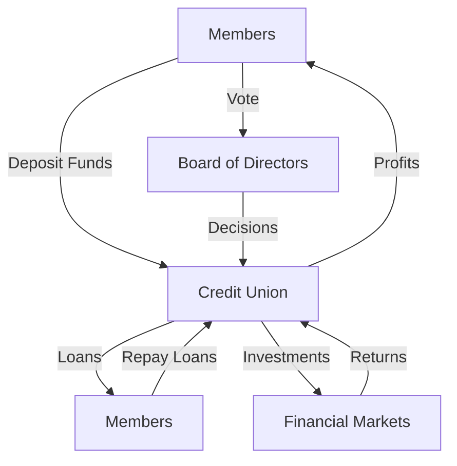

## 1.12 Credit Unions and Caisses Populaires

Credit unions and caisses populaires are integral components of the Canadian financial landscape, offering a unique cooperative approach to banking and financial services. These institutions play a significant role in providing accessible financial services to their members, emphasizing community involvement and member ownership. In this section, we will delve into the nature of these institutions, their cooperative model, the services they offer, and their regulatory framework within Canada.

### Understanding Credit Unions and Caisses Populaires

**Credit Union:** A credit union is a member-owned financial cooperative that provides a wide range of banking services. Unlike traditional banks, credit unions are not-for-profit entities that prioritize serving their members rather than maximizing profits. Members of a credit union are both customers and owners, which means they have a say in how the institution is run.

**Caisse Populaire:** Predominantly found in Quebec, caisses populaires are similar to credit unions but are deeply rooted in the Francophone community. They operate under the same cooperative principles and offer similar services, often tailored to the needs of their local communities.

### The Cooperative Model and Membership Requirements

The cooperative model is the cornerstone of credit unions and caisses populaires. This model is characterized by democratic control, where each member has one vote, regardless of the amount of money they have deposited. This ensures that the institution operates in the best interest of its members.

**Membership Requirements:** To become a member of a credit union or caisse populaire, individuals typically need to meet certain criteria, which may include living in a specific geographic area, working for a particular employer, or belonging to a certain group. Membership often requires purchasing a share in the cooperative, which grants voting rights and a share in any profits distributed.

### Services Offered by Credit Unions

Credit unions and caisses populaires offer a comprehensive range of financial services similar to those provided by traditional banks. These services include:

- **Savings and Checking Accounts:** Members can open savings and checking accounts with competitive interest rates and low fees.
- **Loans and Mortgages:** Credit unions offer personal loans, auto loans, and mortgages with favorable terms and interest rates.
- **Investment Services:** Many credit unions provide investment products such as mutual funds, retirement savings plans (RRSPs), and tax-free savings accounts (TFSAs).
- **Insurance Products:** Members can access various insurance products, including life, home, and auto insurance.
- **Financial Planning and Advice:** Credit unions often offer financial planning services to help members manage their finances and plan for the future.

### Regulatory Framework and Institutions

Credit unions and caisses populaires in Canada are subject to a robust regulatory framework designed to ensure their stability and protect members' interests. The [Cooperative Credit Associations Act](https://laws-lois.justice.gc.ca/eng/acts/C-8.5/) governs the operations of these institutions at the federal level, while provincial regulations may also apply.

One of the largest and most well-known institutions in this sector is the [Desjardins Group](https://www.desjardins.com/), a federation of caisses populaires in Quebec and the largest cooperative financial group in Canada. Desjardins exemplifies the cooperative model's success, offering a wide range of financial products and services to its members.

### Practical Examples and Case Studies

Consider the case of a small community in rural Ontario where a local credit union has been instrumental in supporting local businesses and providing financial education to residents. By offering low-interest loans and personalized financial advice, the credit union has helped stimulate economic growth and improve the financial well-being of its members.

Another example is the Desjardins Group, which has successfully expanded its services beyond Quebec, offering innovative financial products and maintaining a strong commitment to community development and environmental sustainability.

### Diagrams and Visual Aids

To better understand the structure and operations of credit unions, consider the following diagram illustrating the flow of funds and decision-making within a cooperative financial institution:

### Best Practices and Challenges

**Best Practices:**
- Emphasize member education and engagement to ensure informed decision-making.
- Maintain transparency in operations and financial reporting.
- Foster community involvement and support local initiatives.

**Common Challenges:**
- Competing with larger banks that have more resources and broader service offerings.
- Navigating complex regulatory environments that vary by province.
- Adapting to technological advancements and digital banking trends.

### Additional Resources

For those interested in exploring further, consider the following resources:
- [Cooperative Credit Associations Act](https://laws-lois.justice.gc.ca/eng/acts/C-8.5/)
- [Desjardins Group](https://www.desjardins.com/)
- "Benefits of Credit Unions" - [Consumer Financial Protection Bureau](https://www.consumerfinance.gov/about-us/blog/benefits-credit-unions/)

### Conclusion

Credit unions and caisses populaires offer a compelling alternative to traditional banking, emphasizing member ownership, community involvement, and cooperative principles. By understanding their unique structure and services, individuals can make informed decisions about their financial needs and consider joining these member-focused institutions.

### **Ready to Test Your Knowledge?**

**Practice 10 Essential CSC Exam Questions to Master Your Certification**



### What is a credit union?

- [x] A member-owned financial cooperative offering banking services.
- [ ] A government-owned bank.
- [ ] A private investment firm.
- [ ] A non-profit organization unrelated to banking.

> **Explanation:** A credit union is a member-owned financial cooperative that provides banking services to its members.

### What is the primary characteristic of the cooperative model?

- [x] Members own and control the organization.
- [ ] The organization is controlled by a board of investors.
- [ ] The organization is run by government officials.
- [ ] The organization is owned by a single individual.

> **Explanation:** In the cooperative model, members own and control the organization, ensuring decisions are made in their best interest.

### What is a caisse populaire?

- [x] A type of credit union prevalent in Quebec.
- [ ] A government savings bond.
- [ ] A private bank in Ontario.
- [ ] A financial advisory firm.

> **Explanation:** A caisse populaire is a type of credit union that is particularly common in Quebec, operating under cooperative principles.

### Which of the following services is typically offered by credit unions?

- [x] Savings and checking accounts.
- [ ] Only investment services.
- [ ] Only insurance products.
- [ ] Only financial planning.

> **Explanation:** Credit unions offer a wide range of services, including savings and checking accounts, loans, and investment services.

### What is required to become a member of a credit union?

- [x] Meeting specific criteria and purchasing a share in the cooperative.
- [ ] Simply opening an account with any amount.
- [ ] Being a government employee.
- [ ] Having a minimum deposit of $10,000.

> **Explanation:** Membership typically requires meeting certain criteria and purchasing a share in the cooperative, granting voting rights.

### Which act governs the operations of credit unions at the federal level in Canada?

- [x] Cooperative Credit Associations Act.
- [ ] Bank Act.
- [ ] Financial Institutions Act.
- [ ] Securities Act.

> **Explanation:** The Cooperative Credit Associations Act governs the operations of credit unions at the federal level in Canada.

### What is one of the largest cooperative financial groups in Canada?

- [x] Desjardins Group.
- [ ] Royal Bank of Canada.
- [ ] Bank of Montreal.
- [ ] Scotiabank.

> **Explanation:** Desjardins Group is one of the largest cooperative financial groups in Canada, based in Quebec.

### What is a common challenge faced by credit unions?

- [x] Competing with larger banks.
- [ ] Having too many members.
- [ ] Excessive government funding.
- [ ] Lack of regulatory oversight.

> **Explanation:** Credit unions often face the challenge of competing with larger banks that have more resources.

### Which of the following is a best practice for credit unions?

- [x] Emphasizing member education and engagement.
- [ ] Focusing solely on profit maximization.
- [ ] Limiting community involvement.
- [ ] Reducing transparency in operations.

> **Explanation:** Emphasizing member education and engagement is a best practice for credit unions to ensure informed decision-making.

### True or False: Credit unions are for-profit institutions.

- [ ] True
- [x] False

> **Explanation:** Credit unions are not-for-profit institutions that prioritize serving their members over maximizing profits.


