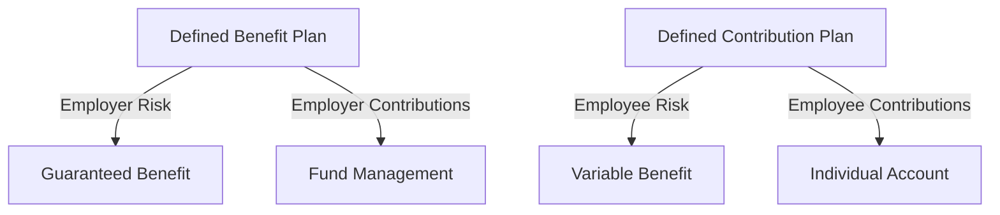

## 1.18 Social and Economic Shifts

The Canadian financial services industry is continually evolving, influenced by a myriad of social and economic shifts. Understanding these changes is crucial for financial professionals as they navigate the complexities of financial planning and investment strategies. This section delves into the impact of demographic changes, the transition from defined benefit to defined contribution pension plans, and the influence of savings rates and debt levels on financial planning.

### Impact of Demographic Changes

Demographics, defined as statistical data relating to the population and particular groups within it, play a pivotal role in shaping the financial services industry. In Canada, several demographic trends are influencing financial markets and investment strategies:

1. **Aging Population**: Canada is experiencing a significant demographic shift as the baby boomer generation enters retirement. This trend increases the demand for retirement planning services and products tailored to older adults, such as annuities and long-term care insurance. Financial advisors must adapt to meet the needs of this growing segment.

2. **Diverse Population**: Canada's multicultural society brings diverse financial needs and preferences. Financial institutions must offer products and services that cater to various cultural backgrounds and financial literacy levels, ensuring inclusivity and accessibility.

3. **Millennial and Gen Z Investors**: Younger generations are entering the workforce and beginning to invest. These groups are tech-savvy and value sustainability, prompting financial institutions to offer digital solutions and socially responsible investment options.

### Transition from Defined Benefit to Defined Contribution Pension Plans

The shift from defined benefit (DB) to defined contribution (DC) pension plans is a significant trend in the Canadian retirement landscape. Understanding the differences between these plans is essential for financial professionals:

- **Defined Benefit Pension Plan**: This retirement plan promises a specified monthly benefit at retirement, often based on salary and years of service. The employer bears the investment risk and is responsible for ensuring sufficient funds to meet future obligations.

- **Defined Contribution Pension Plan**: In this plan, the employer, employee, or both make regular contributions to an individual account. The retirement benefit depends on the contributions made and the investment performance of the account. The employee bears the investment risk.

The transition to DC plans shifts the responsibility of retirement savings from employers to employees, requiring individuals to take a more active role in managing their retirement funds. Financial advisors must educate clients on investment strategies and risk management to ensure adequate retirement savings.

### Influence of Savings Rates and Debt Levels

Savings rates and debt levels are critical factors in financial planning and investment decisions. In Canada, these elements have a profound impact on individual financial health and the broader economy:

1. **Savings Rates**: The rate at which individuals save affects their ability to invest and plan for future financial goals. Higher savings rates enable greater investment in financial markets, contributing to economic growth. Financial advisors should encourage clients to prioritize savings to build a robust financial foundation.

2. **Debt Levels**: The debt-to-income ratio, a measure of an individual's monthly debt payments compared to their monthly gross income, is a key indicator of financial stability. High debt levels can constrain financial flexibility and limit investment opportunities. Advisors must help clients manage debt effectively to maintain financial health.

### Practical Examples and Case Studies

To illustrate these concepts, consider the following real-world scenarios:

- **Canadian Pension Funds**: Major Canadian pension funds, such as the Canada Pension Plan Investment Board (CPPIB), have adapted to demographic changes by diversifying their investment portfolios globally to ensure sustainable returns for an aging population.

- **RBC's Digital Solutions**: The Royal Bank of Canada (RBC) has embraced digital transformation to cater to younger investors, offering mobile banking apps and online investment platforms that align with the preferences of Millennials and Gen Z.

- **Debt Management Strategies**: Financial advisors often use tools like the debt snowball or avalanche methods to help clients reduce their debt-to-income ratios, freeing up resources for savings and investment.

### Diagrams and Visual Aids

To enhance understanding, consider the following diagram illustrating the transition from DB to DC pension plans:

### Best Practices and Challenges

Financial professionals should consider the following best practices and challenges:

- **Best Practices**: Stay informed about demographic trends, offer personalized financial advice, and leverage technology to meet diverse client needs.

- **Challenges**: Address the financial literacy gap, manage the risks associated with DC plans, and balance debt reduction with savings goals.

### References and Additional Resources

For further exploration, consider the following resources:

- **Statistics Canada**: [Statistics Canada](https://www.statcan.gc.ca/) provides comprehensive demographic data and economic indicators.
- **Canadian Pensioners Association**: "The Shift from Defined Benefit to Defined Contribution Plans" - [Canadian Pensioners Association](https://www.cpa.ca/)
- **Books**: *"Pensions and Retirement Provision for Workers in Canada"* by Paul Beaudoin offers an in-depth analysis of the Canadian pension system.

### Conclusion

Understanding social and economic shifts is crucial for financial professionals navigating the Canadian financial services industry. By analyzing demographic changes, pension plan transitions, and savings behaviors, advisors can provide informed guidance to clients, helping them achieve their financial goals in a dynamic environment.

### **Ready to Test Your Knowledge?**

**Practice 10 Essential CSC Exam Questions to Master Your Certification**



### How does an aging population impact the financial services industry in Canada?

- [x] Increases demand for retirement planning services
- [ ] Decreases demand for retirement planning services
- [ ] Has no impact on the financial services industry
- [ ] Leads to a decrease in financial literacy

> **Explanation:** An aging population increases the demand for retirement planning services as more individuals approach retirement age and seek financial advice.

### What is a key difference between defined benefit and defined contribution pension plans?

- [x] Defined benefit plans promise a specified monthly benefit at retirement
- [ ] Defined contribution plans promise a specified monthly benefit at retirement
- [ ] Both plans promise a specified monthly benefit at retirement
- [ ] Neither plan involves employer contributions

> **Explanation:** Defined benefit plans promise a specified monthly benefit at retirement, whereas defined contribution plans do not guarantee a specific benefit amount.

### What role do savings rates play in financial planning?

- [x] They affect an individual's ability to invest and plan for future goals
- [ ] They have no impact on financial planning
- [ ] They only affect short-term financial goals
- [ ] They are irrelevant to investment decisions

> **Explanation:** Savings rates affect an individual's ability to invest and plan for future financial goals, making them a crucial component of financial planning.

### How does a high debt-to-income ratio affect financial planning?

- [x] It can constrain financial flexibility and limit investment opportunities
- [ ] It enhances financial flexibility and increases investment opportunities
- [ ] It has no impact on financial planning
- [ ] It only affects retirement planning

> **Explanation:** A high debt-to-income ratio can constrain financial flexibility and limit investment opportunities, making it important to manage debt effectively.

### Which demographic trend is influencing Canadian financial markets?

- [x] Aging population
- [ ] Decreasing population
- [x] Diverse population
- [ ] Homogeneous population

> **Explanation:** Both the aging population and the diverse population are influencing Canadian financial markets by changing the demand for financial products and services.

### What is the primary responsibility shift in defined contribution pension plans?

- [x] From employer to employee
- [ ] From employee to employer
- [ ] From government to employer
- [ ] From employer to government

> **Explanation:** In defined contribution pension plans, the primary responsibility for retirement savings shifts from the employer to the employee.

### How can financial advisors help clients manage high debt levels?

- [x] By using debt reduction strategies like the snowball or avalanche methods
- [ ] By ignoring debt and focusing on savings
- [x] By prioritizing debt management in financial planning
- [ ] By advising clients to take on more debt

> **Explanation:** Financial advisors can help clients manage high debt levels by using debt reduction strategies and prioritizing debt management in financial planning.

### What is a key challenge in transitioning from DB to DC pension plans?

- [x] Managing the investment risk now borne by employees
- [ ] Ensuring employers bear all investment risks
- [ ] Guaranteeing a specified monthly benefit
- [ ] Eliminating employee contributions

> **Explanation:** A key challenge in transitioning from DB to DC pension plans is managing the investment risk now borne by employees, who must take a more active role in their retirement planning.

### Why is it important for financial institutions to offer digital solutions?

- [x] To cater to tech-savvy younger generations
- [ ] To reduce costs for older generations
- [ ] To eliminate the need for financial advisors
- [ ] To focus solely on traditional banking methods

> **Explanation:** Offering digital solutions is important to cater to tech-savvy younger generations who prefer online and mobile banking options.

### True or False: A diverse population in Canada requires financial institutions to offer culturally inclusive products.

- [x] True
- [ ] False

> **Explanation:** True. A diverse population requires financial institutions to offer culturally inclusive products to meet the varied financial needs and preferences of different cultural groups.


