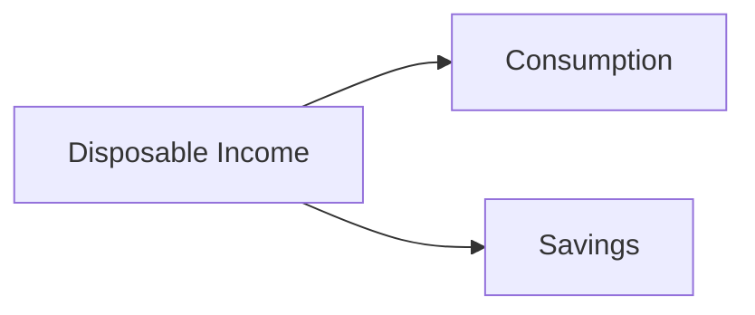

## 1.19 Savings Rates in Canada

Savings rates in Canada have been a topic of significant interest and concern among economists, policymakers, and individuals alike. Understanding these rates is crucial for assessing the financial health of Canadian households and the broader economy. This section delves into the current trends in savings rates among Canadians, explores the implications of low savings rates on individual financial security, and provides actionable strategies for improving personal savings habits.

### Current Trends in Savings Rates Among Canadians

The savings rate, defined as the percentage of disposable income that households save rather than spend, is a key indicator of financial stability. In recent years, Canada has experienced fluctuations in savings rates, influenced by various economic factors such as interest rates, inflation, and consumer confidence.

#### Recent Data and Analysis

According to Statistics Canada, the household savings rate has seen a decline over the past few decades, with occasional spikes during economic downturns. For instance, during the COVID-19 pandemic, savings rates temporarily increased as Canadians reduced spending due to lockdowns and uncertainty. However, as the economy reopened, savings rates began to normalize, reflecting pre-pandemic levels.

This diagram illustrates the basic flow of disposable income into consumption and savings. The balance between these two components is crucial for understanding savings behavior.

### Implications of Low Savings Rates on Individual Financial Security

Low savings rates can have profound implications on individual financial security and the economy at large. Here are some key considerations:

#### Impact on Retirement Planning

With lower savings rates, many Canadians may find themselves inadequately prepared for retirement. The reliance on government programs such as the Canada Pension Plan (CPP) and Old Age Security (OAS) may not suffice to maintain the desired standard of living in retirement.

#### Vulnerability to Economic Shocks

A low savings rate leaves individuals more vulnerable to economic shocks, such as job loss or unexpected expenses. Without a financial cushion, Canadians may resort to high-interest debt, exacerbating financial insecurity.

### Strategies for Improving Personal Savings Habits

Improving savings habits is essential for enhancing financial security. Here are some strategies that Canadians can adopt:

#### Utilize Registered Accounts

1. **Registered Retirement Savings Plan (RRSP):** Contributing to an RRSP provides tax advantages, as contributions are tax-deductible and investments grow tax-deferred until withdrawal. This can significantly enhance retirement savings.

2. **Tax-Free Savings Account (TFSA):** A TFSA allows Canadians to earn investment income tax-free, providing flexibility for both short-term and long-term savings goals.

#### Automate Savings

Setting up automatic transfers from a checking account to a savings account can help individuals save consistently without having to make conscious decisions each month.

#### Budgeting and Financial Planning

Creating a detailed budget can help identify areas where spending can be reduced, allowing for increased savings. Financial planning tools and apps can assist in tracking expenses and setting savings goals.

#### Increase Financial Literacy

Educating oneself about personal finance can empower individuals to make informed decisions about saving and investing. Resources such as books, online courses, and financial advisors can provide valuable insights.

### Glossary

- **Savings Rate:** The percentage of disposable income that households save rather than spend.
- **Registered Retirement Savings Plan (RRSP):** A government-registered plan that provides tax advantages for savings and retirement planning.
- **Tax-Free Savings Account (TFSA):** A savings account that allows Canadians to earn investment income tax-free.

### Additional Resources

For further exploration of savings rates and financial planning in Canada, consider the following resources:

- **Institutions:** [Canada Revenue Agency (CRA) on RRSPs and TFSAs](https://www.canada.ca/en/revenue-agency/services/tax/individuals/topics/rrsps-related-plans.html)
- **Articles:** "Understanding Savings Rates and Their Impact" - [The Globe and Mail](https://www.theglobeandmail.com/business/article-understanding-savings-rates/)
- **Books:** *"Your Complete Guide to Personal Finance"* by Jane Bryant Quinn

### Conclusion

Understanding and improving savings rates is crucial for the financial well-being of Canadians. By leveraging registered accounts, automating savings, and increasing financial literacy, individuals can enhance their financial security and prepare for future challenges. As the economic landscape evolves, staying informed and proactive about savings strategies will remain essential.

### **Ready to Test Your Knowledge?**

**Practice 10 Essential CSC Exam Questions to Master Your Certification**



### What is the savings rate?

- [x] The percentage of disposable income that households save rather than spend.
- [ ] The total amount of money spent by households.
- [ ] The interest rate on savings accounts.
- [ ] The percentage of income spent on taxes.

> **Explanation:** The savings rate is defined as the percentage of disposable income that households save rather than spend.

### How can a low savings rate impact retirement planning?

- [x] It may lead to inadequate preparation for retirement.
- [ ] It ensures a higher standard of living in retirement.
- [ ] It has no impact on retirement planning.
- [ ] It guarantees sufficient government support.

> **Explanation:** A low savings rate can result in inadequate preparation for retirement, as individuals may not have enough savings to maintain their desired standard of living.

### What is one advantage of contributing to an RRSP?

- [x] Contributions are tax-deductible.
- [ ] Contributions are taxed immediately.
- [ ] Contributions have no tax implications.
- [ ] Contributions are limited to $1,000 per year.

> **Explanation:** Contributions to an RRSP are tax-deductible, which can reduce taxable income and enhance retirement savings.

### What is a benefit of a TFSA?

- [x] Investment income is earned tax-free.
- [ ] Contributions are taxed at a higher rate.
- [ ] Withdrawals are taxed heavily.
- [ ] It is only for short-term savings.

> **Explanation:** A TFSA allows Canadians to earn investment income tax-free, providing flexibility for both short-term and long-term savings goals.

### Which strategy can help improve personal savings habits?

- [x] Automating savings
- [ ] Increasing spending
- [x] Budgeting and financial planning
- [ ] Ignoring financial literacy

> **Explanation:** Automating savings and budgeting are effective strategies for improving personal savings habits, while increasing spending and ignoring financial literacy are not.

### What is a potential consequence of low savings rates during economic shocks?

- [x] Increased vulnerability to financial insecurity
- [ ] Guaranteed financial stability
- [ ] No impact on financial security
- [ ] Decreased reliance on debt

> **Explanation:** Low savings rates can increase vulnerability to financial insecurity during economic shocks, as individuals may lack a financial cushion.

### How can financial literacy impact savings habits?

- [x] It empowers individuals to make informed decisions.
- [ ] It has no impact on savings habits.
- [x] It helps individuals understand financial products.
- [ ] It discourages saving.

> **Explanation:** Financial literacy empowers individuals to make informed decisions and understand financial products, positively impacting savings habits.

### What role does consumer confidence play in savings rates?

- [x] It influences spending and saving behavior.
- [ ] It has no impact on savings rates.
- [ ] It only affects investment decisions.
- [ ] It guarantees high savings rates.

> **Explanation:** Consumer confidence influences spending and saving behavior, affecting savings rates.

### Why is automating savings beneficial?

- [x] It ensures consistent saving without conscious effort.
- [ ] It decreases the amount saved.
- [ ] It complicates the savings process.
- [ ] It requires manual transfers each month.

> **Explanation:** Automating savings ensures consistent saving without the need for conscious effort, making it easier to build savings over time.

### True or False: A TFSA allows for tax-free investment income.

- [x] True
- [ ] False

> **Explanation:** True. A TFSA allows Canadians to earn investment income tax-free, providing a significant advantage for savings growth.


