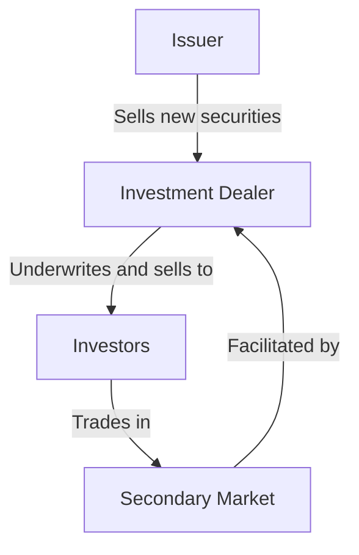

## 1.3 Overview of Investment Dealers

Investment dealers are pivotal entities within the Canadian securities industry, serving as intermediaries between investors and the financial markets. They facilitate the buying and selling of securities, provide investment advice, and play a crucial role in the underwriting of new securities. This section delves into the functions, roles, and regulatory environment of investment dealers, offering insights into their operations and significance in the financial ecosystem.

### Defining Investment Dealers

Investment dealers, also known as broker-dealers, are financial institutions that engage in the trading of securities. They operate within the securities industry to provide a range of services, including executing trades, underwriting new issues, and offering investment advice. In Canada, investment dealers are regulated by the Investment Industry Regulatory Organization of Canada (IIROC), ensuring they adhere to industry standards and protect investor interests.

### Roles and Functions of Investment Dealers

Investment dealers perform several key functions in the securities market:

1. **Facilitating Transactions:** Investment dealers execute buy and sell orders for securities on behalf of their clients. They ensure that transactions are conducted efficiently and at competitive prices.

2. **Providing Investment Advice:** Many investment dealers offer advisory services, helping clients make informed investment decisions based on market analysis and financial goals.

3. **Underwriting New Issues:** Investment dealers play a critical role in the primary market by underwriting new securities. This involves purchasing securities from issuers and selling them to the public, thus providing companies with the capital needed for growth and development.

4. **Market Making:** Some investment dealers act as market makers, providing liquidity by buying and selling securities from their own inventory. This helps maintain market stability and ensures that securities can be traded readily.

### Principal vs. Agency Transactions

Investment dealers can operate in two primary capacities: as principals or as agents. Understanding these roles is essential for grasping how investment dealers function within the market.

#### Principal Transactions

In a principal transaction, an investment dealer buys or sells securities from its own inventory. This means the dealer is acting as the counterparty to the client's trade. By doing so, the dealer assumes the risk of holding the securities, which can lead to profits or losses depending on market movements. Principal transactions are common in market-making activities, where dealers provide liquidity to the market.

#### Agency Transactions

Conversely, in an agency transaction, the investment dealer acts on behalf of the client without owning the securities. The dealer facilitates the trade between the buyer and seller, earning a commission or fee for the service. Agency transactions are typical in brokerage services, where the dealer's primary role is to execute trades on behalf of clients.

### Underwriting and Secondary Market Activities

Investment dealers are integral to both the primary and secondary markets. Their activities in these areas are crucial for the functioning of the securities industry.

#### Underwriting in the Primary Market

Underwriting involves the investment dealer purchasing securities directly from the issuer and reselling them to investors. This process is vital for companies seeking to raise capital through initial public offerings (IPOs) or other new issues. The dealer assesses the market demand, sets the offering price, and assumes the risk of distributing the securities.

#### Secondary Market Activities

In the secondary market, investment dealers facilitate the trading of existing securities. They provide a platform for investors to buy and sell securities, ensuring liquidity and price discovery. By participating in the secondary market, dealers help maintain market efficiency and stability.

### Regulatory Environment

Investment dealers in Canada are subject to stringent regulations to ensure market integrity and protect investors. The Investment Industry Regulatory Organization of Canada (IIROC) oversees the activities of investment dealers, enforcing rules related to capital adequacy, business conduct, and market surveillance. Compliance with IIROC regulations is mandatory for all registered dealers, ensuring they operate transparently and ethically.

### Practical Examples and Case Studies

To illustrate the role of investment dealers, consider the following examples:

- **Case Study: RBC Capital Markets** - As one of Canada's leading investment dealers, RBC Capital Markets provides a wide range of services, including underwriting, advisory, and trading. Their involvement in major IPOs showcases the critical role of investment dealers in capital formation.

- **Example: Market Making by TD Securities** - TD Securities acts as a market maker in various securities, providing liquidity and facilitating efficient trading. Their activities help stabilize the market and ensure that investors can buy and sell securities with ease.

### Diagrams and Visuals

To better understand the flow of transactions and the role of investment dealers, consider the following diagram illustrating the process of underwriting and secondary market trading:

### Best Practices and Challenges

Investment dealers must navigate various challenges, including market volatility, regulatory compliance, and technological advancements. Best practices for investment dealers include maintaining robust risk management systems, ensuring compliance with regulatory standards, and leveraging technology to enhance trading efficiency.

### Additional Resources

For further exploration of investment dealers and their role in the securities industry, consider the following resources:

- **Investment Industry Regulatory Organization of Canada (IIROC):** [IIROC Website](https://www.iiroc.ca/)
- **Article:** "Understanding Investment Dealers" - [The Balance](https://www.thebalance.com/investment-dealers-357514)

### Conclusion

Investment dealers are indispensable to the Canadian securities industry, facilitating transactions, providing liquidity, and supporting capital formation. By understanding their roles and functions, investors can better navigate the financial markets and make informed decisions. As the industry evolves, investment dealers will continue to adapt, leveraging technology and innovation to meet the needs of their clients and the market.

### **Ready to Test Your Knowledge?**

**Practice 10 Essential CSC Exam Questions to Master Your Certification**



### What is the primary role of investment dealers in the securities industry?

- [x] Facilitating transactions and providing investment advice
- [ ] Issuing new securities
- [ ] Regulating financial markets
- [ ] Managing investment funds

> **Explanation:** Investment dealers facilitate transactions and provide investment advice, acting as intermediaries in the securities industry.

### In a principal transaction, what role does the investment dealer play?

- [x] Acts as the counterparty to the client's trade
- [ ] Acts on behalf of the client without owning the securities
- [ ] Only provides investment advice
- [ ] Regulates the transaction

> **Explanation:** In a principal transaction, the dealer buys or sells securities from its own inventory, acting as the counterparty.

### What is the significance of underwriting in the primary market?

- [x] It helps companies raise capital through new securities
- [ ] It regulates the trading of existing securities
- [ ] It provides investment advice to clients
- [ ] It manages investment portfolios

> **Explanation:** Underwriting involves purchasing new securities from issuers and selling them to investors, helping companies raise capital.

### Which organization regulates investment dealers in Canada?

- [x] Investment Industry Regulatory Organization of Canada (IIROC)
- [ ] Canadian Securities Administrators (CSA)
- [ ] Financial Services Regulatory Authority (FSRA)
- [ ] Bank of Canada

> **Explanation:** IIROC is responsible for regulating investment dealers in Canada, ensuring compliance with industry standards.

### What is the difference between principal and agency transactions?

- [x] Principal transactions involve the dealer's own inventory; agency transactions involve acting on behalf of clients
- [ ] Principal transactions involve acting on behalf of clients; agency transactions involve the dealer's own inventory
- [ ] Both involve the dealer's own inventory
- [ ] Both involve acting on behalf of clients

> **Explanation:** Principal transactions involve the dealer's own inventory, while agency transactions involve acting on behalf of clients.

### How do investment dealers contribute to market stability?

- [x] By providing liquidity and facilitating efficient trading
- [ ] By issuing new securities
- [ ] By regulating financial markets
- [ ] By managing investment funds

> **Explanation:** Investment dealers contribute to market stability by providing liquidity and facilitating efficient trading.

### What is a key challenge faced by investment dealers?

- [x] Navigating market volatility and regulatory compliance
- [ ] Issuing new securities
- [ ] Managing investment portfolios
- [ ] Providing investment advice

> **Explanation:** Investment dealers face challenges such as market volatility and regulatory compliance.

### How do investment dealers leverage technology?

- [x] To enhance trading efficiency and meet client needs
- [ ] To issue new securities
- [ ] To regulate financial markets
- [ ] To manage investment portfolios

> **Explanation:** Investment dealers leverage technology to enhance trading efficiency and meet client needs.

### What is the role of market makers in the securities industry?

- [x] Providing liquidity by buying and selling securities
- [ ] Issuing new securities
- [ ] Regulating financial markets
- [ ] Managing investment portfolios

> **Explanation:** Market makers provide liquidity by buying and selling securities, ensuring market stability.

### True or False: Investment dealers only operate in the primary market.

- [ ] True
- [x] False

> **Explanation:** Investment dealers operate in both the primary and secondary markets, facilitating transactions and providing liquidity.


