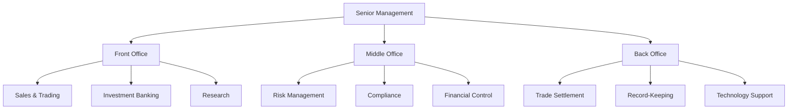

---

linkTitle: "1.5 Organizational Structure of Investment Dealers"
title: "Organizational Structure of Investment Dealers: Understanding Front, Middle, and Back Offices"
description: "Explore the organizational structure of investment dealers, focusing on the roles of front, middle, and back offices, and the importance of senior management in overseeing operations within the Canadian securities industry."
categories:
- Finance
- Investment
- Canadian Securities
tags:
- Investment Dealers
- Front Office
- Middle Office
- Back Office
- Canadian Financial Regulations
date: 2024-10-25
type: docs
nav_weight: 160000
canonical: "https://securitiesexamsmastery.ca/13/1/6"
license: "© 2023 Tokenizer Inc. CC BY-NC-SA 4.0"
---

## 1.5 Organizational Structure of Investment Dealers

Investment dealers play a pivotal role in the Canadian securities industry, acting as intermediaries between investors and the financial markets. Understanding the organizational structure of these firms is essential for anyone looking to navigate or work within this sector. This section delves into the typical departmental divisions within investment dealer firms, highlighting the roles of the front, middle, and back offices, and the critical oversight provided by senior management.

### Typical Departmental Divisions

Investment dealers are structured to efficiently manage the complex processes involved in trading securities, managing client relationships, and ensuring compliance with regulatory standards. The organizational structure is typically divided into three main areas: the front office, middle office, and back office. Each of these divisions plays a distinct role in the operations of an investment dealer.

### Front Office: The Revenue Generators

The front office is the most visible part of an investment dealer, directly involved in client interactions and revenue generation. This division includes departments such as sales, trading, and investment banking. Professionals in the front office are responsible for executing trades, managing client portfolios, and providing financial advice.

#### Key Functions of the Front Office:

- **Sales and Trading:** Engaging with clients to buy and sell securities, providing market insights, and executing trades on behalf of clients.
- **Investment Banking:** Assisting companies in raising capital, advising on mergers and acquisitions, and underwriting new stock issues.
- **Research:** Analyzing market trends, providing investment recommendations, and producing reports that guide trading and investment decisions.

The front office is crucial for generating revenue and maintaining client relationships. It requires a deep understanding of market dynamics and strong interpersonal skills.

### Middle Office: Risk Management and Compliance

The middle office serves as a bridge between the front and back offices, focusing on risk management, compliance, and ensuring that transactions are executed smoothly. This division is essential for maintaining the integrity and stability of the firm's operations.

#### Key Functions of the Middle Office:

- **Risk Management:** Identifying, assessing, and mitigating financial risks associated with trading activities.
- **Compliance:** Ensuring that the firm adheres to regulatory requirements set by bodies such as the Canadian Investment Regulatory Organization (CIRO).
- **Financial Control:** Monitoring and reporting on the firm's financial performance, ensuring accuracy in financial statements.

The middle office plays a critical role in safeguarding the firm against potential losses and regulatory breaches, making it indispensable for sustainable operations.

### Back Office: The Operational Backbone

The back office is responsible for the administrative and support functions that enable the front and middle offices to operate efficiently. This division handles trade settlement, record-keeping, and other essential tasks that ensure the smooth execution of transactions.

#### Key Functions of the Back Office:

- **Trade Settlement:** Ensuring that all trades are settled accurately and on time, managing the transfer of securities and funds.
- **Record-Keeping:** Maintaining accurate records of all transactions and client interactions.
- **Technology Support:** Providing the necessary IT infrastructure and support to facilitate trading and data management.

While the back office may not generate revenue directly, its role is crucial in maintaining the firm's operational efficiency and reliability.

### The Role of Senior Management

Senior management in investment dealers oversees the entire organizational structure, ensuring that each division operates effectively and aligns with the firm's strategic goals. They are responsible for setting the firm's vision, managing resources, and making high-level decisions that impact the firm's direction.

#### Responsibilities of Senior Management:

- **Strategic Planning:** Developing long-term strategies to drive growth and competitiveness.
- **Resource Allocation:** Ensuring that each division has the necessary resources to achieve its objectives.
- **Performance Monitoring:** Evaluating the performance of each division and implementing improvements where necessary.

Senior management's oversight is vital for maintaining a cohesive and efficient organizational structure, enabling the firm to adapt to market changes and regulatory developments.

### Practical Examples and Case Studies

To illustrate these concepts, consider the operations of major Canadian banks like RBC and TD. These institutions have well-defined front, middle, and back office structures that allow them to manage vast portfolios and serve a diverse client base effectively.

For example, RBC's investment banking division (front office) works closely with its risk management team (middle office) to assess the potential impacts of large transactions. Meanwhile, its back office ensures that all trades are settled accurately, maintaining the bank's reputation for reliability.

### Diagrams and Visual Aids

Below is a simplified diagram representing the organizational structure of an investment dealer:

### Best Practices and Challenges

**Best Practices:**

- **Integrated Communication:** Ensure seamless communication between the front, middle, and back offices to enhance efficiency and accuracy.
- **Continuous Training:** Regularly update staff on regulatory changes and market developments to maintain compliance and competitiveness.
- **Technology Investment:** Leverage advanced technologies to streamline operations and improve data management.

**Common Challenges:**

- **Regulatory Compliance:** Keeping up with evolving regulations can be resource-intensive and complex.
- **Risk Management:** Effectively managing financial risks requires sophisticated tools and expertise.
- **Operational Efficiency:** Balancing cost control with the need for robust infrastructure and support services.

### References and Additional Resources

- **Frameworks:** [Three-Tiered Organizational Structure](https://www.investopedia.com/terms/f/frontoffice.asp)
- **Articles:** "Organizational Structure of Investment Firms" - [Harvard Business Review](https://hbr.org)
- **Canadian Financial Regulations:** Visit the [Canadian Investment Regulatory Organization (CIRO)](https://www.ciro.ca) for detailed regulatory guidelines.

### Conclusion

Understanding the organizational structure of investment dealers is fundamental for anyone involved in the Canadian securities industry. By recognizing the distinct roles of the front, middle, and back offices, and the importance of senior management, professionals can better navigate the complexities of this sector. As the industry continues to evolve, staying informed and adaptable is key to success.

### **Ready to Test Your Knowledge?**

**Practice 10 Essential CSC Exam Questions to Master Your Certification**



### Which department in an investment dealer is primarily responsible for client interactions and revenue generation?

- [x] Front Office
- [ ] Middle Office
- [ ] Back Office
- [ ] Senior Management

> **Explanation:** The front office is directly involved in client interactions and revenue generation through activities such as sales, trading, and investment banking.

### What is the primary role of the middle office in an investment dealer?

- [ ] Trade Settlement
- [x] Risk Management and Compliance
- [ ] Client Interactions
- [ ] Revenue Generation

> **Explanation:** The middle office focuses on risk management and compliance, ensuring that the firm's operations are secure and adhere to regulatory standards.

### Which office is responsible for trade settlement and administrative tasks?

- [ ] Front Office
- [ ] Middle Office
- [x] Back Office
- [ ] Senior Management

> **Explanation:** The back office handles trade settlement and administrative tasks, supporting the operations of the front and middle offices.

### What is a key function of the front office?

- [x] Sales and Trading
- [ ] Risk Management
- [ ] Trade Settlement
- [ ] Financial Control

> **Explanation:** Sales and trading are key functions of the front office, involving direct client interactions and revenue generation.

### Which of the following is a responsibility of senior management?

- [x] Strategic Planning
- [ ] Trade Execution
- [ ] Record-Keeping
- [ ] Compliance Monitoring

> **Explanation:** Senior management is responsible for strategic planning, setting the firm's vision, and making high-level decisions.

### What is a common challenge faced by investment dealers?

- [x] Regulatory Compliance
- [ ] Client Interactions
- [ ] Revenue Generation
- [ ] Trade Execution

> **Explanation:** Regulatory compliance is a common challenge due to the complexity and evolving nature of financial regulations.

### Which department would handle a merger and acquisition advisory?

- [x] Front Office
- [ ] Middle Office
- [ ] Back Office
- [ ] Senior Management

> **Explanation:** The front office, specifically the investment banking division, handles mergers and acquisitions advisory.

### What is a best practice for investment dealers to enhance efficiency?

- [x] Integrated Communication
- [ ] Isolated Departments
- [ ] Minimal Training
- [ ] Limited Technology Use

> **Explanation:** Integrated communication between departments enhances efficiency and accuracy in operations.

### Which office is crucial for maintaining the integrity and stability of a firm's operations?

- [ ] Front Office
- [x] Middle Office
- [ ] Back Office
- [ ] Senior Management

> **Explanation:** The middle office is crucial for maintaining integrity and stability through risk management and compliance.

### True or False: The back office is directly involved in revenue generation.

- [ ] True
- [x] False

> **Explanation:** The back office is not directly involved in revenue generation; it supports the front and middle offices through administrative and operational tasks.


