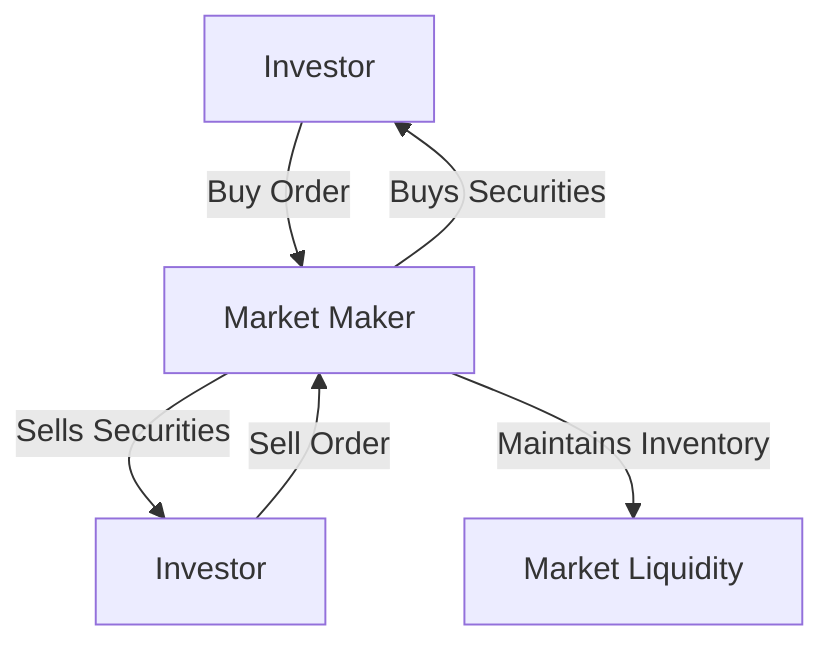

## 1.7 Services Provided by Investment Dealers

Investment dealers play a pivotal role in the Canadian securities industry, acting as intermediaries between issuers and investors in both primary and secondary markets. Their services are crucial for the efficient functioning of financial markets, providing liquidity, facilitating capital raising, and offering expert advice to investors. This section delves into the various services offered by investment dealers, their role as market makers, and how they assist clients in making informed investment decisions.

### Services in the Primary Market

In the primary market, investment dealers assist companies and governments in raising capital by underwriting and distributing new securities. This process involves several key services:

1. **Underwriting:** Investment dealers purchase securities from the issuer and sell them to the public. They assume the risk of selling the securities at a predetermined price, ensuring that the issuer receives the necessary funds.

2. **Advisory Services:** Dealers provide strategic advice on the timing, pricing, and structure of new issues. They help issuers navigate regulatory requirements and market conditions to optimize their capital-raising efforts.

3. **Distribution:** Leveraging their extensive networks, investment dealers distribute new securities to institutional and retail investors. This involves marketing the securities and managing the logistics of the issuance process.

#### Case Study: RBC Capital Markets and a Major IPO

RBC Capital Markets, a leading Canadian investment dealer, played a significant role in the initial public offering (IPO) of a major Canadian technology firm. By underwriting the IPO, RBC Capital Markets helped the company raise substantial capital to fund its expansion plans. The dealer's expertise in pricing and distribution ensured a successful launch, with the shares being well-received by the market.

### Services in the Secondary Market

In the secondary market, investment dealers facilitate the buying and selling of existing securities, providing liquidity and price discovery. Key services include:

1. **Market Making:** Dealers act as market makers by maintaining an inventory of securities and quoting buy and sell prices. This activity enhances market liquidity, allowing investors to trade securities with ease.

2. **Brokerage Services:** Investment dealers execute buy and sell orders on behalf of clients, offering access to various markets, including the Toronto Stock Exchange (TSX).

3. **Research and Analysis:** Dealers provide in-depth research and analysis on securities, industries, and market trends. This information helps investors make informed decisions and manage their portfolios effectively.

#### Diagram: Market Maker Function

### Role of Market Makers

Market makers are essential for maintaining liquidity in the securities market. By continuously quoting buy and sell prices, they facilitate smooth trading and help stabilize prices. This role is particularly important in less liquid markets, where the absence of market makers could lead to significant price volatility.

#### Glossary

- **Market Maker:** A dealer that maintains an inventory of securities to facilitate trading and liquidity.
- **Liquidity:** The ease with which securities can be bought or sold in the market without affecting their price.

### Providing Informed Advice

Investment dealers offer valuable advice to clients, helping them navigate complex financial markets. This advice is based on comprehensive research and market insights, enabling clients to make strategic investment decisions. Services include:

1. **Portfolio Management:** Dealers assist clients in constructing and managing investment portfolios, aligning them with their financial goals and risk tolerance.

2. **Financial Planning:** Comprehensive financial planning services help clients achieve long-term objectives, such as retirement planning and wealth preservation.

3. **Risk Management:** Dealers provide strategies to mitigate investment risks, including diversification and hedging techniques.

### Regulatory Framework and Resources

Investment dealers operate within a robust regulatory framework in Canada, ensuring transparency and investor protection. Key institutions and resources include:

- **Toronto Stock Exchange (TSX):** The primary exchange for trading securities in Canada. [Visit TSX](https://www.tsx.com/)
- **Canadian Investment Regulatory Organization (CIRO):** Regulates investment dealers and ensures compliance with industry standards.
- **Investopedia Article:** "The Role of Market Makers" provides further insights into the function of market makers. [Read more](https://www.investopedia.com/terms/m/marketmaker.asp)

### Best Practices and Challenges

Investment dealers must adhere to best practices to maintain trust and efficiency in the market. These include:

- **Transparency:** Providing clear and accurate information to clients and regulators.
- **Ethical Conduct:** Upholding high ethical standards in all dealings.
- **Continuous Learning:** Staying informed about market developments and regulatory changes.

Challenges faced by investment dealers include adapting to technological advancements, managing regulatory compliance, and addressing market volatility. By leveraging technology and maintaining robust compliance frameworks, dealers can overcome these challenges and continue to provide valuable services.

### Conclusion

Investment dealers are integral to the functioning of the Canadian securities industry, offering a wide range of services that facilitate capital raising, enhance market liquidity, and support informed investment decisions. By understanding the roles and responsibilities of investment dealers, investors can better navigate the financial markets and achieve their investment objectives.

### **Ready to Test Your Knowledge?**

**Practice 10 Essential CSC Exam Questions to Master Your Certification**



### What is the primary role of investment dealers in the primary market?

- [x] Underwriting and distributing new securities
- [ ] Providing loans to investors
- [ ] Offering insurance products
- [ ] Managing real estate portfolios

> **Explanation:** In the primary market, investment dealers underwrite and distribute new securities to raise capital for issuers.

### How do market makers enhance liquidity in the securities market?

- [x] By maintaining an inventory of securities and quoting buy and sell prices
- [ ] By providing loans to investors
- [ ] By issuing new securities
- [ ] By setting interest rates

> **Explanation:** Market makers enhance liquidity by maintaining an inventory of securities and continuously quoting buy and sell prices, facilitating smooth trading.

### What service do investment dealers provide in the secondary market?

- [x] Brokerage services
- [ ] Insurance underwriting
- [ ] Real estate management
- [ ] Tax preparation

> **Explanation:** In the secondary market, investment dealers provide brokerage services, executing buy and sell orders for clients.

### Which institution is the primary exchange for trading securities in Canada?

- [x] Toronto Stock Exchange (TSX)
- [ ] New York Stock Exchange (NYSE)
- [ ] London Stock Exchange (LSE)
- [ ] Tokyo Stock Exchange (TSE)

> **Explanation:** The Toronto Stock Exchange (TSX) is the primary exchange for trading securities in Canada.

### What is a key challenge faced by investment dealers?

- [x] Adapting to technological advancements
- [ ] Managing agricultural production
- [ ] Developing new pharmaceutical products
- [ ] Constructing residential buildings

> **Explanation:** Investment dealers face challenges such as adapting to technological advancements and managing regulatory compliance.

### What is the purpose of financial planning services offered by investment dealers?

- [x] To help clients achieve long-term financial objectives
- [ ] To provide legal advice
- [ ] To manage real estate investments
- [ ] To offer travel insurance

> **Explanation:** Financial planning services help clients achieve long-term financial objectives, such as retirement planning and wealth preservation.

### What is the role of the Canadian Investment Regulatory Organization (CIRO)?

- [x] Regulating investment dealers and ensuring compliance with industry standards
- [ ] Managing public transportation systems
- [ ] Overseeing agricultural production
- [ ] Developing educational curricula

> **Explanation:** CIRO regulates investment dealers and ensures compliance with industry standards to protect investors.

### What is a common strategy used by investment dealers to mitigate investment risks?

- [x] Diversification
- [ ] Concentration
- [ ] Speculation
- [ ] Arbitrage

> **Explanation:** Diversification is a common strategy used by investment dealers to mitigate investment risks by spreading investments across various assets.

### What is the function of a market maker in the securities market?

- [x] Facilitating trading and liquidity by quoting buy and sell prices
- [ ] Issuing new securities
- [ ] Providing insurance coverage
- [ ] Managing real estate properties

> **Explanation:** Market makers facilitate trading and liquidity by maintaining an inventory of securities and quoting buy and sell prices.

### True or False: Investment dealers only operate in the primary market.

- [ ] True
- [x] False

> **Explanation:** Investment dealers operate in both primary and secondary markets, providing a range of services including underwriting, brokerage, and market making.


