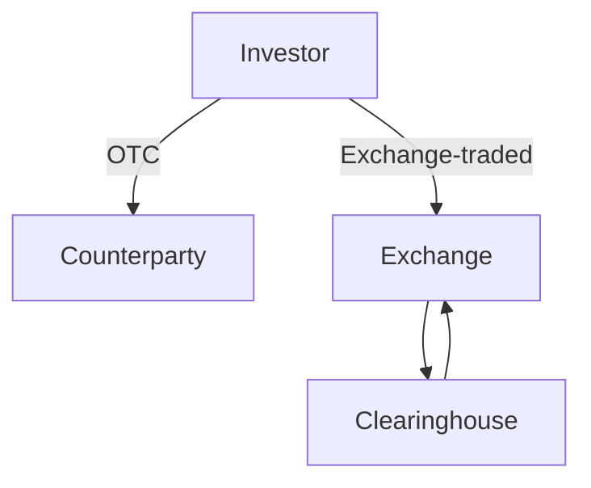

## 10.1.1 Over-the-counter vs Exchange-traded Derivatives

In the world of finance, derivatives are powerful instruments that allow investors to hedge risks, speculate on future price movements, and enhance portfolio returns. Understanding the differences between over-the-counter (OTC) and exchange-traded derivatives is crucial for any finance professional, especially within the Canadian context. This section will delve into the characteristics, advantages, and risks associated with each type of derivative, providing a comprehensive comparison to aid in informed decision-making.

### Over-the-counter (OTC) Derivatives

**Definition and Customization**

Over-the-counter derivatives are financial contracts that are negotiated and traded directly between two parties, without the oversight of an exchange. These derivatives are highly customizable, allowing parties to tailor the terms, such as maturity, notional amount, and underlying asset, to meet specific needs. This flexibility makes OTC derivatives particularly attractive for sophisticated investors and institutions looking to hedge specific risks or achieve unique financial objectives.

**Flexibility and Lack of Standardization**

The primary advantage of OTC derivatives lies in their flexibility. Unlike exchange-traded derivatives, which are standardized, OTC contracts can be customized to suit the precise requirements of the parties involved. This lack of standardization, however, also introduces complexities in pricing and valuation, as each contract may have unique terms and conditions.

**Privacy, Liquidity, and Default Risk**

OTC derivatives offer a level of privacy not found in exchange-traded contracts, as the details of the transaction remain between the parties involved. However, this privacy comes at the cost of liquidity. OTC markets are generally less liquid than exchanges, making it more challenging to enter or exit positions quickly. Additionally, OTC derivatives carry a higher default risk, as they are not backed by a clearinghouse. This counterparty risk means that if one party defaults, the other party may suffer significant financial losses.

### Exchange-traded Derivatives

**Definition and Standardization**

Exchange-traded derivatives are contracts that are standardized and traded on formal exchanges, such as the Montreal Exchange in Canada. These derivatives include futures and options, which have set terms regarding contract size, expiration dates, and underlying assets. The standardization of these contracts facilitates ease of trading and enhances market liquidity.

**Role of Exchanges and Regulation**

Exchanges play a crucial role in regulating and facilitating trades of exchange-traded derivatives. They provide a transparent and organized marketplace where buyers and sellers can transact with confidence. The presence of regulatory oversight ensures that market participants adhere to established rules and standards, promoting fair and orderly trading.

**Advantages of Liquidity, Transparency, and Reduced Default Risk**

One of the key benefits of exchange-traded derivatives is their liquidity. The standardized nature of these contracts and the presence of multiple market participants contribute to a highly liquid market, allowing investors to quickly buy or sell positions. Transparency is another significant advantage, as exchanges provide real-time pricing and market data, enabling investors to make informed decisions. Furthermore, the involvement of clearinghouses in the settlement process reduces default risk by acting as intermediaries between buyers and sellers, ensuring that both parties fulfill their contractual obligations.

### Comparison

When comparing OTC and exchange-traded derivatives, several key differences emerge:

- **Standardization vs. Flexibility:** Exchange-traded derivatives are standardized, making them easier to trade but less flexible. In contrast, OTC derivatives offer customization but lack standardization.
- **Liquidity:** Exchange-traded derivatives benefit from higher liquidity due to their standardized nature and the presence of a centralized marketplace. OTC derivatives, while flexible, often suffer from lower liquidity.
- **Risk Management:** Exchange-traded derivatives involve lower default risk due to the presence of clearinghouses, whereas OTC derivatives carry higher counterparty risk.
- **Regulation:** Exchange-traded derivatives are subject to regulatory oversight, ensuring transparency and market integrity. OTC derivatives, being private contracts, are less regulated.

### Glossary

- **OTC Derivatives:** Customized contracts traded directly between parties without going through an exchange.
- **Exchange-traded Derivatives:** Standardized contracts traded on formal exchanges with regulatory oversight.
- **Clearinghouse:** An entity that manages the clearing and settlement of derivatives trades, reducing counterparty risk.

### Practical Examples and Case Studies

To illustrate these concepts, consider the following examples:

- **Canadian Pension Funds:** A Canadian pension fund may use OTC derivatives to hedge against specific interest rate risks, customizing the terms to match its unique liabilities and cash flow needs.
- **Major Canadian Banks:** Banks like RBC or TD may engage in exchange-traded derivatives to manage currency exposure, benefiting from the liquidity and transparency of the exchange-traded market.

### Diagrams and Visual Aids

Below is a diagram illustrating the flow of transactions in OTC and exchange-traded derivatives markets:

**Explanation:** This diagram shows the direct relationship between investors and counterparties in OTC markets, compared to the structured flow involving exchanges and clearinghouses in exchange-traded markets.

### Best Practices and Common Pitfalls

- **Best Practices:** When dealing with OTC derivatives, ensure thorough due diligence on counterparties to mitigate default risk. For exchange-traded derivatives, leverage the transparency and liquidity of the market to optimize trading strategies.
- **Common Pitfalls:** Avoid underestimating the complexity and risk associated with OTC derivatives. In exchange-traded markets, be aware of margin requirements and potential for rapid price movements.

### Conclusion

Understanding the distinctions between OTC and exchange-traded derivatives is essential for effective risk management and investment strategy development. By recognizing the unique characteristics and risks associated with each type of derivative, finance professionals can make informed decisions that align with their financial goals and regulatory requirements.

## Quiz Time!



### Which of the following is a characteristic of OTC derivatives?

- [x] Customized contracts
- [ ] Standardized contracts
- [ ] Traded on exchanges
- [ ] Backed by clearinghouses

> **Explanation:** OTC derivatives are customized contracts traded directly between parties, not standardized or traded on exchanges.

### What is a primary advantage of exchange-traded derivatives?

- [x] High liquidity
- [ ] High customization
- [ ] High privacy
- [ ] High counterparty risk

> **Explanation:** Exchange-traded derivatives are highly liquid due to their standardized nature and the presence of a centralized marketplace.

### What role does a clearinghouse play in exchange-traded derivatives?

- [x] Reduces default risk
- [ ] Increases customization
- [ ] Provides privacy
- [ ] Increases counterparty risk

> **Explanation:** A clearinghouse reduces default risk by acting as an intermediary between buyers and sellers, ensuring contractual obligations are met.

### Which type of derivative is more likely to have regulatory oversight?

- [x] Exchange-traded derivatives
- [ ] OTC derivatives
- [ ] Both equally
- [ ] Neither

> **Explanation:** Exchange-traded derivatives are subject to regulatory oversight, ensuring transparency and market integrity.

### What is a common risk associated with OTC derivatives?

- [x] Counterparty risk
- [ ] Low liquidity
- [x] Lack of standardization
- [ ] High transparency

> **Explanation:** OTC derivatives carry counterparty risk and lack standardization, which can lead to complexities in pricing and valuation.

### Which of the following is NOT a feature of exchange-traded derivatives?

- [ ] Standardization
- [ ] Transparency
- [x] High customization
- [ ] Regulatory oversight

> **Explanation:** Exchange-traded derivatives are standardized and lack the high customization found in OTC derivatives.

### What is a benefit of the transparency in exchange-traded derivatives?

- [x] Informed decision-making
- [ ] Increased privacy
- [x] Real-time pricing
- [ ] Higher counterparty risk

> **Explanation:** Transparency in exchange-traded derivatives allows for informed decision-making and access to real-time pricing.

### Which market is generally less liquid?

- [x] OTC derivatives market
- [ ] Exchange-traded derivatives market
- [ ] Both equally
- [ ] Neither

> **Explanation:** The OTC derivatives market is generally less liquid due to the customized nature of contracts and lack of a centralized marketplace.

### What is a key difference between OTC and exchange-traded derivatives?

- [x] Standardization vs. customization
- [ ] Both are highly regulated
- [ ] Both are highly liquid
- [ ] Both involve clearinghouses

> **Explanation:** A key difference is that exchange-traded derivatives are standardized, while OTC derivatives are customized.

### True or False: Exchange-traded derivatives are more private than OTC derivatives.

- [ ] True
- [x] False

> **Explanation:** Exchange-traded derivatives are less private than OTC derivatives, as they are traded on public exchanges with transparency.


