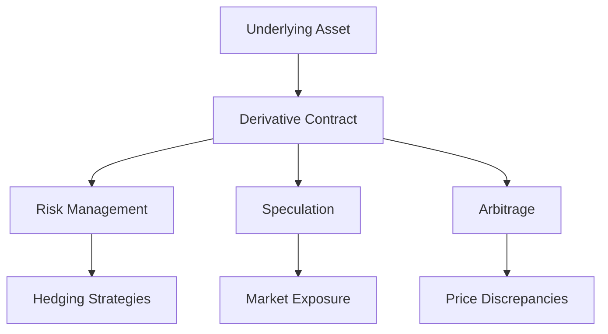

## 10.1 The Role of Derivatives

In the complex world of finance, derivatives play a pivotal role in shaping investment strategies and managing risk. This section delves into the essence of derivatives, their types, and their multifaceted functions within financial markets, particularly within the Canadian context.

### Understanding Derivatives

Derivatives are financial instruments whose value is intrinsically linked to the value of an underlying asset. These underlying assets can range from stocks, bonds, commodities, currencies, interest rates, or market indexes. The primary purpose of derivatives is to provide a mechanism for transferring risk from one party to another, allowing for more efficient allocation of financial resources.

#### Types of Derivatives

1. **Options:**
   - Options are contracts that grant the holder the right, but not the obligation, to buy or sell an asset at a predetermined price within a specified time frame. There are two main types of options:
     - **Call Options:** Give the holder the right to purchase an asset.
     - **Put Options:** Give the holder the right to sell an asset.
   - Options are widely used for hedging and speculative purposes. For instance, a Canadian investor might use call options on a stock like Shopify to hedge against potential price increases.

2. **Forwards and Futures:**
   - These are contracts that obligate the buyer to purchase, or the seller to sell, an asset at a predetermined future date and price. While forwards are typically customized contracts traded over-the-counter (OTC), futures are standardized and traded on exchanges.
   - Futures contracts are commonly used in commodities markets. For example, a Canadian wheat farmer might use futures to lock in a price for their crop, mitigating the risk of price fluctuations.

### Functions of Derivatives

Derivatives serve several critical functions in financial markets, acting as both substitutes and offsets for positions in underlying assets. Their primary functions include:

#### Risk Management

One of the most significant roles of derivatives is in risk management. They allow investors and companies to hedge against potential losses in their portfolios or business operations. For example, a Canadian exporter might use currency futures to hedge against fluctuations in the Canadian dollar, ensuring stable revenue despite exchange rate volatility.

#### Speculation

Derivatives also provide opportunities for speculation, allowing investors to bet on the future direction of market prices. Speculators can leverage derivatives to gain exposure to price movements without owning the underlying asset. This can lead to significant profits, but also substantial risks. For instance, a trader might speculate on the price of crude oil using futures contracts, aiming to profit from anticipated price changes.

#### Arbitrage

Arbitrage involves exploiting price discrepancies in different markets to earn a risk-free profit. Derivatives facilitate arbitrage opportunities by allowing traders to simultaneously buy and sell related assets across different markets. This helps in maintaining market efficiency by aligning prices.

### Practical Examples and Case Studies

To better understand the application of derivatives, let's explore some practical examples and case studies within the Canadian financial landscape:

#### Example 1: Hedging with Options

Consider a Canadian pension fund that holds a significant position in the Toronto Stock Exchange (TSX). To protect against potential downturns, the fund manager might purchase put options on the TSX index. This strategy provides insurance against market declines, allowing the fund to mitigate losses while maintaining upside potential.

#### Example 2: Speculating with Futures

A Canadian energy company anticipates a rise in natural gas prices due to seasonal demand. To capitalize on this expectation, the company might enter into futures contracts to buy natural gas at current prices, aiming to sell at higher prices in the future. This speculative strategy can enhance profitability if the market moves as anticipated.

#### Case Study: RBC's Use of Derivatives

Royal Bank of Canada (RBC) is known for its sophisticated use of derivatives to manage interest rate risk. By employing interest rate swaps, RBC can effectively manage its exposure to fluctuating interest rates, ensuring stable earnings and protecting its balance sheet.

### Diagrams and Visual Aids

To further illustrate the concepts discussed, let's explore a visual representation of how derivatives function in financial markets:

### Best Practices and Common Pitfalls

While derivatives offer numerous benefits, they also come with inherent risks. Here are some best practices and common pitfalls to consider:

#### Best Practices

- **Understand the Instrument:** Before engaging in derivatives trading, ensure a thorough understanding of the specific instrument and its underlying asset.
- **Risk Assessment:** Regularly assess the risk profile of derivative positions and adjust strategies accordingly.
- **Regulatory Compliance:** Adhere to Canadian regulatory requirements, such as those set by the Canadian Investment Regulatory Organization (CIRO).

#### Common Pitfalls

- **Over-Leverage:** Avoid excessive leverage, which can amplify losses and lead to significant financial distress.
- **Market Volatility:** Be aware of market volatility and its potential impact on derivative positions.
- **Complexity:** Recognize the complexity of certain derivatives and seek professional advice if necessary.

### Encouraging Continuous Learning

The world of derivatives is dynamic and ever-evolving. To stay informed and enhance your understanding, consider exploring additional resources such as:

- **Books:** "Options, Futures, and Other Derivatives" by John C. Hull.
- **Online Courses:** The Canadian Securities Institute offers courses on derivatives and risk management.
- **Regulatory Resources:** Visit the CIRO website for updates on regulatory changes and compliance guidelines.

### Conclusion

Derivatives are powerful financial instruments that play a crucial role in modern finance. By understanding their types, functions, and applications, investors and financial professionals can effectively manage risk and capitalize on market opportunities. As you continue your journey in the world of finance, remember to apply these principles thoughtfully and responsibly.

## Quiz Time!



### What is a derivative?

- [x] A financial contract whose value is derived from the value of an underlying asset.
- [ ] A type of stock that pays dividends.
- [ ] A government bond with a fixed interest rate.
- [ ] A mutual fund that invests in real estate.

> **Explanation:** A derivative is a financial contract whose value is derived from the value of an underlying asset, such as stocks, bonds, or commodities.

### Which of the following is NOT a type of derivative?

- [ ] Options
- [ ] Futures
- [x] Bonds
- [ ] Forwards

> **Explanation:** Bonds are not derivatives; they are debt securities. Options, futures, and forwards are all types of derivatives.

### What is the primary purpose of derivatives in financial markets?

- [x] To transfer risk from one party to another
- [ ] To increase the value of stocks
- [ ] To provide dividends to investors
- [ ] To create new financial markets

> **Explanation:** The primary purpose of derivatives is to transfer risk from one party to another, allowing for more efficient allocation of financial resources.

### What is a call option?

- [x] A contract that gives the holder the right to purchase an asset at a set price
- [ ] A contract that obligates the holder to sell an asset at a set price
- [ ] A type of bond with a variable interest rate
- [ ] A mutual fund that invests in commodities

> **Explanation:** A call option is a contract that gives the holder the right to purchase an asset at a set price within a specified time frame.

### How do futures contracts differ from forwards?

- [x] Futures are standardized and traded on exchanges, while forwards are customized and traded OTC.
- [ ] Futures are only used for commodities, while forwards are used for stocks.
- [ ] Futures have no expiration date, while forwards do.
- [ ] Futures are less risky than forwards.

> **Explanation:** Futures contracts are standardized and traded on exchanges, whereas forwards are customized contracts traded over-the-counter (OTC).

### What is one common use of derivatives in risk management?

- [x] Hedging against potential losses
- [ ] Maximizing short-term profits
- [ ] Increasing leverage
- [ ] Speculating on currency fluctuations

> **Explanation:** One common use of derivatives in risk management is hedging against potential losses in portfolios or business operations.

### Which Canadian financial institution is known for using derivatives to manage interest rate risk?

- [x] Royal Bank of Canada (RBC)
- [ ] Bank of Montreal (BMO)
- [ ] Scotiabank
- [ ] Canadian Imperial Bank of Commerce (CIBC)

> **Explanation:** Royal Bank of Canada (RBC) is known for its sophisticated use of derivatives to manage interest rate risk.

### What is a potential pitfall of using derivatives?

- [x] Over-leverage
- [ ] Guaranteed profits
- [ ] Reduced market volatility
- [ ] Simplified investment strategies

> **Explanation:** A potential pitfall of using derivatives is over-leverage, which can amplify losses and lead to significant financial distress.

### What is arbitrage in the context of derivatives?

- [x] Exploiting price discrepancies in different markets to earn a risk-free profit
- [ ] Buying and holding assets for long-term growth
- [ ] Speculating on future market trends
- [ ] Hedging against currency fluctuations

> **Explanation:** Arbitrage involves exploiting price discrepancies in different markets to earn a risk-free profit, often facilitated by derivatives.

### True or False: Derivatives can only be used for speculation.

- [ ] True
- [x] False

> **Explanation:** False. Derivatives can be used for various purposes, including risk management, speculation, and arbitrage.


