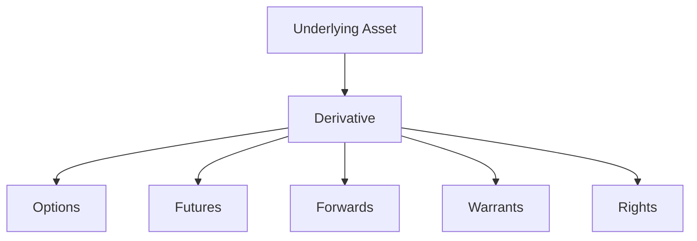

## Overview of Chapter 10: Derivatives

In the intricate world of finance, derivatives play a pivotal role by providing tools for risk management, speculation, and arbitrage. This chapter delves into the essence of derivatives, exploring their significance, types, and the dynamics of their markets, particularly within the Canadian financial landscape.

### Introduction to Derivatives

Derivatives are financial contracts whose value is derived from an underlying asset. These assets can range from stocks, bonds, and currencies to commodities like oil and gold. Derivatives are essential in financial markets as they allow investors to hedge against risks, speculate on future price movements, and gain exposure to assets without owning them directly.

#### Significance in Financial Markets

Derivatives serve multiple purposes in financial markets:

- **Risk Management (Hedging):** Investors use derivatives to protect against price fluctuations in underlying assets. For example, a Canadian wheat farmer might use futures contracts to lock in prices and mitigate the risk of falling wheat prices.
  
- **Speculation:** Traders can use derivatives to bet on the future direction of market prices, potentially earning profits from price movements without owning the underlying asset.
  
- **Arbitrage:** Derivatives enable traders to exploit price discrepancies between markets, ensuring that prices remain efficient and aligned.

### Underlying Assets

The value of a derivative is intrinsically linked to its underlying asset. These assets can be broadly categorized into:

- **Equities:** Stocks and indices.
- **Fixed Income:** Bonds and interest rates.
- **Commodities:** Physical goods like oil, gold, and agricultural products.
- **Currencies:** Foreign exchange rates.

Understanding the behavior and characteristics of these underlying assets is crucial for effectively using derivatives.

### Over-the-Counter (OTC) vs. Exchange-Traded Derivatives

Derivatives can be traded in two primary ways:

- **Over-the-Counter (OTC):** These are customized contracts negotiated directly between parties. They offer flexibility but come with higher counterparty risk since they are not standardized or regulated by an exchange.

- **Exchange-Traded Derivatives:** These are standardized contracts traded on regulated exchanges like the Montréal Exchange. They provide transparency, liquidity, and reduced counterparty risk due to the involvement of clearinghouses.

### Categories of Derivatives

#### Options

Options are contracts that give the holder the right, but not the obligation, to buy or sell an underlying asset at a predetermined price within a specified time frame. They are divided into:

- **Call Options:** Provide the right to buy an asset.
- **Put Options:** Provide the right to sell an asset.

Options are versatile tools used for hedging, speculation, and income generation.

#### Forwards and Futures Contracts

- **Forward Contracts:** Customized agreements between two parties to buy or sell an asset at a specified price on a future date. They are typically traded OTC.

- **Futures Contracts:** Standardized forward contracts traded on exchanges. They are marked to market daily, meaning gains and losses are settled each day based on market prices.

Futures are commonly used by investors to hedge against price changes in commodities and financial instruments.

### Market Participants

The derivatives market comprises various participants, each with distinct roles and motivations:

- **Hedgers:** Use derivatives to mitigate risk associated with price movements in underlying assets.
- **Speculators:** Aim to profit from price changes by taking on risk.
- **Arbitrageurs:** Seek to exploit price inefficiencies across markets for profit.

Understanding these participants' strategies and objectives is key to navigating the derivatives market effectively.

### Rights and Warrants

Rights and warrants are unique types of derivatives:

- **Rights:** These are short-term securities that allow existing shareholders to purchase additional shares at a discounted price before a specified date. They are often used by companies to raise capital.

- **Warrants:** Long-term options issued by a company, granting holders the right to buy stock at a specific price before expiration. Warrants are often used as sweeteners in bond or preferred stock offerings.

### Practical Examples and Case Studies

#### Canadian Pension Funds

Canadian pension funds often use derivatives to manage risk and enhance returns. For instance, they might use interest rate swaps to hedge against fluctuations in interest rates, ensuring stable returns for retirees.

#### Major Canadian Banks

Banks like RBC and TD utilize derivatives for various purposes, including currency hedging and managing interest rate exposure. These institutions often engage in complex derivative strategies to optimize their financial positions.

### Diagrams and Visual Aids

Below is a simple diagram illustrating the relationship between underlying assets and derivatives:

### Best Practices and Common Pitfalls

- **Best Practices:** Always assess the risk-reward profile of a derivative position. Use derivatives as part of a broader risk management strategy rather than speculative bets.
  
- **Common Pitfalls:** Avoid excessive leverage, which can amplify losses. Ensure a thorough understanding of the derivative's underlying asset and market conditions.

### Canadian Financial Regulations and Resources

Understanding the regulatory framework is crucial for operating in the derivatives market. Key resources include:

- **Canadian Securities Administrators (CSA):** [www.securities-administrators.ca](https://www.securities-administrators.ca)
- **Montréal Exchange:** [www.mlx.com](https://www.mlx.com)
- **Canadian Derivatives Clearing Corporation (CDCC):** [www.cdcc.com](https://www.cdcc.com)

### Further Reading and Learning

For those interested in deepening their understanding of derivatives, consider the following resources:

- **Books:**
  - *Options, Futures, and Other Derivatives* by John C. Hull
  - *Derivatives for Beginners* by George A. Fontanills and Tom Gentile

- **Online Courses:**
  - [Coursera: Financial Markets by Yale University](https://www.coursera.org/learn/financial-markets-global)
  - [edX: Introduction to Derivatives](https://www.edx.org/course/introduction-to-derivatives)

### Summary

Derivatives are powerful financial instruments that offer numerous benefits, including risk management and speculative opportunities. By understanding their types, market dynamics, and regulatory environment, investors can effectively incorporate derivatives into their financial strategies.

### **Ready to Test Your Knowledge?**

**Practice 10 Essential CSC Exam Questions to Master Your Certification**



### What is a derivative?

- [x] A financial contract whose value is dependent on an underlying asset.
- [ ] A type of stock.
- [ ] A government bond.
- [ ] A physical commodity.

> **Explanation:** A derivative is a financial contract whose value is derived from an underlying asset, such as stocks, bonds, or commodities.

### Which of the following is an example of an underlying asset?

- [x] Stocks
- [x] Commodities
- [ ] Derivatives
- [ ] Options

> **Explanation:** Underlying assets include stocks, commodities, currencies, and more, from which derivatives derive their value.

### What distinguishes exchange-traded derivatives from OTC derivatives?

- [x] Exchange-traded derivatives are standardized and traded on exchanges.
- [ ] OTC derivatives are standardized and traded on exchanges.
- [ ] Exchange-traded derivatives are customized and traded privately.
- [ ] OTC derivatives have no counterparty risk.

> **Explanation:** Exchange-traded derivatives are standardized contracts traded on regulated exchanges, while OTC derivatives are customized and traded privately.

### What is a call option?

- [x] A contract that gives the holder the right to buy an underlying asset.
- [ ] A contract that gives the holder the right to sell an underlying asset.
- [ ] A contract to buy a commodity.
- [ ] A type of futures contract.

> **Explanation:** A call option gives the holder the right, but not the obligation, to buy an underlying asset at a specified price within a certain period.

### Which of the following is a motivation for using derivatives?

- [x] Hedging
- [x] Speculation
- [ ] Tax evasion
- [ ] Money laundering

> **Explanation:** Derivatives are used for hedging to manage risk and for speculation to profit from price movements.

### What is marking to market?

- [x] Daily settling of gains and losses in derivative positions based on current market prices.
- [ ] Setting the market price for a new stock.
- [ ] Calculating the intrinsic value of a bond.
- [ ] Adjusting the interest rate on a loan.

> **Explanation:** Marking to market involves daily settling of gains and losses in derivative positions based on current market prices.

### What is a forward contract?

- [x] A customized contract between two parties to buy or sell an asset at a specified price on a future date.
- [ ] A standardized contract traded on an exchange.
- [ ] A type of option.
- [ ] A government bond.

> **Explanation:** A forward contract is a customized agreement between two parties to buy or sell an asset at a specified price on a future date.

### What are rights in the context of derivatives?

- [x] Securities that give existing shareholders the privilege to purchase additional shares at a discounted price.
- [ ] Long-term options issued by a company.
- [ ] A type of futures contract.
- [ ] A form of government bond.

> **Explanation:** Rights are securities that allow existing shareholders to purchase additional shares at a discounted price before a specified date.

### What is the primary purpose of hedging with derivatives?

- [x] To offset potential losses in an investment.
- [ ] To speculate on future price movements.
- [ ] To evade taxes.
- [ ] To increase leverage.

> **Explanation:** Hedging with derivatives is primarily used to offset potential losses in an investment by managing risk.

### True or False: Warrants are short-term options issued by a company.

- [ ] True
- [x] False

> **Explanation:** Warrants are long-term options issued by a company, giving holders the right to purchase stock at a specific price before expiration.


