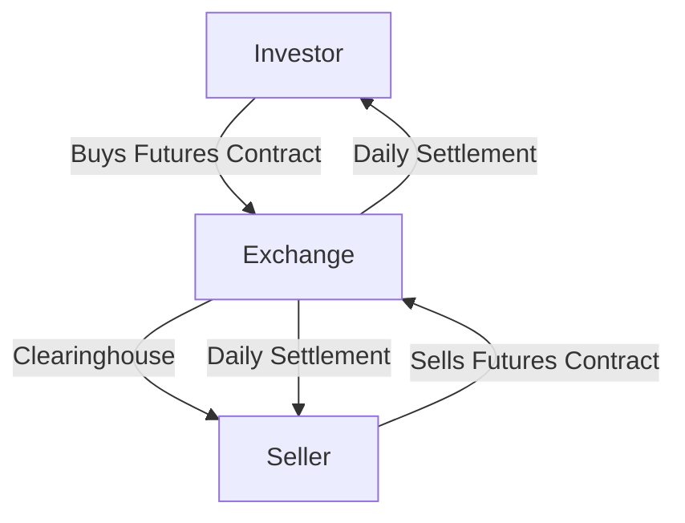

## 10.9 Forwards vs. Futures Contracts

In the world of derivatives, forwards and futures contracts are pivotal instruments used by investors and institutions to manage risk and speculate on price movements. While they share some similarities, they also have distinct characteristics that make them suitable for different purposes. This section will delve into the intricacies of forwards and futures contracts, focusing on their definitions, differences, and applications within the Canadian financial landscape.

### Understanding Forward Contracts

A forward contract is a customized agreement between two parties to buy or sell an asset at a specified price on a future date. These contracts are typically traded over-the-counter (OTC), meaning they are not standardized and are negotiated directly between the parties involved. This flexibility allows for customization in terms of contract size, expiration date, and underlying asset.

#### Key Features of Forward Contracts:
- **Customization:** Forward contracts can be tailored to meet the specific needs of the contracting parties, including the quantity of the asset, delivery date, and price.
- **Counterparty Risk:** Since forwards are OTC contracts, there is a risk that one party may default on the agreement.
- **No Initial Margin Requirement:** Unlike futures, forward contracts do not require an initial margin, which can be advantageous for parties with limited capital.

### Exploring Futures Contracts

Futures contracts, on the other hand, are standardized agreements traded on exchanges such as the Montreal Exchange in Canada. These contracts obligate the buyer to purchase, and the seller to sell, a specific quantity of an asset at a predetermined price on a set future date.

#### Key Features of Futures Contracts:
- **Standardization:** Futures contracts are standardized in terms of contract size, expiration date, and asset type, facilitating easier trading and liquidity.
- **Margin Requirements:** To mitigate counterparty risk, futures contracts require an initial margin deposit, which acts as a performance bond. This margin is adjusted daily based on market movements, a process known as marking to market.
- **Exchange-Traded:** Being traded on exchanges, futures contracts benefit from greater transparency and reduced counterparty risk compared to forwards.

### Comparing Forwards and Futures Contracts

While both forwards and futures are derivatives used for hedging and speculation, their differences lie in their trading environments, standardization, and risk profiles.

| Feature                | Forward Contracts                          | Futures Contracts                          |
|------------------------|--------------------------------------------|--------------------------------------------|
| Trading Venue          | Over-the-counter (OTC)                     | Exchange-traded                            |
| Standardization        | Customized                                 | Standardized                               |
| Counterparty Risk      | Higher due to lack of clearinghouse        | Lower due to exchange clearinghouse        |
| Margin Requirements    | None                                       | Initial and maintenance margins required   |
| Liquidity              | Generally lower                            | Higher due to standardized nature          |

### Strategies for Using Forwards and Futures

#### Hedging

Hedging is a strategy used to reduce the risk of adverse price movements in an asset. Both forwards and futures can be employed to hedge against potential losses.

- **Example:** A Canadian wheat farmer might use a forward contract to lock in a selling price for their crop, protecting against the risk of falling wheat prices. Similarly, a Canadian airline might use futures contracts to hedge against rising fuel prices.

#### Speculation

Speculators use forwards and futures to profit from expected price movements. Unlike hedgers, speculators assume risk in hopes of making a profit.

- **Example:** A trader might speculate on the future price of crude oil by buying futures contracts if they anticipate a price increase. If the price rises, they can sell the contracts at a profit.

### Practical Example: Canadian Pension Fund

Consider a Canadian pension fund that holds a diversified portfolio of equities. To protect against potential downturns in the stock market, the fund manager might use futures contracts on the S&P/TSX Composite Index to hedge their equity exposure. By selling index futures, the fund can offset potential losses in their equity holdings if the market declines.

### Diagram: Futures Contract Flow

Below is a simplified diagram illustrating the flow of a futures contract transaction:

### Best Practices and Common Pitfalls

- **Best Practices:** Always assess the counterparty risk when entering forward contracts. For futures, ensure adequate margin is maintained to avoid margin calls.
- **Common Pitfalls:** Over-leveraging in futures can lead to significant losses. Ensure a clear understanding of the contract specifications and market conditions.

### Regulatory Considerations

In Canada, the trading of futures contracts is regulated by the Canadian Investment Regulatory Organization (CIRO) and provincial securities commissions. It is crucial for market participants to comply with these regulations to ensure fair and transparent trading practices.

### Conclusion

Understanding the nuances between forwards and futures contracts is essential for effectively managing risk and capitalizing on market opportunities. By leveraging these instruments, Canadian investors can enhance their investment strategies, whether for hedging or speculation.

### **Ready to Test Your Knowledge?**

**Practice 10 Essential CSC Exam Questions to Master Your Certification**



### What is a key difference between forward and futures contracts?

- [x] Forwards are customized, while futures are standardized.
- [ ] Forwards are standardized, while futures are customized.
- [ ] Both are traded on exchanges.
- [ ] Both require initial margin deposits.

> **Explanation:** Forward contracts are customized agreements, whereas futures contracts are standardized and traded on exchanges.

### Which of the following is true about futures contracts?

- [x] They require margin deposits.
- [ ] They are traded over-the-counter.
- [ ] They have higher counterparty risk than forwards.
- [ ] They cannot be used for speculation.

> **Explanation:** Futures contracts require margin deposits and are traded on exchanges, reducing counterparty risk.

### What is the primary purpose of hedging?

- [x] To offset potential losses in an investment.
- [ ] To increase potential profits.
- [ ] To speculate on price movements.
- [ ] To avoid regulatory compliance.

> **Explanation:** Hedging is used to offset potential losses by taking an opposite position in a related asset.

### How does marking to market work in futures trading?

- [x] It involves daily settlement of gains and losses.
- [ ] It involves monthly settlement of gains and losses.
- [ ] It only applies to forward contracts.
- [ ] It eliminates the need for margin deposits.

> **Explanation:** Marking to market involves daily settlement of gains and losses to ensure margin requirements are met.

### Which strategy involves using derivatives to profit from expected price movements?

- [x] Speculation
- [ ] Hedging
- [ ] Arbitrage
- [ ] Diversification

> **Explanation:** Speculation involves using derivatives to profit from anticipated price changes.

### What is a common pitfall when trading futures?

- [x] Over-leveraging
- [ ] Under-leveraging
- [ ] Avoiding margin requirements
- [ ] Ignoring counterparty risk

> **Explanation:** Over-leveraging can lead to significant losses in futures trading.

### What is a benefit of trading futures on an exchange?

- [x] Reduced counterparty risk
- [ ] Increased customization
- [ ] No margin requirements
- [ ] Higher counterparty risk

> **Explanation:** Trading on an exchange reduces counterparty risk due to the presence of a clearinghouse.

### What is the role of a clearinghouse in futures trading?

- [x] To act as an intermediary between buyers and sellers
- [ ] To customize contracts
- [ ] To increase counterparty risk
- [ ] To eliminate the need for margin deposits

> **Explanation:** A clearinghouse acts as an intermediary, reducing counterparty risk by ensuring contract fulfillment.

### Which Canadian regulatory body oversees futures trading?

- [x] Canadian Investment Regulatory Organization (CIRO)
- [ ] Canadian Securities Administrators (CSA)
- [ ] Bank of Canada
- [ ] Financial Consumer Agency of Canada (FCAC)

> **Explanation:** CIRO oversees futures trading in Canada, ensuring compliance with regulations.

### True or False: Forward contracts require an initial margin deposit.

- [ ] True
- [x] False

> **Explanation:** Forward contracts do not require an initial margin deposit, unlike futures contracts.


