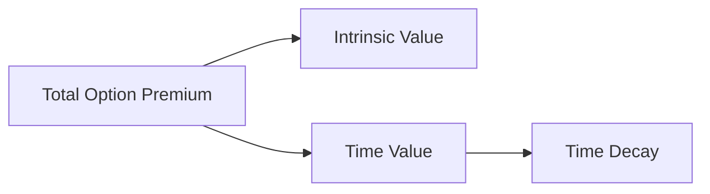

## 10.12 Valuing Derivatives: Intrinsic and Time Value

In the world of derivatives, understanding the intrinsic and time value of options, rights, and warrants is crucial for making informed investment decisions. These two components form the foundation of option pricing and are essential for developing effective trading strategies. This section will delve into these concepts, providing formulas, examples, and insights into how these values evolve over time.

### Understanding Intrinsic Value

**Intrinsic Value** is a fundamental concept in options pricing. It represents the real, tangible value of an option if it were exercised immediately. For a call option, the intrinsic value is the difference between the underlying asset's current market price and the option's strike price, provided this difference is positive. Conversely, for a put option, it is the difference between the strike price and the underlying asset's market price, again if positive.

#### Formula for Intrinsic Value

- **Call Option Intrinsic Value**: 
  
  \text{Intrinsic Value} = \max(0, \text{Current Price of Underlying} - \text{Strike Price})
  

- **Put Option Intrinsic Value**: 
  
  \text{Intrinsic Value} = \max(0, \text{Strike Price} - \text{Current Price of Underlying})
  

#### Example: Calculating Intrinsic Value

Consider a call option on Royal Bank of Canada (RBC) stock with a strike price of CAD 100. If the current market price of RBC stock is CAD 110, the intrinsic value of the call option is:


\text{Intrinsic Value} = \max(0, 110 - 100) = 10


This means the option is "in-the-money" by CAD 10.

### Understanding Time Value

**Time Value** reflects the additional value of an option based on the time remaining until expiration and the expected volatility of the underlying asset. It represents the potential for an option to increase in value before it expires. The longer the time until expiration, the greater the time value, as there is more opportunity for the underlying asset's price to move favorably.

#### Formula for Time Value

Time Value is calculated as the difference between the option's market price (premium) and its intrinsic value:


\text{Time Value} = \text{Option Premium} - \text{Intrinsic Value}


#### Example: Calculating Time Value

Continuing with the RBC call option example, assume the option premium is CAD 15. The intrinsic value is CAD 10, as calculated earlier. Thus, the time value is:


\text{Time Value} = 15 - 10 = 5


This indicates that CAD 5 of the option's premium is attributed to the time value.

### The Dynamics of Intrinsic and Time Value

As the expiration date of an option approaches, the time value diminishes, a phenomenon known as "time decay." This decay accelerates as the expiration nears, which is crucial for traders to consider when developing strategies.

#### Impact on Trading Strategies

1. **Long-Term Strategies**: Investors might prefer options with longer expiration dates to maximize time value, allowing more time for favorable price movements.

2. **Short-Term Strategies**: Traders might focus on options with high intrinsic value and minimal time value, especially if they anticipate quick price movements in the underlying asset.

3. **Volatility Considerations**: High volatility increases time value, making options more expensive. Traders might exploit this by selling options in volatile markets to capture higher premiums.

### Practical Example: Canadian Context

Consider a scenario involving a warrant issued by Toronto-Dominion Bank (TD). A warrant gives the holder the right to purchase TD stock at a specified price before expiration. Suppose the warrant allows buying TD stock at CAD 80, and the current stock price is CAD 85. The intrinsic value of the warrant is:


\text{Intrinsic Value} = \max(0, 85 - 80) = 5


If the warrant is trading at CAD 8, the time value is:


\text{Time Value} = 8 - 5 = 3


This example illustrates how intrinsic and time value are calculated and how they influence the pricing of derivatives like warrants.

### Visualizing Intrinsic and Time Value

Below is a diagram illustrating how intrinsic and time value contribute to the total option premium over time:

### Best Practices and Common Pitfalls

- **Best Practices**: Regularly assess the intrinsic and time value of options in your portfolio. Consider the impact of time decay and volatility on your strategies.

- **Common Pitfalls**: Avoid holding options too close to expiration without a clear strategy, as time decay can erode potential profits.

### Conclusion

Understanding intrinsic and time value is essential for anyone involved in trading derivatives. By mastering these concepts, investors can make more informed decisions, optimize their strategies, and better manage risk within the Canadian financial landscape.

### Further Reading and Resources

- "Options as a Strategic Investment" by Lawrence G. McMillan
- Canadian Securities Institute (CSI) courses on derivatives
- Online resources such as Investopedia for foundational knowledge

### **Ready to Test Your Knowledge?**

**Practice 10 Essential CSC Exam Questions to Master Your Certification**



### What is the intrinsic value of a call option with a strike price of CAD 50 if the underlying asset's price is CAD 60?

- [x] 10
- [ ] 0
- [ ] 50
- [ ] 60

> **Explanation:** The intrinsic value of a call option is the difference between the underlying asset's price and the strike price, which is CAD 60 - CAD 50 = CAD 10.

### How is the time value of an option calculated?

- [x] Option Premium - Intrinsic Value
- [ ] Intrinsic Value - Option Premium
- [ ] Option Premium + Intrinsic Value
- [ ] Strike Price - Underlying Price

> **Explanation:** Time value is calculated as the difference between the option's market price (premium) and its intrinsic value.

### What happens to the time value of an option as it approaches expiration?

- [x] It decreases
- [ ] It increases
- [ ] It remains constant
- [ ] It doubles

> **Explanation:** The time value decreases as the option approaches expiration, a phenomenon known as time decay.

### Which of the following factors increases the time value of an option?

- [x] High volatility
- [ ] Low volatility
- [ ] Short time to expiration
- [ ] Low intrinsic value

> **Explanation:** High volatility increases the time value because it raises the potential for favorable price movements before expiration.

### What is the intrinsic value of a put option with a strike price of CAD 70 if the underlying asset's price is CAD 65?

- [x] 5
- [ ] 0
- [ ] 70
- [ ] 65

> **Explanation:** The intrinsic value of a put option is the difference between the strike price and the underlying asset's price, which is CAD 70 - CAD 65 = CAD 5.

### If an option's premium is CAD 12 and its intrinsic value is CAD 8, what is the time value?

- [x] 4
- [ ] 8
- [ ] 12
- [ ] 20

> **Explanation:** The time value is calculated as the option premium minus the intrinsic value, which is CAD 12 - CAD 8 = CAD 4.

### What is the intrinsic value of a call option if the underlying asset's price is below the strike price?

- [x] 0
- [ ] Negative
- [ ] Equal to the strike price
- [ ] Equal to the underlying asset's price

> **Explanation:** If the underlying asset's price is below the strike price, the intrinsic value of a call option is zero.

### Which strategy might an investor use if they expect high volatility in the market?

- [x] Sell options to capture higher premiums
- [ ] Buy options with low time value
- [ ] Hold options until expiration
- [ ] Avoid trading options

> **Explanation:** In a high volatility market, selling options can capture higher premiums due to increased time value.

### What is the intrinsic value of a warrant if the underlying stock price is CAD 90 and the exercise price is CAD 85?

- [x] 5
- [ ] 0
- [ ] 85
- [ ] 90

> **Explanation:** The intrinsic value of a warrant is the difference between the stock price and the exercise price, which is CAD 90 - CAD 85 = CAD 5.

### True or False: Time decay accelerates as the expiration date of an option approaches.

- [x] True
- [ ] False

> **Explanation:** Time decay accelerates as the expiration date approaches, reducing the time value of the option.


