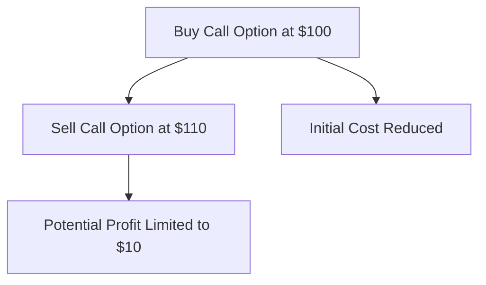
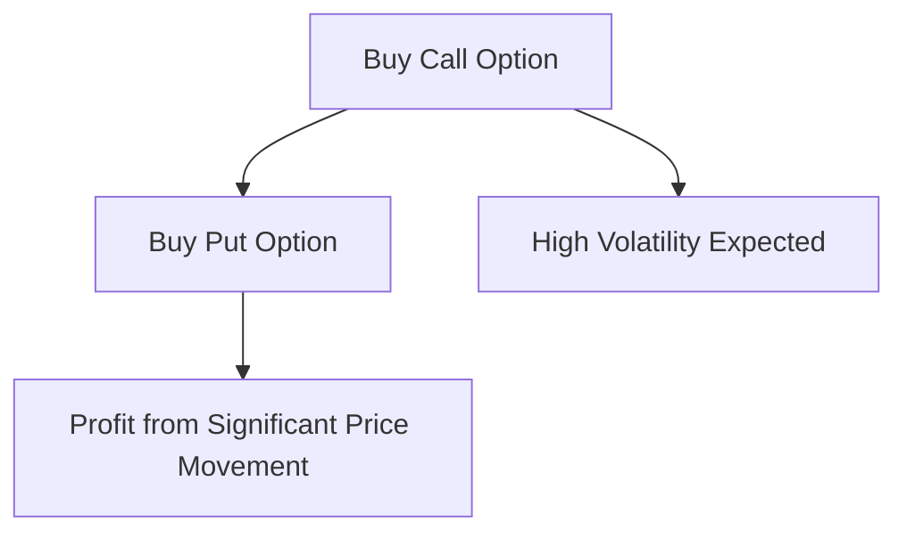
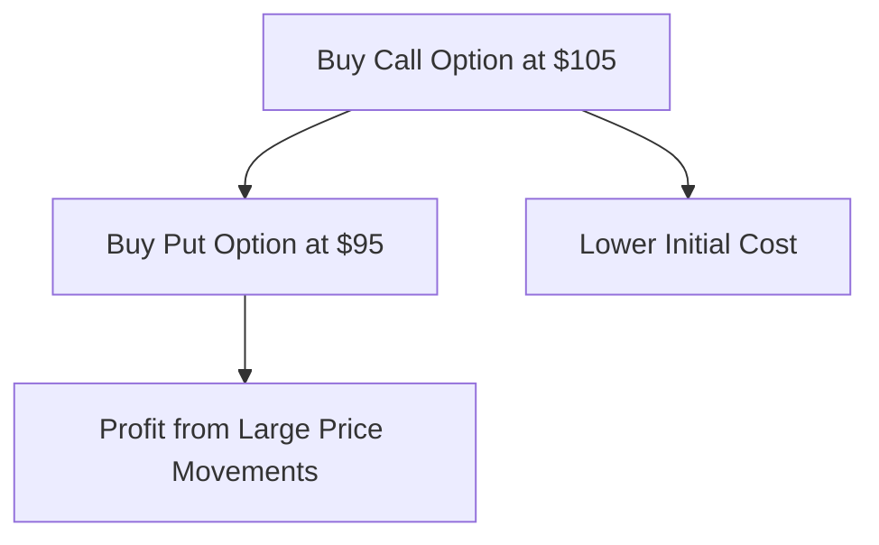

## 10.13 Advanced Option Strategies

In the dynamic world of derivatives, advanced option strategies offer sophisticated tools for investors to navigate various market conditions. This section delves into complex option strategies such as spreads, straddles, and strangles, providing insights into their execution and potential outcomes. By understanding these strategies, investors can enhance their ability to manage risk and optimize returns in the Canadian financial market.

### Understanding Advanced Option Strategies

Advanced option strategies are designed to leverage the flexibility of options to achieve specific investment goals. These strategies can be used to hedge against potential losses, speculate on market movements, or generate income. Let's explore some of the most common advanced option strategies: spreads, straddles, and strangles.

#### Spreads

A spread involves the simultaneous purchase and sale of options of the same class (calls or puts) but with different strike prices or expiration dates. Spreads can be classified into several types, including vertical spreads, horizontal spreads, and diagonal spreads.

- **Vertical Spread:** This involves options with the same expiration date but different strike prices. Vertical spreads can be further divided into bull spreads and bear spreads, depending on the investor's market outlook.

- **Horizontal Spread (Calendar Spread):** This involves options with the same strike price but different expiration dates. It is used to capitalize on time decay differences between the options.

- **Diagonal Spread:** This combines elements of both vertical and horizontal spreads, involving options with different strike prices and expiration dates.

**Example: Bull Call Spread**

A Canadian investor believes that the stock of a major Canadian bank, such as RBC, will rise moderately over the next month. The investor buys a call option with a lower strike price and sells a call option with a higher strike price, both with the same expiration date. This strategy limits the potential profit but also reduces the initial cost compared to buying a single call option.

#### Straddles

A straddle involves purchasing both a call and a put option with the same strike price and expiration date. This strategy is ideal for investors who anticipate significant price movement in either direction but are unsure of the direction.

**Example: Earnings Announcement Straddle**

An investor expects high volatility in the stock price of a Canadian tech company, such as Shopify, around its earnings announcement. The investor buys a call and a put option with the same strike price. If the stock price moves significantly up or down, the investor can profit from the movement.

#### Strangles

A strangle is similar to a straddle but involves buying a call and a put option with different strike prices. This strategy is used when an investor expects significant price movement but wants to reduce the cost compared to a straddle.

**Example: Market Event Strangle**

An investor anticipates a major market event, such as a central bank announcement, that could cause significant price swings in the Canadian dollar. The investor buys a call option with a higher strike price and a put option with a lower strike price. This strategy allows the investor to profit from large price movements while keeping the initial cost lower than a straddle.

### Capitalizing on Market Conditions

Advanced option strategies can be tailored to capitalize on various market conditions:

- **Bullish Market:** Use bull spreads to profit from moderate price increases while limiting risk.
- **Bearish Market:** Use bear spreads to benefit from price declines with controlled risk.
- **Volatile Market:** Use straddles or strangles to profit from significant price movements regardless of direction.
- **Stable Market:** Use horizontal spreads to take advantage of time decay in options.

### Real-World Applications

Canadian investors can apply these strategies in various scenarios:

- **Pension Funds:** Use spreads to hedge against interest rate changes affecting bond portfolios.
- **Individual Investors:** Use straddles during earnings seasons to capitalize on stock volatility.
- **Institutional Investors:** Use strangles to manage currency risk in international investments.

### Best Practices and Common Pitfalls

- **Risk Management:** Always assess the risk-reward ratio and potential losses before executing any strategy.
- **Market Analysis:** Conduct thorough market analysis to identify suitable conditions for each strategy.
- **Regulatory Compliance:** Ensure compliance with Canadian securities regulations when trading options.

### Conclusion

Advanced option strategies offer powerful tools for investors to navigate complex market environments. By understanding and applying spreads, straddles, and strangles, investors can enhance their ability to manage risk and optimize returns. As with any investment strategy, it is crucial to conduct thorough research and consider the specific market conditions before execution.

### **Ready to Test Your Knowledge?**

**Practice 10 Essential CSC Exam Questions to Master Your Certification**



### What is a vertical spread?

- [x] An option strategy involving options with the same expiration date but different strike prices.
- [ ] An option strategy involving options with different expiration dates but the same strike price.
- [ ] An option strategy involving options with different strike prices and expiration dates.
- [ ] An option strategy involving the purchase of both a call and a put option.

> **Explanation:** A vertical spread involves options with the same expiration date but different strike prices, allowing investors to capitalize on price movements within a specific range.

### Which strategy involves buying both a call and a put option with the same strike price and expiration date?

- [x] Straddle
- [ ] Strangle
- [ ] Vertical Spread
- [ ] Horizontal Spread

> **Explanation:** A straddle involves buying both a call and a put option with the same strike price and expiration date, allowing investors to profit from significant price movements in either direction.

### What is the primary advantage of using a strangle over a straddle?

- [x] Lower initial cost
- [ ] Higher potential profit
- [ ] Reduced risk
- [ ] Simplicity

> **Explanation:** A strangle typically has a lower initial cost compared to a straddle because the options have different strike prices, reducing the premium paid.

### In which market condition would a bull spread be most effective?

- [x] Bullish Market
- [ ] Bearish Market
- [ ] Volatile Market
- [ ] Stable Market

> **Explanation:** A bull spread is most effective in a bullish market where moderate price increases are expected, allowing investors to profit while limiting risk.

### What is a horizontal spread also known as?

- [x] Calendar Spread
- [ ] Vertical Spread
- [ ] Diagonal Spread
- [ ] Straddle

> **Explanation:** A horizontal spread, also known as a calendar spread, involves options with the same strike price but different expiration dates, capitalizing on time decay differences.

### Which strategy is ideal for profiting from significant price movements regardless of direction?

- [x] Straddle
- [ ] Bull Spread
- [ ] Bear Spread
- [ ] Horizontal Spread

> **Explanation:** A straddle is ideal for profiting from significant price movements regardless of direction, as it involves both a call and a put option with the same strike price and expiration date.

### What is a diagonal spread?

- [x] An option strategy involving options with different strike prices and expiration dates.
- [ ] An option strategy involving options with the same expiration date but different strike prices.
- [ ] An option strategy involving options with different expiration dates but the same strike price.
- [ ] An option strategy involving the purchase of both a call and a put option.

> **Explanation:** A diagonal spread involves options with different strike prices and expiration dates, combining elements of both vertical and horizontal spreads.

### Which strategy would be suitable for an investor expecting high volatility around an earnings announcement?

- [x] Straddle
- [ ] Bull Spread
- [ ] Bear Spread
- [ ] Horizontal Spread

> **Explanation:** A straddle is suitable for an investor expecting high volatility around an earnings announcement, as it allows for profit from significant price movements in either direction.

### What is the primary goal of using a spread strategy?

- [x] To limit risk while capitalizing on price movements
- [ ] To maximize profit regardless of risk
- [ ] To simplify the trading process
- [ ] To eliminate all potential losses

> **Explanation:** The primary goal of using a spread strategy is to limit risk while capitalizing on price movements within a specific range, balancing potential profit and loss.

### True or False: A strangle involves buying a call and a put option with the same strike price.

- [ ] True
- [x] False

> **Explanation:** False. A strangle involves buying a call and a put option with different strike prices, unlike a straddle, which uses the same strike price.


