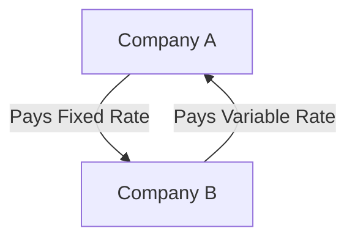

## 10.14 Risk Management with Derivatives

In the complex world of finance, managing risk is a critical component of any investment strategy. Derivatives, financial instruments whose value is derived from an underlying asset, play a pivotal role in risk management. This section delves into how derivatives are used to manage and mitigate various types of financial risks, including market risk, credit risk, and operational risk. We will explore specific derivative instruments and strategies tailored for risk management purposes, emphasizing the importance of understanding the underlying risks before implementing these strategies.

### Understanding Financial Risks

Before diving into the specifics of derivatives, it's essential to understand the types of financial risks that organizations face:

- **Market Risk:** This is the risk of losses in positions arising from movements in market prices. Market risk can be caused by changes in interest rates, currency exchange rates, commodity prices, and equity prices.

- **Credit Risk:** This is the risk that a counterparty will not fulfill their contractual obligations, leading to a financial loss. Credit risk is a significant concern in lending and trading activities.

- **Operational Risk:** This involves the risk of loss resulting from inadequate or failed internal processes, people, systems, or external events.

### Derivatives as Risk Management Tools

Derivatives can be powerful tools for managing these risks. They allow investors and companies to hedge against potential losses, speculate on future price movements, and improve the efficiency of their portfolios.

#### Market Risk Management

Market risk is perhaps the most common type of risk managed with derivatives. Here are some derivative instruments and strategies used to manage market risk:

1. **Futures Contracts:** These are standardized contracts to buy or sell an asset at a predetermined price at a specified time in the future. Canadian investors often use futures to hedge against price fluctuations in commodities, currencies, and interest rates.

   **Example:** A Canadian wheat farmer might use futures contracts to lock in a price for their crop, protecting against the risk of falling wheat prices.

2. **Options Contracts:** Options give the holder the right, but not the obligation, to buy or sell an asset at a specified price before a certain date. Options can be used to hedge against adverse price movements while allowing for potential gains.

   **Example:** A Canadian investor holding shares in a volatile technology company might purchase put options to protect against a potential decline in the stock's price.

3. **Swaps:** Swaps are agreements to exchange cash flows or other financial instruments. Interest rate swaps and currency swaps are common in Canada for managing interest rate risk and foreign exchange risk.

   **Example:** A Canadian corporation with a loan in U.S. dollars might use a currency swap to exchange its USD cash flows for CAD, mitigating the risk of currency fluctuations.

#### Credit Risk Management

Managing credit risk involves ensuring that counterparties fulfill their obligations. Derivatives can help in this regard:

1. **Credit Default Swaps (CDS):** These are contracts that transfer the credit exposure of fixed income products between parties. A CDS can be used to hedge against the risk of a credit event, such as a default.

   **Example:** A Canadian bank might purchase a CDS to protect against the default risk of a corporate bond it holds.

2. **Total Return Swaps:** These swaps allow one party to receive the total return of an asset, including income and capital gains, while paying a fixed or floating rate. They can be used to manage credit exposure without owning the underlying asset.

   **Example:** A Canadian investment firm might use a total return swap to gain exposure to a foreign bond market without directly purchasing the bonds.

#### Operational Risk Management

While derivatives are not typically used to manage operational risk directly, they can be part of a broader risk management strategy that includes:

1. **Risk Transfer:** Derivatives can transfer certain risks to other parties, reducing the operational burden on the original holder.

2. **Insurance Derivatives:** These are specialized derivatives that provide payouts based on insurance-related events, helping manage operational risks related to catastrophic events.

### Importance of Understanding Underlying Risks

Before implementing derivative strategies, it's crucial to thoroughly understand the underlying risks. Derivatives can be complex instruments, and improper use can lead to significant financial losses. Here are some best practices:

- **Risk Assessment:** Conduct a comprehensive risk assessment to identify and quantify potential risks.

- **Education and Training:** Ensure that all stakeholders involved in derivative transactions are well-educated and trained in their use and implications.

- **Regulatory Compliance:** Adhere to Canadian financial regulations, such as those set by the Canadian Investment Regulatory Organization (CIRO), to ensure compliance and mitigate legal risks.

- **Continuous Monitoring:** Regularly monitor derivative positions and market conditions to adjust strategies as needed.

### Practical Examples and Case Studies

To illustrate the application of derivatives in risk management, let's consider a case study involving a major Canadian bank:

**Case Study: RBC and Interest Rate Swaps**

The Royal Bank of Canada (RBC) is one of the largest banks in Canada, with significant exposure to interest rate fluctuations. To manage this risk, RBC frequently uses interest rate swaps. By entering into these swaps, RBC can exchange variable interest rate payments for fixed-rate payments, stabilizing its interest expenses and protecting against rising rates.

**Diagram: Interest Rate Swap**

This diagram illustrates a simple interest rate swap where Company A pays a fixed rate to Company B in exchange for receiving a variable rate.

### Conclusion

Derivatives are indispensable tools in modern financial risk management. By understanding and utilizing these instruments, Canadian investors and institutions can effectively manage market, credit, and operational risks. However, it is crucial to approach derivatives with caution, ensuring a thorough understanding of the underlying risks and maintaining compliance with regulatory standards.

For further exploration, consider resources such as the "Canadian Securities Course" offered by the Canadian Securities Institute (CSI) and the "Derivatives Fundamentals Course" by the Global Risk Institute.

### **Ready to Test Your Knowledge?**

**Practice 10 Essential CSC Exam Questions to Master Your Certification**



### Which of the following is a derivative instrument used to hedge against price fluctuations in commodities?

- [x] Futures Contracts
- [ ] Bonds
- [ ] Stocks
- [ ] Real Estate

> **Explanation:** Futures contracts are standardized agreements to buy or sell an asset at a predetermined price in the future, commonly used to hedge against price fluctuations in commodities.

### What type of risk involves the possibility that a counterparty will not fulfill their contractual obligations?

- [ ] Market Risk
- [x] Credit Risk
- [ ] Operational Risk
- [ ] Liquidity Risk

> **Explanation:** Credit risk is the risk that a counterparty will not fulfill their contractual obligations, leading to a financial loss.

### Which derivative instrument gives the holder the right, but not the obligation, to buy or sell an asset at a specified price?

- [x] Options Contracts
- [ ] Futures Contracts
- [ ] Swaps
- [ ] Forwards

> **Explanation:** Options contracts give the holder the right, but not the obligation, to buy or sell an asset at a specified price before a certain date.

### What is the primary purpose of using interest rate swaps?

- [x] To manage interest rate risk
- [ ] To speculate on currency movements
- [ ] To hedge against stock market declines
- [ ] To insure against credit defaults

> **Explanation:** Interest rate swaps are used to manage interest rate risk by exchanging variable interest rate payments for fixed-rate payments or vice versa.

### Which of the following is a best practice before implementing derivative strategies?

- [x] Conduct a comprehensive risk assessment
- [ ] Ignore market conditions
- [ ] Avoid regulatory compliance
- [ ] Rely solely on historical data

> **Explanation:** Conducting a comprehensive risk assessment is a best practice to identify and quantify potential risks before implementing derivative strategies.

### What is a Credit Default Swap (CDS) primarily used for?

- [x] To hedge against the risk of a credit event
- [ ] To speculate on commodity prices
- [ ] To manage operational risk
- [ ] To insure against natural disasters

> **Explanation:** A Credit Default Swap (CDS) is used to hedge against the risk of a credit event, such as a default, by transferring credit exposure between parties.

### Which Canadian regulatory body sets standards for financial derivatives?

- [x] Canadian Investment Regulatory Organization (CIRO)
- [ ] Financial Conduct Authority (FCA)
- [ ] Securities and Exchange Commission (SEC)
- [ ] European Central Bank (ECB)

> **Explanation:** The Canadian Investment Regulatory Organization (CIRO) sets standards for financial derivatives in Canada.

### What is the main advantage of using options contracts in risk management?

- [x] They provide the right, but not the obligation, to buy or sell an asset
- [ ] They guarantee a profit
- [ ] They eliminate all risks
- [ ] They are free of cost

> **Explanation:** Options contracts provide the right, but not the obligation, to buy or sell an asset, allowing for flexibility in risk management.

### Which derivative is used to exchange cash flows or other financial instruments?

- [x] Swaps
- [ ] Options
- [ ] Futures
- [ ] Forwards

> **Explanation:** Swaps are agreements to exchange cash flows or other financial instruments, commonly used to manage interest rate and currency risks.

### True or False: Derivatives can be used to manage operational risk directly.

- [ ] True
- [x] False

> **Explanation:** Derivatives are not typically used to manage operational risk directly, but they can be part of a broader risk management strategy.


