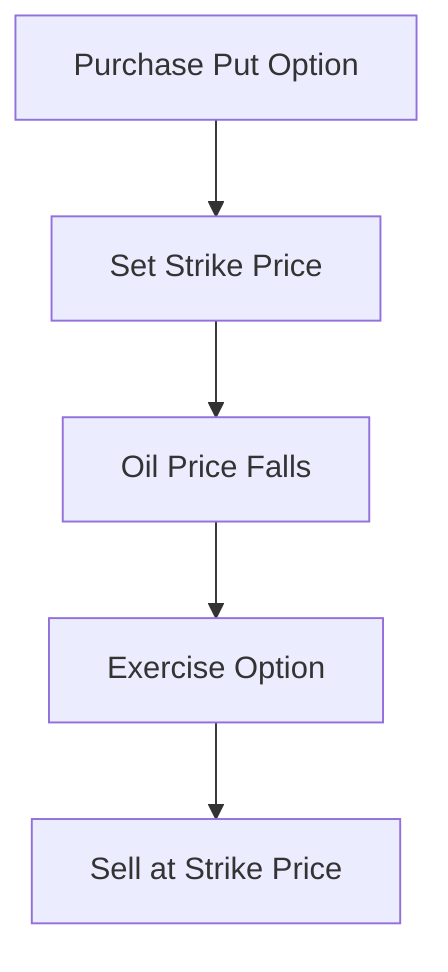

## 10.17 Practical Applications and Case Studies in Derivatives

In the world of finance, derivatives are powerful tools that can be used for a variety of purposes, including hedging risk, speculating on future price movements, and enhancing portfolio returns. This section delves into practical applications and real-world case studies to illustrate how derivatives are employed in financial strategies, particularly within the Canadian context. By analyzing these examples, we aim to provide insights into what strategies have been successful, which have not, and the lessons that can be drawn from these experiences.

### Understanding Derivatives in Practice

Before diving into the case studies, it's crucial to understand the basic types of derivatives commonly used in financial markets:

- **Options:** Contracts that give the buyer the right, but not the obligation, to buy or sell an asset at a predetermined price before a specified date.
- **Futures:** Agreements to buy or sell an asset at a future date for a price agreed upon today.
- **Swaps:** Contracts in which two parties exchange cash flows or other financial instruments.
- **Forwards:** Customized contracts between two parties to buy or sell an asset at a specified future date for a price agreed upon today.

These instruments can be used individually or in combination to achieve specific financial objectives.

### Case Study 1: Hedging with Options in the Canadian Oil Industry

**Background:**  
The Canadian oil industry is highly susceptible to fluctuations in global oil prices. A major Canadian oil producer, facing uncertainty in oil prices, decided to use options to hedge against potential price declines.

**Strategy:**  
The company purchased put options on crude oil futures. This strategy provided the right to sell oil at a predetermined price, thus setting a floor price for their product.

**Outcome:**  
When oil prices fell significantly due to geopolitical tensions, the company was able to exercise its put options, selling oil at the higher strike price. This hedging strategy effectively mitigated the financial impact of the price drop.

**Lessons Learned:**  
- **Effective Risk Management:** Options can serve as an effective tool for managing price risk in volatile markets.
- **Cost Consideration:** The premium paid for options must be weighed against the potential benefits of the hedge.

### Case Study 2: Speculation with Futures in the Agricultural Sector

**Background:**  
A Canadian agricultural firm sought to capitalize on anticipated increases in wheat prices due to projected supply shortages.

**Strategy:**  
The firm entered into long futures contracts on wheat, betting that prices would rise.

**Outcome:**  
Contrary to expectations, wheat prices fell due to unexpected favorable weather conditions that boosted supply. The firm incurred significant losses on its futures positions.

**Lessons Learned:**  
- **Market Uncertainty:** Speculation carries inherent risks, and market conditions can change unexpectedly.
- **Diversification:** Relying solely on speculative positions can lead to substantial losses; diversification can mitigate this risk.

### Case Study 3: Interest Rate Swaps in Corporate Finance

**Background:**  
A Canadian corporation with variable-rate debt sought to stabilize its interest expenses amid rising interest rates.

**Strategy:**  
The company entered into an interest rate swap agreement, exchanging its variable-rate payments for fixed-rate payments.

**Outcome:**  
As interest rates continued to rise, the swap effectively locked in lower interest payments, providing cost certainty and protecting the company's cash flow.

**Lessons Learned:**  
- **Cash Flow Stability:** Swaps can be instrumental in managing interest rate risk and ensuring predictable cash flows.
- **Counterparty Risk:** It's essential to assess the creditworthiness of the swap counterparty to mitigate default risk.

### Case Study 4: Currency Forwards in International Trade

**Background:**  
A Canadian exporter with significant sales in the U.S. faced exchange rate risk due to fluctuations in the CAD/USD exchange rate.

**Strategy:**  
The exporter used currency forwards to lock in exchange rates for future sales, ensuring stable revenue in Canadian dollars.

**Outcome:**  
When the Canadian dollar appreciated unexpectedly, the forward contracts protected the exporter from adverse currency movements, preserving profit margins.

**Lessons Learned:**  
- **Exchange Rate Protection:** Forwards can effectively hedge against currency risk, particularly for businesses with international exposure.
- **Flexibility vs. Commitment:** While forwards provide certainty, they also require a commitment to the agreed-upon rate, which may not always be favorable.

### Encouraging Critical Thinking

These case studies highlight the diverse applications of derivatives in managing financial challenges. As you consider these examples, reflect on the following questions:

- How might different derivative instruments be combined to achieve a more comprehensive risk management strategy?
- What factors should be considered when deciding whether to hedge, speculate, or use derivatives for other purposes?
- How can lessons from past successes and failures inform future financial decisions?

### Best Practices and Common Pitfalls

**Best Practices:**
- **Thorough Analysis:** Conduct detailed market analysis before implementing derivative strategies.
- **Risk Assessment:** Continuously assess and manage the risks associated with derivative positions.
- **Regulatory Compliance:** Ensure all derivative transactions comply with relevant Canadian regulations.

**Common Pitfalls:**
- **Over-Leverage:** Avoid excessive leverage, which can amplify losses.
- **Lack of Diversification:** Diversify strategies to reduce reliance on a single outcome.
- **Ignoring Costs:** Consider transaction costs and potential impacts on profitability.

### Diagrams and Visual Aids

To further illustrate these concepts, consider the following diagram depicting a basic options strategy:

This flowchart demonstrates the process of using put options to hedge against declining oil prices, highlighting the decision points and outcomes.

### Additional Resources

For those interested in exploring derivatives further, consider the following resources:

- **Books:** "Options, Futures, and Other Derivatives" by John C. Hull
- **Online Courses:** Coursera's "Financial Derivatives" course
- **Regulatory Information:** Canadian Securities Administrators (CSA) website for updates on derivatives regulations

### Conclusion

Derivatives offer a versatile set of tools for managing financial risks and opportunities. By studying real-world applications and analyzing outcomes, finance professionals can enhance their understanding and application of these instruments in the Canadian market. As you continue your journey in finance, remember to apply these principles thoughtfully, considering both the potential benefits and risks.

### **Ready to Test Your Knowledge?**

**Practice 10 Essential CSC Exam Questions to Master Your Certification**



### Which derivative instrument provides the right, but not the obligation, to buy or sell an asset at a predetermined price?

- [x] Options
- [ ] Futures
- [ ] Swaps
- [ ] Forwards

> **Explanation:** Options give the holder the right, but not the obligation, to buy or sell an asset at a specified price before a certain date.

### In the case study involving the Canadian oil industry, what derivative was used to hedge against price declines?

- [x] Put options
- [ ] Call options
- [ ] Futures contracts
- [ ] Currency forwards

> **Explanation:** The Canadian oil producer used put options to hedge against potential declines in oil prices.

### What was the outcome of the agricultural firm's speculation with wheat futures?

- [ ] They made a profit due to rising prices.
- [x] They incurred losses due to falling prices.
- [ ] They broke even.
- [ ] They avoided losses through diversification.

> **Explanation:** The firm incurred losses because wheat prices fell, contrary to their expectations.

### Which derivative was used by the Canadian corporation to manage interest rate risk?

- [ ] Options
- [ ] Futures
- [x] Swaps
- [ ] Forwards

> **Explanation:** The corporation used interest rate swaps to exchange variable-rate payments for fixed-rate payments.

### What is a common pitfall when using derivatives?

- [x] Over-leverage
- [ ] Thorough analysis
- [ ] Risk assessment
- [ ] Regulatory compliance

> **Explanation:** Over-leverage can amplify losses and is a common pitfall in derivative trading.

### What is a key benefit of using currency forwards for a Canadian exporter?

- [x] Exchange rate protection
- [ ] Increased leverage
- [ ] Speculative gains
- [ ] Reduced transaction costs

> **Explanation:** Currency forwards provide exchange rate protection, ensuring stable revenue in Canadian dollars.

### What should be considered when deciding to use derivatives for hedging?

- [x] Market conditions
- [x] Cost of the derivative
- [ ] Speculative potential
- [ ] Historical performance

> **Explanation:** Both market conditions and the cost of the derivative should be considered when using derivatives for hedging.

### Which of the following is a best practice when using derivatives?

- [x] Conducting thorough analysis
- [ ] Ignoring transaction costs
- [ ] Relying solely on speculation
- [ ] Over-leveraging positions

> **Explanation:** Conducting thorough analysis is a best practice to ensure informed decision-making.

### What is a potential risk of entering into an interest rate swap?

- [x] Counterparty risk
- [ ] Exchange rate risk
- [ ] Commodity price risk
- [ ] Speculative risk

> **Explanation:** Counterparty risk is a potential risk in swaps, as it involves the creditworthiness of the other party.

### True or False: Derivatives can only be used for speculative purposes.

- [ ] True
- [x] False

> **Explanation:** Derivatives can be used for various purposes, including hedging, risk management, and speculation.


