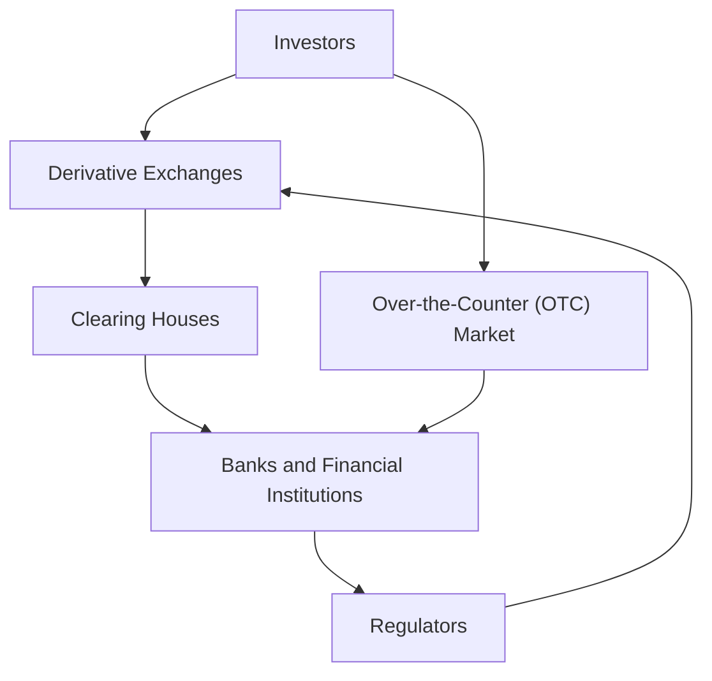

## 10.18 Common Misconceptions about Derivatives

Derivatives are complex financial instruments that often evoke a mix of intrigue and apprehension among investors and financial professionals. Despite their widespread use in the financial markets, derivatives are frequently misunderstood, leading to several myths and misconceptions. This section aims to identify and debunk these prevalent myths, providing factual explanations to clarify the true nature and purpose of derivative instruments. By emphasizing the importance of education and due diligence, we aim to equip readers with the knowledge necessary to engage with derivatives confidently and effectively.

### Understanding Derivatives

Before delving into misconceptions, it's essential to understand what derivatives are. Derivatives are financial contracts whose value is derived from an underlying asset, index, or rate. Common types of derivatives include options, futures, forwards, and swaps. These instruments are used for various purposes, including hedging risk, speculating on price movements, and enhancing portfolio returns.

### Myth 1: Derivatives Are Inherently Risky and Speculative

**Debunking the Myth:**

One of the most pervasive myths is that derivatives are inherently risky and primarily used for speculation. While it's true that derivatives can be used for speculative purposes, they are also powerful tools for risk management. For example, Canadian farmers might use futures contracts to lock in prices for their crops, thereby hedging against price fluctuations. Similarly, a Canadian pension fund might use interest rate swaps to manage exposure to interest rate changes.

**Factual Explanation:**

Derivatives can be tailored to suit various risk appetites and investment strategies. When used prudently, they can reduce risk and provide stability to a portfolio. The key is understanding the specific derivative instrument and its application within the broader investment strategy.

### Myth 2: Derivatives Are Only for Large Institutions

**Debunking the Myth:**

Another common misconception is that derivatives are exclusively for large financial institutions and not accessible to individual investors or smaller entities. This belief stems from the complexity and scale often associated with derivative transactions.

**Factual Explanation:**

While it's true that large institutions like banks and hedge funds are significant players in the derivatives market, individual investors and smaller firms can also participate. For instance, options and futures are available on exchanges like the Montreal Exchange, allowing Canadian retail investors to trade these instruments. Moreover, exchange-traded funds (ETFs) that use derivatives are accessible to individual investors, providing exposure to derivative strategies without direct involvement in complex transactions.

### Myth 3: Derivatives Caused the 2008 Financial Crisis

**Debunking the Myth:**

The 2008 financial crisis is often attributed to derivatives, particularly mortgage-backed securities (MBS) and credit default swaps (CDS). This has led to the belief that derivatives are inherently dangerous and destabilizing.

**Factual Explanation:**

While derivatives played a role in the crisis, they were not the sole cause. The crisis resulted from a combination of factors, including poor risk management, inadequate regulation, and excessive leverage. Derivatives themselves are not inherently harmful; rather, it was the misuse and lack of understanding of these instruments that contributed to the crisis. Post-crisis regulatory reforms, such as those implemented by the Canadian Securities Administrators (CSA), have strengthened oversight and transparency in the derivatives market.

### Myth 4: Derivatives Are Too Complex for the Average Investor

**Debunking the Myth:**

The complexity of derivatives often leads to the perception that they are beyond the understanding of the average investor.

**Factual Explanation:**

While some derivatives can be complex, many are straightforward and accessible with the right education and resources. For example, options trading involves understanding basic concepts like strike prices and expiration dates, which can be learned through courses and educational materials. Canadian investors can access resources from institutions like the Investment Industry Regulatory Organization of Canada (IIROC) to enhance their understanding of derivatives.

### Myth 5: Derivatives Are a Zero-Sum Game

**Debunking the Myth:**

A common belief is that derivatives are a zero-sum game, where one party's gain is another's loss.

**Factual Explanation:**

While some derivative transactions, like options and futures, can be zero-sum, this is not universally true. Derivatives can create value by allowing market participants to transfer risk, hedge positions, and improve market efficiency. For example, a Canadian exporter might use currency futures to hedge against exchange rate fluctuations, benefiting from stable cash flows without necessarily causing a loss to the counterparty.

### The Importance of Education and Due Diligence

Understanding derivatives requires a commitment to education and due diligence. Investors should seek to understand the specific characteristics and risks associated with each derivative instrument. Engaging with financial advisors, attending workshops, and utilizing educational resources can enhance one's ability to navigate the derivatives market effectively.

### Practical Example: Canadian Pension Fund Strategy

Consider a Canadian pension fund that uses interest rate swaps to manage its exposure to interest rate fluctuations. By entering into a swap agreement, the fund can exchange variable interest payments for fixed payments, stabilizing its cash flows and reducing interest rate risk. This strategic use of derivatives illustrates their potential to enhance financial stability and performance.

### Diagram: Derivative Market Structure

Below is a simplified diagram illustrating the structure of the derivatives market, highlighting the relationships between different market participants.

### Conclusion

Derivatives are versatile financial instruments that, when used appropriately, can offer significant benefits in terms of risk management and investment returns. By debunking common misconceptions and emphasizing the importance of education, investors can better understand and utilize derivatives within their portfolios. As with any financial instrument, due diligence and a clear understanding of the associated risks and rewards are crucial.

### **Ready to Test Your Knowledge?**

**Practice 10 Essential CSC Exam Questions to Master Your Certification**



### Which of the following is a common myth about derivatives?

- [x] Derivatives are inherently risky and speculative.
- [ ] Derivatives are only used for hedging.
- [ ] Derivatives are simple financial instruments.
- [ ] Derivatives have no impact on financial markets.

> **Explanation:** A common myth is that derivatives are inherently risky and speculative, though they can also be used for hedging and risk management.

### How can derivatives benefit a Canadian pension fund?

- [x] By managing interest rate risk through swaps.
- [ ] By eliminating all investment risks.
- [ ] By guaranteeing high returns.
- [ ] By avoiding regulatory oversight.

> **Explanation:** Derivatives like interest rate swaps can help a Canadian pension fund manage interest rate risk, stabilizing cash flows.

### What role did derivatives play in the 2008 financial crisis?

- [x] They were misused and contributed to the crisis.
- [ ] They were the sole cause of the crisis.
- [ ] They prevented the crisis.
- [ ] They had no impact on the crisis.

> **Explanation:** Derivatives were misused and contributed to the crisis, but they were not the sole cause.

### Are derivatives accessible to individual investors in Canada?

- [x] Yes, through exchanges like the Montreal Exchange.
- [ ] No, they are only for large institutions.
- [ ] No, they are illegal for individuals.
- [ ] Yes, but only through foreign exchanges.

> **Explanation:** Individual investors in Canada can access derivatives through exchanges like the Montreal Exchange.

### What is a zero-sum game in the context of derivatives?

- [x] A situation where one party's gain is another's loss.
- [ ] A situation where all parties gain.
- [ ] A situation where no parties gain or lose.
- [ ] A situation where all parties lose.

> **Explanation:** A zero-sum game in derivatives is where one party's gain is another's loss, though not all derivatives are zero-sum.

### Why is education important when dealing with derivatives?

- [x] To understand the risks and benefits.
- [ ] To avoid all financial instruments.
- [ ] To guarantee profits.
- [ ] To eliminate market volatility.

> **Explanation:** Education is crucial to understanding the risks and benefits of derivatives, enabling informed decision-making.

### Can derivatives be used for purposes other than speculation?

- [x] Yes, for hedging and risk management.
- [ ] No, they are only for speculation.
- [ ] No, they are illegal for other uses.
- [ ] Yes, but only in foreign markets.

> **Explanation:** Derivatives can be used for hedging and risk management, not just speculation.

### What is the role of clearing houses in the derivatives market?

- [x] To facilitate the settlement of trades.
- [ ] To create new derivatives.
- [ ] To eliminate all market risks.
- [ ] To regulate financial institutions.

> **Explanation:** Clearing houses facilitate the settlement of trades, ensuring the smooth functioning of the derivatives market.

### How can individual investors learn about derivatives?

- [x] Through educational resources and courses.
- [ ] By avoiding all financial education.
- [ ] By relying solely on market rumors.
- [ ] By only trading without learning.

> **Explanation:** Individual investors can learn about derivatives through educational resources and courses, enhancing their understanding.

### True or False: Derivatives can only be used by financial experts.

- [ ] True
- [x] False

> **Explanation:** False. While derivatives can be complex, they are accessible to informed individual investors and smaller entities with the right education.


