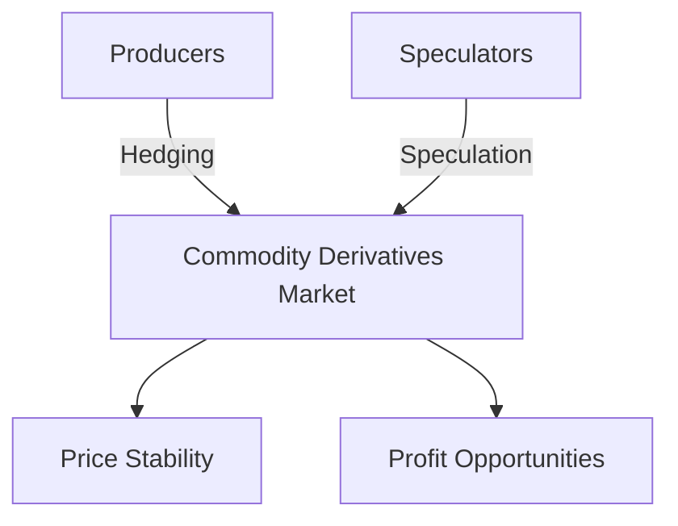

## 10.2.1 Commodities

In the world of finance, commodities play a crucial role as underlying assets in derivatives markets. Understanding how commodity derivatives function is essential for anyone involved in financial services, particularly within the Canadian context. This section will delve into the types of commodity derivatives, the market influences affecting them, and their uses in hedging and speculation.

### Types of Commodity Derivatives

Commodity derivatives are financial instruments whose value is derived from the price of a physical commodity. These derivatives are commonly used for trading and risk management purposes. Here are some of the most prevalent commodities used in derivatives:

- **Crude Oil:** As one of the most traded commodities globally, crude oil derivatives are vital for managing the risks associated with oil price volatility. Canada, being a significant oil producer, sees substantial activity in crude oil derivatives.

- **Gold:** Known for its status as a safe-haven asset, gold is a popular choice for derivatives trading. Investors often use gold derivatives to hedge against inflation and currency fluctuations.

- **Wheat:** As a staple agricultural product, wheat derivatives are crucial for farmers and food producers to manage price risks. Canada, with its vast agricultural sector, is a key player in wheat derivatives.

These commodities serve as the foundation for various derivative instruments, including futures, options, and swaps, each offering unique benefits and risks.

### Market Influences

The prices of commodities are influenced by a myriad of factors, making them inherently volatile. Understanding these influences is critical for anyone dealing with commodity derivatives:

- **Supply and Demand Dynamics:** The fundamental economic principle of supply and demand significantly impacts commodity prices. For instance, a bumper wheat harvest can lead to lower prices, while a supply disruption in oil can cause prices to spike.

- **Weather Conditions:** Particularly relevant for agricultural commodities, weather conditions can drastically affect supply levels. Droughts, floods, and other extreme weather events can lead to significant price fluctuations.

- **Geopolitical Factors:** Political instability, trade policies, and international relations can all influence commodity prices. For example, tensions in oil-producing regions can lead to supply concerns and price increases.

These factors create a complex environment where commodity prices can change rapidly, necessitating the use of derivatives for effective risk management.

### Uses of Commodity Derivatives

Commodity derivatives are versatile tools used by various market participants for different purposes:

#### Hedging

Hedging involves using derivatives to protect against adverse price movements. Producers, such as farmers or oil companies, often use commodity derivatives to lock in prices and ensure stable revenues. For example, a Canadian wheat farmer might use futures contracts to secure a selling price for their crop, mitigating the risk of price drops due to unforeseen circumstances.

#### Speculation

Speculators, on the other hand, use commodity derivatives to profit from price changes. They do not have an inherent interest in the physical commodity but aim to capitalize on market movements. For instance, a trader might buy crude oil futures if they anticipate a price increase due to geopolitical tensions. While speculation can lead to significant profits, it also carries substantial risks.

### Glossary

- **Hedging:** Using derivatives to offset potential losses in an investment. It is a risk management strategy employed to protect against price volatility.

- **Speculation:** Using derivatives to bet on the direction of price movements for profit. Speculators aim to benefit from market fluctuations without any intention of taking delivery of the underlying commodity.

### Practical Example: Canadian Pension Funds

Canadian pension funds often use commodity derivatives as part of their investment strategies. By incorporating commodities like gold and oil into their portfolios, they can achieve diversification and hedge against inflation. For instance, a pension fund might use gold futures to protect against currency devaluation, ensuring the preservation of purchasing power for retirees.

### Diagram: Commodity Derivatives Market Flow

Below is a diagram illustrating the flow of commodity derivatives in the market, highlighting the interactions between producers, speculators, and the market itself.

### Best Practices and Challenges

When dealing with commodity derivatives, it's essential to adhere to best practices and be aware of common challenges:

- **Best Practices:**
  - Conduct thorough market analysis to understand price drivers.
  - Use derivatives as part of a broader risk management strategy.
  - Stay informed about regulatory changes affecting derivatives trading.

- **Common Challenges:**
  - Managing the complexity and volatility of commodity markets.
  - Ensuring compliance with Canadian financial regulations.
  - Balancing the risks and rewards of speculation.

### Conclusion

Commodity derivatives are powerful tools in the financial markets, offering opportunities for hedging and speculation. By understanding the types of commodities, market influences, and strategic uses, financial professionals can effectively navigate these instruments within the Canadian context. As you continue to explore the world of derivatives, consider how these principles apply to your own financial strategies and investment decisions.

## Quiz Time!



### Which of the following is a common commodity used in derivatives?

- [x] Crude Oil
- [ ] Silver
- [ ] Copper
- [ ] Natural Gas

> **Explanation:** Crude oil is one of the most traded commodities in derivatives markets, especially in Canada.

### What is the primary purpose of hedging with commodity derivatives?

- [x] To offset potential losses due to price volatility
- [ ] To maximize profits from price changes
- [ ] To speculate on market movements
- [ ] To diversify investment portfolios

> **Explanation:** Hedging is used to protect against adverse price movements, ensuring stable revenues for producers.

### How do weather conditions affect commodity prices?

- [x] They can cause supply disruptions leading to price fluctuations
- [ ] They have no impact on commodity prices
- [ ] They only affect agricultural commodities
- [ ] They stabilize commodity prices

> **Explanation:** Weather conditions, such as droughts or floods, can significantly impact the supply of agricultural commodities, leading to price changes.

### What role do speculators play in the commodity derivatives market?

- [x] They aim to profit from price changes without interest in the physical commodity
- [ ] They stabilize prices by providing liquidity
- [ ] They hedge against price volatility
- [ ] They produce the underlying commodities

> **Explanation:** Speculators seek to profit from market movements, often taking on higher risks for potential rewards.

### Which factor is NOT a market influence on commodity prices?

- [ ] Supply and demand dynamics
- [ ] Geopolitical factors
- [ ] Weather conditions
- [x] Interest rates

> **Explanation:** While interest rates can affect broader economic conditions, they are not a direct influence on commodity prices like supply, demand, and geopolitical factors.

### What is the relationship between producers and the commodity derivatives market?

- [x] Producers use derivatives to hedge against price volatility
- [ ] Producers speculate on price movements for profit
- [ ] Producers have no interaction with the derivatives market
- [ ] Producers only use derivatives for investment purposes

> **Explanation:** Producers use derivatives to lock in prices and manage revenue risks associated with price volatility.

### How can geopolitical factors influence commodity prices?

- [x] They can lead to supply concerns and price increases
- [ ] They have no impact on commodity prices
- [ ] They only affect agricultural commodities
- [ ] They stabilize commodity prices

> **Explanation:** Geopolitical tensions, especially in oil-producing regions, can lead to supply disruptions and price increases.

### What is a key challenge when using commodity derivatives?

- [x] Managing market complexity and volatility
- [ ] Ensuring high returns on investment
- [ ] Avoiding regulatory compliance
- [ ] Predicting exact price movements

> **Explanation:** The complexity and volatility of commodity markets pose significant challenges for those using derivatives.

### Why might a Canadian pension fund use commodity derivatives?

- [x] To diversify and hedge against inflation
- [ ] To speculate on short-term price movements
- [ ] To avoid investing in equities
- [ ] To increase exposure to currency risk

> **Explanation:** Pension funds use commodity derivatives to diversify their portfolios and protect against inflation, ensuring stable returns.

### True or False: Speculation with commodity derivatives is risk-free.

- [ ] True
- [x] False

> **Explanation:** Speculation involves significant risks as it relies on predicting market movements, which can be highly volatile and unpredictable.


