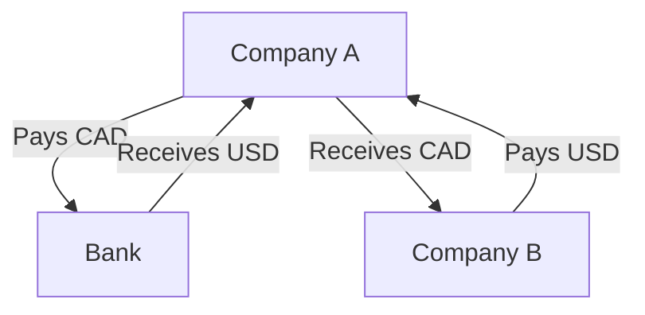

## 10.2.2 Financial Assets

In the realm of financial markets, derivatives play a crucial role in risk management and investment strategies. This section delves into financial derivatives, focusing on those based on equities, interest rates, and currencies. We will explore their types, market uses, and features, providing a comprehensive understanding of these complex instruments.

### Types of Financial Derivatives

Financial derivatives are contracts whose value is derived from the performance of underlying financial assets. These assets can include equities, interest rates, and currencies. Let's examine the common types of financial derivatives associated with each of these categories:

#### 1. Equity Derivatives

Equity derivatives are financial instruments whose value is based on the price movements of underlying stocks or stock indices. Common equity derivatives include:

- **Options:** Contracts that give the holder the right, but not the obligation, to buy or sell a stock at a predetermined price before or on a specific date.
- **Futures:** Agreements to buy or sell a stock or stock index at a predetermined price on a specified future date.
- **Equity Swaps:** Contracts in which two parties exchange cash flows based on the performance of an equity index or a basket of stocks.

#### 2. Interest Rate Derivatives

Interest rate derivatives are contracts that derive their value from interest rate movements. They are primarily used to manage exposure to fluctuations in interest rates. Key interest rate derivatives include:

- **Interest Rate Swaps:** Agreements between two parties to exchange one stream of interest payments for another, based on a specified principal amount.
- **Forward Rate Agreements (FRAs):** Contracts that determine the interest rate to be paid or received on an obligation beginning at a future start date.
- **Interest Rate Options:** Options that provide the holder with the right to pay or receive a specific interest rate on a predetermined principal amount.

#### 3. Currency Derivatives

Currency derivatives are financial instruments used to hedge or speculate on changes in exchange rates. Common currency derivatives include:

- **Currency Futures:** Contracts to exchange a specific amount of one currency for another at a future date and at a predetermined rate.
- **Currency Options:** Options that give the holder the right to exchange currency at a specified rate on or before a certain date.
- **Currency Swaps:** Agreements to exchange principal and interest payments in one currency for principal and interest payments in another currency.

### Market Uses of Financial Derivatives

Financial derivatives serve various purposes in the market, primarily for hedging and managing financial risks. Here are some common uses:

#### Hedging Interest Rate Risk

Interest rate derivatives, such as swaps and options, are widely used by corporations and financial institutions to hedge against interest rate fluctuations. For example, a Canadian company with a variable-rate loan might use an interest rate swap to lock in a fixed interest rate, thus stabilizing its interest payments.

#### Managing Currency Risk

Currency derivatives are essential tools for managing currency risk, especially for businesses engaged in international trade. A Canadian exporter expecting payment in U.S. dollars might use currency futures or options to hedge against adverse currency movements, ensuring predictable revenue in Canadian dollars.

#### Mitigating Equity Exposure

Equity derivatives, such as options and futures, allow investors to manage their exposure to stock market volatility. For instance, a Canadian pension fund might use equity options to protect its portfolio from a potential downturn in the stock market, thereby preserving its value.

### Features of Financial Derivatives

Financial derivatives can be broadly categorized into standardized and customized contracts, each with distinct features:

#### Standardized Derivatives

Standardized derivatives, such as futures and options traded on exchanges, have fixed terms and conditions. These contracts offer high liquidity and transparency, making them accessible to a wide range of investors. The standardization ensures that all market participants trade under the same terms, facilitating ease of trading and settlement.

#### Customized Derivatives

Customized derivatives, often referred to as over-the-counter (OTC) derivatives, are tailored to meet the specific needs of the contracting parties. These contracts offer flexibility in terms of contract size, maturity, and underlying assets. However, they may carry higher counterparty risk due to the lack of a centralized clearinghouse.

### Glossary

- **Interest Rate Derivatives:** Contracts whose value is based on interest rate movements, used to hedge or speculate on changes in interest rates.
- **Currency Derivatives:** Contracts based on currency exchange rates, used to manage currency risk or speculate on currency movements.

### Practical Examples and Case Studies

To illustrate the application of financial derivatives, consider the following real-world scenarios:

#### Case Study: Hedging Interest Rate Risk with RBC

Royal Bank of Canada (RBC), like many financial institutions, uses interest rate swaps to manage its exposure to interest rate fluctuations. By entering into swap agreements, RBC can convert its variable-rate liabilities into fixed-rate obligations, stabilizing its interest expenses and protecting its profit margins.

#### Example: Currency Risk Management by a Canadian Exporter

A Canadian exporter, expecting a large payment in euros, might use currency futures to lock in the current exchange rate. This strategy ensures that the exporter receives a predictable amount in Canadian dollars, regardless of future currency fluctuations.

### Diagrams and Visual Aids

To enhance understanding, let's visualize the flow of a currency swap using a diagram:

**Explanation:** In this currency swap, Company A pays Canadian dollars to the bank and receives U.S. dollars. Simultaneously, Company A receives Canadian dollars from Company B and pays U.S. dollars, effectively hedging its currency exposure.

### Best Practices and Common Pitfalls

When dealing with financial derivatives, consider the following best practices and potential challenges:

- **Best Practices:**
  - Conduct thorough risk assessments before entering derivative contracts.
  - Use derivatives as part of a broader risk management strategy, not as standalone solutions.
  - Ensure compliance with Canadian regulatory requirements, such as those set by the Canadian Securities Administrators (CSA).

- **Common Pitfalls:**
  - Over-reliance on derivatives without understanding the underlying risks.
  - Ignoring counterparty risk in OTC derivatives.
  - Failing to monitor and adjust derivative positions in response to market changes.

### Encouraging Continuous Learning

Understanding financial derivatives is crucial for effective risk management and investment strategies. To deepen your knowledge, consider exploring the following resources:

- **Books:** "Options, Futures, and Other Derivatives" by John C. Hull
- **Online Courses:** Coursera's "Financial Derivatives" course
- **Regulatory Resources:** Canadian Securities Administrators (CSA) website for updates on derivatives regulations

By applying the principles and strategies discussed in this section, you can effectively manage financial risks and enhance your investment decisions within the Canadian market.

## Quiz Time!



### What are equity derivatives primarily based on?

- [x] Stock price movements
- [ ] Interest rate movements
- [ ] Currency exchange rates
- [ ] Commodity prices

> **Explanation:** Equity derivatives derive their value from the price movements of underlying stocks or stock indices.

### Which of the following is a common interest rate derivative?

- [x] Interest Rate Swap
- [ ] Currency Option
- [ ] Equity Future
- [ ] Commodity Swap

> **Explanation:** Interest rate swaps are agreements to exchange interest payments and are a common type of interest rate derivative.

### What is the primary use of currency derivatives?

- [x] Managing currency risk
- [ ] Speculating on commodity prices
- [ ] Hedging equity exposure
- [ ] Stabilizing interest payments

> **Explanation:** Currency derivatives are used to manage currency risk by hedging against adverse currency movements.

### What distinguishes standardized derivatives from customized derivatives?

- [x] Standardized terms and conditions
- [ ] Higher counterparty risk
- [ ] Tailored contract size
- [ ] Lack of liquidity

> **Explanation:** Standardized derivatives have fixed terms and conditions, making them highly liquid and transparent.

### Which financial institution is mentioned as using interest rate swaps for risk management?

- [x] RBC
- [ ] TD Bank
- [ ] Scotiabank
- [ ] BMO

> **Explanation:** RBC uses interest rate swaps to manage its exposure to interest rate fluctuations.

### What is a common pitfall when using financial derivatives?

- [x] Over-reliance without understanding risks
- [ ] Conducting thorough risk assessments
- [ ] Ensuring regulatory compliance
- [ ] Using derivatives as part of a broader strategy

> **Explanation:** Over-reliance on derivatives without understanding the underlying risks is a common pitfall.

### What is a key feature of customized derivatives?

- [x] Tailored to specific needs
- [ ] Standardized terms
- [ ] High liquidity
- [ ] Centralized clearinghouse

> **Explanation:** Customized derivatives are tailored to meet the specific needs of the contracting parties.

### What is the primary purpose of an interest rate swap?

- [x] Exchange interest payments
- [ ] Exchange currency
- [ ] Hedge equity exposure
- [ ] Speculate on stock prices

> **Explanation:** Interest rate swaps are used to exchange one stream of interest payments for another.

### Which of the following is a feature of standardized derivatives?

- [x] Traded on exchanges
- [ ] Tailored contract terms
- [ ] Higher counterparty risk
- [ ] Lack of transparency

> **Explanation:** Standardized derivatives are traded on exchanges, offering transparency and liquidity.

### True or False: Currency swaps involve exchanging principal and interest payments in different currencies.

- [x] True
- [ ] False

> **Explanation:** Currency swaps involve exchanging principal and interest payments in different currencies, hedging currency risk.


