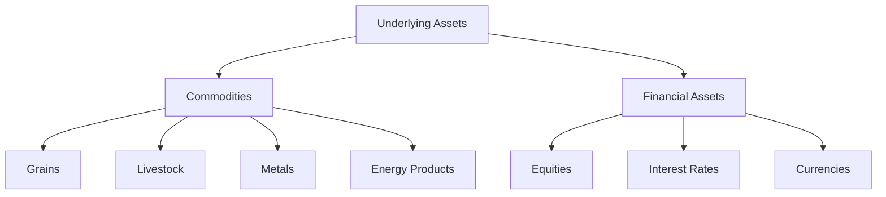

## 10.2 Types of Underlying Assets

In the world of derivatives, understanding the types of underlying assets is crucial for both investors and financial professionals. Derivatives are financial instruments whose value is derived from the performance of an underlying asset. These assets can be broadly categorized into commodities and financial assets. This section will delve into these categories, exploring their characteristics, uses, and the factors influencing their value.

### Identifying Underlying Assets

An underlying asset is the financial instrument upon which a derivative's price is based. It serves as the foundation for the derivative contract, determining its value and performance. Underlying assets can be tangible, like commodities, or intangible, like financial assets. Understanding these assets is essential for effectively using derivatives in investment strategies.

#### Categories of Underlying Assets

1. **Commodities**: These are tangible goods that are interchangeable with other goods of the same type. They include agricultural products, metals, and energy resources.
2. **Financial Assets**: These are intangible assets that represent a claim to future cash flows or ownership rights, such as equities, interest rates, and currencies.

### Commodities

Commodities are basic goods used in commerce that are interchangeable with other goods of the same type. They are traded on exchanges and are subject to supply and demand dynamics, which influence their prices.

#### Common Commodity-Based Derivatives

- **Grains**: Includes wheat, corn, and soybeans. These are essential agricultural products with prices influenced by weather conditions, crop yields, and global demand.
- **Livestock**: Includes cattle and hogs. Prices are affected by feed costs, disease outbreaks, and consumer demand.
- **Metals**: Includes gold, silver, and copper. These are often used as a hedge against inflation and currency fluctuations.
- **Energy Products**: Includes crude oil, natural gas, and coal. Prices are driven by geopolitical events, supply constraints, and changes in energy consumption patterns.

#### Factors Influencing Commodity Prices

Commodity prices are influenced by a variety of factors, including:

- **Supply and Demand**: Changes in production levels and consumer demand can lead to price fluctuations.
- **Weather Conditions**: Adverse weather can impact agricultural yields, affecting supply.
- **Geopolitical Events**: Political instability in key producing regions can disrupt supply chains.
- **Economic Indicators**: Inflation rates, currency values, and economic growth can impact commodity prices.

These factors can significantly impact the value of commodity-based derivatives, making them a popular choice for hedging against price volatility.

### Financial Assets

Financial assets are intangible assets that derive value from a contractual claim. They are crucial in the financial markets for hedging, speculation, and investment purposes.

#### Common Financial Asset-Based Derivatives

- **Equities**: Derivatives based on stocks or stock indices. They are used for hedging against market volatility or speculating on price movements.
- **Interest Rates**: Includes futures and options on interest rates. These are used to manage exposure to fluctuations in interest rates.
- **Currencies**: Includes forex derivatives. They are used to hedge against currency risk or speculate on currency movements.

#### Importance of Financial Derivatives

Financial derivatives play a vital role in the financial markets by providing tools for:

- **Hedging**: Protecting against adverse price movements in the underlying asset.
- **Speculation**: Taking advantage of price movements to generate profits.
- **Arbitrage**: Exploiting price differences between markets to earn risk-free profits.

These derivatives are essential for managing risk and enhancing returns in investment portfolios.

### Glossary

- **Commodity**: A basic good used in commerce that is interchangeable with other goods of the same type.
- **Financial Asset**: An asset that is cash, a contractual right to receive cash, or another financial asset.

### Practical Examples and Case Studies

To illustrate the application of derivatives based on underlying assets, consider the following examples:

- **Canadian Pension Funds**: These funds often use commodity derivatives to hedge against inflation, ensuring stable returns for retirees. For instance, they might use oil futures to protect against rising energy costs.
- **Major Canadian Banks**: Banks like RBC and TD use interest rate derivatives to manage their exposure to changes in interest rates, which can impact their lending and borrowing activities.

### Diagrams and Visuals

Below is a diagram illustrating the relationship between derivatives and their underlying assets:

### Best Practices and Common Pitfalls

- **Best Practices**: Always conduct thorough research on the underlying asset before entering a derivative contract. Understand the factors influencing its price and the potential risks involved.
- **Common Pitfalls**: Avoid over-leveraging in derivatives, as this can lead to significant losses. Ensure you have a clear risk management strategy in place.

### Conclusion

Understanding the types of underlying assets in derivatives is essential for effectively using these financial instruments. Whether dealing with commodities or financial assets, it's crucial to comprehend the factors influencing their prices and the role they play in hedging and speculation. By mastering these concepts, investors can make informed decisions and optimize their investment strategies.

## Quiz Time!



### What is an underlying asset in the context of derivatives?

- [x] A financial instrument upon which a derivative's price is based
- [ ] A type of derivative contract
- [ ] A financial institution that trades derivatives
- [ ] A regulatory body overseeing derivatives markets

> **Explanation:** An underlying asset is the financial instrument upon which a derivative's price is based, determining its value and performance.

### Which of the following is NOT a common commodity-based derivative?

- [ ] Grains
- [ ] Livestock
- [ ] Metals
- [x] Equities

> **Explanation:** Equities are financial assets, not commodities. Common commodity-based derivatives include grains, livestock, and metals.

### What factors influence commodity prices?

- [x] Supply and demand, weather conditions, geopolitical events, economic indicators
- [ ] Only supply and demand
- [ ] Only geopolitical events
- [ ] Only economic indicators

> **Explanation:** Commodity prices are influenced by a combination of supply and demand, weather conditions, geopolitical events, and economic indicators.

### Which of the following is a financial asset-based derivative?

- [ ] Crude oil
- [x] Equities
- [ ] Wheat
- [ ] Natural gas

> **Explanation:** Equities are financial assets, and derivatives based on them are financial asset-based derivatives.

### What is the primary purpose of financial derivatives?

- [x] Hedging and speculation
- [ ] Only speculation
- [ ] Only hedging
- [ ] Regulatory compliance

> **Explanation:** Financial derivatives are primarily used for hedging against adverse price movements and for speculation to generate profits.

### Which of the following is a factor that influences the price of energy products?

- [x] Geopolitical events
- [ ] Crop yields
- [ ] Livestock feed costs
- [ ] Stock market trends

> **Explanation:** Geopolitical events can significantly impact the price of energy products by affecting supply chains and production levels.

### What is a common use of interest rate derivatives?

- [x] Managing exposure to fluctuations in interest rates
- [ ] Speculating on currency movements
- [ ] Hedging against stock market volatility
- [ ] Protecting against inflation

> **Explanation:** Interest rate derivatives are commonly used to manage exposure to fluctuations in interest rates.

### Which of the following is a best practice when using derivatives?

- [x] Conduct thorough research on the underlying asset
- [ ] Over-leverage to maximize potential returns
- [ ] Ignore risk management strategies
- [ ] Focus only on short-term gains

> **Explanation:** Conducting thorough research on the underlying asset is a best practice to understand the factors influencing its price and potential risks.

### What is a common pitfall in derivatives trading?

- [x] Over-leveraging
- [ ] Diversifying investments
- [ ] Conducting thorough research
- [ ] Implementing risk management strategies

> **Explanation:** Over-leveraging is a common pitfall in derivatives trading, as it can lead to significant losses.

### True or False: Financial derivatives can be used for arbitrage.

- [x] True
- [ ] False

> **Explanation:** Financial derivatives can be used for arbitrage, exploiting price differences between markets to earn risk-free profits.


