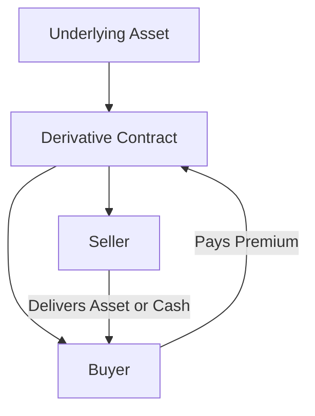

## 10.1 Introduction to Derivatives

In the vast landscape of financial instruments, derivatives stand out as both complex and versatile tools. They play a crucial role in modern finance, offering mechanisms for risk management, speculation, and strategic investment. This section delves into the essence of derivatives, tracing their historical roots, examining their growth, and exploring their multifaceted functions.

### What Are Derivatives?

Derivatives are financial contracts whose value is derived from the performance of an underlying asset, index, or rate. These underlying entities can include stocks, bonds, commodities, currencies, interest rates, and market indexes. The primary types of derivatives are options, futures, forwards, and swaps. Each of these instruments serves distinct purposes and is utilized in various financial strategies.

#### Key Characteristics of Derivatives

- **Leverage:** Derivatives allow investors to gain exposure to an asset without the need to invest the full amount upfront, thus amplifying potential returns and risks.
- **Flexibility:** They can be tailored to meet specific financial goals, such as hedging against price fluctuations or speculating on future price movements.
- **Market Efficiency:** Derivatives contribute to market efficiency by enabling price discovery and facilitating the transfer of risk.

### Historical Development of Derivative Markets

The concept of derivatives is not new; it dates back to ancient times. However, the modern derivatives market began to take shape in the 1970s with the establishment of formal exchanges and the introduction of standardized contracts.

#### Milestones in Derivative Markets

- **1972:** The Chicago Mercantile Exchange (CME) launched the International Monetary Market, introducing currency futures.
- **1973:** The Chicago Board Options Exchange (CBOE) began trading standardized options, marking a significant development in the derivatives market.
- **1980s-1990s:** The proliferation of financial engineering and the advent of complex derivatives such as swaps and exotic options.

### Factors Contributing to the Growth of Derivatives

Several factors have fueled the expansion of derivatives markets over the past few decades:

#### Financial Deregulation

The deregulation of financial markets in the 1980s and 1990s removed many of the barriers that previously restricted the use of derivatives. This liberalization allowed for greater innovation and the development of new derivative products.

#### Technological Advancements

Advancements in technology have played a pivotal role in the growth of derivatives. High-speed computing and sophisticated algorithms have enabled the rapid execution of complex trades and the development of new financial models.

#### Globalization

As markets became more interconnected, the demand for derivatives as tools for managing cross-border risks increased. This globalization has led to the creation of a more integrated and liquid derivatives market.

### Functions of Derivatives

Derivatives serve several critical functions in the financial ecosystem, each catering to different needs and objectives.

#### Substitution

Derivatives can act as substitutes for direct investment in an underlying asset. For instance, an investor might use a futures contract to gain exposure to a commodity without physically purchasing it.

#### Hedging

One of the primary uses of derivatives is hedging, which involves reducing the risk of adverse price movements in an asset. For example, a Canadian wheat farmer might use futures contracts to lock in a price for their crop, protecting against the risk of falling prices.

#### Speculation

Speculators use derivatives to bet on the future direction of market prices. This activity can lead to significant profits but also carries substantial risk. For instance, an investor might buy call options on a stock, anticipating that its price will rise.

### Glossary

- **Financial Engineering:** The use of mathematical techniques to solve financial problems. Financial engineering involves the design, development, and implementation of innovative financial instruments and processes.
- **Arbitrage:** The practice of taking advantage of price differences in different markets to earn a risk-free profit. Arbitrageurs play a crucial role in maintaining market efficiency by ensuring that prices do not deviate significantly from their fair value.

### Practical Examples and Case Studies

#### Case Study: Hedging with Derivatives in Canadian Pension Funds

Canadian pension funds often use derivatives to manage interest rate and currency risks. For example, a pension fund with significant foreign investments might use currency swaps to hedge against fluctuations in exchange rates, ensuring stable returns for its beneficiaries.

#### Example: Speculation in the Canadian Oil Market

A trader anticipating a rise in oil prices might purchase futures contracts on the Canadian crude oil benchmark. If the price increases as expected, the trader can sell the contracts at a profit.

### Visualizing Derivatives: A Diagrammatic Approach

Below is a simplified diagram illustrating the basic structure of a derivative contract:

### Best Practices and Common Pitfalls

#### Best Practices

- **Understand the Instrument:** Before engaging in derivative transactions, ensure a thorough understanding of the specific instrument and its risks.
- **Risk Management:** Use derivatives as part of a broader risk management strategy, not as standalone speculative tools.

#### Common Pitfalls

- **Over-Leverage:** Excessive use of leverage can lead to significant losses, particularly in volatile markets.
- **Complexity:** The complexity of some derivatives can obscure their risks, leading to unexpected outcomes.

### Conclusion

Derivatives are powerful financial instruments that offer a range of benefits, from risk management to speculative opportunities. However, they also carry inherent risks that require careful consideration and management. By understanding the fundamentals of derivatives and their role in the financial ecosystem, investors and financial professionals can harness their potential while mitigating associated risks.

### **Ready to Test Your Knowledge?**

**Practice 10 Essential CSC Exam Questions to Master Your Certification**



### What is a derivative?

- [x] A financial contract whose value is derived from an underlying asset
- [ ] A direct investment in a physical asset
- [ ] A type of stock or bond
- [ ] A government-issued security

> **Explanation:** A derivative is a financial contract whose value is derived from the performance of an underlying asset, index, or rate.

### Which of the following is NOT a primary type of derivative?

- [ ] Options
- [ ] Futures
- [ ] Swaps
- [x] Bonds

> **Explanation:** Bonds are not a type of derivative; they are debt securities. Options, futures, and swaps are primary types of derivatives.

### What is the primary purpose of hedging with derivatives?

- [x] To reduce the risk of adverse price movements
- [ ] To speculate on future price movements
- [ ] To increase leverage
- [ ] To earn a risk-free profit

> **Explanation:** Hedging with derivatives is primarily used to reduce the risk of adverse price movements in an asset.

### What role did technological advancements play in the growth of derivatives?

- [x] Enabled rapid execution of complex trades
- [ ] Restricted the development of new financial models
- [ ] Decreased market efficiency
- [ ] Limited the use of derivatives

> **Explanation:** Technological advancements enabled the rapid execution of complex trades and the development of new financial models, contributing to the growth of derivatives.

### What is financial engineering?

- [x] The use of mathematical techniques to solve financial problems
- [ ] The practice of earning a risk-free profit
- [ ] The process of buying and selling stocks
- [ ] The regulation of financial markets

> **Explanation:** Financial engineering involves the use of mathematical techniques to solve financial problems, including the design of innovative financial instruments.

### What is arbitrage?

- [x] The practice of taking advantage of price differences in different markets
- [ ] A method of increasing leverage
- [ ] A type of derivative contract
- [ ] A strategy for long-term investment

> **Explanation:** Arbitrage is the practice of taking advantage of price differences in different markets to earn a risk-free profit.

### Which factor contributed to the expansion of derivatives markets?

- [x] Financial deregulation
- [ ] Increased market restrictions
- [ ] Decreased globalization
- [ ] Reduced technological advancements

> **Explanation:** Financial deregulation removed barriers that restricted the use of derivatives, contributing to their expansion.

### What is a common pitfall when using derivatives?

- [x] Over-leverage
- [ ] Under-leverage
- [ ] Lack of flexibility
- [ ] Excessive regulation

> **Explanation:** Over-leverage is a common pitfall when using derivatives, as it can lead to significant losses in volatile markets.

### Which of the following is an example of using derivatives for speculation?

- [x] Buying call options on a stock anticipating a price rise
- [ ] Using futures to lock in a price for a commodity
- [ ] Engaging in arbitrage to earn a risk-free profit
- [ ] Hedging against currency risk with swaps

> **Explanation:** Buying call options on a stock in anticipation of a price rise is an example of using derivatives for speculation.

### True or False: Derivatives can only be used for hedging purposes.

- [ ] True
- [x] False

> **Explanation:** False. Derivatives can be used for various purposes, including hedging, speculation, and substitution.


