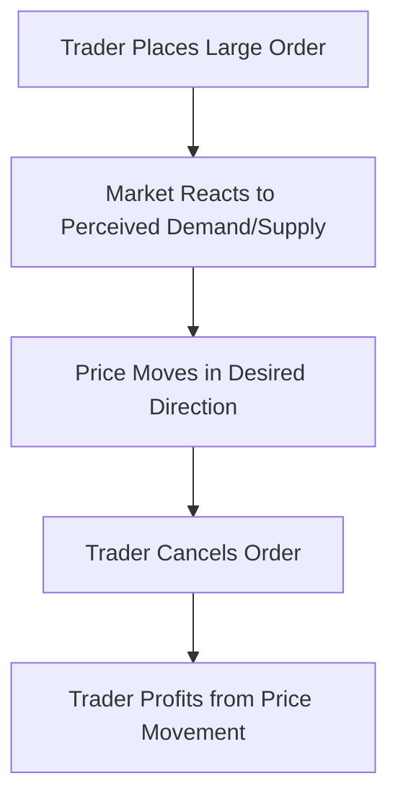
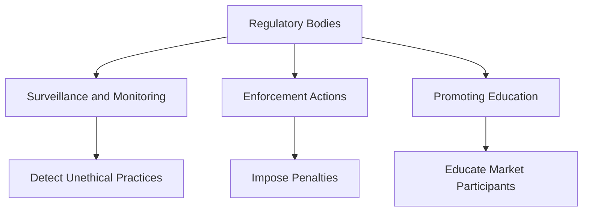

## 10.20 Ethical Considerations in Derivatives Trading

Derivatives trading, a cornerstone of modern financial markets, offers significant opportunities for risk management and speculative gains. However, it also presents unique ethical challenges that market participants must navigate to maintain the integrity and transparency of the financial system. This section delves into the ethical considerations inherent in derivatives trading, focusing on issues such as market manipulation and insider trading, the responsibilities of market participants, and the critical role of regulatory bodies in enforcing ethical standards.

### Understanding Ethical Issues in Derivatives Trading

#### Market Manipulation

**Market Manipulation** refers to actions designed to deceive or defraud market participants by controlling or artificially affecting the price of securities or derivatives. This unethical practice undermines market integrity and can lead to significant financial losses for unsuspecting investors.

**Example:** A trader at a major Canadian bank might engage in "spoofing," where they place large orders to create an illusion of demand or supply, only to cancel them before execution. This can mislead other traders into making decisions based on false market signals.

**Diagram: Market Manipulation Process**

#### Insider Trading

**Insider Trading** involves trading a public company's stock or other securities by individuals with access to non-public, material information about the company. This practice is illegal and unethical as it violates the principle of fair and equal access to information.

**Example:** An executive at a Canadian corporation learns about an upcoming merger and uses this information to buy call options on the company's stock, anticipating a price increase once the merger is announced.

### Responsibilities of Market Participants

Market participants, including traders, brokers, and financial institutions, have a responsibility to uphold ethical standards in their operations. This involves:

1. **Ensuring Transparency:** Providing clear and accurate information to clients and the market to foster trust and confidence.
2. **Avoiding Conflicts of Interest:** Identifying and mitigating situations where personal interests might conflict with professional duties.
3. **Adhering to Regulations:** Complying with all relevant laws and regulations to prevent unethical practices.

**Case Study: RBC's Ethical Trading Practices**

The Royal Bank of Canada (RBC) has implemented robust compliance programs to ensure its traders adhere to ethical standards. This includes regular training on market conduct and the use of advanced monitoring systems to detect and prevent unethical trading activities.

### Role of Regulatory Bodies

Regulatory bodies play a crucial role in maintaining ethical standards in derivatives trading. In Canada, organizations such as the Canadian Investment Regulatory Organization (CIRO) and the Ontario Securities Commission (OSC) are tasked with enforcing regulations and ensuring market integrity.

#### Regulatory Measures

1. **Surveillance and Monitoring:** Regulators use sophisticated technology to monitor trading activities and detect suspicious patterns indicative of market manipulation or insider trading.
2. **Enforcement Actions:** When unethical practices are identified, regulators can impose penalties, including fines, suspensions, or criminal charges, to deter future violations.
3. **Promoting Education:** Regulatory bodies often provide resources and training to market participants to promote ethical behavior and compliance with regulations.

**Diagram: Regulatory Framework for Derivatives Trading**

### Best Practices for Ethical Derivatives Trading

1. **Implementing Robust Compliance Programs:** Financial institutions should establish comprehensive compliance frameworks to monitor and enforce ethical trading practices.
2. **Continuous Training and Education:** Regular training sessions can help traders and other market participants stay informed about ethical standards and regulatory requirements.
3. **Encouraging Whistleblowing:** Creating a safe environment for employees to report unethical behavior can help identify and address issues before they escalate.

### Common Challenges and Strategies to Overcome Them

#### Challenge: Complexity of Derivatives

The complexity of derivatives can make it difficult for market participants to fully understand the ethical implications of their actions.

**Strategy:** Simplifying communication and providing clear guidelines can help demystify derivatives trading and promote ethical behavior.

#### Challenge: Rapid Technological Advancements

The fast pace of technological change can outstrip regulatory frameworks, leading to gaps in oversight.

**Strategy:** Regulators and financial institutions must work together to continuously update and adapt compliance measures to address emerging technologies.

### Conclusion

Ethical considerations in derivatives trading are paramount to maintaining the integrity and transparency of financial markets. By understanding the ethical issues, upholding responsibilities, and adhering to regulatory standards, market participants can contribute to a fair and equitable trading environment. Continuous education and proactive compliance measures are essential to navigating the complex ethical landscape of derivatives trading.

### **Ready to Test Your Knowledge?**

**Practice 10 Essential CSC Exam Questions to Master Your Certification**



### What is market manipulation?

- [x] Actions designed to deceive or defraud market participants by controlling or artificially affecting the price of securities or derivatives.
- [ ] The legal trading of securities based on public information.
- [ ] A strategy to diversify investment portfolios.
- [ ] A method to hedge against market risks.

> **Explanation:** Market manipulation involves deceptive practices to influence the price of securities or derivatives, undermining market integrity.

### Which of the following is an example of insider trading?

- [x] Trading based on non-public, material information about a company.
- [ ] Trading based on publicly available financial reports.
- [ ] Diversifying a portfolio with a mix of stocks and bonds.
- [ ] Using technical analysis to predict market trends.

> **Explanation:** Insider trading involves using confidential information not available to the public to make trading decisions.

### What is the role of regulatory bodies in derivatives trading?

- [x] Enforcing regulations and ensuring market integrity.
- [ ] Providing investment advice to traders.
- [ ] Offering financial products to consumers.
- [ ] Setting interest rates for financial institutions.

> **Explanation:** Regulatory bodies enforce rules and monitor trading activities to maintain ethical standards in the market.

### How can financial institutions promote ethical trading practices?

- [x] By implementing robust compliance programs.
- [ ] By encouraging traders to take more risks.
- [ ] By focusing solely on profit maximization.
- [ ] By reducing transparency in trading activities.

> **Explanation:** Compliance programs help monitor and enforce ethical standards, ensuring adherence to regulations.

### What is a common challenge in derivatives trading?

- [x] Complexity of derivatives.
- [ ] Lack of available trading platforms.
- [ ] Excessive regulation.
- [ ] Limited market participants.

> **Explanation:** The complexity of derivatives can make it difficult to understand their ethical implications, requiring clear guidelines and education.

### What is spoofing in the context of market manipulation?

- [x] Placing large orders to create an illusion of demand or supply, then canceling them before execution.
- [ ] Buying and holding securities for long-term gains.
- [ ] Using insider information to make trading decisions.
- [ ] Diversifying investments across different asset classes.

> **Explanation:** Spoofing involves placing and canceling orders to mislead other traders about market conditions.

### How can market participants avoid conflicts of interest?

- [x] By identifying and mitigating situations where personal interests might conflict with professional duties.
- [ ] By prioritizing personal gains over client interests.
- [ ] By ignoring regulatory guidelines.
- [ ] By focusing solely on short-term profits.

> **Explanation:** Avoiding conflicts of interest involves recognizing and addressing situations where personal and professional interests may clash.

### What is the purpose of continuous training and education in derivatives trading?

- [x] To keep traders informed about ethical standards and regulatory requirements.
- [ ] To increase the complexity of trading strategies.
- [ ] To reduce the number of market participants.
- [ ] To eliminate the need for regulatory oversight.

> **Explanation:** Continuous training ensures that traders are aware of ethical practices and comply with regulations.

### Why is transparency important in derivatives trading?

- [x] It fosters trust and confidence in the market.
- [ ] It allows traders to hide their strategies.
- [ ] It reduces the need for regulatory bodies.
- [ ] It increases market volatility.

> **Explanation:** Transparency ensures that all market participants have access to accurate information, promoting fairness and trust.

### True or False: Regulatory bodies in Canada are responsible for setting interest rates for financial institutions.

- [ ] True
- [x] False

> **Explanation:** Regulatory bodies in Canada enforce ethical standards and monitor trading activities, but they do not set interest rates.


