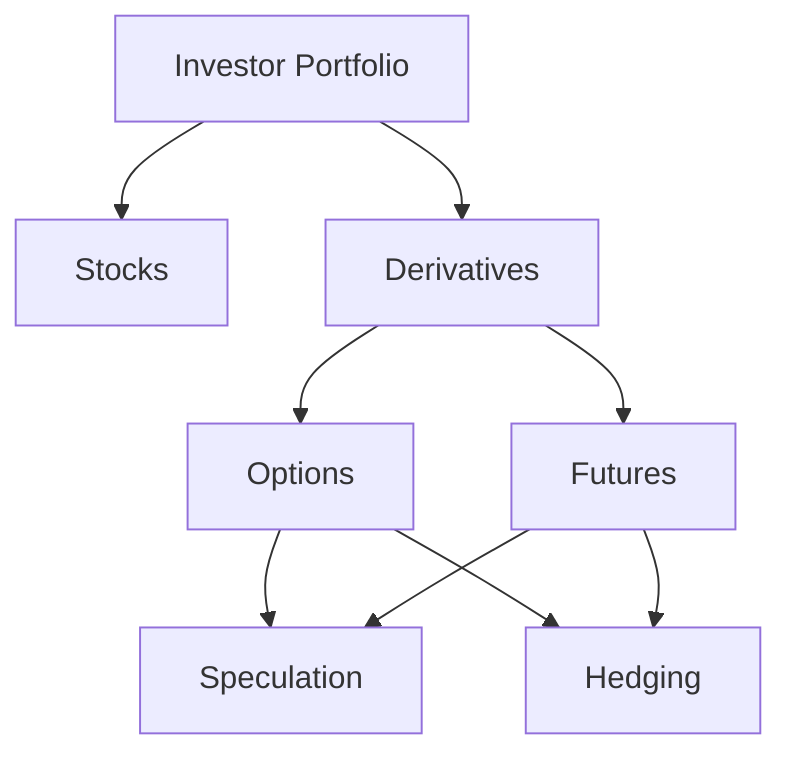

## 10.3.1 Individual Investors

In the dynamic world of finance, derivatives have emerged as powerful tools for individual investors. These financial instruments, which derive their value from underlying assets such as stocks, bonds, commodities, or currencies, offer opportunities for both speculation and hedging. In this section, we will delve into how individual investors in Canada can utilize derivatives, the barriers they face, and the inherent risks and rewards.

### Uses of Derivatives

#### Short-term Speculative Strategies

Speculation involves engaging in risky financial transactions to profit from short or medium-term market fluctuations. For individual investors, derivatives such as options and futures provide a platform for speculation. 

- **Options Trading:** Investors can buy call options if they anticipate a rise in the underlying asset's price or put options if they expect a decline. For example, an investor might purchase call options on a Canadian tech stock like Shopify, betting on its price increase following a positive earnings report.

- **Futures Contracts:** These allow investors to speculate on the future price of an asset. A Canadian investor might use oil futures to speculate on the price movements of crude oil, aiming to capitalize on geopolitical events affecting supply.

#### Long-term Hedging Strategies

Hedging involves reducing risk exposure by taking an offsetting position in a related security. For individual investors, derivatives can serve as a hedge against potential losses in their portfolios.

- **Protective Puts:** An investor holding a substantial position in a Canadian bank stock, such as RBC, might purchase put options to protect against a downturn in the financial sector.

- **Covered Calls:** This strategy involves holding a long position in an asset while selling call options on the same asset. It can generate additional income and provide some downside protection.

### Access to Markets

#### Barriers to Entry

While derivatives offer significant opportunities, they also come with barriers to entry that individual investors must overcome:

- **Required Knowledge:** Understanding derivatives requires a solid grasp of financial markets and instruments. Investors must educate themselves on the mechanics of options, futures, and other derivatives, as well as the factors influencing their prices.

- **Account Types:** Trading derivatives typically requires a margin account, which involves borrowing funds from a broker. This adds complexity and risk, as investors must meet margin requirements and manage potential losses.

- **Regulatory Requirements:** In Canada, investors must comply with regulations set by the Canadian Investment Regulatory Organization (CIRO) and provincial authorities. This includes understanding the legal framework governing derivatives trading.

### Risks and Rewards

#### Potential for High Returns

Derivatives can amplify returns due to their leverage. A small change in the underlying asset's price can lead to significant profits. For instance, a well-timed options trade on a volatile stock can yield substantial gains.

#### Substantial Risks Involved

However, the leverage that makes derivatives attractive also increases risk. Investors can lose more than their initial investment, especially in volatile markets. For example, a futures contract gone wrong can lead to significant financial losses if the market moves against the investor's position.

### Glossary

- **Speculation:** Engaging in risky financial transactions in an attempt to profit from short or medium-term fluctuations in the market value of a tradable good.

### Practical Examples and Case Studies

To illustrate these concepts, consider the following scenarios:

- **Case Study: Options Speculation on Shopify:** An investor buys call options on Shopify, anticipating a positive earnings report. The report exceeds expectations, and the stock price rises, resulting in a profitable trade.

- **Hedging Example with RBC:** An investor holds a significant position in RBC shares. Concerned about potential market volatility, they purchase put options to hedge against a decline in the stock price.

### Diagrams and Visuals

To enhance understanding, let's visualize the relationship between an investor's portfolio and the use of derivatives for hedging:

### Best Practices and Common Pitfalls

- **Best Practices:** 
  - Educate yourself thoroughly before trading derivatives.
  - Use derivatives as part of a diversified investment strategy.
  - Monitor positions closely and be prepared to adjust strategies as market conditions change.

- **Common Pitfalls:**
  - Over-leveraging positions, leading to significant losses.
  - Failing to understand the underlying asset and market conditions.
  - Neglecting to account for transaction costs and fees.

### Encouragement for Continuous Learning

The world of derivatives is complex and ever-evolving. Individual investors should continuously seek to expand their knowledge and stay informed about market trends and regulatory changes. Consider exploring additional resources such as:

- **Books:** "Options, Futures, and Other Derivatives" by John C. Hull.
- **Online Courses:** The Canadian Securities Institute offers courses on derivatives and risk management.
- **Articles:** Financial news outlets like The Globe and Mail provide insights into Canadian market trends.

## Quiz Time!



### Which of the following is a speculative strategy using derivatives?

- [x] Buying call options on a stock
- [ ] Purchasing a bond for long-term income
- [ ] Holding cash in a savings account
- [ ] Investing in a GIC

> **Explanation:** Buying call options is a speculative strategy aimed at profiting from a rise in the stock's price.

### What is a common barrier to entry for individual investors in derivatives markets?

- [x] Required knowledge and understanding of derivatives
- [ ] Lack of access to savings accounts
- [ ] High interest rates on loans
- [ ] Limited availability of mutual funds

> **Explanation:** Understanding derivatives requires specialized knowledge, which can be a barrier for new investors.

### Which strategy involves holding a long position in an asset while selling call options on the same asset?

- [x] Covered call
- [ ] Protective put
- [ ] Short selling
- [ ] Buying futures

> **Explanation:** A covered call strategy involves holding the asset and selling call options to generate income.

### What is the primary risk associated with trading derivatives?

- [x] Potential for significant financial losses
- [ ] Guaranteed returns
- [ ] Lack of market volatility
- [ ] High interest rates

> **Explanation:** Derivatives are leveraged instruments, which can lead to substantial losses if the market moves unfavorably.

### Which of the following is a hedging strategy using derivatives?

- [x] Purchasing put options on a stock you own
- [ ] Buying lottery tickets
- [ ] Investing in penny stocks
- [ ] Holding cash in a checking account

> **Explanation:** Purchasing put options on a stock you own is a hedging strategy to protect against price declines.

### What type of account is typically required to trade derivatives?

- [x] Margin account
- [ ] Savings account
- [ ] Checking account
- [ ] Retirement account

> **Explanation:** A margin account is required for trading derivatives due to the leverage involved.

### What is the primary purpose of hedging with derivatives?

- [x] To reduce risk exposure
- [ ] To maximize short-term profits
- [ ] To increase leverage
- [ ] To speculate on currency fluctuations

> **Explanation:** Hedging aims to reduce risk exposure by offsetting potential losses in a portfolio.

### Which Canadian regulatory body oversees derivatives trading?

- [x] Canadian Investment Regulatory Organization (CIRO)
- [ ] Federal Reserve
- [ ] Securities and Exchange Commission (SEC)
- [ ] European Central Bank

> **Explanation:** CIRO is responsible for overseeing derivatives trading in Canada.

### What is a potential reward of trading derivatives?

- [x] High returns due to leverage
- [ ] Guaranteed income
- [ ] Risk-free investments
- [ ] Low transaction costs

> **Explanation:** Derivatives can offer high returns due to their leveraged nature, though they also carry significant risks.

### True or False: Derivatives can only be used for speculative purposes.

- [ ] True
- [x] False

> **Explanation:** Derivatives can be used for both speculative and hedging purposes, depending on the investor's strategy.



By understanding the uses, access, risks, and rewards of derivatives, individual investors can make informed decisions and effectively integrate these instruments into their investment strategies. As you continue to explore the world of derivatives, remember to balance potential gains with the associated risks and maintain a disciplined approach to investing.
