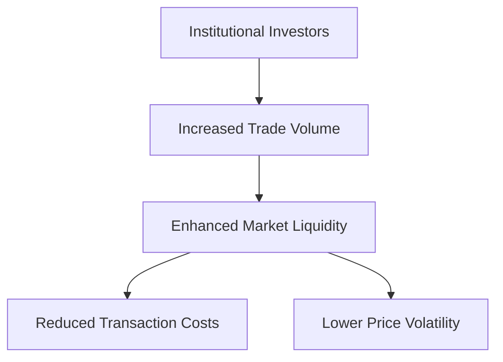

## 10.3.2 Institutional Investors

Institutional investors, such as pension funds, insurance companies, mutual funds, and hedge funds, play a pivotal role in the financial markets, particularly in the derivatives market. Their substantial capital and sophisticated investment strategies significantly influence market dynamics. In this section, we will delve into how these investors use derivatives for hedging, diversification, arbitrage, and yield enhancement, and their impact on market liquidity and volume.

### Hedging and Diversification

Institutional investors often manage large portfolios that are exposed to various risks, including market, credit, and interest rate risks. Derivatives offer these investors powerful tools to hedge against these risks and achieve diversification.

#### Hedging with Derivatives

Hedging involves taking a position in a derivative to offset potential losses in an underlying asset. For example, a Canadian pension fund with significant equity holdings might use index futures to hedge against a potential downturn in the stock market. By selling futures contracts, the fund can lock in current prices, thus protecting itself from adverse price movements.

**Example:** Consider a Canadian pension fund with a $500 million equity portfolio. To hedge against a potential market decline, the fund could sell S&P/TSX 60 Index futures. If the market falls, the gains from the futures position would offset the losses in the equity portfolio, thus stabilizing the fund's overall value.

#### Diversification through Derivatives

Derivatives also enable institutional investors to achieve diversification without directly purchasing the underlying assets. Options and swaps can be used to gain exposure to different asset classes, sectors, or geographies, thereby spreading risk.

**Case Study:** A Canadian mutual fund seeking exposure to international markets might use currency swaps to manage foreign exchange risk while investing in foreign equities. This allows the fund to benefit from global diversification while mitigating currency fluctuations.

### Other Strategies: Arbitrage and Yield Enhancement

Beyond hedging and diversification, institutional investors employ derivatives for arbitrage and yield enhancement strategies.

#### Arbitrage Opportunities

Arbitrage involves exploiting price discrepancies between different markets or instruments to earn risk-free profits. Institutional investors, with their access to sophisticated trading platforms and market data, are well-positioned to identify and execute arbitrage opportunities.

**Glossary:** **Arbitrage** is the simultaneous buying and selling of an asset in different markets to profit from unequal prices.

**Example:** A Canadian hedge fund might engage in index arbitrage by buying undervalued stocks in the S&P/TSX Composite Index while simultaneously selling futures contracts on the index. The fund profits from the price convergence between the stocks and the futures.

#### Yield Enhancement Strategies

Yield enhancement involves using derivatives to increase the returns on an investment. This can be achieved through strategies such as covered call writing, where an investor sells call options on a stock they own to generate additional income.

**Glossary:** **Yield Enhancement** refers to strategies aimed at increasing the returns on an investment.

**Example:** A Canadian insurance company might use covered call strategies on its equity holdings to generate extra income, thereby enhancing the overall yield of its investment portfolio.

### Trade Volume and Market Impact

Institutional investors are major players in the derivatives market, contributing significantly to trade volume and liquidity. Their large-scale transactions and sophisticated strategies ensure that derivatives markets remain active and efficient.

#### Market Liquidity

The presence of institutional investors enhances market liquidity, making it easier for other participants to enter and exit positions. This liquidity is crucial for the smooth functioning of the derivatives market, as it reduces transaction costs and minimizes price volatility.

**Diagram: Institutional Investors and Market Liquidity**

#### Impact on Market Dynamics

The trading activities of institutional investors can also influence market dynamics. Their large orders can move prices, and their strategic decisions can set trends. For example, if a significant number of institutional investors decide to hedge against a market downturn, it could lead to increased demand for put options, affecting option pricing and market sentiment.

### Conclusion

Institutional investors are integral to the derivatives market, using these instruments for hedging, diversification, arbitrage, and yield enhancement. Their activities drive market liquidity and influence market dynamics, making them key players in the financial ecosystem. Understanding their strategies and impact is crucial for anyone involved in the derivatives market.

### Further Reading and Resources

- **Canadian Securities Administrators (CSA):** [Website](https://www.securities-administrators.ca/)
- **Investment Industry Regulatory Organization of Canada (IIROC):** [Website](https://www.iiroc.ca/)
- **Books:** "Options, Futures, and Other Derivatives" by John C. Hull
- **Online Courses:** "Derivatives Markets" on Coursera

## Quiz Time!



### How do institutional investors use derivatives for hedging?

- [x] To offset potential losses in an underlying asset
- [ ] To increase the risk exposure of their portfolio
- [ ] To avoid regulatory requirements
- [ ] To eliminate all market risks

> **Explanation:** Institutional investors use derivatives to hedge by taking positions that offset potential losses in their underlying assets, thereby managing risk.

### What is the primary goal of diversification through derivatives?

- [x] To spread risk across different asset classes
- [ ] To concentrate investments in a single asset class
- [ ] To maximize short-term profits
- [ ] To avoid international markets

> **Explanation:** Diversification through derivatives allows investors to spread risk across various asset classes, sectors, or geographies.

### What does arbitrage involve?

- [x] Simultaneous buying and selling of an asset in different markets
- [ ] Long-term investment in a single market
- [ ] Speculating on future price movements
- [ ] Avoiding market transactions

> **Explanation:** Arbitrage involves the simultaneous buying and selling of an asset in different markets to profit from price discrepancies.

### How can institutional investors enhance yield using derivatives?

- [x] By selling call options on stocks they own
- [ ] By buying put options on stocks they do not own
- [ ] By avoiding all derivative transactions
- [ ] By investing only in government bonds

> **Explanation:** Yield enhancement can be achieved by selling call options on stocks they own, generating additional income.

### What impact do institutional investors have on market liquidity?

- [x] They increase market liquidity
- [ ] They decrease market liquidity
- [ ] They have no impact on market liquidity
- [ ] They only affect liquidity in equity markets

> **Explanation:** Institutional investors increase market liquidity by contributing to trade volume and ensuring active market participation.

### Why is market liquidity important?

- [x] It reduces transaction costs and minimizes price volatility
- [ ] It increases transaction costs and price volatility
- [ ] It only benefits institutional investors
- [ ] It is irrelevant to market participants

> **Explanation:** Market liquidity is important because it reduces transaction costs and minimizes price volatility, benefiting all market participants.

### What can large orders from institutional investors lead to?

- [x] Price movements and trend setting
- [ ] Complete market stability
- [ ] Elimination of all market risks
- [ ] Decreased market participation

> **Explanation:** Large orders from institutional investors can lead to price movements and influence market trends.

### What is a covered call strategy?

- [x] Selling call options on stocks that an investor owns
- [ ] Buying call options on stocks that an investor does not own
- [ ] Selling put options on stocks that an investor owns
- [ ] Avoiding all option transactions

> **Explanation:** A covered call strategy involves selling call options on stocks that an investor already owns to generate additional income.

### How do institutional investors contribute to market efficiency?

- [x] By ensuring active participation and liquidity
- [ ] By avoiding all market transactions
- [ ] By concentrating investments in a single asset
- [ ] By speculating on future price movements

> **Explanation:** Institutional investors contribute to market efficiency by ensuring active participation and liquidity, which facilitates smooth market operations.

### True or False: Institutional investors only use derivatives for speculative purposes.

- [ ] True
- [x] False

> **Explanation:** Institutional investors use derivatives for various purposes, including hedging, diversification, arbitrage, and yield enhancement, not just speculation.


