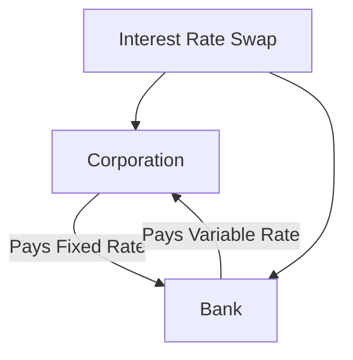

## 10.3.3 Corporations and Businesses

In the complex world of finance, corporations and businesses face a myriad of risks that can significantly impact their operations and profitability. Among these, operational risks—defined as the risks associated with the execution of a company's business functions—are particularly prevalent. To mitigate these risks, many corporations turn to derivatives, powerful financial instruments that can be used to hedge against uncertainties such as interest rate fluctuations, currency exchange rate volatility, and commodity price changes. This section delves into how corporations utilize derivatives for risk management, the benefits and challenges of these strategies, and provides real-world examples to illustrate their application.

### Risk Management with Derivatives

Corporations use derivatives primarily as a tool for risk management. By entering into derivative contracts, businesses can lock in prices or rates, thereby reducing the uncertainty associated with future cash flows. This is particularly important for companies with significant exposure to volatile markets.

#### Hedging Interest Rate Risks

Interest rate risk is a major concern for businesses with significant debt obligations. Fluctuations in interest rates can lead to increased borrowing costs, affecting a company's profitability. To hedge against this risk, corporations often use interest rate swaps. In a typical interest rate swap, a company might exchange a variable interest rate for a fixed rate, stabilizing its interest expenses.

**Example:** A Canadian manufacturing company with a $100 million loan at a variable interest rate might enter into an interest rate swap to pay a fixed rate instead. This swap would protect the company from rising interest rates, allowing it to predict its interest payments more accurately.

#### Hedging Currency Risks

For multinational corporations, currency risk is a significant concern. Exchange rate fluctuations can affect the value of international revenues and expenses. To manage this risk, companies use currency derivatives such as forwards, futures, and options.

**Example:** A Canadian exporter selling goods to the United States might use a currency forward contract to lock in the exchange rate for future USD to CAD conversions. This ensures that the company knows exactly how much it will receive in Canadian dollars, regardless of currency market movements.

#### Hedging Commodity Price Risks

Companies in industries such as agriculture, energy, and manufacturing often face commodity price risks. Changes in the prices of raw materials can significantly impact profit margins. Commodity futures and options are commonly used to hedge these risks.

**Example:** An airline company concerned about rising fuel prices might purchase crude oil futures contracts. By locking in the price of fuel, the airline can stabilize its operating costs and protect its profit margins from price spikes.

### Benefits and Challenges of Using Derivatives

#### Benefits

1. **Risk Mitigation:** Derivatives provide a way for businesses to manage and mitigate financial risks, leading to more predictable financial outcomes.
2. **Cost Efficiency:** Compared to other risk management strategies, derivatives can be a cost-effective way to hedge risks.
3. **Flexibility:** Derivatives offer flexibility in terms of contract size, duration, and underlying assets, allowing businesses to tailor their risk management strategies to specific needs.
4. **Enhanced Decision-Making:** By reducing uncertainty, derivatives enable better strategic planning and decision-making.

#### Challenges

1. **Complexity:** Derivatives can be complex instruments that require specialized knowledge to manage effectively.
2. **Counterparty Risk:** The risk that the other party in a derivative contract may default on their obligations.
3. **Market Risk:** While derivatives are used to hedge risks, they can also introduce new risks if not managed properly.
4. **Regulatory Compliance:** Corporations must navigate a complex regulatory environment when using derivatives, ensuring compliance with Canadian and international financial regulations.

### Glossary

- **Operational Risk:** The risk associated with the execution of a company's business functions.

### Visualizing Derivative Strategies

To better understand how derivatives function in risk management, consider the following diagram illustrating a basic interest rate swap:

In this diagram, the corporation enters into an interest rate swap with a bank. The corporation pays a fixed interest rate to the bank, while the bank pays a variable rate to the corporation, effectively hedging the corporation's interest rate risk.

### Best Practices and Common Pitfalls

**Best Practices:**

- **Thorough Analysis:** Conduct a comprehensive analysis of the company's risk exposure before entering into derivative contracts.
- **Expert Consultation:** Engage financial experts or consultants to design and implement derivative strategies.
- **Regular Monitoring:** Continuously monitor derivative positions and market conditions to adjust strategies as needed.

**Common Pitfalls:**

- **Over-Leveraging:** Avoid excessive use of derivatives, which can lead to significant financial losses.
- **Lack of Understanding:** Ensure that all stakeholders understand the derivative instruments being used and their potential impacts.
- **Ignoring Regulatory Changes:** Stay informed about regulatory changes that may affect derivative use and compliance requirements.

### Conclusion

Derivatives are powerful tools for corporations and businesses seeking to manage financial risks. By effectively using derivatives, companies can stabilize their financial performance, enhance strategic planning, and gain a competitive edge in the market. However, it is crucial to approach derivatives with a clear understanding of their complexities and potential risks. By adhering to best practices and remaining vigilant about market and regulatory changes, businesses can harness the full potential of derivatives in their risk management strategies.

## Quiz Time!



### What is the primary purpose of corporations using derivatives?

- [x] Risk management
- [ ] Speculation
- [ ] Increasing leverage
- [ ] Tax avoidance

> **Explanation:** Corporations primarily use derivatives for risk management to hedge against uncertainties such as interest rate, currency, and commodity price risks.

### Which derivative is commonly used to hedge interest rate risks?

- [x] Interest rate swaps
- [ ] Currency forwards
- [ ] Commodity futures
- [ ] Stock options

> **Explanation:** Interest rate swaps are commonly used by corporations to hedge against interest rate risks by exchanging variable interest rates for fixed rates.

### How can a Canadian exporter hedge against currency risk?

- [x] Using currency forward contracts
- [ ] Buying stock options
- [ ] Entering into interest rate swaps
- [ ] Purchasing commodity futures

> **Explanation:** A Canadian exporter can use currency forward contracts to lock in exchange rates for future transactions, mitigating currency risk.

### What is a major benefit of using derivatives?

- [x] Risk mitigation
- [ ] Guaranteed profits
- [ ] Elimination of all risks
- [ ] Simplified financial reporting

> **Explanation:** Derivatives help in risk mitigation by providing a way to manage and reduce financial uncertainties.

### What is a common challenge associated with derivatives?

- [x] Complexity
- [ ] Guaranteed losses
- [ ] Lack of flexibility
- [ ] High regulatory costs

> **Explanation:** Derivatives can be complex instruments that require specialized knowledge to manage effectively.

### What is operational risk?

- [x] The risk associated with the execution of a company's business functions
- [ ] The risk of market fluctuations
- [ ] The risk of regulatory changes
- [ ] The risk of technological failure

> **Explanation:** Operational risk refers to the risk associated with the execution of a company's business functions.

### What is a potential pitfall of using derivatives?

- [x] Over-leveraging
- [ ] Guaranteed profits
- [ ] Simplified risk management
- [ ] Elimination of counterparty risk

> **Explanation:** Over-leveraging is a potential pitfall of using derivatives, as it can lead to significant financial losses.

### Which of the following is a best practice when using derivatives?

- [x] Regular monitoring of derivative positions
- [ ] Ignoring market conditions
- [ ] Using derivatives for speculation
- [ ] Avoiding expert consultation

> **Explanation:** Regular monitoring of derivative positions and market conditions is a best practice to ensure effective risk management.

### What is counterparty risk?

- [x] The risk that the other party in a derivative contract may default
- [ ] The risk of market fluctuations
- [ ] The risk of regulatory changes
- [ ] The risk of technological failure

> **Explanation:** Counterparty risk is the risk that the other party in a derivative contract may default on their obligations.

### True or False: Derivatives can eliminate all financial risks for a corporation.

- [ ] True
- [x] False

> **Explanation:** False. While derivatives can help manage and mitigate financial risks, they cannot eliminate all risks and may introduce new ones if not managed properly.


