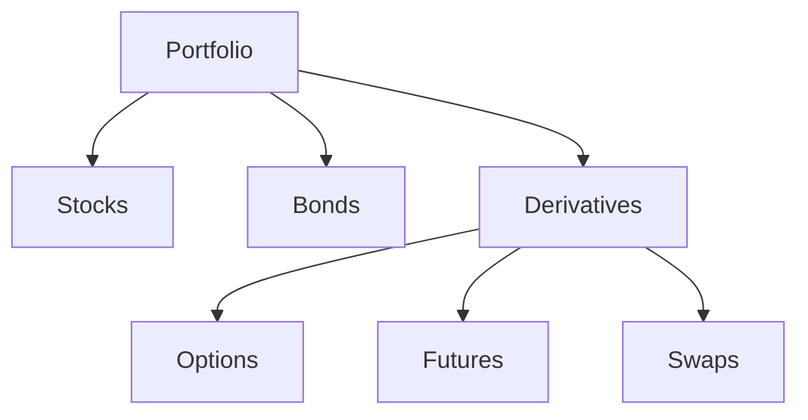

## 10.2 The Role of Derivatives

Derivatives are powerful financial instruments that derive their value from an underlying asset, index, or interest rate. They play a crucial role in modern financial markets, serving various purposes such as hedging, speculation, and portfolio optimization. This section delves into how derivatives function as substitutes or offsets for underlying assets, their use in risk management, and their speculative applications, which can significantly impact market liquidity.

### Derivatives as Substitutes or Offsets

Derivatives can act as substitutes or offsets for underlying assets, allowing investors to gain exposure to the asset without directly owning it. This feature is particularly beneficial in scenarios where direct ownership is impractical due to cost, regulatory, or logistical reasons.

#### Example: Currency Futures

Consider a Canadian exporter expecting to receive USD payments in six months. The exporter can use currency futures to lock in a favorable exchange rate, effectively substituting the future cash flow with a derivative contract. This strategy mitigates the risk of currency fluctuations impacting the firm's revenue.

### Risk Management and Portfolio Optimization

One of the primary uses of derivatives is in risk management. By using derivatives, investors can hedge against adverse price movements in the underlying asset, thereby reducing potential losses.

#### Hedging with Options

Options provide the right, but not the obligation, to buy or sell an asset at a predetermined price. For instance, a Canadian wheat farmer might purchase put options to protect against a potential drop in wheat prices. This hedge ensures that the farmer can sell the wheat at a guaranteed price, securing revenue despite market volatility.

#### Portfolio Optimization

Derivatives also play a vital role in portfolio optimization. By incorporating derivatives, investors can achieve a more efficient asset allocation, balancing risk and return according to their investment objectives.

In the diagram above, derivatives are integrated into a portfolio alongside stocks and bonds, enhancing diversification and enabling more precise risk management.

### Speculative Uses and Market Liquidity

Derivatives are not only tools for hedging and optimization but also for speculation. Speculators use derivatives to bet on the future direction of market prices, aiming to profit from price movements.

#### Speculation with Futures

A speculator might buy oil futures if they anticipate a rise in oil prices. If the price increases, the speculator can sell the futures contract at a profit. While speculation can lead to significant gains, it also carries substantial risk, as incorrect predictions can result in losses.

#### Impact on Market Liquidity

The speculative use of derivatives contributes to market liquidity by increasing the volume of trades. This liquidity is essential for the efficient functioning of financial markets, as it facilitates smoother transactions and narrower bid-ask spreads.

### Best Practices and Challenges

While derivatives offer numerous benefits, they also pose challenges. Investors must understand the complexities and risks associated with these instruments to use them effectively.

#### Best Practices

- **Thorough Understanding:** Investors should have a comprehensive understanding of the derivative product and its underlying asset.
- **Risk Assessment:** Regularly assess the risk exposure and ensure it aligns with investment goals.
- **Regulatory Compliance:** Adhere to relevant Canadian regulations, such as those set by the Canadian Securities Administrators (CSA).

#### Common Pitfalls

- **Over-Leverage:** Derivatives can amplify both gains and losses. Over-leveraging can lead to significant financial distress.
- **Market Volatility:** Rapid market changes can lead to unexpected outcomes, especially for speculative positions.

### Conclusion

Derivatives are indispensable tools in the financial markets, offering flexibility and efficiency in managing risk, optimizing portfolios, and enhancing market liquidity. However, their complexity and potential for significant risk require careful consideration and expertise. By understanding the role of derivatives, investors can better navigate the financial landscape and make informed decisions.

### **Ready to Test Your Knowledge?**

**Practice 10 Essential CSC Exam Questions to Master Your Certification**



### What is one primary use of derivatives in financial markets?

- [x] Risk management
- [ ] Tax evasion
- [ ] Currency manipulation
- [ ] Insider trading

> **Explanation:** Derivatives are primarily used for risk management, allowing investors to hedge against adverse price movements.

### How can derivatives act as substitutes for underlying assets?

- [x] By providing exposure without direct ownership
- [ ] By eliminating the need for financial markets
- [ ] By increasing transaction costs
- [ ] By reducing market liquidity

> **Explanation:** Derivatives can provide exposure to an asset without the need for direct ownership, acting as substitutes.

### What is portfolio optimization?

- [x] Choosing the best asset distribution according to an objective
- [ ] Maximizing transaction costs
- [ ] Avoiding regulatory compliance
- [ ] Speculating on currency fluctuations

> **Explanation:** Portfolio optimization involves selecting the best asset distribution to meet specific investment objectives.

### How do speculators use derivatives?

- [x] To bet on future price movements
- [ ] To eliminate market risk
- [ ] To guarantee profits
- [ ] To avoid taxes

> **Explanation:** Speculators use derivatives to bet on future price movements, aiming to profit from changes in market prices.

### What is a common pitfall when using derivatives?

- [x] Over-leverage
- [ ] Guaranteed profits
- [ ] Reduced market risk
- [ ] Simplified transactions

> **Explanation:** Over-leverage is a common pitfall, as derivatives can amplify both gains and losses.

### How do derivatives impact market liquidity?

- [x] By increasing trade volume
- [ ] By reducing transaction costs
- [ ] By eliminating market volatility
- [ ] By simplifying regulatory compliance

> **Explanation:** Derivatives increase trade volume, contributing to market liquidity.

### What is a key benefit of using options for hedging?

- [x] They provide the right, but not the obligation, to buy or sell
- [ ] They guarantee profits
- [ ] They eliminate all market risks
- [ ] They simplify tax calculations

> **Explanation:** Options provide the right, but not the obligation, to buy or sell, making them effective for hedging.

### Why is a thorough understanding of derivatives important?

- [x] To effectively manage risk and align with investment goals
- [ ] To guarantee profits
- [ ] To avoid all market risks
- [ ] To simplify financial statements

> **Explanation:** A thorough understanding is crucial for managing risk and ensuring alignment with investment goals.

### What role do derivatives play in portfolio optimization?

- [x] They enhance diversification and risk management
- [ ] They simplify asset allocation
- [ ] They guarantee returns
- [ ] They eliminate market volatility

> **Explanation:** Derivatives enhance diversification and risk management, contributing to portfolio optimization.

### True or False: Derivatives can only be used for hedging purposes.

- [ ] True
- [x] False

> **Explanation:** Derivatives can be used for hedging, speculation, and portfolio optimization, among other purposes.


