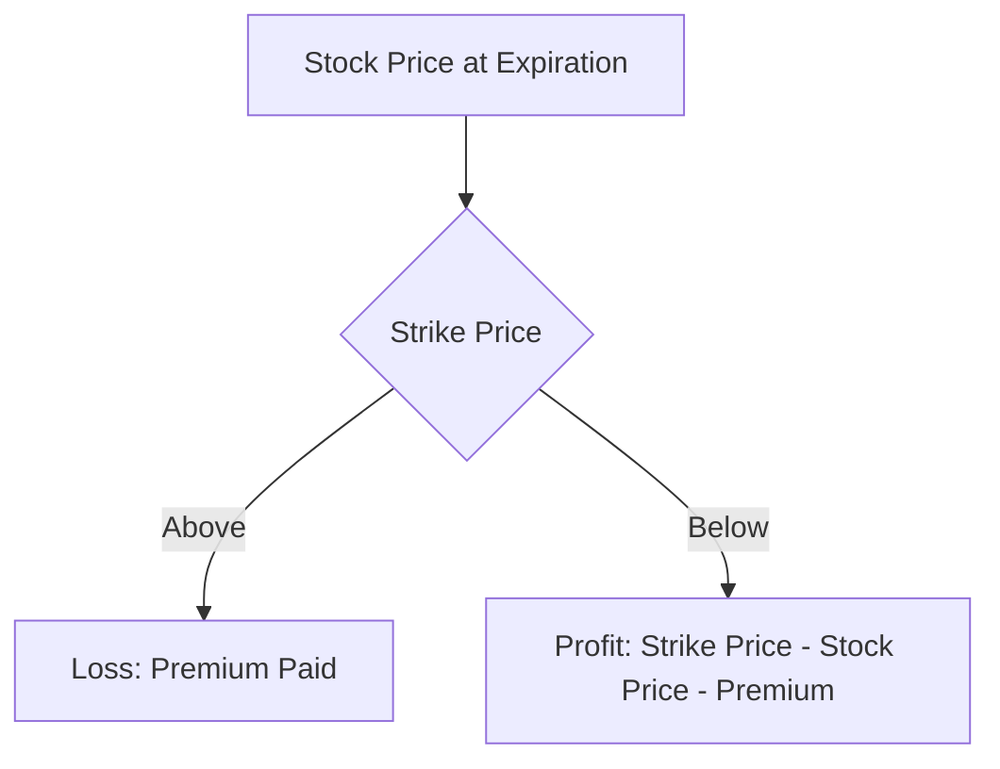

## 10.4.3 Buying Put Options

In the world of derivatives, put options offer investors a versatile tool for both speculation and risk management. This section delves into the mechanics of buying put options, illustrating how they can be used to profit from anticipated price declines and protect existing investments. We will explore practical examples and provide insights into the strategic application of put options within the Canadian financial landscape.

### Speculating on Price Decline

Buying put options is a strategic move for investors who anticipate a decline in the price of a particular asset. A put option gives the holder the right, but not the obligation, to sell a specified amount of an underlying asset at a predetermined price (the strike price) before the option expires. This strategy is particularly appealing in bearish markets or when an investor expects a specific stock or index to decrease in value.

#### How It Works

When an investor buys a put option, they are essentially betting that the price of the underlying asset will fall below the strike price before the option's expiration date. If this occurs, the investor can either sell the asset at the higher strike price or sell the put option itself for a profit. The potential for profit is significant if the asset's price drops substantially, as the value of the put option increases with the decline in the underlying asset's price.

### Hedging Existing Positions

Beyond speculation, put options serve as an effective hedging tool to protect against declines in the value of owned stock. This is particularly useful for investors who wish to maintain their stock holdings for the long term but are concerned about short-term market volatility.

#### Protective Puts

A protective put strategy involves purchasing put options for stocks that an investor already owns. This strategy acts as an insurance policy, limiting potential losses if the stock price falls. The put option ensures that the investor can sell the stock at the strike price, thus stabilizing the effective selling price and mitigating the impact of adverse price movements.

### Example of Speculation

Consider an investor who believes that the stock of XYZ Corporation, currently trading at CAD 50, will decline in the coming months. The investor buys a put option with a strike price of CAD 45, expiring in three months, for a premium of CAD 2 per share.

- **Scenario 1:** If XYZ's stock price falls to CAD 40 before expiration, the investor can exercise the option, selling the stock at CAD 45. The profit per share would be CAD 3 (CAD 45 - CAD 40 - CAD 2 premium).
- **Scenario 2:** If the stock price remains above CAD 45, the investor may choose not to exercise the option, resulting in a loss limited to the premium paid (CAD 2 per share).

### Example of Risk Management

Suppose an investor owns 100 shares of ABC Corporation, currently valued at CAD 100 per share. To protect against potential losses, the investor buys a put option with a strike price of CAD 95, expiring in six months, for a premium of CAD 3 per share.

- **Scenario 1:** If ABC's stock price falls to CAD 85, the investor can exercise the put option, selling the shares at CAD 95. This limits the loss to CAD 8 per share (CAD 100 - CAD 95 + CAD 3 premium).
- **Scenario 2:** If the stock price remains above CAD 95, the investor retains the shares, and the loss is limited to the premium paid (CAD 3 per share).

### Glossary

- **Speculation:** Using high-risk investments to make high returns based on reactance to price movements.

### Visualizing Put Options

To better understand the dynamics of put options, consider the following diagram illustrating the payoff profile of a put option:

This diagram shows that the payoff from a put option is negative (limited to the premium paid) if the stock price is above the strike price at expiration. However, if the stock price falls below the strike price, the payoff becomes positive, increasing as the stock price decreases.

### Best Practices and Common Pitfalls

**Best Practices:**
- **Research and Analysis:** Conduct thorough research and analysis before buying put options to ensure informed decision-making.
- **Diversification:** Use put options as part of a diversified investment strategy to manage risk effectively.
- **Expiration Dates:** Pay attention to expiration dates and market conditions to optimize the timing of option purchases.

**Common Pitfalls:**
- **Over-Speculation:** Avoid excessive speculation, which can lead to significant losses if market predictions are incorrect.
- **Ignoring Costs:** Consider the cost of premiums and transaction fees, which can erode potential profits.

### Conclusion

Buying put options is a powerful strategy for both speculation and hedging in the Canadian financial market. By understanding the mechanics and applications of put options, investors can enhance their portfolio management strategies, protect against downside risks, and capitalize on market opportunities. As with any investment strategy, it is crucial to conduct thorough research and consider the broader market context before engaging in options trading.

## Quiz Time!



### What is the primary purpose of buying put options?

- [x] To profit from expected price declines
- [ ] To increase stock dividends
- [ ] To hedge against interest rate increases
- [ ] To speculate on currency fluctuations

> **Explanation:** Buying put options allows investors to profit from expected declines in the price of an underlying asset.

### How can put options be used for hedging?

- [x] By protecting against declines in the value of owned stock
- [ ] By increasing the value of owned stock
- [ ] By reducing transaction costs
- [ ] By enhancing dividend yields

> **Explanation:** Put options can be used as a protective measure to hedge against declines in the value of stocks that an investor already owns.

### In a speculative scenario, what happens if the stock price falls below the strike price?

- [x] The put option can be exercised for a profit
- [ ] The put option expires worthless
- [ ] The investor incurs a loss
- [ ] The stock price increases

> **Explanation:** If the stock price falls below the strike price, the investor can exercise the put option to sell the stock at the higher strike price, resulting in a profit.

### What is a protective put strategy?

- [x] Buying put options for stocks already owned
- [ ] Selling call options for stocks not owned
- [ ] Buying call options for stocks not owned
- [ ] Selling put options for stocks already owned

> **Explanation:** A protective put strategy involves buying put options for stocks that an investor already owns to protect against potential losses.

### What is the maximum loss when buying a put option?

- [x] The premium paid for the option
- [ ] The difference between the strike price and stock price
- [x] The premium paid for the option
- [ ] The total value of the stock

> **Explanation:** The maximum loss when buying a put option is limited to the premium paid for the option.

### What is the payoff profile of a put option if the stock price is above the strike price at expiration?

- [x] Loss limited to the premium paid
- [ ] Profit equal to the strike price
- [ ] Loss equal to the stock price
- [ ] Profit limited to the premium paid

> **Explanation:** If the stock price is above the strike price at expiration, the put option expires worthless, and the loss is limited to the premium paid.

### What is a common pitfall when buying put options?

- [x] Over-speculation
- [ ] Under-diversification
- [x] Over-speculation
- [ ] Ignoring dividends

> **Explanation:** Over-speculation is a common pitfall, as it can lead to significant losses if market predictions are incorrect.

### How can investors optimize the timing of option purchases?

- [x] By paying attention to expiration dates and market conditions
- [ ] By ignoring market trends
- [ ] By focusing solely on dividends
- [ ] By disregarding expiration dates

> **Explanation:** Investors can optimize the timing of option purchases by paying attention to expiration dates and market conditions.

### What is the role of research and analysis in buying put options?

- [x] To ensure informed decision-making
- [ ] To increase transaction costs
- [ ] To reduce stock dividends
- [ ] To speculate on currency fluctuations

> **Explanation:** Conducting thorough research and analysis is crucial for informed decision-making when buying put options.

### True or False: Buying put options can only be used for speculation.

- [ ] True
- [x] False

> **Explanation:** Buying put options can be used for both speculation and hedging, providing flexibility in investment strategies.


