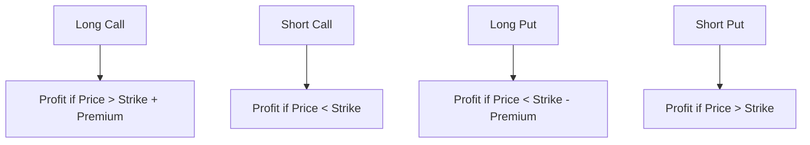

## 10.4 Options

Options are versatile financial instruments that play a crucial role in the world of derivatives. They provide investors with the flexibility to hedge against risks or speculate on market movements. This section delves into the intricacies of options, focusing on their application within the Canadian financial landscape.

### Understanding Options

Options are contracts that confer the right, but not the obligation, to buy or sell an underlying asset at a predetermined price before a specified expiration date. The two primary types of options are call options and put options.

- **Call Option:** A call option gives the holder the right to purchase the underlying asset at a specified price, known as the strike price, within a certain period. Investors typically buy call options when they anticipate that the asset's price will rise.

- **Put Option:** Conversely, a put option grants the holder the right to sell the underlying asset at the strike price within a specified timeframe. Put options are generally purchased when investors expect the asset's price to decline.

Both call and put options have standard features, including the underlying asset, expiration date, strike price, and premium (the price paid for the option).

### Option Positions

Understanding the basic option positions is essential for effectively utilizing options in investment strategies. There are four fundamental option positions:

1. **Long Call:** This position involves purchasing a call option. The investor profits if the underlying asset's price exceeds the strike price plus the premium paid before expiration.

2. **Short Call:** In this position, the investor sells a call option, expecting the asset's price to remain below the strike price. The seller earns the premium but faces unlimited risk if the asset's price rises significantly.

3. **Long Put:** This position involves buying a put option. The investor benefits if the asset's price falls below the strike price minus the premium paid.

4. **Short Put:** Here, the investor sells a put option, anticipating that the asset's price will stay above the strike price. The seller gains the premium but risks significant losses if the asset's price drops.

### Option Strategies

Options can be employed in various strategies to achieve different investment objectives, such as speculation or hedging.

#### Speculative Strategies

- **Buying Calls:** Investors purchase call options to profit from an anticipated increase in the underlying asset's price. This strategy offers potentially unlimited upside with limited downside risk (the premium paid).

- **Buying Puts:** This strategy involves purchasing put options to benefit from a predicted decline in the asset's price. It provides a way to profit from bearish market movements with limited risk.

#### Hedging Strategies

- **Writing Calls (Covered Call):** Investors holding the underlying asset sell call options to generate additional income. This strategy provides some downside protection but limits potential upside gains.

- **Writing Puts (Cash-Secured Put):** Investors sell put options while holding enough cash to purchase the underlying asset if assigned. This strategy can be used to acquire assets at a lower effective price or generate income.

### Valuing Options

The value of an option is composed of two main components: intrinsic value and time value.

- **Intrinsic Value:** This is the difference between the underlying asset's current price and the option's strike price. For a call option, intrinsic value is the amount by which the asset's price exceeds the strike price. For a put option, it's the amount by which the strike price exceeds the asset's price. If the intrinsic value is negative, it is considered zero, as options cannot have negative intrinsic value.

- **Time Value:** This reflects the potential for the option to gain value before expiration. It is influenced by factors such as the time remaining until expiration, volatility of the underlying asset, and prevailing interest rates. The longer the time until expiration and the higher the volatility, the greater the time value.

Understanding these components is crucial for evaluating options and making informed investment decisions.

### Practical Example: Canadian Financial Scenario

Consider a Canadian investor who anticipates that the stock of a major bank, such as RBC, will rise in the coming months. The investor could purchase a call option with a strike price of $100, expiring in three months, for a premium of $5. If RBC's stock price rises to $110, the intrinsic value of the option becomes $10, and the investor can exercise the option for a profit.

Alternatively, if the investor expects the stock to decline, they might buy a put option with a strike price of $100. If the stock falls to $90, the intrinsic value of the put option would be $10, allowing the investor to profit from the downturn.

### Diagrams and Visuals

Below is a diagram illustrating the payoff profiles for the four basic option positions:

### Best Practices and Common Pitfalls

- **Best Practices:**
  - Thoroughly research the underlying asset and market conditions before entering an option position.
  - Use options as part of a diversified investment strategy to manage risk effectively.
  - Monitor option positions regularly to adjust strategies as market conditions change.

- **Common Pitfalls:**
  - Over-leveraging positions, leading to significant losses.
  - Ignoring the impact of time decay on option value.
  - Failing to understand the risks associated with writing options, particularly uncovered positions.

### Further Resources

For those interested in deepening their understanding of options, consider exploring the following resources:

- "Options as a Strategic Investment" by Lawrence G. McMillan
- The Canadian Securities Administrators (CSA) website for regulatory updates
- Online courses on options trading offered by Canadian financial institutions

## Quiz Time!



### What is a call option?

- [x] A contract that gives the holder the right to buy the underlying asset at a specified price
- [ ] A contract that gives the holder the right to sell the underlying asset at a specified price
- [ ] A contract that obligates the holder to buy the underlying asset at a specified price
- [ ] A contract that obligates the holder to sell the underlying asset at a specified price

> **Explanation:** A call option gives the holder the right, but not the obligation, to purchase the underlying asset at a predetermined price.

### Which option position involves selling a call option?

- [ ] Long Call
- [x] Short Call
- [ ] Long Put
- [ ] Short Put

> **Explanation:** A short call position involves selling a call option, expecting the asset's price to remain below the strike price.

### What is the intrinsic value of an option?

- [x] The difference between the underlying asset's current price and the option's strike price
- [ ] The potential for the option to gain value before expiration
- [ ] The premium paid for the option
- [ ] The time remaining until the option's expiration

> **Explanation:** Intrinsic value is the difference between the underlying asset's current price and the option's strike price.

### What strategy involves buying a put option?

- [ ] Writing Calls
- [ ] Writing Puts
- [x] Buying Puts
- [ ] Buying Calls

> **Explanation:** Buying puts is a strategy used to profit from a predicted decline in the asset's price.

### Which of the following is a hedging strategy?

- [x] Writing Calls
- [ ] Buying Calls
- [x] Writing Puts
- [ ] Buying Puts

> **Explanation:** Writing calls and writing puts can be used as hedging strategies to generate income or acquire assets at a lower effective price.

### What is the time value of an option?

- [x] The potential for the option to gain value before expiration
- [ ] The difference between the underlying asset's current price and the option's strike price
- [ ] The premium paid for the option
- [ ] The time remaining until the option's expiration

> **Explanation:** Time value reflects the potential for the option to gain value before expiration, influenced by time remaining and volatility.

### Which position profits if the asset's price falls below the strike price minus the premium?

- [ ] Long Call
- [ ] Short Call
- [x] Long Put
- [ ] Short Put

> **Explanation:** A long put position profits if the asset's price falls below the strike price minus the premium paid.

### What is a common pitfall when trading options?

- [x] Over-leveraging positions
- [ ] Diversifying the investment strategy
- [ ] Monitoring option positions regularly
- [ ] Understanding the risks associated with writing options

> **Explanation:** Over-leveraging positions can lead to significant losses, making it a common pitfall in options trading.

### Which of the following is a speculative strategy?

- [x] Buying Calls
- [ ] Writing Calls
- [ ] Writing Puts
- [ ] Holding the underlying asset

> **Explanation:** Buying calls is a speculative strategy used to profit from an anticipated increase in the underlying asset's price.

### True or False: A put option gives the holder the right to buy the underlying asset.

- [ ] True
- [x] False

> **Explanation:** A put option gives the holder the right to sell the underlying asset, not buy it.


