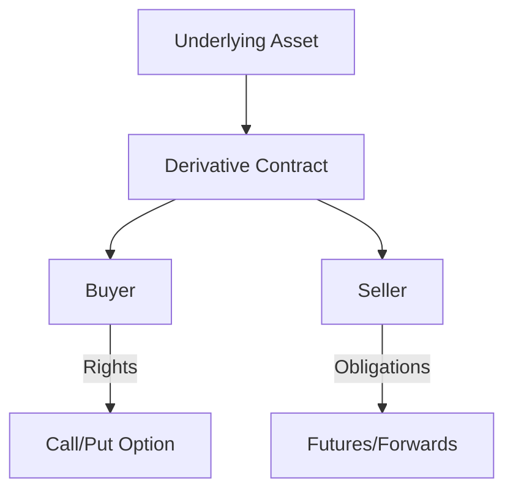

## 10.4 Features Common to All Derivatives

Derivatives are financial instruments whose value is derived from an underlying asset, index, or rate. They are essential tools in the financial markets, used for hedging, speculation, and arbitrage. Despite the diversity in types of derivatives, such as options, futures, forwards, and swaps, they share several fundamental features. Understanding these commonalities is crucial for anyone involved in the financial markets, particularly within the Canadian context.

### Fundamental Features of Derivatives

#### Contract Terms

At the heart of every derivative is a contract that specifies the terms of the agreement between the parties involved. These terms include:

- **Underlying Asset:** The asset from which the derivative derives its value. This could be a stock, bond, commodity, currency, interest rate, or market index.
  
- **Contract Size:** The amount of the underlying asset that the derivative contract represents. For example, a futures contract might represent 100 shares of a stock or 1,000 barrels of oil.

- **Expiration Date:** The date on which the derivative contract expires. This is the last day the contract can be exercised or settled. For instance, options contracts typically have monthly expiration dates.

- **Strike Price:** For options, this is the price at which the underlying asset can be bought or sold. It is a predetermined price set at the time the contract is written.

- **Settlement Terms:** The method by which the contract is settled, either through physical delivery of the underlying asset or cash settlement.

#### Obligations and Rights

Derivatives involve specific obligations and rights for the parties involved:

- **Obligations:** In a futures or forward contract, both parties are obligated to fulfill the terms of the contract at expiration. For example, the buyer must purchase, and the seller must deliver the underlying asset at the agreed-upon price.

- **Rights:** In options contracts, the buyer has the right, but not the obligation, to buy (call option) or sell (put option) the underlying asset at the strike price before or at expiration. The seller, however, has the obligation to fulfill the contract if the buyer exercises the option.

#### Pricing

The pricing of derivatives is complex and involves several factors:

- **Intrinsic Value:** The difference between the current price of the underlying asset and the strike price of the option. For example, if a call option has a strike price of $50 and the underlying stock is trading at $55, the intrinsic value is $5.

- **Time Value:** The additional value of the option based on the time remaining until expiration. Longer expiration periods typically increase the time value.

- **Volatility:** The expected volatility of the underlying asset's price can significantly affect the derivative's price. Higher volatility increases the potential for profit, thus increasing the derivative's price.

- **Interest Rates:** Changes in interest rates can affect the pricing of derivatives, particularly those involving currencies or interest rate swaps.

#### Expiration Dates

The expiration date is a critical feature of derivatives, marking the end of the contract's life. It determines the timeframe within which the rights and obligations must be exercised. The expiration date impacts the derivative's time value and overall pricing. In the Canadian market, options typically expire on the third Friday of the expiration month.

### The Zero-Sum Nature of Derivatives

Derivatives are often described as a zero-sum game, meaning that the gain of one party is exactly balanced by the loss of another. This characteristic has significant implications for market participants:

- **Risk Transfer:** Derivatives allow for the transfer of risk from one party to another. For example, a farmer may use futures contracts to lock in a price for their crop, transferring the risk of price fluctuations to the buyer.

- **Speculation:** Traders can use derivatives to speculate on the future direction of market prices. While this can lead to significant profits, it also involves substantial risk, as losses are equally possible.

- **Hedging:** Investors and companies use derivatives to hedge against potential losses in their portfolios or business operations. For instance, a Canadian exporter might use currency futures to hedge against fluctuations in the exchange rate.

### Practical Examples and Case Studies

#### Example 1: Hedging with Futures

Consider a Canadian wheat farmer who anticipates a harvest in six months. To protect against the risk of falling wheat prices, the farmer enters into a futures contract to sell wheat at a predetermined price. This contract locks in the selling price, providing certainty and reducing the farmer's exposure to price volatility.

#### Example 2: Speculating with Options

A Canadian investor believes that the stock of a major Canadian bank, such as RBC, will rise in the next three months. The investor purchases call options with a strike price close to the current market price. If the stock price increases, the investor can exercise the options for a profit. However, if the stock price falls, the investor's loss is limited to the premium paid for the options.

### Diagrams and Visual Aids

To further illustrate these concepts, consider the following diagram that outlines the basic structure of a derivative contract:

This diagram shows the relationship between the underlying asset, the derivative contract, and the parties involved, highlighting the rights and obligations inherent in different types of derivatives.

### Best Practices and Common Pitfalls

#### Best Practices

- **Understand the Contract Terms:** Thoroughly review and understand the terms of any derivative contract before entering into it. This includes the underlying asset, contract size, expiration date, and settlement terms.

- **Assess Risk Tolerance:** Evaluate your risk tolerance and ensure that the derivative strategy aligns with your financial goals and risk appetite.

- **Stay Informed:** Keep abreast of market conditions and factors that may affect the pricing and performance of derivatives.

#### Common Pitfalls

- **Over-Leverage:** Derivatives can amplify both gains and losses. Avoid over-leveraging your position, as this can lead to significant financial losses.

- **Ignoring Expiration Dates:** Failing to monitor expiration dates can result in missed opportunities or unexpected obligations.

- **Mispricing:** Misunderstanding the factors that influence derivative pricing can lead to poor investment decisions.

### Conclusion

Derivatives are powerful financial instruments that offer a range of opportunities for hedging, speculation, and risk management. By understanding the fundamental features common to all derivatives, including contract terms, obligations, pricing, and expiration dates, market participants can make informed decisions and effectively manage their financial strategies. As with any financial instrument, it is essential to approach derivatives with a clear understanding of the risks and rewards involved.

### **Ready to Test Your Knowledge?**

**Practice 10 Essential CSC Exam Questions to Master Your Certification**



### Which of the following is a fundamental feature of all derivatives?

- [x] Contract Terms
- [ ] Dividends
- [ ] Voting Rights
- [ ] Interest Payments

> **Explanation:** Contract terms are a fundamental feature of all derivatives, outlining the specifics of the agreement between parties.

### What does the expiration date of a derivative signify?

- [x] The last day the contract can be exercised or settled
- [ ] The day the contract was created
- [ ] The day the underlying asset was purchased
- [ ] The day the contract is automatically renewed

> **Explanation:** The expiration date is the last day the derivative contract can be exercised or settled.

### In a zero-sum game, what is the relationship between participants' gains and losses?

- [x] One participant's gain is exactly balanced by another's loss
- [ ] All participants gain equally
- [ ] All participants lose equally
- [ ] Gains and losses are unrelated

> **Explanation:** In a zero-sum game, one participant's gain is exactly balanced by another's loss.

### What is the intrinsic value of an option?

- [x] The difference between the current price of the underlying asset and the strike price
- [ ] The premium paid for the option
- [ ] The time remaining until expiration
- [ ] The interest rate impact on the option

> **Explanation:** The intrinsic value is the difference between the current price of the underlying asset and the strike price.

### Which of the following factors can affect the pricing of derivatives?

- [x] Volatility
- [x] Interest Rates
- [ ] Dividends
- [ ] Voting Rights

> **Explanation:** Volatility and interest rates are key factors that can affect the pricing of derivatives.

### What is a common use of derivatives in financial markets?

- [x] Hedging
- [ ] Increasing dividends
- [ ] Enhancing voting rights
- [ ] Reducing taxes

> **Explanation:** Derivatives are commonly used for hedging to manage risk in financial markets.

### What is a potential pitfall when using derivatives?

- [x] Over-Leverage
- [x] Ignoring Expiration Dates
- [ ] Increasing dividends
- [ ] Enhancing voting rights

> **Explanation:** Over-leverage and ignoring expiration dates are common pitfalls when using derivatives.

### What does the term "premium" refer to in the context of options?

- [x] The price paid for an option contract
- [ ] The interest earned on a bond
- [ ] The dividend received from a stock
- [ ] The fee for opening a brokerage account

> **Explanation:** The premium is the price paid for an option contract.

### How can derivatives be used for speculation?

- [x] By betting on the future direction of market prices
- [ ] By holding the underlying asset indefinitely
- [ ] By collecting dividends
- [ ] By voting in shareholder meetings

> **Explanation:** Derivatives can be used for speculation by betting on the future direction of market prices.

### True or False: Derivatives can only be settled through physical delivery of the underlying asset.

- [ ] True
- [x] False

> **Explanation:** Derivatives can be settled through physical delivery or cash settlement, depending on the contract terms.


