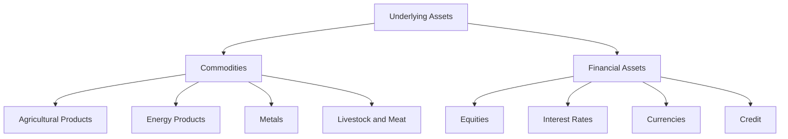

## 10.5 Types of Underlying Assets

In the world of derivatives, understanding the types of underlying assets is crucial for effective investment strategies and risk management. Underlying assets are the financial instruments upon which derivatives are based. They can be broadly categorized into two main groups: commodities and financial assets. Each category has unique characteristics that influence derivative pricing and strategies. This section will delve into these categories, providing examples and insights into how they affect the derivatives market.

### Commodities

Commodities are basic goods used in commerce that are interchangeable with other goods of the same type. They are often the raw materials used to produce other goods and services. Commodities can be further divided into several subcategories:

#### Agricultural Products

Agricultural commodities include products such as wheat, corn, soybeans, and coffee. These are essential goods that are traded globally. The prices of agricultural commodities are influenced by factors such as weather conditions, crop yields, and global demand.

#### Energy Products

Energy commodities include crude oil, natural gas, and coal. These commodities are critical to the global economy, as they are primary sources of energy. The pricing of energy commodities is affected by geopolitical events, supply disruptions, and changes in energy policies.

#### Metals

Metals are another important category of commodities. They include precious metals like gold and silver, as well as industrial metals like copper and aluminum. The demand for metals is driven by industrial production, technological advancements, and investment demand.

#### Livestock and Meat

This category includes commodities such as cattle, hogs, and poultry. Livestock prices are influenced by factors such as feed costs, disease outbreaks, and changes in consumer preferences.

### Financial Assets

Financial assets are intangible assets that derive value from contractual claims. They are a key component of the financial markets and include the following:

#### Equities

Equities represent ownership interest held by shareholders in a company. They are a popular underlying asset for derivatives such as options and futures. The value of equity derivatives is influenced by factors such as company performance, market sentiment, and economic conditions.

#### Interest Rates

Interest rate derivatives are based on the movement of interest rates. These derivatives are used to hedge against interest rate risk or to speculate on changes in interest rates. The pricing of interest rate derivatives is affected by central bank policies, inflation expectations, and economic growth.

#### Currencies

Currency derivatives are based on the exchange rates between different currencies. They are used by investors and companies to hedge against currency risk or to speculate on currency movements. Factors influencing currency derivatives include trade balances, interest rate differentials, and geopolitical events.

#### Credit

Credit derivatives are financial instruments used to manage exposure to credit risk. They are based on the creditworthiness of a borrower or a group of borrowers. The pricing of credit derivatives is influenced by credit ratings, default probabilities, and economic conditions.

### Impact on Derivative Pricing and Strategies

The characteristics of underlying assets significantly affect derivative pricing and strategies. Here are some key considerations:

- **Volatility:** The volatility of the underlying asset is a critical factor in derivative pricing. Higher volatility generally leads to higher option premiums, as the potential for large price movements increases the risk and reward of holding the derivative.

- **Liquidity:** The liquidity of the underlying asset affects the ease with which derivatives can be traded. Highly liquid assets, such as major currencies and large-cap equities, typically have more active derivative markets with tighter bid-ask spreads.

- **Correlation:** The correlation between the underlying asset and other market variables can impact hedging strategies. Understanding these correlations helps investors construct effective hedges and manage portfolio risk.

- **Market Sentiment:** Investor sentiment towards the underlying asset can influence derivative pricing. Positive sentiment may lead to higher demand for call options, while negative sentiment may increase the demand for put options.

### Practical Examples and Case Studies

#### Example 1: Canadian Pension Fund and Commodity Derivatives

A Canadian pension fund might use commodity derivatives to hedge against inflation risk. By investing in futures contracts for commodities like oil and wheat, the fund can protect its portfolio from the adverse effects of rising prices.

#### Example 2: RBC and Currency Derivatives

The Royal Bank of Canada (RBC) may use currency derivatives to manage its foreign exchange exposure. By entering into forward contracts or options on currencies, RBC can hedge against fluctuations in exchange rates that could impact its international operations.

#### Example 3: TD Bank and Interest Rate Derivatives

TD Bank might use interest rate swaps to manage its interest rate risk. By swapping fixed-rate payments for floating-rate payments, TD Bank can align its interest rate exposure with its risk management objectives.

### Diagrams and Visuals

Below is a diagram illustrating the relationship between different types of underlying assets and their corresponding derivatives:

### Best Practices and Common Pitfalls

- **Best Practices:**
  - Diversify exposure across different types of underlying assets to manage risk effectively.
  - Stay informed about market trends and economic indicators that affect underlying asset prices.
  - Use derivatives as part of a broader risk management strategy, rather than as standalone investments.

- **Common Pitfalls:**
  - Over-reliance on derivatives without understanding the underlying asset can lead to significant losses.
  - Ignoring liquidity and volatility factors can result in unfavorable pricing and execution.

### Conclusion

Understanding the types of underlying assets is essential for anyone involved in the derivatives market. By recognizing the unique characteristics of commodities and financial assets, investors can make informed decisions and develop effective strategies. As the Canadian financial landscape continues to evolve, staying informed and adaptable is key to success.

### **Ready to Test Your Knowledge?**

**Practice 10 Essential CSC Exam Questions to Master Your Certification**



### Which of the following is NOT a category of commodities?

- [ ] Agricultural Products
- [ ] Energy Products
- [ ] Metals
- [x] Equities

> **Explanation:** Equities are financial assets, not commodities.

### What factor primarily affects the pricing of interest rate derivatives?

- [x] Central bank policies
- [ ] Weather conditions
- [ ] Crop yields
- [ ] Consumer preferences

> **Explanation:** Interest rate derivatives are influenced by central bank policies, which affect interest rates.

### Which of the following is an example of a financial asset?

- [ ] Wheat
- [ ] Crude oil
- [x] Currencies
- [ ] Copper

> **Explanation:** Currencies are financial assets, while the others are commodities.

### What is a key consideration in derivative pricing related to the underlying asset?

- [x] Volatility
- [ ] Color
- [ ] Shape
- [ ] Texture

> **Explanation:** Volatility is a critical factor in derivative pricing, affecting option premiums.

### Which Canadian bank might use currency derivatives to manage foreign exchange exposure?

- [x] RBC
- [ ] TD Bank
- [ ] CIBC
- [ ] BMO

> **Explanation:** RBC, like other banks, uses currency derivatives to manage foreign exchange risk.

### What is the primary use of credit derivatives?

- [x] Manage exposure to credit risk
- [ ] Hedge against weather changes
- [ ] Speculate on commodity prices
- [ ] Predict stock market trends

> **Explanation:** Credit derivatives are used to manage exposure to credit risk.

### Which of the following is a subcategory of financial assets?

- [ ] Livestock and Meat
- [ ] Energy Products
- [x] Interest Rates
- [ ] Agricultural Products

> **Explanation:** Interest rates are a subcategory of financial assets.

### What is a common pitfall when using derivatives?

- [x] Over-reliance without understanding the underlying asset
- [ ] Diversifying exposure
- [ ] Staying informed about market trends
- [ ] Using derivatives as part of a broader strategy

> **Explanation:** Over-reliance on derivatives without understanding the underlying asset can lead to losses.

### Which factor can influence investor sentiment towards an underlying asset?

- [x] Market Sentiment
- [ ] Weather conditions
- [ ] Crop yields
- [ ] Feed costs

> **Explanation:** Market sentiment can influence investor sentiment and affect derivative pricing.

### True or False: Metals are considered financial assets.

- [ ] True
- [x] False

> **Explanation:** Metals are commodities, not financial assets.


