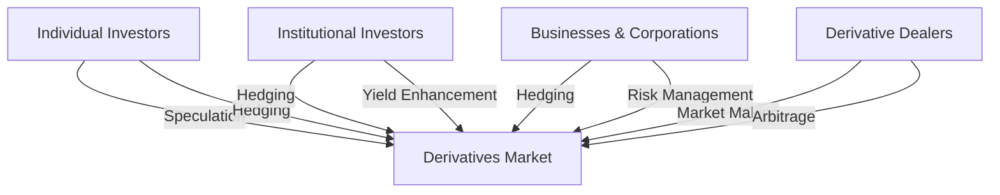

## 10.6 Users of Derivatives

Derivatives are versatile financial instruments that derive their value from underlying assets such as stocks, bonds, commodities, or currencies. They are used by a variety of market participants for different purposes, including hedging risk, speculating on future price movements, and arbitraging price discrepancies. In this section, we will explore the four main groups of derivative users: individual investors, institutional investors, businesses and corporations, and derivative dealers. Understanding the motivations and strategies of these groups is crucial for anyone looking to navigate the derivatives market effectively.

### Individual Investors

Individual investors, often referred to as retail investors, use derivatives primarily for speculation and hedging purposes. These investors may include day traders, high-net-worth individuals, or even small-scale investors looking to enhance their portfolio returns.

#### Motivations and Strategies

1. **Speculation:** Individual investors may use derivatives to speculate on the future direction of market prices. For example, an investor might purchase call options on a stock they believe will rise in value. This allows them to leverage their position, potentially amplifying returns with a relatively small initial investment.

2. **Hedging:** Some individual investors use derivatives to hedge against potential losses in their portfolios. For instance, an investor holding a significant amount of Canadian equities might buy put options to protect against a downturn in the market.

3. **Leverage:** Derivatives allow individual investors to gain exposure to larger positions than they could with the underlying asset alone. This can magnify both gains and losses, making it a double-edged sword.

### Institutional Investors

Institutional investors are organizations that invest on behalf of their members, such as mutual funds, pension funds, and insurance companies. These entities often have significant capital at their disposal and use derivatives to manage large portfolios.

#### Motivations and Strategies

1. **Hedging:** Institutional investors frequently use derivatives to hedge against various risks, such as interest rate changes, currency fluctuations, or commodity price volatility. For example, a Canadian pension fund might use currency futures to hedge against the impact of a weakening Canadian dollar on its foreign investments.

2. **Portfolio Diversification:** Derivatives can provide exposure to asset classes that might be difficult to access directly. This allows institutional investors to diversify their portfolios and manage risk more effectively.

3. **Yield Enhancement:** By writing options, institutional investors can generate additional income from their portfolios. This strategy, known as covered call writing, involves selling call options on securities they already own.

### Businesses and Corporations

Businesses and corporations use derivatives primarily to manage risks associated with their operations. These risks can include fluctuations in commodity prices, interest rates, and foreign exchange rates.

#### Motivations and Strategies

1. **Hedging Operational Risks:** Companies often use derivatives to hedge against price volatility in raw materials. For example, an airline might use fuel futures to lock in prices and protect against rising fuel costs.

2. **Interest Rate Management:** Corporations with significant debt may use interest rate swaps to manage exposure to fluctuating interest rates, ensuring more predictable financing costs.

3. **Currency Risk Management:** Multinational corporations use currency derivatives to hedge against adverse movements in exchange rates, which can impact their profitability when converting foreign earnings back to Canadian dollars.

### Derivative Dealers

Derivative dealers, often large financial institutions or specialized trading firms, play a crucial role as intermediaries in the derivatives market. They facilitate transactions between buyers and sellers, providing liquidity and ensuring efficient market functioning.

#### Role and Strategies

1. **Market Making:** Derivative dealers provide liquidity by quoting buy and sell prices for derivatives, enabling other market participants to execute trades quickly and efficiently.

2. **Risk Management:** Dealers manage their own risk exposure by using sophisticated hedging strategies and maintaining diversified portfolios of derivatives.

3. **Arbitrage:** Dealers may engage in arbitrage by exploiting price discrepancies between related derivatives or between derivatives and their underlying assets. This helps to align prices and maintain market efficiency.

### Diagram: Users of Derivatives

Below is a diagram illustrating the interactions between different users of derivatives and their primary motivations.

### Best Practices and Challenges

- **Best Practices:** Users of derivatives should have a clear understanding of their risk tolerance and investment objectives. It's essential to use derivatives as part of a broader, well-thought-out strategy rather than for speculative purposes alone.

- **Common Challenges:** The complexity of derivatives can lead to significant losses if not managed properly. Users must be aware of the potential for leverage to amplify losses and should employ robust risk management practices.

- **Regulatory Compliance:** In Canada, derivative users must comply with regulations set by the Canadian Securities Administrators (CSA) and other relevant bodies. Staying informed about regulatory changes is crucial for maintaining compliance.

### Conclusion

Derivatives are powerful financial tools used by a diverse range of market participants. Whether for hedging, speculation, or arbitrage, understanding the motivations and strategies of different users is key to navigating the derivatives market successfully. By employing best practices and staying informed about regulatory requirements, investors and businesses can harness the potential of derivatives to achieve their financial goals.

### **Ready to Test Your Knowledge?**

**Practice 10 Essential CSC Exam Questions to Master Your Certification**



### Who are the primary users of derivatives?

- [x] Individual investors, institutional investors, businesses and corporations, and derivative dealers
- [ ] Only individual investors and businesses
- [ ] Only institutional investors and derivative dealers
- [ ] Only businesses and corporations

> **Explanation:** The primary users of derivatives include individual investors, institutional investors, businesses and corporations, and derivative dealers, each with distinct motivations and strategies.

### What is a common strategy used by individual investors in the derivatives market?

- [x] Speculation
- [ ] Market making
- [ ] Arbitrage
- [ ] Hedging operational risks

> **Explanation:** Individual investors often use derivatives for speculation, aiming to profit from anticipated price movements.

### How do institutional investors typically use derivatives?

- [x] Hedging and yield enhancement
- [ ] Speculation and market making
- [ ] Arbitrage and speculation
- [ ] Only for hedging operational risks

> **Explanation:** Institutional investors use derivatives primarily for hedging risks and enhancing portfolio yields through strategies like covered call writing.

### What is a key role of derivative dealers in the market?

- [x] Market making
- [ ] Speculation
- [ ] Portfolio diversification
- [ ] Hedging currency risks

> **Explanation:** Derivative dealers provide liquidity and facilitate transactions by quoting buy and sell prices, a process known as market making.

### Which strategy might a business use to manage currency risk?

- [x] Currency derivatives
- [ ] Covered call writing
- [ ] Speculation
- [ ] Market making

> **Explanation:** Businesses use currency derivatives to hedge against adverse movements in exchange rates, protecting their profitability.

### What is a potential challenge of using derivatives?

- [x] Complexity leading to significant losses
- [ ] Guaranteed profits
- [ ] Lack of regulatory oversight
- [ ] No impact on portfolio risk

> **Explanation:** The complexity of derivatives can lead to significant losses if not managed properly, highlighting the importance of robust risk management.

### How can institutional investors enhance portfolio yields using derivatives?

- [x] Writing options
- [ ] Speculation
- [ ] Market making
- [ ] Hedging operational risks

> **Explanation:** Institutional investors can enhance yields by writing options, such as covered calls, to generate additional income.

### What is a common motivation for businesses to use derivatives?

- [x] Hedging operational risks
- [ ] Speculation
- [ ] Market making
- [ ] Arbitrage

> **Explanation:** Businesses use derivatives to hedge against operational risks, such as price volatility in raw materials or currency fluctuations.

### What is the role of arbitrage in the derivatives market?

- [x] Exploiting price discrepancies to maintain market efficiency
- [ ] Speculation on future price movements
- [ ] Hedging against interest rate changes
- [ ] Enhancing portfolio yields

> **Explanation:** Arbitrage involves exploiting price discrepancies between related derivatives or between derivatives and their underlying assets, helping to maintain market efficiency.

### True or False: Derivative dealers primarily engage in speculation.

- [ ] True
- [x] False

> **Explanation:** Derivative dealers primarily engage in market making and arbitrage, providing liquidity and facilitating efficient market functioning rather than speculation.


