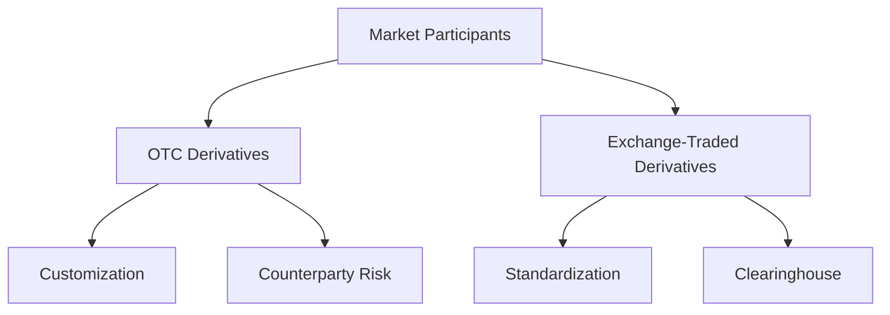

## Conclusion of Chapter 10

As we conclude Chapter 10 on derivatives, it's essential to consolidate our understanding of these complex yet pivotal financial instruments. Derivatives, including options, forwards, and futures, play a crucial role in the financial markets, offering both opportunities and challenges for investors and institutions alike.

### Recap of Derivatives

Derivatives are financial instruments whose value is derived from an underlying asset, such as stocks, bonds, commodities, or currencies. The primary types of derivatives include:

- **Options:** Contracts that give the holder the right, but not the obligation, to buy or sell an asset at a predetermined price before a specific date. Options are versatile tools for hedging and speculation, allowing investors to manage risk or leverage positions.

- **Forwards:** Customized contracts traded over-the-counter (OTC) that obligate the buyer to purchase, and the seller to sell, an asset at a predetermined future date and price. Forwards are primarily used for hedging purposes, particularly in commodities and foreign exchange markets.

- **Futures:** Standardized contracts traded on exchanges that obligate the parties to transact an asset at a predetermined future date and price. Futures are widely used for both hedging and speculative purposes, offering liquidity and transparency.

### Functions and Uses

Derivatives serve two primary functions in financial markets: hedging and speculation.

- **Hedging:** Derivatives are powerful tools for managing risk. By using derivatives, investors and corporations can protect themselves against adverse price movements in underlying assets. For example, a Canadian wheat farmer might use futures contracts to lock in a selling price for their crop, mitigating the risk of price fluctuations.

- **Speculation:** Traders and investors use derivatives to profit from anticipated price movements. Speculators provide liquidity and depth to the markets, although their activities can also increase volatility. For instance, a trader might purchase call options on a Canadian tech stock, betting on its price increase.

### Understanding Market Structures

Derivatives can be traded in two main market structures: over-the-counter (OTC) and exchange-traded.

- **OTC Derivatives:** These are privately negotiated contracts between parties, offering customization in terms of contract size, expiration, and underlying asset. However, they carry higher counterparty risk due to the lack of a central clearinghouse. OTC derivatives are prevalent in interest rate swaps and currency forwards.

- **Exchange-Traded Derivatives:** These are standardized contracts traded on regulated exchanges, such as the Montreal Exchange in Canada. They offer greater transparency, liquidity, and reduced counterparty risk due to the presence of a clearinghouse. Futures and options on indices and commodities are typical examples.

### Importance of Risk Management

Derivatives are indispensable in risk management strategies for investors, institutions, and corporations. They allow market participants to:

- **Mitigate Risk:** By hedging against potential losses, derivatives help stabilize cash flows and protect profit margins. For example, a Canadian exporter might use currency futures to hedge against adverse currency movements.

- **Enhance Returns:** Through strategic use of leverage, derivatives can amplify returns, although this comes with increased risk. Investors must carefully assess their risk tolerance and market conditions.

- **Improve Market Efficiency:** Derivatives contribute to price discovery and market efficiency by allowing participants to express views on future price movements.

### Glossary

- **Derivatives:** Financial instruments whose value is derived from the value of an underlying asset.
- **Hedging:** Using derivatives to offset potential losses in investments.
- **Speculation:** Engaging in derivatives trading to profit from expected price movements.

### Practical Example: Canadian Pension Funds

Consider a Canadian pension fund that uses interest rate swaps to manage its exposure to fluctuating interest rates. By entering into a swap agreement, the fund can exchange variable interest payments for fixed payments, stabilizing its cash flows and ensuring predictable returns for its beneficiaries.

### Diagram: Derivatives Market Structure

Below is a diagram illustrating the flow of derivatives in OTC and exchange-traded markets:

```mermaid
graph TD;
    A[Market Participants] --> B[OTC Derivatives]
    A --> C[Exchange-Traded Derivatives]
    B --> D[Customization]
    B --> E[Counterparty Risk]
    C --> F[Standardization]
    C --> G[Clearinghouse]
```

### Best Practices and Challenges

- **Best Practices:** Always conduct thorough due diligence and risk assessment before engaging in derivatives trading. Understand the underlying asset and market conditions.

- **Common Challenges:** Managing leverage and understanding complex derivatives structures can be daunting. Continuous education and professional advice are crucial.

### Encouragement for Continuous Learning

As you continue your journey in the financial world, remember that derivatives are powerful tools that require a deep understanding and careful management. Stay informed about market trends, regulatory changes, and new financial instruments to enhance your expertise.

## Quiz Time!



### What is a derivative?

- [x] A financial instrument whose value is derived from an underlying asset
- [ ] A type of stock
- [ ] A government bond
- [ ] A savings account

> **Explanation:** Derivatives derive their value from an underlying asset, such as stocks, bonds, or commodities.

### Which of the following is a primary use of derivatives?

- [x] Hedging
- [ ] Tax evasion
- [ ] Money laundering
- [ ] Real estate investment

> **Explanation:** Derivatives are primarily used for hedging to manage financial risk.

### What is the main difference between forwards and futures?

- [x] Forwards are OTC contracts, while futures are exchange-traded
- [ ] Forwards are standardized, while futures are customized
- [ ] Forwards are only used for speculation, while futures are only used for hedging
- [ ] Forwards have no expiration date, while futures do

> **Explanation:** Forwards are customized OTC contracts, whereas futures are standardized and traded on exchanges.

### How do exchange-traded derivatives reduce counterparty risk?

- [x] Through the presence of a clearinghouse
- [ ] By being more expensive
- [ ] By being less liquid
- [ ] By having longer expiration dates

> **Explanation:** A clearinghouse acts as an intermediary, reducing counterparty risk in exchange-traded derivatives.

### What is a common challenge when using derivatives?

- [x] Managing leverage
- [ ] Finding a broker
- [ ] Opening a bank account
- [ ] Buying real estate

> **Explanation:** Managing leverage is a common challenge due to the potential for amplified losses.

### Which Canadian institution is known for trading exchange-traded derivatives?

- [x] Montreal Exchange
- [ ] Toronto Stock Exchange
- [ ] Bank of Canada
- [ ] Canadian Imperial Bank of Commerce

> **Explanation:** The Montreal Exchange specializes in trading exchange-traded derivatives.

### What is the role of speculators in the derivatives market?

- [x] Providing liquidity
- [ ] Reducing market volatility
- [ ] Increasing transaction costs
- [ ] Stabilizing interest rates

> **Explanation:** Speculators provide liquidity and depth to the market, although they can also increase volatility.

### How can derivatives enhance returns?

- [x] Through leverage
- [ ] By reducing taxes
- [ ] By increasing fees
- [ ] By decreasing market access

> **Explanation:** Derivatives can enhance returns through leverage, allowing for amplified gains.

### What is a key benefit of using derivatives for hedging?

- [x] Stabilizing cash flows
- [ ] Increasing transaction costs
- [ ] Reducing market access
- [ ] Decreasing liquidity

> **Explanation:** Hedging with derivatives helps stabilize cash flows by mitigating risk.

### True or False: OTC derivatives are standardized contracts.

- [ ] True
- [x] False

> **Explanation:** OTC derivatives are customized contracts, not standardized.



By mastering the concepts and applications of derivatives, you are better equipped to navigate the complexities of the financial markets and make informed investment decisions. Continue to explore and apply these principles to enhance your financial acumen and achieve your investment goals.
