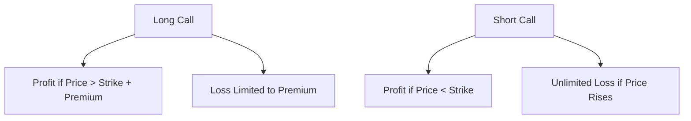
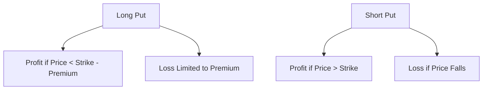

## 10.7 Options: Call and Put Positions

Options are a versatile financial instrument that can be used for hedging, speculation, or to enhance portfolio returns. In the Canadian financial market, understanding options is crucial for both individual investors and financial professionals. This section will delve into the intricacies of call and put options, their positions, and how they can be strategically employed.

### Understanding Call and Put Options

Options are contracts that give the holder the right, but not the obligation, to buy or sell an underlying asset at a predetermined price before a specified expiration date. The two primary types of options are **call options** and **put options**.

#### Call Options

A **call option** gives the holder the right to purchase the underlying asset at the strike price before the option expires. The buyer of a call option anticipates that the price of the underlying asset will rise above the strike price before expiration, allowing them to purchase the asset at a lower price and potentially sell it at the market price for a profit.

- **Buyer of a Call Option (Long Call):** Gains the right to buy the asset. The maximum loss is limited to the premium paid for the option, while the potential profit is theoretically unlimited if the asset's price rises significantly.
  
- **Seller of a Call Option (Short Call):** Obligates the seller to sell the asset at the strike price if the buyer exercises the option. The seller receives the premium as income but faces unlimited potential loss if the asset's price rises substantially.

#### Put Options

A **put option** gives the holder the right to sell the underlying asset at the strike price before the option expires. The buyer of a put option expects the price of the underlying asset to fall below the strike price, allowing them to sell the asset at a higher price than the market value.

- **Buyer of a Put Option (Long Put):** Gains the right to sell the asset. The maximum loss is limited to the premium paid, while the potential profit is significant if the asset's price falls sharply.
  
- **Seller of a Put Option (Short Put):** Obligates the seller to buy the asset at the strike price if the buyer exercises the option. The seller receives the premium but risks significant loss if the asset's price plummets.

### The Four Basic Option Positions

Understanding the four basic option positions is essential for effectively utilizing options in various market conditions. Each position has distinct characteristics and potential outcomes based on market movements.

#### 1. Long Call

- **Position:** Buying a call option.
- **Market Expectation:** The investor expects the price of the underlying asset to rise.
- **Profit Scenario:** Profitable if the asset's price exceeds the strike price plus the premium paid.
- **Example:** A Canadian investor buys a call option on RBC shares with a strike price of $100, paying a $5 premium. If RBC's share price rises to $110, the investor can exercise the option to buy at $100 and potentially sell at $110, realizing a profit.

#### 2. Short Call

- **Position:** Selling a call option.
- **Market Expectation:** The investor expects the price of the underlying asset to remain stable or decline.
- **Profit Scenario:** Profitable if the asset's price stays below the strike price, allowing the seller to keep the premium.
- **Example:** A Canadian investor sells a call option on TD Bank shares with a strike price of $80, receiving a $3 premium. If TD's share price remains below $80, the investor retains the premium as profit.

#### 3. Long Put

- **Position:** Buying a put option.
- **Market Expectation:** The investor expects the price of the underlying asset to fall.
- **Profit Scenario:** Profitable if the asset's price falls below the strike price minus the premium paid.
- **Example:** A Canadian investor buys a put option on a mutual fund with a strike price of $50, paying a $2 premium. If the fund's value drops to $40, the investor can sell at $50, realizing a profit.

#### 4. Short Put

- **Position:** Selling a put option.
- **Market Expectation:** The investor expects the price of the underlying asset to remain stable or rise.
- **Profit Scenario:** Profitable if the asset's price stays above the strike price, allowing the seller to keep the premium.
- **Example:** A Canadian investor sells a put option on a government bond with a strike price of $90, receiving a $1 premium. If the bond's price remains above $90, the investor retains the premium as profit.

### Market Scenarios and Profitability

The profitability of each option position is contingent upon market movements and the investor's expectations. Below are scenarios illustrating when each position would be advantageous:

- **Long Call:** Profitable in a bullish market where the asset's price is expected to rise significantly.
- **Short Call:** Profitable in a bearish or stable market where the asset's price is expected to remain below the strike price.
- **Long Put:** Profitable in a bearish market where the asset's price is expected to fall significantly.
- **Short Put:** Profitable in a bullish or stable market where the asset's price is expected to remain above the strike price.

### Practical Examples and Case Studies

To further illustrate these concepts, consider the following real-world scenarios involving major Canadian financial institutions:

#### Case Study: RBC Call Options

An investor anticipates a strong quarterly earnings report from RBC, expecting the stock price to rise. They purchase a long call option with a strike price of $100, paying a $5 premium. If RBC's stock price rises to $115, the investor can exercise the option, buying at $100 and potentially selling at the market price, realizing a profit of $10 per share after accounting for the premium.

#### Case Study: TD Put Options

Conversely, an investor expects TD Bank's stock to decline due to unfavorable economic conditions. They purchase a long put option with a strike price of $80, paying a $3 premium. If TD's stock price falls to $70, the investor can exercise the option, selling at $80 and realizing a profit of $7 per share after accounting for the premium.

### Diagrams and Visual Aids

To enhance understanding, the following diagrams illustrate the profit and loss scenarios for each option position:

#### Long Call and Short Call

#### Long Put and Short Put

### Best Practices and Common Pitfalls

When trading options, consider the following best practices and avoid common pitfalls:

- **Best Practices:**
  - Conduct thorough market analysis and understand the underlying asset.
  - Use options as part of a diversified investment strategy.
  - Monitor market conditions and adjust positions as needed.

- **Common Pitfalls:**
  - Overleveraging positions, leading to significant losses.
  - Ignoring transaction costs and taxes, which can impact profitability.
  - Failing to understand the complexities of options, leading to poor decision-making.

### Regulatory Considerations

In Canada, options trading is regulated by the Canadian Investment Regulatory Organization (CIRO) and provincial securities commissions. Investors must adhere to regulatory requirements, including disclosure and reporting obligations. Familiarize yourself with the relevant regulations and seek professional advice if needed.

### Conclusion

Options are a powerful tool in the financial markets, offering flexibility and strategic opportunities. By understanding call and put positions, investors can effectively navigate market conditions and enhance their portfolios. As with any financial instrument, thorough research and prudent risk management are essential to success.

### **Ready to Test Your Knowledge?**

**Practice 10 Essential CSC Exam Questions to Master Your Certification**



### What is a call option?

- [x] A contract giving the holder the right to buy an asset at a predetermined price.
- [ ] A contract giving the holder the right to sell an asset at a predetermined price.
- [ ] A contract obligating the holder to buy an asset at a predetermined price.
- [ ] A contract obligating the holder to sell an asset at a predetermined price.

> **Explanation:** A call option gives the holder the right, but not the obligation, to buy an asset at a predetermined price before the expiration date.

### What is a put option?

- [ ] A contract giving the holder the right to buy an asset at a predetermined price.
- [x] A contract giving the holder the right to sell an asset at a predetermined price.
- [ ] A contract obligating the holder to buy an asset at a predetermined price.
- [ ] A contract obligating the holder to sell an asset at a predetermined price.

> **Explanation:** A put option gives the holder the right, but not the obligation, to sell an asset at a predetermined price before the expiration date.

### Which position benefits from a rising market?

- [x] Long Call
- [ ] Short Call
- [ ] Long Put
- [ ] Short Put

> **Explanation:** A long call position benefits from a rising market as it allows the holder to buy the asset at a lower strike price and potentially sell at a higher market price.

### Which position benefits from a falling market?

- [ ] Long Call
- [ ] Short Call
- [x] Long Put
- [ ] Short Put

> **Explanation:** A long put position benefits from a falling market as it allows the holder to sell the asset at a higher strike price than the market price.

### What is the maximum loss for a long call position?

- [x] The premium paid
- [ ] Unlimited
- [ ] The difference between the strike price and market price
- [ ] The strike price

> **Explanation:** The maximum loss for a long call position is limited to the premium paid for the option.

### What is the maximum profit for a short call position?

- [x] The premium received
- [ ] Unlimited
- [ ] The difference between the strike price and market price
- [ ] The strike price

> **Explanation:** The maximum profit for a short call position is limited to the premium received for selling the option.

### Which position involves the obligation to sell the underlying asset?

- [ ] Long Call
- [x] Short Call
- [ ] Long Put
- [ ] Short Put

> **Explanation:** A short call position involves the obligation to sell the underlying asset if the option is exercised by the buyer.

### Which position involves the obligation to buy the underlying asset?

- [ ] Long Call
- [ ] Short Call
- [ ] Long Put
- [x] Short Put

> **Explanation:** A short put position involves the obligation to buy the underlying asset if the option is exercised by the buyer.

### What is the primary regulatory body for options trading in Canada?

- [x] Canadian Investment Regulatory Organization (CIRO)
- [ ] Securities and Exchange Commission (SEC)
- [ ] Financial Conduct Authority (FCA)
- [ ] European Securities and Markets Authority (ESMA)

> **Explanation:** The Canadian Investment Regulatory Organization (CIRO) is the primary regulatory body overseeing options trading in Canada.

### True or False: A long put position is profitable if the asset's price rises above the strike price.

- [ ] True
- [x] False

> **Explanation:** A long put position is profitable if the asset's price falls below the strike price, not if it rises above it.


