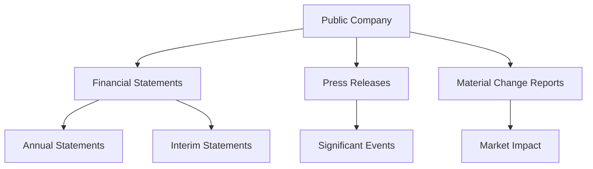

## 11.9 Public Company Disclosures and Investor Rights

In the Canadian financial landscape, public companies are subject to stringent disclosure requirements to ensure transparency and protect investor interests. This section delves into the continuous disclosure obligations of public companies, the statutory rights of investors, and the regulatory framework governing insider trading and takeover bids. Understanding these elements is crucial for finance professionals and investors alike, as they navigate the complexities of the securities market.

### Continuous Disclosure Requirements

Continuous disclosure is a fundamental principle in the Canadian securities market, ensuring that investors have access to timely and accurate information about public companies. This transparency is vital for maintaining market integrity and investor confidence.

#### Financial Statements

Public companies in Canada are required to prepare and file financial statements on a regular basis. These statements include:

- **Annual Financial Statements:** Must be audited and filed within 90 days of the company's fiscal year-end.
- **Interim Financial Statements:** Typically unaudited, these must be filed within 45 days of the end of each quarter.

These financial statements provide a comprehensive overview of a company's financial health, including its assets, liabilities, revenues, and expenses. Investors rely on this information to make informed decisions.

#### Press Releases and Material Change Reports

In addition to financial statements, public companies must issue press releases and file material change reports when significant events occur. A **material change** refers to any development that could reasonably be expected to have a significant impact on the market price or value of a company's securities. Examples include mergers, acquisitions, or changes in executive leadership.

The Canadian Securities Administrators (CSA) mandates that material changes be disclosed promptly to ensure all investors have equal access to critical information.

### Statutory Rights of Investors

Investors in Canada are afforded several statutory rights to protect their interests and ensure fair treatment in the securities market.

#### Right of Withdrawal

Investors have the right to withdraw from a purchase agreement within two business days after receiving a prospectus. This right allows investors to reconsider their investment decisions and provides a safeguard against impulsive transactions.

#### Right of Rescission

The right of rescission enables investors to cancel a purchase and receive a refund if the prospectus contains a misrepresentation. This right is crucial for maintaining trust in the disclosure process and holding companies accountable for the accuracy of their information.

#### Action for Damages

Investors can also pursue legal action for damages if they suffer a loss due to a misrepresentation in a prospectus or continuous disclosure document. This right underscores the importance of accurate and complete disclosures by public companies.

### Regulatory Framework Governing Insider Trading and Takeover Bids

The Canadian regulatory framework includes strict rules to prevent insider trading and ensure fair practices during takeover bids.

#### Insider Trading

**Insider trading** involves buying or selling securities based on non-public, material information. This practice is illegal in Canada and is subject to severe penalties. The CSA and provincial securities commissions actively monitor trading activities to detect and deter insider trading.

To comply with regulations, insiders must report their trades and adhere to blackout periods, during which they are prohibited from trading the company's securities.

#### Takeover Bids

A **takeover bid** is an offer to purchase a significant portion of a company's shares to gain control. The regulatory framework ensures that takeover bids are conducted fairly and transparently, protecting the interests of all shareholders.

Key regulations include:

- **Early Warning Requirements:** Acquirers must disclose their intentions when they acquire 10% or more of a company's shares.
- **Takeover Bid Circulars:** Detailed information must be provided to shareholders, including the terms of the offer and the acquirer's intentions.

### Practical Examples and Case Studies

To illustrate these concepts, consider the following examples:

- **Case Study: RBC's Material Change Disclosure:** In 2022, RBC announced a significant acquisition through a press release and material change report, ensuring that all investors were informed simultaneously.
- **Example: Insider Trading Penalties:** In 2021, a Canadian executive was fined for insider trading after purchasing shares based on confidential merger information, highlighting the importance of compliance with insider trading laws.

### Best Practices and Common Pitfalls

**Best Practices:**

- **Timely Disclosure:** Ensure all material changes are disclosed promptly to maintain investor trust.
- **Accurate Reporting:** Verify the accuracy of financial statements and disclosures to avoid legal repercussions.
- **Compliance with Regulations:** Stay informed about regulatory changes and ensure compliance with insider trading and takeover bid rules.

**Common Pitfalls:**

- **Delayed Disclosures:** Failing to disclose material changes promptly can lead to regulatory penalties and loss of investor confidence.
- **Inaccurate Financial Reporting:** Misrepresentations in financial statements can result in legal action and damage to a company's reputation.

### Additional Resources

For further exploration of public company disclosures and investor rights, consider the following resources:

- [Canadian Securities Administrators (CSA) Disclosure Requirements](https://www.securities-administrators.ca/aboutcsa.aspx)
- Books on Canadian securities law and investor rights
- Online courses on financial reporting and compliance

### Conclusion

Understanding public company disclosures and investor rights is essential for navigating the Canadian securities market. By adhering to continuous disclosure requirements, respecting investor rights, and complying with regulatory frameworks, companies can foster transparency and trust. Investors, in turn, can make informed decisions and protect their interests in the dynamic financial landscape.

### **Ready to Test Your Knowledge?**

**Practice 10 Essential CSC Exam Questions to Master Your Certification**



### What is continuous disclosure?

- [x] An ongoing obligation to provide timely and accurate information to the public
- [ ] A one-time financial statement filing requirement
- [ ] A periodic audit requirement
- [ ] A voluntary disclosure of company goals

> **Explanation:** Continuous disclosure involves the ongoing obligation of public companies to provide timely and accurate information to the public, ensuring transparency and fairness in the securities market.

### What is a material change?

- [x] A significant change that could impact an investor’s decision
- [ ] A minor adjustment in financial statements
- [ ] A routine operational update
- [ ] An internal company policy change

> **Explanation:** A material change refers to significant developments that could impact an investor's decision, such as mergers or executive changes.

### What is insider trading?

- [x] Buying or selling securities based on non-public, material information
- [ ] Trading securities during public market hours
- [ ] Trading securities based on public information
- [ ] Trading securities within a family trust

> **Explanation:** Insider trading involves buying or selling securities based on non-public, material information, which is illegal and subject to penalties.

### What is a takeover bid?

- [x] An offer to purchase a significant portion of a company’s shares to gain control
- [ ] A proposal to merge with another company
- [ ] A request for additional funding from investors
- [ ] A strategy to increase market share

> **Explanation:** A takeover bid is an offer to purchase a significant portion of a company's shares to gain control, subject to regulatory requirements.

### What is the right of withdrawal?

- [x] The right to withdraw from a purchase agreement within two business days after receiving a prospectus
- [ ] The right to cancel a trade within 24 hours
- [x] The right to rescind a purchase if the prospectus contains a misrepresentation
- [ ] The right to demand a refund for any investment

> **Explanation:** The right of withdrawal allows investors to reconsider their investment decisions within two business days after receiving a prospectus, while the right of rescission applies if there is a misrepresentation.

### What must public companies disclose in a material change report?

- [x] Significant events that could impact the market price or value of securities
- [ ] Routine financial updates
- [ ] Internal policy changes
- [ ] Employee performance reviews

> **Explanation:** Public companies must disclose significant events that could impact the market price or value of securities in a material change report.

### What is the purpose of early warning requirements in takeover bids?

- [x] To disclose intentions when acquiring 10% or more of a company's shares
- [ ] To announce a merger with another company
- [x] To inform shareholders of a new product launch
- [ ] To provide quarterly financial updates

> **Explanation:** Early warning requirements ensure that acquirers disclose their intentions when acquiring 10% or more of a company's shares, promoting transparency in takeover bids.

### What is the consequence of failing to disclose a material change promptly?

- [x] Regulatory penalties and loss of investor confidence
- [ ] Increased stock price
- [ ] Improved company reputation
- [ ] Enhanced market position

> **Explanation:** Failing to disclose a material change promptly can lead to regulatory penalties and loss of investor confidence, emphasizing the importance of timely disclosures.

### What is the role of the CSA in insider trading regulation?

- [x] Monitoring trading activities to detect and deter insider trading
- [ ] Conducting annual audits of all public companies
- [ ] Setting interest rates for securities
- [ ] Approving all public company mergers

> **Explanation:** The CSA monitors trading activities to detect and deter insider trading, ensuring compliance with regulations.

### True or False: Investors can pursue legal action for damages if they suffer a loss due to a misrepresentation in a prospectus.

- [x] True
- [ ] False

> **Explanation:** True. Investors have the right to pursue legal action for damages if they suffer a loss due to a misrepresentation in a prospectus, protecting their interests.


