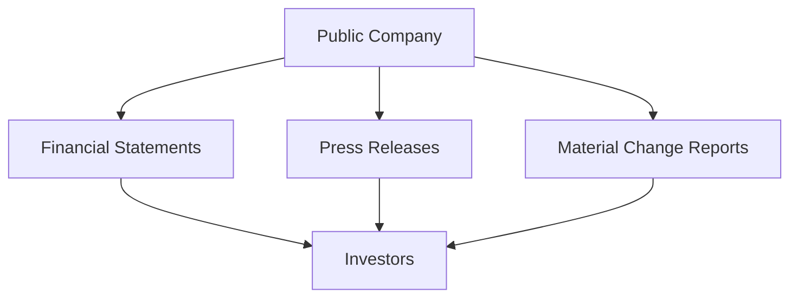

## 11.4 Public Company Disclosures and Investor Rights

Public company disclosures and investor rights are fundamental components of the financial markets, ensuring transparency, fairness, and protection for investors. In Canada, these elements are governed by a robust regulatory framework designed to maintain market integrity and foster investor confidence. This section delves into the rules and regulations governing public company disclosures, the types of information that must be disclosed, and the statutory rights of investors. Additionally, we will explore the regulations surrounding takeover bids and insider trading, which are crucial for protecting investor interests.

### Rules and Regulations Governing Public Company Disclosures

Public companies in Canada are subject to stringent disclosure requirements mandated by securities regulators, primarily the Canadian Securities Administrators (CSA). These requirements are designed to ensure that investors have access to accurate and timely information, enabling them to make informed investment decisions.

#### Continuous Disclosure Obligations

Public companies must adhere to continuous disclosure obligations, which include the regular release of financial statements, management discussion and analysis (MD&A), and other pertinent information. These disclosures are essential for maintaining transparency and providing investors with a clear view of the company's financial health and operational performance.

#### Financial Statements

Financial statements are a critical component of public company disclosures. Companies are required to publish quarterly and annual financial statements, which include the balance sheet, income statement, and cash flow statement. These documents provide a comprehensive overview of the company's financial position, performance, and cash flows.

#### Press Releases and Material Change Reports

In addition to financial statements, public companies must issue press releases and material change reports to inform investors of significant developments. A material change is any change in the business, operations, or capital of the company that would reasonably be expected to have a significant effect on the market price or value of its securities. Timely disclosure of such changes is crucial for maintaining market integrity.

### Statutory Rights of Investors

Investors in public companies are afforded several statutory rights designed to protect their interests and ensure fair treatment. These rights are enshrined in securities legislation and corporate law.

#### Right to Vote on Corporate Matters

One of the fundamental rights of shareholders is the right to vote on important corporate matters, such as the election of directors, approval of significant transactions, and changes to the company's articles of incorporation. This right empowers investors to influence the company's strategic direction and governance.

#### Right to Withdraw and Rescind

Investors also have the right to withdraw from purchases within specified timeframes and to rescind contracts in case of misrepresentation. These rights provide a safeguard against fraudulent or misleading practices, allowing investors to recover their investments if they were induced by false information.

### Regulations Surrounding Takeover Bids and Insider Trading

To further protect investor interests, Canadian securities regulations include provisions governing takeover bids and insider trading.

#### Takeover Bids

A takeover bid is an offer to purchase a significant portion of a company's shares to gain control. The regulations surrounding takeover bids are designed to ensure that all shareholders are treated fairly and have equal opportunity to participate in the bid. Key provisions include the requirement for the bidder to make the same offer to all shareholders and to provide sufficient information for shareholders to make an informed decision.

#### Insider Trading

Insider trading involves the buying or selling of a company's securities by individuals with access to confidential information. This practice is illegal and undermines market integrity. Canadian securities laws prohibit insider trading and impose strict penalties on those who engage in it. The regulations aim to ensure a level playing field for all investors by preventing the misuse of non-public information.

### Practical Examples and Case Studies

To illustrate these concepts, consider the following examples:

- **Financial Disclosures:** A Canadian public company like RBC regularly publishes its financial statements and MD&A, providing investors with insights into its financial performance and strategic initiatives. This transparency helps investors assess the company's value and make informed decisions.

- **Takeover Bid:** In a hypothetical scenario, if a company like TD Bank were to make a takeover bid for another financial institution, it would be required to disclose the terms of the offer and ensure that all shareholders of the target company receive the same treatment.

- **Insider Trading Case:** A real-world example of insider trading enforcement in Canada involved a senior executive at a major corporation who was found guilty of trading shares based on confidential information about an upcoming merger. The executive faced significant fines and legal consequences, highlighting the importance of adhering to insider trading regulations.

### Diagrams and Visual Aids

To enhance understanding, consider the following diagram illustrating the flow of information in public company disclosures:

This diagram shows how public companies disseminate information to investors through various disclosure channels, ensuring transparency and informed decision-making.

### Best Practices and Common Pitfalls

When engaging with public company disclosures and exercising investor rights, consider the following best practices and potential challenges:

- **Best Practices:**
  - Stay informed by regularly reviewing financial statements and press releases.
  - Exercise voting rights to influence corporate governance.
  - Be vigilant for signs of misrepresentation or insider trading.

- **Common Pitfalls:**
  - Failing to act on material change reports can lead to missed investment opportunities.
  - Ignoring voting rights may result in unfavorable corporate decisions.
  - Engaging in insider trading can lead to severe legal consequences.

### Encouraging Critical Thinking and Continuous Learning

As you navigate the world of public company disclosures and investor rights, consider the following questions:

- How do disclosure requirements impact your investment decisions?
- What steps can you take to protect your rights as an investor?
- How can you stay informed about changes in securities regulations?

### References and Additional Resources

For further exploration, consider the following resources:

- Canadian Securities Administrators (CSA) website for regulatory updates.
- Books such as "Canadian Securities Regulation" for in-depth legal insights.
- Online courses on securities law and corporate governance.

### Summary

Public company disclosures and investor rights are essential for maintaining transparency and protecting investors in the Canadian financial markets. By understanding the rules and regulations governing disclosures, the types of information that must be disclosed, and the statutory rights of investors, you can make informed investment decisions and safeguard your interests. Stay informed, exercise your rights, and continue learning to navigate the complexities of the financial markets effectively.

## Quiz Time!



### What are the continuous disclosure obligations of public companies?

- [x] Regular release of financial statements and material change reports
- [ ] Only annual financial statements
- [ ] Only press releases
- [ ] Only quarterly financial statements

> **Explanation:** Continuous disclosure obligations include the regular release of financial statements, management discussion and analysis, and material change reports to ensure transparency.

### What is a material change report?

- [x] A report disclosing significant changes affecting a company's securities
- [ ] A report on annual financial performance
- [ ] A report on minor operational changes
- [ ] A report on employee performance

> **Explanation:** A material change report discloses significant changes in the business, operations, or capital that could affect the market price or value of the company's securities.

### What is one of the statutory rights of investors?

- [x] The right to vote on corporate matters
- [ ] The right to set company policies
- [ ] The right to appoint the CEO
- [ ] The right to dictate financial disclosures

> **Explanation:** Investors have the statutory right to vote on important corporate matters, such as the election of directors and approval of significant transactions.

### What is a takeover bid?

- [x] An offer to purchase a significant portion of a company’s shares to gain control
- [ ] A proposal to merge with another company
- [ ] A request for additional funding from shareholders
- [ ] A strategy to increase market share

> **Explanation:** A takeover bid is an offer to purchase a significant portion of a company's shares to gain control, subject to regulatory requirements.

### What is insider trading?

- [x] The illegal practice of trading based on confidential information
- [ ] Trading based on public information
- [ ] Trading by company executives
- [ ] Trading during market hours

> **Explanation:** Insider trading involves the illegal practice of trading securities based on confidential information, undermining market integrity.

### What is the purpose of financial statements?

- [x] To provide a comprehensive overview of a company's financial position
- [ ] To announce new product launches
- [ ] To disclose employee salaries
- [ ] To report on customer satisfaction

> **Explanation:** Financial statements provide a comprehensive overview of a company's financial position, performance, and cash flows, essential for informed investment decisions.

### What is the role of the Canadian Securities Administrators (CSA)?

- [x] To regulate securities markets and enforce disclosure requirements
- [ ] To set interest rates
- [ ] To manage public companies
- [ ] To provide investment advice

> **Explanation:** The CSA regulates securities markets and enforces disclosure requirements to ensure transparency and protect investors.

### What is the significance of press releases in public company disclosures?

- [x] To inform investors of significant developments
- [ ] To advertise products
- [ ] To announce employee promotions
- [ ] To disclose tax information

> **Explanation:** Press releases inform investors of significant developments, ensuring timely and accurate information dissemination.

### How can investors protect their rights?

- [x] By staying informed and exercising voting rights
- [ ] By ignoring financial statements
- [ ] By relying solely on media reports
- [ ] By avoiding shareholder meetings

> **Explanation:** Investors can protect their rights by staying informed, reviewing disclosures, and exercising their voting rights on corporate matters.

### True or False: Insider trading is legal if the information is obtained from a public source.

- [x] False
- [ ] True

> **Explanation:** Insider trading is illegal when based on confidential information, regardless of the source. Trading on public information is legal.


