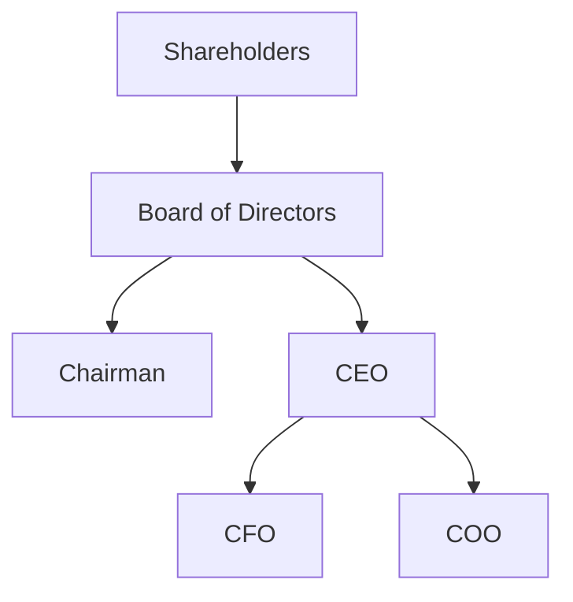

## 11.3 Corporate Structure and Management

In the world of corporate finance, understanding the structure and management of a corporation is crucial for navigating the complexities of business operations and governance. This section delves into the typical corporate hierarchy, the roles and responsibilities of key players, and the intricate relationship between shareholders and the board of directors. By the end of this section, you will have a comprehensive understanding of how corporations are structured and managed, particularly within the Canadian context.

### Corporate Hierarchy: An Overview

A corporation is a legal entity that is separate from its owners, providing a framework for organizing and managing business activities. The typical corporate hierarchy consists of three main levels: shareholders, the board of directors, and executive officers. Each level plays a distinct role in the governance and operation of the corporation.

#### Shareholders

Shareholders are the owners of the corporation, holding shares that represent a portion of the company's equity. They have the right to vote on major corporate decisions, such as the election of the board of directors, mergers, and amendments to the corporate charter. Shareholders' influence is proportional to the number of shares they own, giving them a vested interest in the company's performance and governance.

#### Board of Directors

The board of directors is a group elected by shareholders to oversee the management and major decisions of the corporation. The board acts as a fiduciary for the shareholders, ensuring that the company is managed in their best interests. The board's responsibilities include:

- Setting corporate policies and strategic direction.
- Appointing and evaluating executive officers.
- Approving major financial decisions, such as mergers, acquisitions, and capital expenditures.
- Ensuring compliance with legal and regulatory requirements.

The board is typically led by a chairman, who presides over meetings and guides corporate strategy. The chairman plays a crucial role in facilitating communication between the board and executive management.

#### Executive Officers

Executive officers are individuals appointed to manage the day-to-day operations of the corporation. Key executive roles include:

- **Chief Executive Officer (CEO):** The highest-ranking executive, responsible for overall corporate performance and strategic direction.
- **Chief Financial Officer (CFO):** Manages the corporation's financial planning, risk management, and financial reporting.
- **Chief Operating Officer (COO):** Oversees the corporation's operational functions, ensuring efficient and effective business processes.

These officers are responsible for implementing the board's strategic vision and managing the corporation's resources to achieve its goals.

### Roles and Responsibilities of Corporate Leaders

Understanding the specific roles and responsibilities of corporate leaders is essential for grasping how a corporation functions. Each leader plays a unique role in guiding the corporation towards its objectives.

#### Directors

Directors are elected by shareholders to represent their interests and oversee the corporation's management. Their primary responsibilities include:

- Attending board meetings and participating in decision-making processes.
- Reviewing and approving corporate strategies and budgets.
- Monitoring the performance of executive officers and ensuring accountability.

Directors must act in good faith and with due diligence, prioritizing the corporation's long-term success over personal interests.

#### Chairman

The chairman of the board is responsible for leading the board of directors and ensuring effective governance. Key duties include:

- Presiding over board meetings and setting the agenda.
- Facilitating communication between the board and executive management.
- Guiding the board in strategic planning and decision-making.

The chairman plays a pivotal role in maintaining a balance between the board's oversight responsibilities and the executive team's operational duties.

#### Executive Officers

Executive officers are tasked with executing the corporation's strategic plans and managing its operations. Their responsibilities include:

- Developing and implementing business strategies.
- Managing financial resources and ensuring fiscal responsibility.
- Leading organizational change and innovation.

These officers must work collaboratively with the board to align corporate goals with shareholder interests.

### The Relationship Between Shareholders and the Board

The relationship between shareholders and the board of directors is fundamental to corporate governance. Shareholders rely on the board to protect their interests and ensure the corporation's success. This relationship is characterized by several key elements:

#### Voting Rights

Shareholders exercise their influence through voting rights, which allow them to elect directors and approve major corporate actions. Voting rights are typically proportional to the number of shares owned, giving larger shareholders more influence over corporate decisions.

#### Election of Directors

The election of directors is a critical aspect of shareholder governance. Shareholders have the power to elect or remove directors, ensuring that the board remains accountable and aligned with their interests. This process is typically conducted at the corporation's annual general meeting (AGM), where shareholders vote on the board's composition.

### Practical Examples and Case Studies

To illustrate these concepts, consider the governance structure of a major Canadian bank, such as the Royal Bank of Canada (RBC). RBC's board of directors is composed of experienced professionals from diverse backgrounds, providing strategic oversight and guidance. The board works closely with the executive team, led by the CEO, to ensure that RBC's operations align with shareholder interests and regulatory requirements.

Another example is the governance practices of Canadian pension funds, which often prioritize long-term value creation and sustainability. These funds employ rigorous governance frameworks to manage their investments and protect the interests of their beneficiaries.

### Diagrams and Visual Aids

To enhance understanding, consider the following diagram illustrating the typical corporate hierarchy:

This diagram visually represents the flow of authority and responsibility within a corporation, highlighting the interconnected roles of shareholders, the board, and executive officers.

### Best Practices and Challenges

Effective corporate governance requires adherence to best practices and awareness of common challenges. Key best practices include:

- Ensuring diversity and independence on the board to enhance decision-making.
- Establishing clear communication channels between the board and executive management.
- Implementing robust risk management and compliance frameworks.

Common challenges include managing conflicts of interest, maintaining transparency, and adapting to regulatory changes. By addressing these challenges, corporations can strengthen their governance and achieve sustainable growth.

### References and Additional Resources

For further exploration of corporate governance and management, consider the following resources:

- [Canadian Federation of Independent Business - Corporate Governance](https://www.cfib-fcei.ca/en)
- Books on corporate governance and management, such as "Corporate Governance in Canada" by Anita Anand.
- Online courses on corporate finance and governance, available through platforms like Coursera and edX.

### Conclusion

Understanding corporate structure and management is essential for navigating the complexities of the business world. By grasping the roles and responsibilities of key players and the relationship between shareholders and the board, you can better appreciate the intricacies of corporate governance. This knowledge is invaluable for making informed investment decisions and contributing to the success of the corporations you engage with.

### **Ready to Test Your Knowledge?**

**Practice 10 Essential CSC Exam Questions to Master Your Certification**



### Which group is responsible for overseeing the management and major decisions of a corporation?

- [x] Board of Directors
- [ ] Shareholders
- [ ] Executive Officers
- [ ] Employees

> **Explanation:** The board of directors is elected by shareholders to oversee the management and major decisions of the corporation.

### What is the primary role of shareholders in a corporation?

- [x] To vote on major corporate decisions
- [ ] To manage day-to-day operations
- [ ] To set corporate policies
- [ ] To appoint executive officers

> **Explanation:** Shareholders have the right to vote on major corporate decisions, such as the election of the board of directors.

### Who is responsible for presiding over board meetings and guiding corporate strategy?

- [x] Chairman
- [ ] CEO
- [ ] CFO
- [ ] COO

> **Explanation:** The chairman is responsible for presiding over board meetings and guiding corporate strategy.

### What is the role of the Chief Financial Officer (CFO)?

- [x] To manage the corporation's financial planning and reporting
- [ ] To oversee operational functions
- [ ] To lead the board of directors
- [ ] To vote on corporate decisions

> **Explanation:** The CFO manages the corporation's financial planning, risk management, and financial reporting.

### How do shareholders influence corporate decisions?

- [x] Through voting rights
- [ ] By managing operations
- [x] By electing directors
- [ ] By setting policies

> **Explanation:** Shareholders influence corporate decisions through voting rights and by electing directors to represent their interests.

### What is a common challenge in corporate governance?

- [x] Managing conflicts of interest
- [ ] Setting corporate policies
- [ ] Presiding over meetings
- [ ] Developing business strategies

> **Explanation:** Managing conflicts of interest is a common challenge in corporate governance, requiring transparency and accountability.

### Which of the following is a best practice for effective corporate governance?

- [x] Ensuring board diversity
- [ ] Limiting shareholder voting rights
- [x] Establishing clear communication channels
- [ ] Reducing board independence

> **Explanation:** Ensuring board diversity and establishing clear communication channels are best practices for effective corporate governance.

### What is the primary responsibility of executive officers?

- [x] To manage day-to-day operations
- [ ] To elect the board of directors
- [ ] To vote on major decisions
- [ ] To oversee the board

> **Explanation:** Executive officers are responsible for managing the corporation's day-to-day operations and implementing strategic plans.

### What is the role of the Chief Operating Officer (COO)?

- [x] To oversee operational functions
- [ ] To manage financial planning
- [ ] To lead the board of directors
- [ ] To preside over meetings

> **Explanation:** The COO oversees the corporation's operational functions, ensuring efficient and effective business processes.

### True or False: Shareholders have the power to remove directors.

- [x] True
- [ ] False

> **Explanation:** Shareholders have the power to elect or remove directors, ensuring that the board remains accountable and aligned with their interests.


