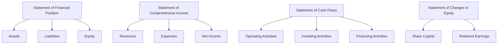

## Glossary for Chapter 11: Corporations and their Financial Statements

Understanding the financial statements of corporations is crucial for anyone involved in finance, investment, or business management. Chapter 11 of the CSC® Exam Prep Guide delves into the intricacies of corporate financial statements, and this glossary serves as a comprehensive reference tool to clarify key terms and concepts. By familiarizing yourself with these terms, you can enhance your ability to analyze financial statements and make informed investment decisions.

### Comprehensive Definitions

#### Amortization
Amortization refers to the process of gradually writing off the initial cost of an intangible asset over its useful life. This accounting method helps in matching the asset's cost with the revenue it generates. For example, a company may amortize the cost of a patent over its 20-year legal life.

#### Equity
Equity represents the shareholders' residual interest in the company's assets after deducting liabilities. It is a crucial measure of a company's financial health and can be calculated as the difference between total assets and total liabilities. Equity is often referred to as shareholders' equity or owners' equity.

#### Goodwill
Goodwill is an intangible asset that arises when a company acquires another business for a price higher than the fair value of its identifiable net assets. It reflects the value of a company's brand, customer relationships, and other non-quantifiable assets. For instance, if Company A buys Company B for $1 million, but the fair value of Company B's net assets is $800,000, the $200,000 difference is recorded as goodwill.

#### Liquidity
Liquidity measures a company's ability to meet its short-term obligations using its most liquid assets. High liquidity indicates that a company can easily convert assets into cash to pay off debts, which is vital for maintaining financial stability. Common liquidity ratios include the current ratio and quick ratio.

#### Non-controlling Interest
Non-controlling interest, also known as minority interest, represents the portion of equity in a subsidiary not attributable to the parent company. It reflects the ownership stake held by other investors in the subsidiary. This is important for consolidated financial statements, where the parent company must account for these interests.

#### Retained Earnings
Retained earnings are the accumulated net income that a company retains for reinvestment in its business rather than distributing as dividends. This figure is crucial for assessing a company's growth potential and financial strategy. Retained earnings are reported on the statement of changes in equity.

#### Share Capital
Share capital refers to the funds a company raises by issuing shares to investors. It represents the equity stake of shareholders in the company and is a key component of a company's capital structure. Share capital can be divided into common and preferred shares, each with different rights and privileges.

#### Statement of Cash Flows
The statement of cash flows provides aggregate data regarding all cash inflows and outflows a company receives from its operating, investing, and financing activities. This statement is essential for understanding a company's liquidity and financial flexibility.

#### Statement of Comprehensive Income
The statement of comprehensive income shows a company's revenues, expenses, and profits or losses over a specific period. It provides a detailed view of a company's financial performance, including items not typically included in the income statement, such as unrealized gains or losses on investments.

#### Statement of Financial Position
Also known as the balance sheet, the statement of financial position summarizes a company's assets, liabilities, and equity at a specific point in time. It provides a snapshot of the company's financial condition and is a fundamental tool for financial analysis.

#### Statement of Changes in Equity
The statement of changes in equity shows the changes in the interests of the company's shareholders over time. It includes information on share capital, retained earnings, and other components of equity, providing insights into how a company's equity has evolved.

#### Current Asset
A current asset is an asset that can be converted into cash within one year. Examples include cash, accounts receivable, and inventory. Current assets are crucial for assessing a company's short-term financial health and liquidity.

#### Non-current Asset
A non-current asset, also known as a long-term asset, is not expected to be converted to cash within one year. These assets include property, plant, equipment, and intangible assets like patents. Non-current assets are vital for a company's long-term growth and operational capacity.

#### Deferred Tax Liability
A deferred tax liability is an obligation to pay taxes in the future due to temporary differences between accounting and tax bases. This liability arises when a company's taxable income is less than its accounting income, resulting in taxes being deferred to future periods.

#### Operating Activities
Operating activities encompass the cash flows related to the primary activities of a business, such as selling products or services. These activities are crucial for assessing a company's core business performance and its ability to generate cash flow from operations.

#### Financing Activities
Financing activities involve cash flows resulting from changes in the company's capital structure, such as issuing or repurchasing shares and borrowing or repaying debt. These activities provide insights into how a company finances its operations and growth.

#### Investing Activities
Investing activities include cash flows related to the acquisition and disposal of long-term assets and other investments. These activities reflect a company's investment strategy and its ability to generate returns from its investments.

#### Hedging
Hedging involves using financial derivatives to offset potential losses in other investments. This risk management strategy is essential for protecting a company's financial position from adverse market movements. For example, a Canadian exporter might use currency futures to hedge against fluctuations in the exchange rate.

#### Shareholder
A shareholder is an individual or institution that owns shares in a corporation. Shareholders have a claim on the company's assets and earnings and may receive dividends and voting rights, depending on the type of shares they hold.

#### Trade Receivables
Trade receivables are amounts owed to a business by its customers for goods or services purchased on credit. They are a key component of a company's working capital and liquidity management.

#### Trade Payables
Trade payables are amounts a business owes to its suppliers for items or services purchased on credit. Managing trade payables is crucial for maintaining good supplier relationships and optimizing cash flow.

#### Inventory
Inventory consists of the goods available for sale and raw materials used to produce goods available for sale. Effective inventory management is vital for minimizing costs and meeting customer demand.

#### Insider
An insider is an individual with access to non-public, material information about a company. Insiders include executives, directors, and employees with privileged information. Insider trading regulations are in place to prevent the misuse of such information.

#### Downturn
A downturn is a period when the economy, a business sector, or an individual business is performing poorly. Understanding downturns is crucial for developing strategies to mitigate risks and capitalize on opportunities during challenging economic times.

#### Change in Net Working Capital
The change in net working capital represents the difference in a company's short-term assets and liabilities from one accounting period to the next. It is a key indicator of a company's operational efficiency and liquidity management.

### Reference Tool

This glossary serves as a quick reference to enhance your understanding of Chapter 11's financial and corporate terminology. By integrating these terms into your study routine, you can deepen your comprehension of corporate financial statements and improve your ability to analyze and interpret financial data.

### Application in Learning

To fully grasp the concepts introduced in Chapter 11, consider applying these glossary terms in practical financial statement analysis and investment assessment. For example, practice calculating liquidity ratios using real-world financial statements from Canadian companies like RBC or TD. Analyze how changes in retained earnings impact a company's growth strategy or how non-controlling interests affect consolidated financial statements.

### Visual Aids

To further enhance your understanding, consider the following diagram illustrating the relationship between key financial statements:

This diagram provides a visual representation of how different financial statements interconnect, offering a holistic view of a company's financial health.

## Quiz Time!



### What is amortization?

- [x] The process of spreading an intangible asset's cost over its useful life.
- [ ] The process of spreading a tangible asset's cost over its useful life.
- [ ] The process of spreading a liability's cost over its useful life.
- [ ] The process of spreading equity's cost over its useful life.

> **Explanation:** Amortization specifically refers to intangible assets, unlike depreciation, which applies to tangible assets.

### What does equity represent in a company's financial statements?

- [x] Shareholders’ residual interest in the company's assets after liabilities are deducted.
- [ ] The total assets of the company.
- [ ] The total liabilities of the company.
- [ ] The company's cash reserves.

> **Explanation:** Equity is the residual interest in the assets of the entity after deducting liabilities, reflecting the ownership interest of shareholders.

### How is goodwill recorded on the balance sheet?

- [x] As an intangible asset.
- [ ] As a liability.
- [ ] As equity.
- [ ] As a current asset.

> **Explanation:** Goodwill is an intangible asset that arises when a company acquires another business for more than the fair value of its net assets.

### What does liquidity measure?

- [x] The ability of a company to meet its short-term obligations.
- [ ] The ability of a company to meet its long-term obligations.
- [ ] The profitability of a company.
- [ ] The market share of a company.

> **Explanation:** Liquidity measures a company's ability to quickly convert assets into cash to meet short-term liabilities.

### What is non-controlling interest?

- [x] The portion of equity in subsidiaries not attributable to the parent company.
- [ ] The portion of equity in subsidiaries attributable to the parent company.
- [ ] The total equity of the parent company.
- [ ] The total liabilities of the parent company.

> **Explanation:** Non-controlling interest represents the equity interest in a subsidiary not owned by the parent company.

### What are retained earnings?

- [x] Accumulated net income that is retained for reinvestment in the business.
- [ ] The initial capital invested by shareholders.
- [ ] The total revenue of the company.
- [ ] The total expenses of the company.

> **Explanation:** Retained earnings are the portion of net income not distributed as dividends but reinvested in the company.

### What does the statement of cash flows provide?

- [x] Aggregate data regarding all cash inflows and outflows a company receives.
- [ ] A summary of a company's assets, liabilities, and equity.
- [ ] A detailed list of a company's revenues and expenses.
- [ ] A record of changes in a company's equity.

> **Explanation:** The statement of cash flows details cash movements from operating, investing, and financing activities.

### What is a current asset?

- [x] An asset that can be converted into cash within one year.
- [ ] An asset that cannot be converted into cash within one year.
- [ ] An asset that is always in cash form.
- [ ] An asset that is intangible.

> **Explanation:** Current assets are expected to be converted to cash or used up within one year.

### What is the purpose of hedging?

- [x] To offset potential losses in other investments.
- [ ] To increase potential gains in other investments.
- [ ] To eliminate all risks in investments.
- [ ] To diversify investment portfolios.

> **Explanation:** Hedging is a risk management strategy used to offset potential losses in investments.

### True or False: A downturn is a period when the economy is performing exceptionally well.

- [ ] True
- [x] False

> **Explanation:** A downturn refers to a period when the economy or a business is performing poorly, not well.



By mastering these terms and concepts, you will be better equipped to analyze corporate financial statements and make informed investment decisions. Continue exploring additional resources and case studies to deepen your understanding of financial statements and their implications in the Canadian financial landscape.
