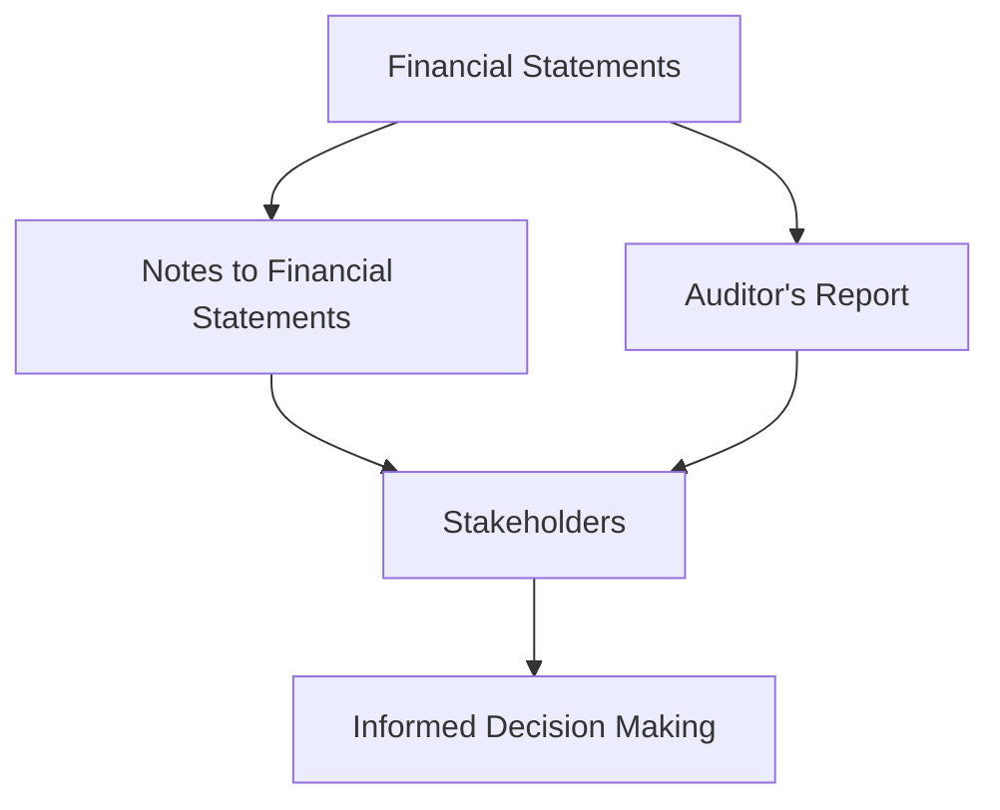

## 11.8 Annual Report Components

In the realm of corporate finance, annual reports serve as a crucial tool for stakeholders to assess a corporation's financial health and operational performance. Two pivotal components of an annual report are the Notes to Financial Statements and the Auditor’s Report. These elements provide essential context and validation to the financial data presented, ensuring transparency and reliability. This section delves into these components, highlighting their significance and illustrating their roles with practical examples.

### Notes to Financial Statements

**Definition:** The Notes to Financial Statements are supplementary details that provide additional context and explanations for the figures presented in the financial statements. They are integral to understanding the full scope of a corporation's financial activities.

#### Importance of Notes to Financial Statements

The Notes to Financial Statements are indispensable for several reasons:

1. **Clarification and Detail:** They offer detailed explanations of accounting policies, methodologies, and assumptions used in preparing the financial statements. This includes information on revenue recognition, inventory valuation, and depreciation methods.

2. **Disclosure of Contingencies and Liabilities:** Notes reveal potential liabilities or contingencies that may not be immediately apparent in the financial statements, such as pending litigation or environmental obligations.

3. **Insight into Financial Instruments:** They provide information on the nature and extent of financial instruments, including derivatives and hedging activities, which are crucial for assessing risk exposure.

4. **Segment Reporting:** For diversified companies, notes often include segment reporting, which breaks down financial performance by business unit or geographic area, offering a more granular view of operations.

#### Example: Canadian Pension Fund

Consider a Canadian pension fund that invests in a mix of equities, bonds, and alternative assets. The Notes to Financial Statements might detail the valuation techniques used for illiquid assets, such as private equity holdings, and disclose any changes in accounting policies that could impact comparability with previous periods.

### Auditor’s Report

**Definition:** The Auditor’s Report is an independent opinion provided by external auditors on the fairness and accuracy of a corporation's financial statements. It serves as a critical assurance mechanism for stakeholders.

#### Importance of the Auditor’s Report

The Auditor’s Report is vital for several reasons:

1. **Assurance of Accuracy:** It provides stakeholders with confidence that the financial statements are free from material misstatements, whether due to fraud or error.

2. **Compliance with Standards:** The report confirms that the financial statements have been prepared in accordance with applicable accounting standards, such as International Financial Reporting Standards (IFRS) in Canada.

3. **Identification of Issues:** An auditor’s report may highlight significant issues or areas of concern, such as going concern uncertainties or significant deficiencies in internal controls.

4. **Enhancing Credibility:** A clean auditor’s report enhances the credibility of the financial statements, which is crucial for investor confidence and access to capital markets.

#### Example: Major Canadian Bank

For a major Canadian bank like RBC, the Auditor’s Report might emphasize the bank's adherence to IFRS and highlight any significant changes in accounting policies or estimates that could affect the financial results. This report reassures investors about the bank's financial integrity and operational soundness.

### Practical Financial Examples and Case Studies

#### Case Study: TD Bank

TD Bank's annual report includes comprehensive Notes to Financial Statements that detail its risk management strategies, including credit risk, market risk, and liquidity risk. These notes provide investors with a deeper understanding of how the bank manages its financial exposures.

The Auditor’s Report for TD Bank, issued by a reputable auditing firm, confirms the bank's compliance with IFRS and provides an unqualified opinion, indicating that the financial statements present a true and fair view of the bank's financial position.

#### Diagram: Relationship Between Financial Statements, Notes, and Auditor’s Report

### Best Practices and Common Pitfalls

#### Best Practices

- **Comprehensive Disclosure:** Ensure that notes provide comprehensive disclosure of accounting policies and significant estimates.
- **Clear and Concise Language:** Use clear and concise language in notes to enhance understanding.
- **Regular Updates:** Regularly update notes to reflect changes in accounting standards or business operations.

#### Common Pitfalls

- **Omission of Key Information:** Failing to disclose critical information in notes can mislead stakeholders.
- **Complex Language:** Using overly technical language can obscure important details.
- **Inconsistency:** Inconsistencies between notes and financial statements can undermine credibility.

### References and Additional Resources

- **Public Company Accounting Oversight Board (PCAOB):** [PCAOB](https://pcaobus.org/)
- **International Financial Reporting Standards (IFRS):** [IFRS](https://www.ifrs.org/)
- **Canadian Securities Administrators (CSA):** [CSA](https://www.securities-administrators.ca/)

### Encouragement for Application

Understanding the components of an annual report is crucial for making informed investment decisions. By analyzing the Notes to Financial Statements and the Auditor’s Report, investors can gain a comprehensive view of a corporation's financial health and operational integrity. Apply these insights to evaluate potential investments, ensuring alignment with your financial goals and risk tolerance.

### **Ready to Test Your Knowledge?**

**Practice 10 Essential CSC Exam Questions to Master Your Certification**



### What is the primary purpose of the Notes to Financial Statements?

- [x] To provide additional context and explanations for the figures in the financial statements
- [ ] To summarize the financial performance of the company
- [ ] To replace the financial statements
- [ ] To provide a forecast of future financial performance

> **Explanation:** The Notes to Financial Statements offer supplementary information that provides details about the figures in the financial statements.

### Which of the following is a key component of an Auditor’s Report?

- [x] An independent opinion on the fairness and accuracy of the financial statements
- [ ] A summary of the company’s financial performance
- [ ] A detailed analysis of market trends
- [ ] A forecast of future earnings

> **Explanation:** The Auditor’s Report provides an independent opinion on the fairness and accuracy of the financial statements.

### Why are the Notes to Financial Statements important?

- [x] They clarify accounting policies and disclose potential liabilities
- [ ] They provide a summary of the company’s history
- [ ] They offer a forecast of future performance
- [ ] They replace the financial statements

> **Explanation:** The Notes to Financial Statements clarify accounting policies and disclose potential liabilities, offering a deeper understanding of the financial statements.

### What assurance does an Auditor’s Report provide?

- [x] That the financial statements are free from material misstatements
- [ ] That the company will perform well in the future
- [ ] That the company has no liabilities
- [ ] That the company is the market leader

> **Explanation:** The Auditor’s Report assures stakeholders that the financial statements are free from material misstatements.

### How do the Notes to Financial Statements enhance understanding?

- [x] By providing detailed explanations of accounting policies and assumptions
- [ ] By summarizing the company’s history
- [x] By disclosing potential liabilities and contingencies
- [ ] By offering a forecast of future performance

> **Explanation:** The Notes to Financial Statements enhance understanding by providing detailed explanations of accounting policies and disclosing potential liabilities.

### What is a common pitfall in preparing Notes to Financial Statements?

- [x] Omission of key information
- [ ] Providing too much detail
- [ ] Using simple language
- [ ] Including forecasts

> **Explanation:** A common pitfall is the omission of key information, which can mislead stakeholders.

### What does a clean Auditor’s Report indicate?

- [x] That the financial statements present a true and fair view
- [ ] That the company will perform well in the future
- [x] That the financial statements are free from material misstatements
- [ ] That the company is the market leader

> **Explanation:** A clean Auditor’s Report indicates that the financial statements present a true and fair view and are free from material misstatements.

### Which of the following is a benefit of segment reporting in the Notes to Financial Statements?

- [x] It provides a more granular view of operations
- [ ] It summarizes the company’s history
- [ ] It offers a forecast of future performance
- [ ] It replaces the financial statements

> **Explanation:** Segment reporting provides a more granular view of operations, enhancing understanding of the company’s performance.

### What role does the Auditor’s Report play in financial reporting?

- [x] It enhances the credibility of the financial statements
- [ ] It provides a forecast of future performance
- [ ] It summarizes the company’s history
- [ ] It replaces the financial statements

> **Explanation:** The Auditor’s Report enhances the credibility of the financial statements, which is crucial for investor confidence.

### True or False: The Notes to Financial Statements can replace the financial statements.

- [ ] True
- [x] False

> **Explanation:** False. The Notes to Financial Statements provide supplementary information and cannot replace the financial statements.


