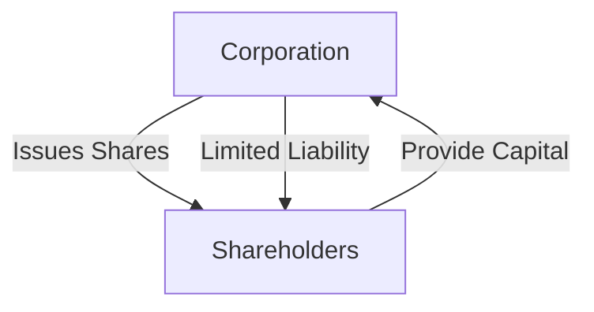

## Chapter 11: Corporations and their Financial Statements

In this chapter, we delve into the world of corporations and their financial statements, a crucial component of the Canadian Securities Course (CSC®). Understanding how corporations operate, their financial reporting mechanisms, and the regulatory environment is essential for anyone involved in the financial services industry. This chapter will guide you through the various business structures, the advantages and disadvantages of incorporation, and the intricacies of corporate financial statements.

### Understanding Business Structures

Before diving into corporations, it's important to understand the three primary types of business structures: sole proprietorship, partnership, and corporation. Each has distinct characteristics, advantages, and disadvantages.

#### Sole Proprietorship

A sole proprietorship is the simplest form of business structure, owned and operated by a single individual. It is easy to establish and offers complete control to the owner. However, the owner is personally liable for all business debts and obligations, which can be a significant risk.

#### Partnership

A partnership involves two or more individuals who share ownership of a business. Partnerships can be general or limited, with varying degrees of liability and involvement in management. While partnerships allow for shared resources and expertise, they also require clear agreements to manage potential conflicts and liabilities.

#### Corporation

A corporation is a separate legal entity distinct from its shareholders. This separation provides limited liability protection, meaning shareholders are not personally liable for the corporation's debts. Corporations can raise capital more easily through the sale of shares and have perpetual existence, continuing beyond the involvement of the original owners.

### Corporations as Separate Legal Entities

Corporations operate independently from their shareholders, allowing them to enter into contracts, own assets, and incur liabilities. This separation is a key advantage, as it protects shareholders' personal assets from business risks. Additionally, corporations can benefit from tax advantages and have greater access to capital markets.

#### Advantages of Incorporation

1. **Limited Liability**: Shareholders are only liable for their investment in the corporation.
2. **Access to Capital**: Corporations can issue shares to raise funds.
3. **Perpetual Existence**: Corporations continue to exist regardless of changes in ownership.
4. **Tax Benefits**: Potential for lower tax rates and deferral of taxes.
5. **Credibility**: Incorporation can enhance a business's credibility with customers and suppliers.

#### Disadvantages of Incorporation

1. **Complexity and Cost**: Incorporation involves legal and administrative costs.
2. **Regulatory Compliance**: Corporations must adhere to strict regulatory requirements.
3. **Double Taxation**: Profits may be taxed at both the corporate and shareholder levels.
4. **Loss of Control**: Shareholders may have limited influence over management decisions.

### Financial Statements of Corporations

Corporations use financial statements to report their financial performance and position. These statements are essential for investors, regulators, and other stakeholders to assess the corporation's health and make informed decisions.

#### Key Financial Statements

1. **Income Statement**: Shows the corporation's revenues, expenses, and profits over a specific period. It provides insights into operational efficiency and profitability.

2. **Balance Sheet**: Presents the corporation's assets, liabilities, and shareholders' equity at a specific point in time. It offers a snapshot of the company's financial position.

3. **Cash Flow Statement**: Details the inflows and outflows of cash, highlighting the corporation's liquidity and financial flexibility.

4. **Statement of Changes in Equity**: Reflects changes in shareholders' equity, including retained earnings and share capital.

#### Components of a Corporation’s Annual Report

An annual report provides a comprehensive overview of a corporation's activities and financial performance. Key components include:

- **Management Discussion and Analysis (MD&A)**: Offers management's perspective on financial results and future outlook.
- **Financial Statements**: Includes the income statement, balance sheet, cash flow statement, and statement of changes in equity.
- **Auditor’s Report**: An independent auditor's opinion on the accuracy and fairness of the financial statements.

### Public Company Disclosures and Regulations

Public companies in Canada are subject to stringent disclosure requirements to ensure transparency and protect investors. Key regulations include:

#### Takeover Bids

A takeover bid involves an offer to purchase shares of a corporation to gain control. Canadian regulations require disclosure of such bids to ensure fairness and transparency.

#### Insider Trading Regulations

Insider trading involves buying or selling securities based on non-public information. Canadian regulations prohibit insider trading to maintain market integrity and investor confidence.

### Practical Examples and Case Studies

To illustrate these concepts, consider the following examples:

- **Case Study: RBC's Annual Report**: Analyze the Royal Bank of Canada's annual report to understand how a major Canadian bank presents its financial statements and disclosures.

- **Example: Incorporation Benefits for a Tech Startup**: Explore how a Canadian tech startup benefits from incorporation, including access to venture capital and limited liability protection.

### Diagrams and Visual Aids

To enhance understanding, let's use a diagram to illustrate the relationship between a corporation and its shareholders:

### Best Practices and Common Challenges

- **Best Practices**: Ensure accurate and timely financial reporting, maintain compliance with regulations, and engage with stakeholders transparently.
- **Common Challenges**: Navigating complex regulatory environments, managing shareholder expectations, and maintaining financial integrity.

### Further Resources

For those interested in exploring these topics further, consider the following resources:

- **Books**: "Financial Statement Analysis" by Martin S. Fridson and Fernando Alvarez.
- **Online Courses**: "Corporate Finance Essentials" on Coursera.
- **Regulatory Bodies**: Visit the Canadian Securities Administrators (CSA) website for up-to-date regulations.

### Summary

Understanding corporations and their financial statements is crucial for anyone involved in the financial services industry. By grasping the advantages and challenges of incorporation, the components of financial statements, and the regulatory environment, you can make informed decisions and provide valuable insights to clients and stakeholders.

## Quiz Time!



### Which business structure offers the owner complete control but also personal liability for debts?

- [x] Sole Proprietorship
- [ ] Partnership
- [ ] Corporation
- [ ] Limited Liability Company

> **Explanation:** A sole proprietorship is owned and operated by a single individual, offering complete control but also personal liability for business debts.

### What is a key advantage of incorporating a business?

- [x] Limited Liability
- [ ] Simplicity
- [ ] No regulatory compliance
- [ ] Personal tax benefits

> **Explanation:** Incorporation provides limited liability protection, meaning shareholders are not personally liable for the corporation's debts.

### Which financial statement provides a snapshot of a corporation's financial position at a specific point in time?

- [ ] Income Statement
- [x] Balance Sheet
- [ ] Cash Flow Statement
- [ ] Statement of Changes in Equity

> **Explanation:** The balance sheet presents the corporation's assets, liabilities, and shareholders' equity at a specific point in time.

### What is the purpose of the auditor's report in a corporation's annual report?

- [x] To provide an independent opinion on the accuracy and fairness of the financial statements
- [ ] To offer management's perspective on financial results
- [ ] To detail cash inflows and outflows
- [ ] To present changes in shareholders' equity

> **Explanation:** The auditor's report provides an independent opinion on the accuracy and fairness of the financial statements.

### Which regulation prohibits buying or selling securities based on non-public information?

- [x] Insider Trading Regulations
- [ ] Takeover Bid Regulations
- [ ] Disclosure Requirements
- [ ] Financial Reporting Standards

> **Explanation:** Insider trading regulations prohibit buying or selling securities based on non-public information to maintain market integrity.

### What is a disadvantage of incorporating a business?

- [x] Complexity and Cost
- [ ] Unlimited Liability
- [ ] Lack of credibility
- [ ] Limited access to capital

> **Explanation:** Incorporation involves legal and administrative costs, making it more complex and costly than other business structures.

### Which component of an annual report offers management's perspective on financial results and future outlook?

- [ ] Auditor’s Report
- [x] Management Discussion and Analysis (MD&A)
- [ ] Financial Statements
- [ ] Statement of Changes in Equity

> **Explanation:** The MD&A offers management's perspective on financial results and future outlook.

### What is a takeover bid?

- [x] An offer to purchase shares of a corporation to gain control
- [ ] A report on financial performance
- [ ] A type of financial statement
- [ ] A regulatory requirement

> **Explanation:** A takeover bid involves an offer to purchase shares of a corporation to gain control.

### Which statement details the inflows and outflows of cash for a corporation?

- [ ] Income Statement
- [ ] Balance Sheet
- [x] Cash Flow Statement
- [ ] Statement of Changes in Equity

> **Explanation:** The cash flow statement details the inflows and outflows of cash, highlighting the corporation's liquidity.

### True or False: Corporations have perpetual existence, continuing beyond the involvement of the original owners.

- [x] True
- [ ] False

> **Explanation:** Corporations have perpetual existence, meaning they continue to exist regardless of changes in ownership.


