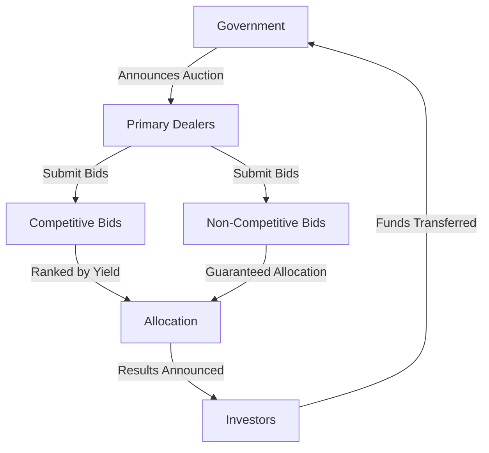

## 12.1.1 Government Financing

Government financing is a critical aspect of national economic management, involving the issuance of securities to fund public expenditures. In Canada, this process is primarily conducted through auctions, where government securities are sold to investors. Understanding the mechanisms of these auctions, the roles of fiscal agents, and the types of bids involved is essential for finance professionals navigating the Canadian securities landscape.

### Debt Issuance through Auctions

The Canadian government raises funds by issuing debt securities, such as bonds and treasury bills, through a well-structured auction process. This process ensures transparency, efficiency, and market-driven pricing.

#### Auction Process for Government Securities

The auction process for government securities involves two main types of bids: competitive and non-competitive. Each plays a distinct role in determining the allocation and pricing of the securities.

- **Competitive Bids:** In a competitive bid, the bidder specifies the yield (interest rate) they are willing to accept. These bids are ranked from the lowest to the highest yield, and securities are allocated starting with the lowest yield until the entire issue is sold. This method allows the market to determine the yield, ensuring that the government receives the best possible terms.

- **Non-Competitive Bids:** Non-competitive bidders agree to accept the yield determined by the competitive bidding process. This type of bid guarantees the bidder a certain allocation of securities, making it attractive for smaller investors or those seeking certainty in their investment.

#### Role of Primary Dealers

Primary dealers are financial institutions authorized to participate directly in government securities auctions. They play a crucial role in the distribution and liquidity of government debt. In Canada, primary dealers are responsible for:

- Submitting bids on behalf of themselves and their clients.
- Providing liquidity in the secondary market by buying and selling government securities.
- Offering market insights and feedback to the government, helping to shape future debt issuance strategies.

### Fiscal Agents

Fiscal agents are intermediaries appointed by the government to manage the issuance and servicing of government securities. In Canada, the Bank of Canada often acts as the fiscal agent for the federal government.

#### Role of Fiscal Agents

Fiscal agents perform several key functions in the government financing process:

- **Structuring Debt Instruments:** They assist in designing the terms and conditions of the securities, ensuring they meet market demands and government financing needs.

- **Pricing Debt Instruments:** Fiscal agents help determine the initial pricing of securities, balancing the government's cost of borrowing with investor demand.

- **Managing Auctions:** They oversee the auction process, ensuring it runs smoothly and efficiently, and that all participants adhere to the rules and regulations.

### Example of Government Auction

To illustrate the auction process, consider a scenario where the Canadian government issues $1 billion in 10-year bonds through a competitive tender.

1. **Announcement:** The government announces the auction details, including the amount, maturity, and auction date.

2. **Bid Submission:** Primary dealers submit both competitive and non-competitive bids. For example, a competitive bidder might offer to purchase $100 million at a yield of 2.5%, while a non-competitive bidder agrees to accept the auction-determined yield.

3. **Allocation:** Bids are ranked by yield, starting with the lowest. If the lowest yield bid is 2.4%, those bidders receive their requested allocation. This process continues until the entire $1 billion is allocated.

4. **Result Announcement:** The government announces the auction results, including the cut-off yield and total amount allocated.

5. **Settlement:** Successful bidders pay for their securities, and the government receives the funds.

### Glossary

- **Fiscal Agent:** An intermediary appointed by the government to manage the issuance and servicing of government securities.
- **Competitive Bid:** A bid where the bidder specifies the yield at which they are willing to purchase the securities.
- **Non-Competitive Bid:** A bid where the bidder agrees to accept the yield determined by the auction.

### Diagrams and Visuals

To further illustrate these concepts, consider the following diagram showing the flow of a government securities auction:

### Best Practices and Challenges

When participating in government securities auctions, consider the following best practices and potential challenges:

- **Best Practices:**
  - Stay informed about market conditions and government announcements.
  - Understand the differences between competitive and non-competitive bids.
  - Leverage the expertise of primary dealers and fiscal agents.

- **Challenges:**
  - Navigating volatile market conditions that can affect yields.
  - Ensuring compliance with regulatory requirements.
  - Managing the risks associated with interest rate fluctuations.

### Conclusion

Government financing through debt issuance is a cornerstone of fiscal policy, enabling the government to fund essential services and projects. By understanding the auction process, the roles of fiscal agents and primary dealers, and the intricacies of competitive and non-competitive bids, finance professionals can effectively navigate this complex landscape. As you apply these principles, consider how they impact your investment strategies and financial planning within the Canadian market.

## Quiz Time!



### What is a competitive bid in a government securities auction?

- [x] A bid where the bidder specifies the yield they are willing to accept.
- [ ] A bid where the bidder agrees to accept the auction-determined yield.
- [ ] A bid submitted by non-primary dealers.
- [ ] A bid that guarantees allocation of securities.

> **Explanation:** A competitive bid involves specifying the yield at which the bidder is willing to purchase the securities, allowing the market to determine the yield.

### What role do primary dealers play in government securities auctions?

- [x] Submitting bids on behalf of themselves and their clients.
- [ ] Acting as fiscal agents for the government.
- [ ] Setting the yield for non-competitive bids.
- [ ] Managing the auction process.

> **Explanation:** Primary dealers submit bids and provide liquidity in the secondary market, but they do not manage the auction process or act as fiscal agents.

### What is the main advantage of a non-competitive bid?

- [x] Guaranteed allocation of securities.
- [ ] Ability to specify the yield.
- [ ] Lower transaction costs.
- [ ] Higher potential returns.

> **Explanation:** Non-competitive bids guarantee allocation of securities, as the bidder agrees to accept the yield determined by the auction.

### Who often acts as the fiscal agent for the Canadian government?

- [x] The Bank of Canada
- [ ] Primary dealers
- [ ] The Department of Finance
- [ ] Private investment banks

> **Explanation:** The Bank of Canada often acts as the fiscal agent, managing the issuance and servicing of government securities.

### In a government auction, what happens after bids are ranked by yield?

- [x] Securities are allocated starting with the lowest yield.
- [ ] The highest yield bids are allocated first.
- [ ] Non-competitive bids are rejected.
- [ ] The auction is canceled if yields are too high.

> **Explanation:** Securities are allocated starting with the lowest yield to ensure the government receives the best possible terms.

### What is the primary function of a fiscal agent?

- [x] Managing the issuance and servicing of government securities.
- [ ] Setting the yield for competitive bids.
- [ ] Acting as a primary dealer.
- [ ] Conducting monetary policy.

> **Explanation:** Fiscal agents manage the issuance and servicing of government securities, assisting in structuring and pricing debt instruments.

### What is a key challenge in government securities auctions?

- [x] Navigating volatile market conditions.
- [ ] Guaranteeing high yields for investors.
- [ ] Ensuring all bids are competitive.
- [ ] Reducing the number of primary dealers.

> **Explanation:** Volatile market conditions can affect yields and investor demand, posing a challenge in government securities auctions.

### How do fiscal agents assist in government financing?

- [x] Structuring and pricing debt instruments.
- [ ] Submitting bids on behalf of investors.
- [ ] Providing liquidity in the secondary market.
- [ ] Conducting the auction process.

> **Explanation:** Fiscal agents assist in structuring and pricing debt instruments, ensuring they meet market demands and government financing needs.

### What is the outcome of a government auction?

- [x] The government receives funds from successful bidders.
- [ ] The government sets the yield for future auctions.
- [ ] All non-competitive bids are rejected.
- [ ] Primary dealers are eliminated from the process.

> **Explanation:** Successful bidders pay for their securities, and the government receives the funds, completing the auction process.

### True or False: Non-competitive bids specify the yield at which the bidder is willing to purchase securities.

- [ ] True
- [x] False

> **Explanation:** Non-competitive bids do not specify the yield; instead, bidders agree to accept the yield determined by the auction.


