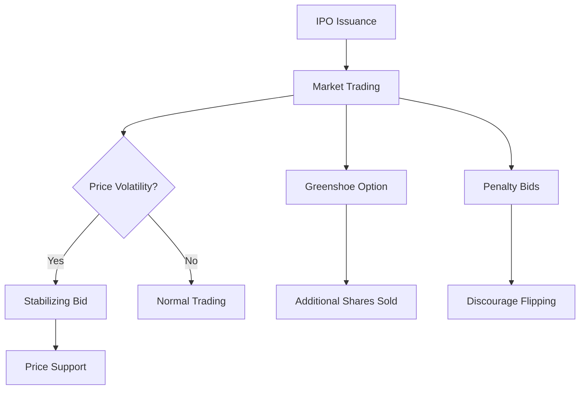

## 12.9 After-Market Stabilization

In the dynamic world of securities, the period immediately following the issuance of new shares is crucial. After-market stabilization plays a pivotal role in ensuring that the security prices remain stable, protecting both the issuer and the investors. This section delves into the mechanisms and strategies employed by lead dealers to support security prices post-issuance, with a particular focus on the Canadian financial landscape.

### The Role of Lead Dealers

Lead dealers, often referred to as underwriters, are instrumental in the initial public offering (IPO) process. Their responsibilities extend beyond the issuance of securities to include stabilizing the market price of a newly issued security. This stabilization is vital to prevent excessive volatility, which can undermine investor confidence and the perceived value of the security.

In Canada, lead dealers are typically large financial institutions such as RBC Capital Markets or TD Securities. These institutions leverage their expertise and resources to manage the delicate balance between supply and demand in the immediate aftermath of a security's issuance.

### Methods of After-Market Stabilization

There are several methods that lead dealers employ to stabilize the market post-issuance. These include the Greenshoe option, penalty bids, and stabilizing bids. Each method serves a unique purpose and is used under specific market conditions.

#### Greenshoe Option

The Greenshoe option, named after the Green Shoe Manufacturing Company, is a powerful tool for after-market stabilization. It is an over-allotment option that allows underwriters to sell additional shares, typically up to 15% more than the original number of shares offered. This option provides flexibility to manage demand fluctuations and stabilize the security's price.

**Example:** Consider a Canadian tech company, TechNova, going public with an IPO of 1 million shares. The underwriters have a Greenshoe option to sell an additional 150,000 shares. If the demand exceeds expectations and the stock price rises above the offering price, the underwriters can exercise the Greenshoe option to sell these additional shares, thus stabilizing the price by increasing supply.

#### Stabilizing Bid

A stabilizing bid is a strategic move by underwriters to support the security's price if trading is weak. This involves placing a bid at or below the offering price to prevent the stock from falling below its initial price. Stabilizing bids are temporary measures designed to instill confidence in the market.

**Example:** If TechNova's shares begin trading below the offering price, the underwriters might place a stabilizing bid at the offering price to support the stock. This action reassures investors and can prevent a downward spiral in the stock's value.

#### Penalty Bids

Penalty bids are used to discourage short-term trading that could destabilize the market. Under this arrangement, underwriters can reclaim the selling concession from a broker if the broker's clients sell their shares shortly after the IPO. This discourages flipping, which can lead to price volatility.

**Example:** If a broker's clients sell TechNova shares within a few days of the IPO, the underwriters might impose a penalty bid, reclaiming the selling concession from the broker. This discourages brokers from encouraging quick sales and helps maintain price stability.

### Practical Applications and Case Studies

To illustrate these concepts, let's consider the IPO of a major Canadian company, such as Shopify. During its IPO, Shopify's underwriters utilized a combination of the Greenshoe option and stabilizing bids to ensure a smooth transition to public trading. By effectively managing the supply of shares and supporting the stock price, they were able to maintain investor confidence and facilitate a successful market entry.

### Diagrams and Visual Aids

To better understand the flow of after-market stabilization, consider the following diagram illustrating the interaction between the Greenshoe option, stabilizing bids, and penalty bids:

### Best Practices and Common Pitfalls

**Best Practices:**
- **Strategic Use of Greenshoe Option:** Underwriters should carefully assess market demand before exercising the Greenshoe option to avoid unnecessary dilution.
- **Timely Stabilizing Bids:** Placing stabilizing bids promptly can prevent panic selling and maintain investor confidence.
- **Clear Communication:** Transparency with investors about stabilization efforts can enhance trust and market stability.

**Common Pitfalls:**
- **Overreliance on Stabilization:** Excessive intervention can lead to artificial price levels, which may not be sustainable in the long term.
- **Inadequate Penalty Bid Enforcement:** Failing to enforce penalty bids can lead to increased volatility due to short-term trading.

### Regulatory Framework and Compliance

In Canada, after-market stabilization activities are subject to regulatory oversight by bodies such as the Canadian Securities Administrators (CSA) and the Investment Industry Regulatory Organization of Canada (IIROC). These organizations ensure that stabilization efforts are conducted fairly and transparently, protecting the interests of all market participants.

### Encouraging Continuous Learning

For those interested in further exploring after-market stabilization, consider the following resources:
- **Books:** "Investment Banking: Valuation, Leveraged Buyouts, and Mergers & Acquisitions" by Joshua Rosenbaum and Joshua Pearl.
- **Online Courses:** The Canadian Securities Institute offers courses on securities regulation and market operations.
- **Articles:** Explore articles on after-market stabilization in financial journals such as the "Journal of Finance" or "Canadian Investment Review."

### Conclusion

After-market stabilization is a critical component of the securities issuance process, ensuring that new securities enter the market smoothly and maintain investor confidence. By understanding the roles and strategies of lead dealers, investors and financial professionals can better navigate the complexities of the post-issuance market.

### **Ready to Test Your Knowledge?**

**Practice 10 Essential CSC Exam Questions to Master Your Certification**



### What is the primary role of lead dealers in after-market stabilization?

- [x] To support the security price post-issuance
- [ ] To increase the volatility of the security price
- [ ] To discourage long-term investment
- [ ] To reduce the number of shares available

> **Explanation:** Lead dealers are responsible for supporting the security price post-issuance to maintain market stability and investor confidence.

### Which option allows underwriters to sell additional shares to stabilize the offering?

- [x] Greenshoe option
- [ ] Penalty bid
- [ ] Stabilizing bid
- [ ] Short selling

> **Explanation:** The Greenshoe option is an over-allotment option that allows underwriters to sell additional shares to stabilize the offering.

### What is a stabilizing bid?

- [x] A bid placed by underwriters to support the security price if trading is weak
- [ ] A bid placed to increase the security price above the offering price
- [ ] A bid placed to discourage long-term investment
- [ ] A bid placed to reduce the number of shares available

> **Explanation:** A stabilizing bid is placed by underwriters to support the security price if trading is weak, preventing it from falling below the offering price.

### What is the purpose of penalty bids?

- [x] To discourage short-term trading that could destabilize the market
- [ ] To encourage brokers to sell more shares
- [ ] To increase the volatility of the security price
- [ ] To reduce the number of shares available

> **Explanation:** Penalty bids are used to discourage short-term trading that could destabilize the market by reclaiming the selling concession from brokers whose clients sell shares shortly after the IPO.

### Which Canadian regulatory body oversees after-market stabilization activities?

- [x] Canadian Securities Administrators (CSA)
- [x] Investment Industry Regulatory Organization of Canada (IIROC)
- [ ] Financial Services Regulatory Authority of Ontario (FSRA)
- [ ] Office of the Superintendent of Financial Institutions (OSFI)

> **Explanation:** The CSA and IIROC oversee after-market stabilization activities to ensure they are conducted fairly and transparently.

### What is the potential risk of overreliance on stabilization efforts?

- [x] Artificial price levels that may not be sustainable
- [ ] Increased long-term investment
- [ ] Reduced market volatility
- [ ] Enhanced investor confidence

> **Explanation:** Overreliance on stabilization efforts can lead to artificial price levels that may not be sustainable in the long term.

### How can underwriters use the Greenshoe option strategically?

- [x] By assessing market demand before exercising the option
- [ ] By exercising the option regardless of market conditions
- [ ] By using it to discourage long-term investment
- [ ] By reducing the number of shares available

> **Explanation:** Underwriters should assess market demand before exercising the Greenshoe option to avoid unnecessary dilution and maintain market stability.

### What is a common pitfall in enforcing penalty bids?

- [x] Failing to enforce them can lead to increased volatility
- [ ] Enforcing them can reduce market volatility
- [ ] Enforcing them can increase long-term investment
- [ ] Failing to enforce them can enhance investor confidence

> **Explanation:** Failing to enforce penalty bids can lead to increased volatility due to short-term trading.

### Which of the following is a best practice for placing stabilizing bids?

- [x] Placing them promptly to prevent panic selling
- [ ] Placing them only after the stock price has fallen significantly
- [ ] Placing them to increase the security price above the offering price
- [ ] Placing them to discourage long-term investment

> **Explanation:** Placing stabilizing bids promptly can prevent panic selling and maintain investor confidence.

### True or False: After-market stabilization is only important for the issuer, not the investors.

- [ ] True
- [x] False

> **Explanation:** After-market stabilization is important for both the issuer and the investors as it helps maintain market stability and investor confidence.


