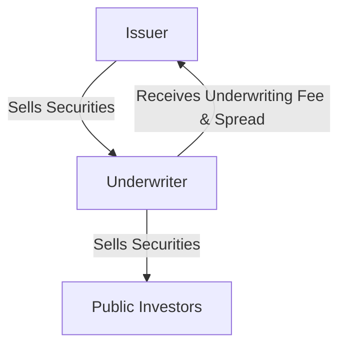

## 12.12 Types of Underwriting Agreements

In the world of finance, underwriting agreements play a crucial role in the issuance of new securities. These agreements outline the terms under which investment banks or underwriters agree to purchase and subsequently sell securities to the public. Understanding the different types of underwriting agreements is essential for anyone involved in the securities market, particularly within the Canadian context. This section will delve into the various types of underwriting agreements, detailing the roles and responsibilities involved, how underwriting fees and spreads are determined, and providing practical examples to illustrate these concepts.

### Understanding Underwriting Agreements

Underwriting agreements are contracts between a group of investment banks or underwriters and the issuing company. These agreements specify the terms and conditions under which the underwriters will purchase securities from the issuer and sell them to the public. The primary purpose of underwriting is to ensure that the issuer raises the required capital while transferring the risk of selling the securities to the underwriters.

### Types of Underwriting Agreements

There are several types of underwriting agreements, each with its own set of roles, responsibilities, and financial implications. The most common types include:

#### 1. Firm Commitment Underwriting

In a firm commitment underwriting, the underwriter purchases the entire issue of securities from the issuer and resells them to the public. This type of agreement provides the issuer with a guarantee that the entire issue will be sold, as the underwriter assumes the risk of any unsold securities. The underwriter profits from the spread, which is the difference between the purchase price paid to the issuer and the selling price to the public.

**Example:** Suppose a Canadian technology company is issuing $100 million in new shares. An investment bank agrees to a firm commitment underwriting, purchasing all shares at $95 million and selling them to the public at $100 million, earning a $5 million spread.

#### 2. Best Efforts Underwriting

In a best efforts underwriting, the underwriter agrees to sell as much of the issue as possible but does not guarantee the sale of the entire issue. The issuer bears the risk of any unsold securities. This type of agreement is often used for smaller or riskier issues where the underwriter is unwilling to assume the full risk.

**Example:** A small Canadian biotech firm is issuing $20 million in shares. An underwriter agrees to a best efforts underwriting, attempting to sell as many shares as possible but not guaranteeing the sale of the entire $20 million.

#### 3. All-or-None Underwriting

An all-or-none underwriting is a variation of the best efforts agreement. The underwriter agrees to sell the entire issue or cancel the offering if the entire issue cannot be sold. This type of agreement protects the issuer from a partial sale, which might not meet their capital needs.

**Example:** A Canadian renewable energy company is issuing $50 million in bonds. The underwriter agrees to an all-or-none underwriting, meaning if they cannot sell all $50 million, the offering will be canceled.

#### 4. Standby Underwriting

Standby underwriting is commonly used in rights offerings, where existing shareholders are given the right to purchase additional shares. The underwriter agrees to purchase any shares not subscribed to by existing shareholders, ensuring the issuer raises the desired capital.

**Example:** A Canadian mining company offers existing shareholders the right to purchase additional shares. The underwriter agrees to a standby underwriting, purchasing any unsubscribed shares to ensure the company raises the full amount.

### Roles and Responsibilities in Underwriting Agreements

The roles and responsibilities in underwriting agreements vary depending on the type of agreement. However, some common roles include:

- **Issuer:** The company issuing the securities. The issuer is responsible for providing accurate information and complying with regulatory requirements.
- **Underwriter:** The investment bank or financial institution that agrees to purchase and sell the securities. The underwriter conducts due diligence, sets the offering price, and markets the securities to investors.
- **Syndicate:** A group of underwriters that work together to distribute the securities. In large offerings, a lead underwriter may form a syndicate to share the risk and responsibilities.

### Determining Underwriting Fees and Spreads

Underwriting fees and spreads are critical components of underwriting agreements. The underwriting fee is the compensation received by underwriters for their services, while the spread is the difference between the price paid to the issuer and the price at which the securities are sold to the public.

#### Underwriting Fees

Underwriting fees are typically a percentage of the total issue size and vary based on the complexity and risk of the offering. In Canada, underwriting fees can range from 3% to 7% of the total issue size, depending on factors such as the issuer's creditworthiness and market conditions.

#### Spreads

The spread compensates the underwriter for the risk of holding and selling the securities. It is determined by the difference between the purchase price from the issuer and the selling price to the public. The spread can vary based on market conditions, the issuer's reputation, and the demand for the securities.

### Practical Example: Underwriting in Action

Consider a scenario where a major Canadian bank, such as RBC, is underwriting a $500 million bond issue for a Canadian utility company. RBC agrees to a firm commitment underwriting, purchasing the bonds at $490 million and selling them to the public at $500 million, earning a $10 million spread. The underwriting fee is set at 5%, amounting to $25 million. This example illustrates how underwriting agreements function in practice, highlighting the roles, responsibilities, and financial implications involved.

### Diagrams and Visuals

To enhance understanding, let's visualize the flow of a firm commitment underwriting agreement:

### Best Practices and Common Pitfalls

**Best Practices:**

- **Conduct Thorough Due Diligence:** Underwriters should conduct comprehensive due diligence to assess the issuer's financial health and the market demand for the securities.
- **Clear Communication:** Maintain clear communication between the issuer and underwriters to ensure all parties understand the terms and conditions of the agreement.
- **Market Analysis:** Conduct a thorough market analysis to set an appropriate offering price and maximize investor interest.

**Common Pitfalls:**

- **Inadequate Risk Assessment:** Failing to adequately assess the risk of the securities can lead to financial losses for underwriters.
- **Overpricing Securities:** Setting an offering price too high can result in unsold securities and financial losses for the issuer.
- **Regulatory Non-Compliance:** Non-compliance with regulatory requirements can lead to legal issues and reputational damage.

### Conclusion

Understanding the different types of underwriting agreements is essential for anyone involved in the securities market. Each type of agreement has its own set of roles, responsibilities, and financial implications. By comprehending these agreements, finance professionals can make informed decisions and effectively manage the risks associated with securities offerings.

### **Ready to Test Your Knowledge?**

**Practice 10 Essential CSC Exam Questions to Master Your Certification**



### Which type of underwriting agreement guarantees the sale of the entire issue?

- [x] Firm Commitment Underwriting
- [ ] Best Efforts Underwriting
- [ ] All-or-None Underwriting
- [ ] Standby Underwriting

> **Explanation:** In a firm commitment underwriting, the underwriter guarantees the sale of the entire issue by purchasing all securities from the issuer.

### What is the primary role of the underwriter in an underwriting agreement?

- [x] To purchase and sell securities
- [ ] To issue securities
- [ ] To regulate securities
- [ ] To invest in securities

> **Explanation:** The primary role of the underwriter is to purchase securities from the issuer and sell them to the public.

### In which underwriting agreement does the issuer bear the risk of unsold securities?

- [ ] Firm Commitment Underwriting
- [x] Best Efforts Underwriting
- [ ] All-or-None Underwriting
- [ ] Standby Underwriting

> **Explanation:** In a best efforts underwriting, the issuer bears the risk of any unsold securities.

### How is the underwriting fee typically calculated?

- [x] As a percentage of the total issue size
- [ ] As a fixed amount
- [ ] Based on the number of securities sold
- [ ] Based on the market demand

> **Explanation:** The underwriting fee is typically calculated as a percentage of the total issue size.

### What does the spread represent in an underwriting agreement?

- [x] The difference between the purchase and selling price of securities
- [ ] The total cost of underwriting
- [ ] The risk of the securities
- [ ] The market demand for the securities

> **Explanation:** The spread represents the difference between the price at which underwriters buy securities from the issuer and the price at which they sell them to the public.

### Which type of underwriting is commonly used in rights offerings?

- [ ] Firm Commitment Underwriting
- [ ] Best Efforts Underwriting
- [ ] All-or-None Underwriting
- [x] Standby Underwriting

> **Explanation:** Standby underwriting is commonly used in rights offerings to ensure the issuer raises the desired capital.

### What is a common pitfall in underwriting agreements?

- [x] Inadequate risk assessment
- [ ] Clear communication
- [ ] Thorough due diligence
- [ ] Market analysis

> **Explanation:** Inadequate risk assessment is a common pitfall that can lead to financial losses for underwriters.

### Which type of underwriting agreement cancels the offering if the entire issue cannot be sold?

- [ ] Firm Commitment Underwriting
- [ ] Best Efforts Underwriting
- [x] All-or-None Underwriting
- [ ] Standby Underwriting

> **Explanation:** In an all-or-none underwriting, the offering is canceled if the entire issue cannot be sold.

### What is the benefit of a firm commitment underwriting for the issuer?

- [x] Guaranteed sale of the entire issue
- [ ] Lower underwriting fees
- [ ] Reduced regulatory requirements
- [ ] Increased market demand

> **Explanation:** The benefit of a firm commitment underwriting for the issuer is the guaranteed sale of the entire issue.

### True or False: The spread compensates the issuer for the risk of selling securities.

- [ ] True
- [x] False

> **Explanation:** False. The spread compensates the underwriter for the risk of holding and selling the securities.


