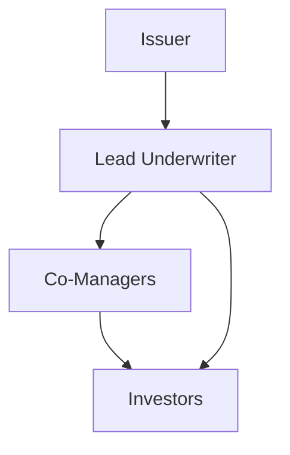

## 12.15 Role of Syndicates and Selling Groups

In the complex world of securities issuance, particularly in large bond offerings, syndicates and selling groups play pivotal roles. Understanding these entities is crucial for anyone involved in the financial markets, especially within the Canadian context. This section delves into the formation and function of syndicates, the roles of selling groups, and the involvement of casual dealers, providing a comprehensive overview of their impact on securities issuance.

### Formation and Function of Syndicates

A **syndicate** is a temporary alliance of financial institutions, primarily investment dealers and banks, formed to handle large securities issues. The primary purpose of a syndicate is to spread the risk associated with underwriting a large issue among multiple parties, thereby reducing the financial burden on any single institution. This collaboration is particularly vital in the issuance of large bond offerings, where the financial stakes are high.

#### Formation of Syndicates

The formation of a syndicate typically begins with the lead underwriter, often a major investment bank, which is responsible for organizing the group. The lead underwriter negotiates the terms of the issue with the issuer, sets the price, and allocates portions of the issue to other members of the syndicate. These members, known as co-managers, contribute their expertise and distribution networks to ensure the successful sale of the securities.

**Diagram: Syndicate Structure**

In this diagram, the issuer collaborates with the lead underwriter, who then coordinates with co-managers to distribute the securities to investors.

#### Functions of Syndicates

1. **Risk Management:** By distributing the financial risk among multiple institutions, syndicates ensure that no single entity is overly exposed to the potential failure of the issue.

2. **Market Reach:** Syndicates leverage the combined distribution networks of their members to reach a broader investor base, increasing the likelihood of a successful issue.

3. **Pricing and Allocation:** The syndicate collectively determines the pricing of the securities, balancing the issuer's needs with market conditions. Allocation of the securities is also managed to ensure fair distribution among investors.

4. **Regulatory Compliance:** Syndicates ensure that the issuance complies with all relevant regulations, including those set by the Canadian Investment Regulatory Organization (CIRO) and provincial authorities.

### Roles of the Selling Group and Casual Dealers

While syndicates are responsible for underwriting and distributing securities, the **selling group** plays a supportive role in the sales process. Unlike syndicate members, selling group members do not bear underwriting risk. Instead, they assist in marketing and selling the securities to their clients.

#### Selling Group

The selling group is composed of dealers who agree to sell the securities on behalf of the syndicate. These dealers are compensated through a selling concession, a fee paid for their services in distributing the securities.

**Key Functions of the Selling Group:**

- **Distribution Support:** Selling group members expand the reach of the issue by tapping into their client networks, which may include retail investors, institutional clients, or both.
- **Market Intelligence:** They provide valuable insights into investor demand and market conditions, aiding the syndicate in making informed decisions about pricing and allocation.
- **Sales Execution:** Selling group members are responsible for executing sales orders, ensuring that the securities are efficiently distributed to investors.

#### Casual Dealers

Casual dealers are not formal members of the syndicate or selling group but may participate in the distribution of securities on an ad-hoc basis. They typically engage in the sale of securities when there is excess demand or when their specific client base is targeted.

**Role of Casual Dealers:**

- **Flexibility:** Casual dealers offer additional flexibility in the distribution process, allowing the syndicate to respond dynamically to market conditions.
- **Niche Markets:** They often cater to niche markets or specific investor segments that may not be directly accessible through the syndicate or selling group.

### Practical Example: A Canadian Bond Issuance

Consider a hypothetical scenario where the Royal Bank of Canada (RBC) decides to issue a large bond to raise capital for expansion. RBC appoints a leading investment bank as the lead underwriter, which then forms a syndicate with several co-managers, including other major Canadian banks like TD and CIBC.

The syndicate sets the bond's price and allocates portions to each member. A selling group is also formed, comprising smaller dealers who assist in marketing the bond to retail investors. Casual dealers may be engaged to reach specific institutional clients interested in the bond.

This collaborative effort ensures that RBC's bond is successfully issued, with risks distributed across the syndicate and sales maximized through the selling group's extensive networks.

### Best Practices and Challenges

**Best Practices:**

- **Effective Communication:** Clear communication among syndicate members and the selling group is essential for coordinating efforts and ensuring a successful issue.
- **Market Analysis:** Conducting thorough market analysis helps in setting competitive pricing and identifying potential investor demand.
- **Regulatory Adherence:** Ensuring compliance with Canadian securities regulations is crucial to avoid legal complications and maintain market integrity.

**Common Challenges:**

- **Market Volatility:** Fluctuations in market conditions can impact the pricing and demand for securities, requiring syndicates to be adaptable.
- **Coordination Complexity:** Managing a large group of institutions with varying interests can be challenging, necessitating strong leadership from the lead underwriter.

### Conclusion

Syndicates and selling groups are integral to the successful issuance of large securities, particularly in the Canadian financial market. By understanding their roles and functions, financial professionals can better navigate the complexities of securities issuance and contribute to the efficient operation of capital markets.

For further exploration, consider reviewing resources from the Canadian Securities Administrators (CSA) and the Investment Industry Regulatory Organization of Canada (IIROC). Additionally, books such as "Investment Banking: Valuation, Leveraged Buyouts, and Mergers & Acquisitions" by Joshua Rosenbaum and Joshua Pearl provide deeper insights into the intricacies of investment banking and syndicate operations.

### **Ready to Test Your Knowledge?**

**Practice 10 Essential CSC Exam Questions to Master Your Certification**



### What is a syndicate in the context of securities issuance?

- [x] A group of investment dealers and banks that underwrite and distribute a large securities issue.
- [ ] A single bank responsible for issuing securities.
- [ ] A regulatory body overseeing securities markets.
- [ ] A group of investors purchasing securities.

> **Explanation:** A syndicate is a group of financial institutions that collaborate to underwrite and distribute large securities issues, sharing the associated risks.

### What is the primary role of the lead underwriter in a syndicate?

- [x] Organizing the syndicate and negotiating terms with the issuer.
- [ ] Selling securities directly to investors.
- [ ] Setting regulatory guidelines for the issue.
- [ ] Acting as a casual dealer.

> **Explanation:** The lead underwriter is responsible for forming the syndicate, negotiating terms, and coordinating the distribution of securities.

### How do selling group members differ from syndicate members?

- [x] Selling group members do not bear underwriting risk.
- [ ] Selling group members set the price of the securities.
- [ ] Selling group members are responsible for regulatory compliance.
- [ ] Selling group members are the primary underwriters.

> **Explanation:** Selling group members assist in selling securities but do not take on the underwriting risk, unlike syndicate members.

### What is a key function of casual dealers?

- [x] Providing additional distribution flexibility.
- [ ] Setting the securities' price.
- [ ] Leading the syndicate.
- [ ] Ensuring regulatory compliance.

> **Explanation:** Casual dealers offer flexibility by participating in the distribution process on an ad-hoc basis, often targeting specific investor segments.

### Which of the following is a best practice for syndicates?

- [x] Effective communication among members.
- [ ] Ignoring market conditions.
- [ ] Relying solely on the lead underwriter for sales.
- [ ] Avoiding regulatory compliance.

> **Explanation:** Effective communication is crucial for coordinating efforts and ensuring a successful securities issue.

### What challenge might a syndicate face during securities issuance?

- [x] Market volatility affecting pricing and demand.
- [ ] Excessive regulatory compliance.
- [ ] Lack of investor interest in all market conditions.
- [ ] Overcommunication among members.

> **Explanation:** Market volatility can impact the pricing and demand for securities, requiring syndicates to adapt their strategies.

### What is the role of the selling group in securities issuance?

- [x] Assisting in marketing and selling securities.
- [ ] Underwriting the securities.
- [ ] Setting the securities' price.
- [ ] Acting as the lead underwriter.

> **Explanation:** The selling group supports the syndicate by marketing and selling the securities, expanding the reach of the issue.

### How does a syndicate manage risk in securities issuance?

- [x] By distributing the risk among multiple institutions.
- [ ] By relying on a single institution to bear all risks.
- [ ] By avoiding large securities issues.
- [ ] By setting high prices for securities.

> **Explanation:** Syndicates manage risk by spreading it across multiple institutions, reducing the financial burden on any single entity.

### True or False: Casual dealers are formal members of the syndicate.

- [ ] True
- [x] False

> **Explanation:** Casual dealers are not formal members of the syndicate; they participate in the distribution process on an ad-hoc basis.

### What is a common challenge for selling groups?

- [x] Coordinating sales efforts with the syndicate.
- [ ] Setting the securities' price.
- [ ] Underwriting the securities.
- [ ] Acting as the lead underwriter.

> **Explanation:** Selling groups must coordinate their sales efforts with the syndicate to ensure efficient distribution and maximize sales.


