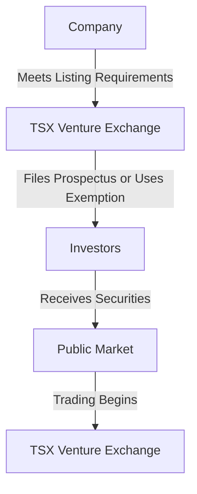

---

linkTitle: "12.16 Distribution through the TSX Venture Exchange"
title: "TSX Venture Exchange: Distribution and Prospectus Exemptions"
description: "Explore the distribution of securities through the TSX Venture Exchange, including specific requirements, processes, and prospectus exemption criteria for exchange offerings."
categories:
- Finance
- Canadian Securities
- Investment
tags:
- TSX Venture Exchange
- Securities Distribution
- Prospectus Exemption
- Canadian Finance
- Emerging Companies
date: 2024-10-25
type: docs
nav_weight: 1370000
canonical: "https://securitiesexamsmastery.ca/13/12/17"
license: "© 2023 Tokenizer Inc. CC BY-NC-SA 4.0"
---

## 12.16 Distribution through the TSX Venture Exchange

The TSX Venture Exchange (TSXV) is a vital platform for emerging companies in Canada, providing them with access to public capital markets. Understanding the distribution of securities through the TSXV is crucial for financial professionals involved in the Canadian securities industry. This section will delve into the specific requirements and processes for distributing securities via the TSXV, as well as the prospectus exemption criteria for exchange offerings.

### Understanding the TSX Venture Exchange

The TSX Venture Exchange is a Canadian stock exchange that caters to small and medium-sized enterprises (SMEs) seeking to raise capital and gain visibility in the public markets. It serves as a stepping stone for companies aiming to graduate to the Toronto Stock Exchange (TSX) as they grow. The TSXV is known for its flexibility and support for emerging companies, making it an attractive option for businesses in various sectors, including technology, mining, and energy.

### Distribution Requirements and Processes

Distributing securities through the TSXV involves several key steps and requirements that companies must adhere to. These processes ensure that the securities are offered in a manner that protects investors and maintains market integrity.

#### 1. Initial Listing Requirements

To list on the TSXV, a company must meet specific initial listing requirements, which vary depending on the industry sector. These requirements typically include:

- **Financial Criteria:** Companies must demonstrate sufficient working capital and financial resources to carry out their business plans.
- **Public Float:** A minimum number of shares must be held by public shareholders to ensure liquidity.
- **Management and Board of Directors:** The company must have a qualified management team and board of directors with relevant experience.

#### 2. Filing a Prospectus

A prospectus is a formal legal document required by securities regulators that provides details about an investment offering to the public. However, the TSXV offers certain exemptions that allow companies to distribute securities without a full prospectus, under specific conditions.

#### 3. Information Circular (Greensheet)

An information circular, often referred to as a "Greensheet," is an internal document used by sales representatives to understand the key features of a new issue. It includes essential information such as the company's business model, financials, and the terms of the offering. This document aids in the effective communication of the offering's value proposition to potential investors.

### Prospectus Exemption Criteria

The TSXV provides several prospectus exemptions that facilitate the distribution of securities without the need for a full prospectus. These exemptions are designed to streamline the process for emerging companies while ensuring investor protection.

#### 1. Accredited Investor Exemption

This exemption allows companies to distribute securities to accredited investors without a prospectus. Accredited investors are individuals or entities that meet specific financial criteria, such as having a certain level of income or net worth. This exemption is based on the assumption that accredited investors possess the financial sophistication to understand the risks involved.

#### 2. Private Issuer Exemption

A private issuer exemption is available for companies that have not yet become reporting issuers. This exemption allows the distribution of securities to a limited number of investors, typically friends, family, and business associates, without a prospectus.

#### 3. Offering Memorandum Exemption

Under this exemption, companies can distribute securities using an offering memorandum, a less comprehensive document than a prospectus. The offering memorandum provides sufficient information for investors to make informed decisions while reducing the regulatory burden on the issuer.

### Practical Example: A Canadian Mining Company

Consider a Canadian mining company seeking to raise capital through the TSXV. The company meets the initial listing requirements, including financial criteria and public float. To expedite the process, it opts for the accredited investor exemption, targeting high-net-worth individuals and institutional investors familiar with the mining sector. The company prepares a detailed information circular to assist sales representatives in communicating the offering's potential to investors.

### Best Practices and Common Challenges

When distributing securities through the TSXV, companies should adhere to best practices to ensure a successful offering:

- **Thorough Preparation:** Companies should prepare comprehensive documentation, including financial statements and business plans, to meet listing requirements.
- **Clear Communication:** Effective communication with potential investors is crucial. Information circulars should be clear and concise, highlighting the company's value proposition.
- **Regulatory Compliance:** Companies must stay informed about regulatory changes and ensure compliance with all applicable rules and exemptions.

Common challenges include navigating the complex regulatory landscape and ensuring sufficient investor interest. Companies can overcome these challenges by engaging experienced legal and financial advisors and leveraging the TSXV's resources and support.

### Diagrams and Visual Aids

To enhance understanding, consider the following diagram illustrating the distribution process through the TSXV:

### Conclusion

Distributing securities through the TSX Venture Exchange offers emerging companies a valuable opportunity to access public capital markets. By understanding the specific requirements, processes, and prospectus exemption criteria, companies can effectively navigate the TSXV and achieve their financing goals. Financial professionals should stay informed about regulatory developments and leverage best practices to support their clients in successful securities offerings.

### **Ready to Test Your Knowledge?**

**Practice 10 Essential CSC Exam Questions to Master Your Certification**



### What is the primary purpose of the TSX Venture Exchange?

- [x] To provide emerging companies with access to public capital markets
- [ ] To facilitate mergers and acquisitions for large corporations
- [ ] To serve as a platform for high-frequency trading
- [ ] To regulate the Canadian banking sector

> **Explanation:** The TSX Venture Exchange is designed to help emerging companies access public capital markets, providing them with the opportunity to grow and potentially graduate to the Toronto Stock Exchange.

### Which document is used internally by sales representatives to understand a new issue?

- [x] Information circular (Greensheet)
- [ ] Prospectus
- [ ] Annual report
- [ ] Financial statement

> **Explanation:** An information circular, or Greensheet, is used internally by sales representatives to summarize key features of a new issue, aiding in communication with potential investors.

### What is a key requirement for a company to list on the TSX Venture Exchange?

- [x] Sufficient working capital and financial resources
- [ ] A minimum of 10 years in operation
- [ ] A headquarters in Toronto
- [ ] A minimum of 1,000 employees

> **Explanation:** Companies must demonstrate sufficient working capital and financial resources to meet the TSXV's initial listing requirements.

### Which exemption allows companies to distribute securities to accredited investors without a prospectus?

- [x] Accredited Investor Exemption
- [ ] Private Issuer Exemption
- [ ] Offering Memorandum Exemption
- [ ] Employee Stock Option Exemption

> **Explanation:** The Accredited Investor Exemption allows companies to distribute securities to accredited investors without a prospectus, based on their financial sophistication.

### What is the purpose of an offering memorandum?

- [x] To provide sufficient information for investors to make informed decisions
- [ ] To serve as a comprehensive financial audit
- [ ] To outline the company's marketing strategy
- [ ] To detail the company's employee benefits

> **Explanation:** An offering memorandum provides sufficient information for investors to make informed decisions, serving as an alternative to a full prospectus.

### Which of the following is a common challenge when distributing securities through the TSXV?

- [x] Navigating the complex regulatory landscape
- [ ] Finding a suitable office location
- [ ] Hiring a new CEO
- [ ] Developing a new product line

> **Explanation:** Navigating the complex regulatory landscape is a common challenge for companies distributing securities through the TSXV.

### What is a benefit of using the accredited investor exemption?

- [x] It allows companies to target high-net-worth individuals and institutional investors
- [ ] It eliminates the need for financial statements
- [ ] It guarantees a successful offering
- [ ] It requires no regulatory compliance

> **Explanation:** The accredited investor exemption allows companies to target high-net-worth individuals and institutional investors, who are assumed to have the financial sophistication to understand the risks involved.

### What is the role of the TSX Venture Exchange in the Canadian financial market?

- [x] To support small and medium-sized enterprises in raising capital
- [ ] To regulate all Canadian financial institutions
- [ ] To provide loans to emerging companies
- [ ] To manage Canada's monetary policy

> **Explanation:** The TSX Venture Exchange supports small and medium-sized enterprises in raising capital, serving as a platform for emerging companies to access public markets.

### True or False: The TSX Venture Exchange is only for technology companies.

- [ ] True
- [x] False

> **Explanation:** The TSX Venture Exchange is not limited to technology companies; it supports businesses in various sectors, including mining, energy, and more.

### Which of the following is a best practice for companies distributing securities through the TSXV?

- [x] Engaging experienced legal and financial advisors
- [ ] Ignoring regulatory changes
- [ ] Relying solely on internal resources
- [ ] Avoiding communication with potential investors

> **Explanation:** Engaging experienced legal and financial advisors is a best practice for companies distributing securities through the TSXV, helping them navigate regulatory requirements and achieve successful offerings.



