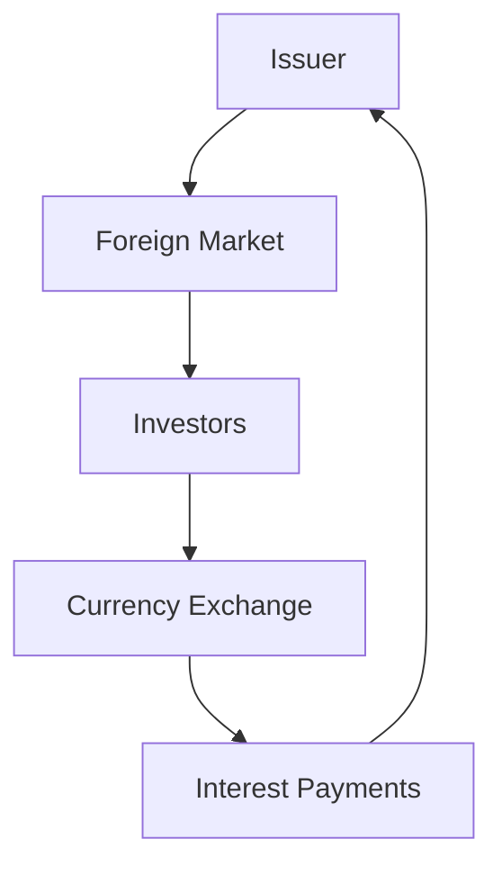

## 12.17 Direct and Foreign Bond Issuances

In the realm of finance, bonds are a critical tool for raising capital. They provide a way for governments, corporations, and other entities to secure funds for various projects and operations. This section delves into the mechanisms of issuing bonds directly and in foreign markets, emphasizing the Canadian context. We will explore the impact of exchange rates, international regulations, and provide practical examples to illustrate these concepts.

### Understanding Direct Bond Issuance

**Direct bond issuance** refers to the process of selling bonds directly to investors without the involvement of intermediaries such as investment banks or brokers. This method can be advantageous for issuers seeking to reduce costs associated with underwriting fees and commissions. Direct issuance is often utilized by large, well-established entities with a strong investor base.

#### Mechanisms of Direct Bond Issuance

1. **Private Placements**: Bonds are sold directly to a select group of investors, typically institutional investors such as pension funds or insurance companies. This approach allows issuers to tailor bond terms to meet specific investor needs.

2. **Shelf Registrations**: This method allows issuers to register a large amount of bonds with regulatory authorities and issue them over time as market conditions become favorable. It provides flexibility and quick access to capital markets.

3. **Online Platforms**: With technological advancements, online platforms have emerged, enabling issuers to reach a broader audience of potential investors directly. These platforms facilitate transparency and efficiency in the issuance process.

#### Advantages and Challenges

- **Advantages**: Cost savings, greater control over terms, and direct relationships with investors.
- **Challenges**: Limited investor reach compared to public offerings, potential liquidity issues, and the need for a strong reputation to attract investors.

### Foreign Bond Issuances

**Foreign bond issuance** involves selling bonds in a market outside the issuer's home country. These bonds are often denominated in a foreign currency, leading to the term **foreign pay bond**. Issuing bonds in foreign markets can help diversify funding sources and tap into different investor bases.

#### Mechanisms of Foreign Bond Issuance

1. **Eurobonds**: These are bonds issued in a currency not native to the country where it is issued. For example, a Canadian company issuing a bond in USD in the European market.

2. **Foreign Bonds**: These are bonds issued in a foreign country and denominated in that country's currency. For instance, a Canadian firm issuing bonds in Japan denominated in Japanese Yen, known as Samurai bonds.

3. **Global Bonds**: These bonds are issued simultaneously in multiple markets and currencies, offering issuers a way to access a wide range of investors globally.

#### Impact of Exchange Rates

Exchange rates play a crucial role in foreign bond issuances. Fluctuations in currency values can significantly impact the cost of servicing debt and the overall return for investors. Issuers must consider:

- **Currency Risk**: The risk that changes in exchange rates will affect the value of bond payments. Hedging strategies, such as currency swaps or forward contracts, can mitigate this risk.

- **Interest Rate Differentials**: Differences in interest rates between countries can influence the attractiveness of issuing bonds in a particular currency.

#### International Regulations

Issuing bonds in foreign markets requires compliance with international regulations, which can vary significantly between jurisdictions. Key considerations include:

- **Regulatory Compliance**: Understanding and adhering to the securities laws and regulations of the target market is essential. This may involve registration with local regulatory bodies and meeting disclosure requirements.

- **Tax Implications**: Different countries have varying tax treatments for bond interest and capital gains, which can affect the net return for investors.

- **Legal and Political Risks**: Issuers must assess the legal and political environment of the foreign market to ensure stability and predictability.

### Practical Examples and Case Studies

#### Example 1: Canadian Pension Fund

A Canadian pension fund looking to diversify its portfolio might consider investing in foreign bonds to gain exposure to different currencies and interest rate environments. By purchasing Eurobonds, the fund can benefit from potentially higher yields while managing currency risk through hedging strategies.

#### Example 2: RBC's Global Bond Issuance

The Royal Bank of Canada (RBC) has successfully issued global bonds to tap into international markets. By issuing bonds in multiple currencies, RBC can access a diverse investor base and optimize its capital structure. This strategy also allows RBC to manage its exposure to currency fluctuations effectively.

### Best Practices and Common Challenges

- **Best Practices**: Conduct thorough market research, engage with local legal and financial advisors, and implement robust risk management strategies.
- **Common Challenges**: Navigating complex regulatory environments, managing currency risk, and ensuring investor confidence in foreign markets.

### Diagrams and Visual Aids

Below is a diagram illustrating the flow of a foreign bond issuance process:

### Conclusion

Direct and foreign bond issuances offer unique opportunities and challenges for issuers and investors alike. By understanding the mechanisms, regulatory requirements, and market dynamics, financial professionals can effectively navigate these complex processes. As the global financial landscape continues to evolve, staying informed and adaptable is crucial for success.

### Additional Resources

- **Books**: "International Finance: Theory and Policy" by Paul Krugman
- **Online Courses**: "Global Financial Markets and Instruments" on Coursera
- **Regulatory Bodies**: Canadian Securities Administrators (CSA), International Organization of Securities Commissions (IOSCO)

### **Ready to Test Your Knowledge?**

**Practice 10 Essential CSC Exam Questions to Master Your Certification**



### What is a direct bond issuance?

- [x] Selling bonds directly to investors without intermediaries.
- [ ] Selling bonds through investment banks.
- [ ] Issuing bonds in foreign markets.
- [ ] Selling bonds to retail investors only.

> **Explanation:** Direct bond issuance involves selling bonds directly to investors without the use of intermediaries like investment banks.

### What is a foreign pay bond?

- [x] A bond that pays interest in a currency different from the issuer's domestic currency.
- [ ] A bond issued in the issuer's home country.
- [ ] A bond that pays interest in the issuer's domestic currency.
- [ ] A bond that is only sold to foreign investors.

> **Explanation:** A foreign pay bond pays interest in a currency different from the issuer's domestic currency, often used in foreign bond issuances.

### Which of the following is a mechanism of direct bond issuance?

- [x] Private Placements
- [ ] Eurobonds
- [ ] Samurai Bonds
- [ ] Global Bonds

> **Explanation:** Private placements are a mechanism of direct bond issuance where bonds are sold directly to a select group of investors.

### What is a Eurobond?

- [x] A bond issued in a currency not native to the country where it is issued.
- [ ] A bond issued in the issuer's domestic market.
- [ ] A bond issued in Europe only.
- [ ] A bond denominated in Euros.

> **Explanation:** Eurobonds are issued in a currency not native to the country where they are issued, allowing issuers to access international markets.

### What is a key risk associated with foreign bond issuances?

- [x] Currency Risk
- [ ] Inflation Risk
- [ ] Credit Risk
- [ ] Liquidity Risk

> **Explanation:** Currency risk is a key risk in foreign bond issuances due to potential fluctuations in exchange rates affecting bond payments.

### What is a Samurai bond?

- [x] A bond issued in Japan denominated in Japanese Yen.
- [ ] A bond issued in Europe denominated in Euros.
- [ ] A bond issued in the USA denominated in USD.
- [ ] A bond issued in Canada denominated in CAD.

> **Explanation:** A Samurai bond is issued in Japan and denominated in Japanese Yen, allowing foreign issuers to access the Japanese market.

### What is the role of exchange rates in foreign bond issuances?

- [x] They affect the cost of servicing debt and the return for investors.
- [ ] They determine the interest rate of the bond.
- [ ] They have no impact on foreign bond issuances.
- [ ] They only affect domestic bond issuances.

> **Explanation:** Exchange rates impact the cost of servicing debt and the return for investors in foreign bond issuances due to currency fluctuations.

### What is a shelf registration?

- [x] A method allowing issuers to register a large amount of bonds and issue them over time.
- [ ] A method of issuing bonds directly to retail investors.
- [ ] A method of issuing bonds in foreign markets.
- [ ] A method of issuing bonds through intermediaries.

> **Explanation:** Shelf registration allows issuers to register a large amount of bonds with regulatory authorities and issue them over time as needed.

### What is a key advantage of direct bond issuance?

- [x] Cost savings from reduced underwriting fees.
- [ ] Access to a broader investor base.
- [ ] Higher liquidity compared to public offerings.
- [ ] Guaranteed investor interest.

> **Explanation:** Direct bond issuance can result in cost savings due to reduced underwriting fees and commissions.

### True or False: Issuing bonds in foreign markets requires compliance with international regulations.

- [x] True
- [ ] False

> **Explanation:** Issuing bonds in foreign markets requires compliance with international regulations, including securities laws and disclosure requirements.


