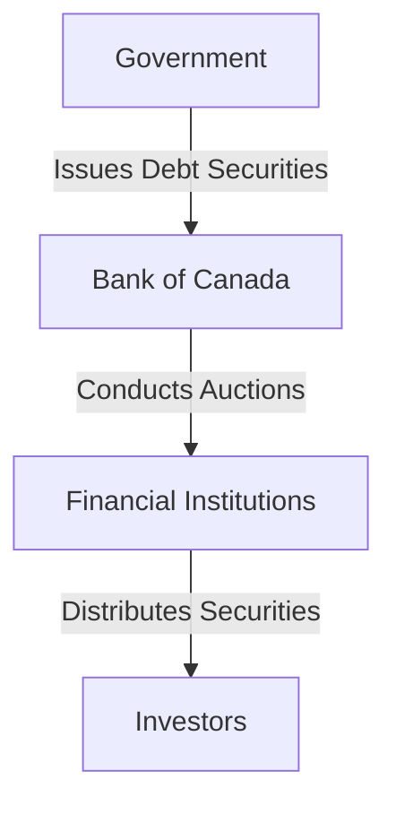

## 12.1 Government and Corporate Finance

In the world of finance, both governments and corporations must raise capital to fund their operations, projects, and growth initiatives. This section explores the mechanisms through which these entities secure funding, the roles of fiscal agencies and underwriters, and the distinctions between public and private financing. Understanding these concepts is crucial for anyone involved in the financial services industry, particularly within the Canadian context.

### Government Financing: Auctions and Fiscal Agencies

Governments primarily raise capital through the issuance of debt securities, such as bonds and treasury bills. In Canada, the federal government, as well as provincial and municipal governments, utilize auctions and fiscal agencies to manage this process.

#### Auctions

Government securities are often sold through auctions, which can be competitive or non-competitive. In a competitive auction, investors submit bids specifying the quantity of securities they wish to purchase and the yield they are willing to accept. The government then allocates securities to the highest bidders until the entire issue is sold. In a non-competitive auction, investors agree to accept the yield determined at the auction, ensuring they receive the desired amount of securities without specifying a yield.

**Example:** The Bank of Canada conducts regular auctions for Government of Canada bonds and treasury bills. These auctions are open to financial institutions and investment dealers, who then distribute the securities to individual and institutional investors.

#### Fiscal Agencies

A fiscal agency is an organization authorized to manage government funds and securities issuance. In Canada, the Bank of Canada acts as the fiscal agent for the federal government, handling the issuance and redemption of government securities. This role includes managing the auction process, maintaining records, and ensuring the smooth operation of the government's debt program.

**Diagram: Government Financing Process**

### Corporate Financing: Balancing Issuer Needs and Investor Demands

Corporations raise capital through various methods, each with its own advantages and challenges. The choice of financing method depends on the corporation's needs, market conditions, and investor preferences.

#### Equity Financing

Equity financing involves issuing shares to investors in exchange for capital. This method does not require repayment, but it dilutes existing shareholders' ownership. Equity financing can be public or private.

- **Public Equity Financing:** Involves issuing shares through an initial public offering (IPO) or a secondary offering on a stock exchange. This method provides access to a broad investor base but requires compliance with regulatory requirements and disclosure obligations.
  
- **Private Equity Financing:** Involves selling shares to a select group of investors, such as venture capitalists or private equity firms. This method offers more flexibility and confidentiality but limits the pool of potential investors.

#### Debt Financing

Debt financing involves borrowing funds that must be repaid with interest. This method allows corporations to retain ownership but requires regular interest payments and eventual repayment of the principal.

- **Bonds:** Corporations issue bonds to raise long-term capital. Bonds are typically sold to institutional investors and traded on secondary markets.
  
- **Loans:** Corporations can also secure loans from banks or other financial institutions. Loans may offer more flexible terms but often come with covenants and restrictions.

**Diagram: Corporate Financing Options**

### Public vs. Private Financing

Understanding the differences between public and private financing is essential for making informed investment decisions.

#### Public Financing

Public financing involves raising capital through public markets, such as stock exchanges. This method provides access to a large pool of investors and enhances liquidity, but it requires adherence to regulatory standards and public disclosure.

**Advantages:**
- Access to a wide investor base
- Enhanced liquidity and marketability
- Increased visibility and credibility

**Challenges:**
- Regulatory compliance and reporting requirements
- Market volatility and price fluctuations
- Potential loss of control due to shareholder influence

#### Private Financing

Private financing involves raising capital from a limited group of investors, such as private equity firms or venture capitalists. This method offers more privacy and control but limits the availability of funds.

**Advantages:**
- Greater flexibility in terms and conditions
- Confidentiality and reduced disclosure requirements
- Retained control over business decisions

**Challenges:**
- Limited access to capital
- Potentially higher cost of capital
- Less liquidity and marketability

### Best Practices and Common Pitfalls

When raising capital, both governments and corporations must navigate various challenges and opportunities. Here are some best practices and common pitfalls to consider:

**Best Practices:**
- **Thorough Planning:** Develop a comprehensive financing strategy that aligns with long-term goals and market conditions.
- **Diversification:** Utilize a mix of financing methods to spread risk and optimize capital structure.
- **Regulatory Compliance:** Ensure adherence to all relevant regulations and disclosure requirements to maintain credibility and avoid penalties.

**Common Pitfalls:**
- **Overleveraging:** Excessive reliance on debt can lead to financial distress and reduced flexibility.
- **Market Timing:** Poor timing of capital raising efforts can result in unfavorable terms and conditions.
- **Inadequate Communication:** Failing to communicate effectively with investors can lead to misunderstandings and reduced investor confidence.

### Conclusion

Understanding government and corporate finance is crucial for navigating the financial landscape and making informed investment decisions. By exploring the mechanisms of capital raising, the roles of fiscal agencies and underwriters, and the distinctions between public and private financing, financial professionals can better serve their clients and contribute to the stability and growth of the financial markets.

For further exploration, consider reviewing resources such as the Bank of Canada's website for information on government securities auctions, or the Canadian Securities Administrators (CSA) for guidelines on public offerings and regulatory compliance.

### **Ready to Test Your Knowledge?**

**Practice 10 Essential CSC Exam Questions to Master Your Certification**



### How do governments primarily raise capital?

- [x] Through the issuance of debt securities
- [ ] By selling equity shares
- [ ] By collecting taxes
- [ ] Through private equity investments

> **Explanation:** Governments primarily raise capital by issuing debt securities such as bonds and treasury bills.

### What role does a fiscal agency play in government financing?

- [x] Manages government funds and securities issuance
- [ ] Provides loans to corporations
- [ ] Invests in private equity
- [ ] Sets interest rates for banks

> **Explanation:** A fiscal agency is authorized to manage government funds and securities issuance, ensuring smooth operation of the government's debt program.

### What is a key advantage of public equity financing?

- [x] Access to a broad investor base
- [ ] Complete confidentiality
- [ ] No regulatory requirements
- [ ] Guaranteed returns

> **Explanation:** Public equity financing provides access to a broad investor base, enhancing liquidity and marketability.

### Which of the following is a common pitfall in corporate financing?

- [x] Overleveraging
- [ ] Diversification
- [ ] Regulatory compliance
- [ ] Effective communication

> **Explanation:** Overleveraging, or excessive reliance on debt, can lead to financial distress and reduced flexibility.

### What is a benefit of private financing?

- [x] Greater flexibility in terms and conditions
- [ ] Enhanced liquidity
- [x] Confidentiality
- [ ] Access to a wide investor base

> **Explanation:** Private financing offers greater flexibility and confidentiality, though it limits access to a wide investor base.

### What is the primary difference between public and private financing?

- [x] Public financing involves raising capital through public markets
- [ ] Private financing requires public disclosure
- [ ] Public financing is always more expensive
- [ ] Private financing offers more liquidity

> **Explanation:** Public financing involves raising capital through public markets, while private financing involves a limited group of investors.

### Which method involves issuing shares to investors?

- [x] Equity financing
- [ ] Debt financing
- [x] Public offering
- [ ] Loan financing

> **Explanation:** Equity financing involves issuing shares to investors, either through public offerings or private placements.

### What is a common challenge of public financing?

- [x] Regulatory compliance and reporting requirements
- [ ] Limited access to capital
- [ ] Complete confidentiality
- [ ] Lack of investor interest

> **Explanation:** Public financing requires adherence to regulatory compliance and reporting requirements, which can be challenging.

### What is the role of underwriters in corporate financing?

- [x] Raise investment capital from investors
- [ ] Manage government funds
- [ ] Set interest rates
- [ ] Provide loans to corporations

> **Explanation:** Underwriters raise investment capital from investors on behalf of corporations and governments.

### True or False: Private financing offers more liquidity than public financing.

- [ ] True
- [x] False

> **Explanation:** Private financing typically offers less liquidity than public financing, as it involves a limited group of investors.


