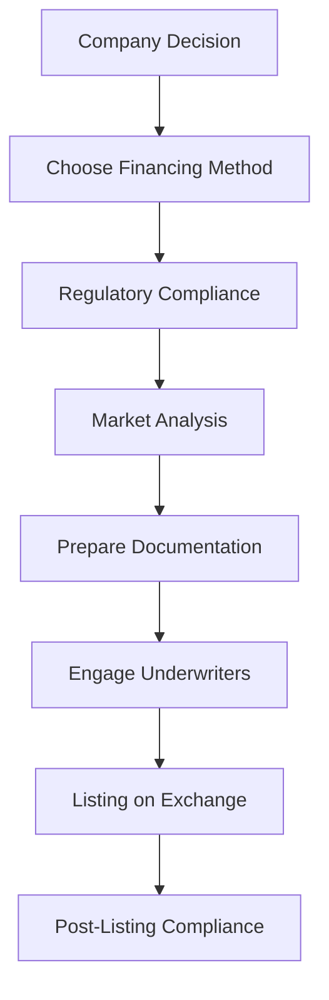

## Conclusion of Chapter 12: Mastering Securities Financing and Listing

As we conclude Chapter 12 on Financing and Listing Securities, it's essential to reflect on the critical insights and knowledge gained throughout this section. This chapter has delved into the intricacies of how securities are financed and listed, highlighting the importance of understanding both the regulatory frameworks and the market dynamics that influence these processes. 

### Key Takeaways

1. **Understanding Securities Financing**: We explored various methods of financing securities, including initial public offerings (IPOs), private placements, and debt financing. Each method has its unique advantages and challenges, and choosing the right one depends on the company's financial strategy and market conditions.

2. **Regulatory Compliance**: A significant portion of this chapter focused on the regulatory requirements that govern the financing and listing of securities in Canada. Compliance with the Investment Industry Regulatory Organization of Canada (IIROC) and the Canadian Financial Services Regulatory Association (CFSRA) is crucial for ensuring legal and ethical operations within the financial markets.

3. **Market Dynamics**: The chapter also emphasized the role of market dynamics in the financing and listing process. Understanding market trends, investor behavior, and economic indicators can significantly impact the success of a securities offering.

4. **Listing Process**: We covered the step-by-step process of listing securities on Canadian exchanges, such as the Toronto Stock Exchange (TSX) and the TSX Venture Exchange. This includes meeting listing requirements, preparing necessary documentation, and engaging with underwriters and legal advisors.

5. **Risk Management**: Effective risk management strategies are vital when financing and listing securities. This involves assessing market risks, regulatory risks, and operational risks to mitigate potential challenges.

### Importance of Regulatory Understanding

Regulatory compliance is not just a legal obligation but a strategic advantage. Companies that understand and adhere to regulatory requirements can avoid costly penalties and enhance their reputation among investors. The IIROC and CFSRA provide guidelines and frameworks that help maintain market integrity and protect investors.

For further exploration, consider visiting the [IIROC website](https://www.iiroc.ca/) and the [CFSRA website](https://www.cfsra.com/) for the latest updates on regulations and compliance requirements. These resources offer valuable insights into the evolving regulatory landscape and provide access to educational materials and tools.

### Encouragement for Further Exploration

While this chapter provides a foundational understanding of securities financing and listing, the field is vast and continually evolving. We encourage you to explore advanced topics such as:

- **Alternative Financing Methods**: Investigate emerging financing options like crowdfunding and peer-to-peer lending.
- **Global Market Comparisons**: Understand how Canadian securities markets compare to global counterparts, and what lessons can be learned.
- **Technological Innovations**: Explore how technology, such as blockchain and fintech solutions, is transforming securities financing and listing processes.

### Additional Resources

To deepen your understanding, consider participating in educational webinars and seminars offered by financial institutions and regulatory bodies. These events provide opportunities to learn from industry experts and stay updated on the latest trends and best practices.

### Visualizing the Process

Below is a diagram illustrating the typical process of financing and listing securities in Canada:

This flowchart highlights the sequential steps involved, from the initial decision-making to post-listing compliance, emphasizing the importance of each phase in the process.

### Best Practices and Common Pitfalls

- **Best Practices**: Maintain transparency with investors, ensure thorough due diligence, and engage experienced legal and financial advisors.
- **Common Pitfalls**: Underestimating regulatory requirements, ignoring market trends, and inadequate risk assessment can lead to significant setbacks.

### Conclusion

Mastering the art of financing and listing securities requires a blend of strategic insight, regulatory knowledge, and market awareness. By understanding these elements, financial professionals can effectively navigate the complexities of the Canadian securities market, ensuring successful outcomes for their organizations.

As you continue your journey in the world of finance, remember that continuous learning and adaptation are key to staying ahead in this dynamic field. We hope this chapter has equipped you with the foundational tools and insights needed to excel in securities financing and listing.

### **Ready to Test Your Knowledge?**

**Practice 10 Essential CSC Exam Questions to Master Your Certification**



### What is a primary method of financing securities discussed in this chapter?

- [x] Initial Public Offerings (IPOs)
- [ ] Stock Buybacks
- [ ] Dividend Reinvestment Plans
- [ ] Short Selling

> **Explanation:** Initial Public Offerings (IPOs) are a primary method of financing securities, allowing companies to raise capital by offering shares to the public.

### Which regulatory body is crucial for compliance in Canadian securities markets?

- [x] Investment Industry Regulatory Organization of Canada (IIROC)
- [ ] Securities and Exchange Commission (SEC)
- [ ] Financial Conduct Authority (FCA)
- [ ] European Securities and Markets Authority (ESMA)

> **Explanation:** The IIROC is a key regulatory body in Canada, overseeing investment dealers and trading activity to ensure market integrity.

### What is a common pitfall in the securities financing process?

- [x] Underestimating regulatory requirements
- [ ] Overestimating market demand
- [ ] Focusing solely on short-term gains
- [ ] Ignoring technological advancements

> **Explanation:** Underestimating regulatory requirements can lead to legal issues and financial penalties, making it a common pitfall.

### What role do underwriters play in the listing process?

- [x] They assist in preparing and marketing the securities offering.
- [ ] They provide post-listing compliance services.
- [ ] They act as regulatory bodies.
- [ ] They manage investor relations.

> **Explanation:** Underwriters help prepare and market the securities offering, ensuring it meets market and regulatory standards.

### Which of the following is a step in the securities listing process?

- [x] Prepare Documentation
- [ ] Conduct a Hostile Takeover
- [ ] Implement a Stock Split
- [ ] Initiate a Share Buyback

> **Explanation:** Preparing documentation is a crucial step in the securities listing process, ensuring all necessary information is available for regulatory review.

### Why is market analysis important in the financing process?

- [x] It helps assess investor demand and market conditions.
- [ ] It determines the company's internal financial health.
- [ ] It evaluates competitor pricing strategies.
- [ ] It forecasts future economic downturns.

> **Explanation:** Market analysis is important to understand investor demand and current market conditions, which influence the success of the offering.

### What is a benefit of regulatory compliance?

- [x] Enhanced reputation among investors
- [ ] Increased short-term profits
- [ ] Reduced operational costs
- [ ] Guaranteed market success

> **Explanation:** Regulatory compliance enhances a company's reputation among investors, fostering trust and long-term relationships.

### What is an alternative financing method mentioned for further exploration?

- [x] Crowdfunding
- [ ] Stock Options
- [ ] Futures Contracts
- [ ] Margin Trading

> **Explanation:** Crowdfunding is an emerging alternative financing method that allows companies to raise capital from a large number of small investors.

### How can technology impact securities financing?

- [x] By streamlining processes and increasing transparency
- [ ] By reducing the need for regulatory compliance
- [ ] By eliminating market risks
- [ ] By guaranteeing investment returns

> **Explanation:** Technology can streamline financing processes and increase transparency, improving efficiency and trust in the market.

### True or False: Understanding market dynamics is unnecessary for successful securities financing.

- [ ] True
- [x] False

> **Explanation:** Understanding market dynamics is crucial for successful securities financing, as it influences investor behavior and market conditions.


