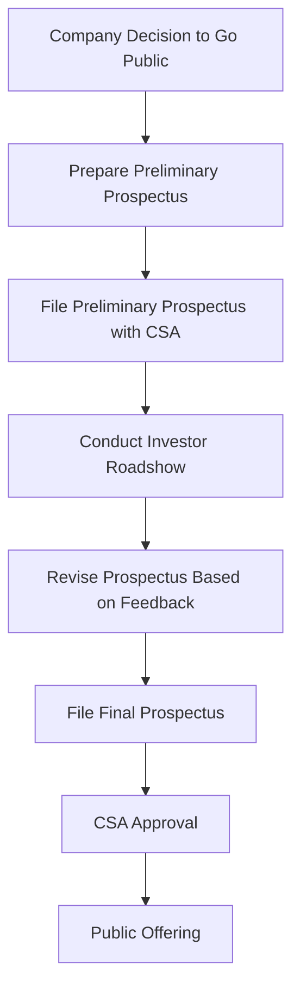

## 12.3.1 Prospectus Requirements

In the world of Canadian securities, the prospectus is a critical document that serves as a cornerstone for bringing securities to the market. It ensures transparency, provides essential information to investors, and complies with regulatory requirements. This section delves into the intricacies of the preliminary and final prospectus, offering insights into their roles, contents, and the filing process.

### Preliminary Prospectus

The preliminary prospectus, often referred to as the "red herring" due to the red ink used on its cover, is the initial document filed by a company planning to go public. Its primary purpose is to gauge investor interest and set the stage for the final offering. This document provides potential investors with an overview of the company's business operations, financial status, and the securities being offered.

#### Role of the Preliminary Prospectus

1. **Investor Engagement:** The preliminary prospectus is used to test the waters with potential investors. It allows the company to present its business model, growth prospects, and the terms of the offering without committing to final details.

2. **Feedback Mechanism:** By circulating the preliminary prospectus, companies can receive feedback from institutional investors and underwriters. This feedback is crucial for adjusting the offering terms, such as pricing and the number of shares to be issued.

3. **Regulatory Compliance:** Filing a preliminary prospectus is a regulatory requirement in Canada. It demonstrates the company's intent to comply with securities laws and provides a basis for further scrutiny by regulatory bodies.

### Final Prospectus

The final prospectus is a comprehensive document that contains all material information about the securities offering. It is the definitive version that investors rely on to make informed decisions. The final prospectus must be approved by the relevant securities regulatory authorities before the securities can be sold to the public.

#### Contents of the Final Prospectus

1. **Detailed Financial Information:** The final prospectus includes audited financial statements, management's discussion and analysis (MD&A), and other financial data that provide a clear picture of the company's financial health.

2. **Disclosure of Material Facts:** It contains all material facts about the company and the securities being offered. This includes information about the company's business operations, risk factors, use of proceeds, and management team.

3. **Legal and Regulatory Disclosures:** The document must comply with all legal and regulatory requirements, ensuring that investors have access to all pertinent information.

4. **Pricing and Offering Details:** The final prospectus specifies the price of the securities, the number of shares being offered, and the expected timeline for the offering.

### Example of Prospectus Filing

To illustrate the process of filing a prospectus, let's consider a hypothetical Canadian technology company, TechInnovate Inc., planning to go public.

#### Step-by-Step Example

1. **Preparation of Preliminary Prospectus:**
   - TechInnovate Inc. prepares a preliminary prospectus with the help of its legal and financial advisors. This document outlines the company's business model, financial projections, and the terms of the offering.
   - The preliminary prospectus is filed with the Canadian Securities Administrators (CSA) for review.

2. **Investor Roadshow:**
   - With the preliminary prospectus in hand, TechInnovate's management team embarks on a roadshow to present the offering to potential institutional investors. Feedback from these meetings helps refine the offering terms.

3. **Revision and Finalization:**
   - Based on investor feedback and regulatory comments, TechInnovate revises the prospectus. The final prospectus includes updated financial information and any changes to the offering terms.

4. **Filing of Final Prospectus:**
   - The final prospectus is submitted to the CSA for approval. Once approved, it is made available to the public, and the company can proceed with the securities offering.

5. **Public Offering:**
   - With the final prospectus in place, TechInnovate Inc. launches its initial public offering (IPO), allowing investors to purchase shares based on the detailed information provided.

### Glossary

- **Final Prospectus:** The comprehensive document containing all material information about the securities offering, approved by regulators.
- **Preliminary Prospectus:** An initial version of the prospectus, subject to revisions and final approval.
- **Greensheet:** An internal document used by dealers to summarize key offering details for sales purposes.

### Diagrams and Visual Aids

To better understand the flow of the prospectus process, consider the following diagram illustrating the steps from preliminary to final prospectus:

### Best Practices and Challenges

- **Best Practices:**
  - Engage experienced legal and financial advisors early in the process.
  - Ensure transparency and full disclosure of all material facts.
  - Use the roadshow as an opportunity to gather valuable investor insights.

- **Common Challenges:**
  - Navigating complex regulatory requirements.
  - Balancing investor expectations with company objectives.
  - Managing the timing of the offering to align with market conditions.

### Conclusion

Understanding the prospectus requirements is crucial for any company looking to bring securities to the Canadian market. By mastering the intricacies of the preliminary and final prospectus, companies can ensure a successful public offering while maintaining compliance with regulatory standards. This knowledge is not only vital for issuers but also for investors seeking to make informed decisions.

## Quiz Time!



### What is the primary purpose of a preliminary prospectus?

- [x] To gauge investor interest and set the stage for the final offering
- [ ] To finalize the pricing of the securities
- [ ] To provide audited financial statements
- [ ] To approve the securities offering by regulators

> **Explanation:** The preliminary prospectus is used to gauge investor interest and set the stage for the final offering, allowing companies to adjust terms based on feedback.

### Which document contains all material information about the securities offering?

- [ ] Preliminary Prospectus
- [x] Final Prospectus
- [ ] Greensheet
- [ ] Investor Roadshow Presentation

> **Explanation:** The final prospectus contains all material information about the securities offering and is approved by regulators.

### What is a "greensheet"?

- [ ] A document filed with regulators
- [ ] A summary of the company's financial statements
- [x] An internal document used by dealers to summarize key offering details
- [ ] A marketing brochure for investors

> **Explanation:** A greensheet is an internal document used by dealers to summarize key offering details for sales purposes.

### What is the role of the Canadian Securities Administrators (CSA) in the prospectus process?

- [x] To review and approve the prospectus
- [ ] To set the price of the securities
- [ ] To conduct the investor roadshow
- [ ] To manage the company's financial statements

> **Explanation:** The CSA reviews and approves the prospectus to ensure compliance with regulatory standards.

### Which of the following is NOT typically included in the final prospectus?

- [ ] Audited financial statements
- [ ] Disclosure of material facts
- [ ] Pricing and offering details
- [x] Investor feedback from the roadshow

> **Explanation:** Investor feedback from the roadshow is used to refine the prospectus but is not included in the final document.

### What is the significance of the "red herring" in the prospectus process?

- [x] It refers to the preliminary prospectus
- [ ] It is a type of financial statement
- [ ] It is a regulatory approval
- [ ] It is a marketing strategy

> **Explanation:** The "red herring" refers to the preliminary prospectus, named for the red ink used on its cover.

### Why is investor feedback important during the roadshow?

- [x] It helps refine the offering terms
- [ ] It determines the final price of the securities
- [ ] It is required by regulators
- [ ] It is included in the final prospectus

> **Explanation:** Investor feedback helps refine the offering terms, such as pricing and the number of shares to be issued.

### What happens after the final prospectus is approved by the CSA?

- [ ] The preliminary prospectus is revised
- [x] The public offering can proceed
- [ ] The investor roadshow begins
- [ ] The greensheet is filed with regulators

> **Explanation:** Once the final prospectus is approved by the CSA, the public offering can proceed.

### Which of the following is a common challenge in the prospectus process?

- [x] Navigating complex regulatory requirements
- [ ] Engaging with investors
- [ ] Preparing financial statements
- [ ] Conducting the roadshow

> **Explanation:** Navigating complex regulatory requirements is a common challenge in the prospectus process.

### True or False: The preliminary prospectus includes the final pricing of the securities.

- [ ] True
- [x] False

> **Explanation:** The preliminary prospectus does not include the final pricing of the securities; this is determined later in the process.


