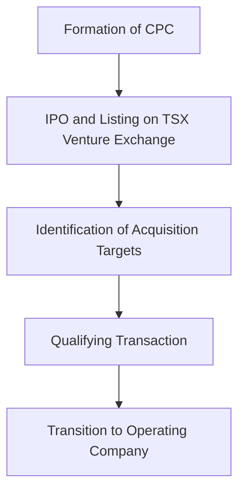

## 12.4.2 Capital Pool Company (CPC) Program

The Capital Pool Company (CPC) Program is a distinctive Canadian initiative designed to facilitate the access of emerging businesses to capital markets. This program, pioneered by the TSX Venture Exchange, provides a streamlined pathway for small and medium-sized enterprises (SMEs) to secure the necessary funding and achieve public listing. By understanding the CPC Program, investors and entrepreneurs can leverage this opportunity to foster growth and innovation within the Canadian market.

### Purpose of CPCs

The primary purpose of Capital Pool Companies is to bridge the gap between private enterprises and public capital markets. CPCs offer a structured mechanism for emerging businesses to raise capital and gain public exposure without the complexities and costs associated with traditional initial public offerings (IPOs). This program is particularly beneficial for companies that have strong growth potential but lack the financial resources or market presence to attract significant investment independently.

CPCs serve as a vehicle for funding, enabling entrepreneurs to focus on business development while leveraging the expertise and networks of experienced investors. By participating in the CPC Program, businesses can access a broader investor base, enhance their credibility, and accelerate their growth trajectory.

### Two-Stage Process

The CPC Program operates through a two-stage process, which involves the initial formation and listing of a CPC, followed by the acquisition of business assets or a target company. This structured approach ensures that both investors and entrepreneurs can navigate the complexities of capital markets with greater ease and confidence.

#### Stage 1: Formation and Listing of a CPC

The first stage involves the creation of a Capital Pool Company by a group of experienced directors and officers. These individuals, often seasoned entrepreneurs or industry experts, form a CPC with the sole purpose of raising capital through an initial public offering (IPO) on the TSX Venture Exchange. The funds raised during this stage are used to identify and evaluate potential acquisition targets.

Key steps in this stage include:

1. **Incorporation and Initial Public Offering (IPO):** The CPC is incorporated and prepares a prospectus for its IPO. The prospectus outlines the company's objectives, management team, and intended use of funds. The IPO typically raises between $200,000 and $4,750,000.

2. **Listing on the TSX Venture Exchange:** Once the IPO is complete, the CPC is listed on the TSX Venture Exchange. At this point, the CPC has no commercial operations or assets other than cash.

3. **Identification of Acquisition Targets:** With the funds raised, the CPC's management team begins the search for a suitable business or assets to acquire. This stage requires due diligence and strategic planning to ensure the acquisition aligns with the CPC's objectives and investor expectations.

#### Stage 2: Qualifying Transaction

The second stage involves the completion of a "Qualifying Transaction," where the CPC acquires significant business assets or a target company. This transaction transforms the CPC into an operating company with commercial activities, effectively completing its transition from a capital pool to a publicly listed entity.

Key steps in this stage include:

1. **Selection of Target Business:** The CPC identifies a target business that meets the criteria for a Qualifying Transaction. This business should have strong growth potential and align with the CPC's strategic goals.

2. **Negotiation and Approval:** The CPC negotiates the terms of the acquisition with the target business. The transaction must be approved by the CPC's shareholders and the TSX Venture Exchange.

3. **Completion of the Acquisition:** Once approved, the acquisition is completed, and the CPC transitions into an operating company. The newly formed entity is now publicly listed, providing it with access to additional capital and market opportunities.

### Example of a CPC Acquisition

To illustrate the CPC process, consider the hypothetical example of "Tech Innovators CPC," a Capital Pool Company formed by a group of technology industry veterans. Tech Innovators CPC raises $3 million through its IPO on the TSX Venture Exchange, with the goal of acquiring a promising technology startup.

After an extensive search, Tech Innovators CPC identifies "GreenTech Solutions," a startup specializing in renewable energy technologies. GreenTech Solutions has developed a patented solar panel technology with significant market potential.

The CPC's management team negotiates an acquisition deal with GreenTech Solutions, valuing the startup at $10 million. The deal involves a combination of cash and shares, with the CPC's shareholders approving the transaction.

Upon completion of the acquisition, Tech Innovators CPC transitions into "GreenTech Innovations Inc.," a publicly listed company with commercial operations. The new entity benefits from increased visibility, access to capital, and the expertise of its management team, positioning it for future growth and expansion.

### Glossary

- **Capital Pool Company (CPC):** A vehicle for funding emerging businesses through an initial listing, followed by the acquisition of significant assets or businesses.

### Diagrams and Visuals

To enhance understanding, the following diagram illustrates the CPC process:

### Best Practices and Challenges

**Best Practices:**

- **Experienced Management:** Ensure the CPC is managed by individuals with industry expertise and a strong track record.
- **Thorough Due Diligence:** Conduct comprehensive due diligence on potential acquisition targets to mitigate risks.
- **Clear Strategic Vision:** Align the CPC's objectives with the target business's growth potential and market opportunities.

**Common Challenges:**

- **Market Volatility:** Fluctuations in market conditions can impact the CPC's ability to raise capital and complete acquisitions.
- **Regulatory Compliance:** Navigating the regulatory requirements of the TSX Venture Exchange and securities laws can be complex.

### Conclusion

The Capital Pool Company (CPC) Program offers a unique and effective pathway for emerging businesses to access capital markets and achieve public listing. By understanding the two-stage process and leveraging the expertise of experienced investors, entrepreneurs can unlock new opportunities for growth and innovation. As the Canadian market continues to evolve, the CPC Program remains a vital tool for fostering entrepreneurship and economic development.

## Quiz Time!



### What is the primary purpose of a Capital Pool Company (CPC)?

- [x] To facilitate access to capital markets for emerging businesses
- [ ] To provide loans to small businesses
- [ ] To manage investment portfolios for large corporations
- [ ] To offer financial advisory services

> **Explanation:** The primary purpose of a CPC is to facilitate access to capital markets for emerging businesses by providing a structured mechanism for raising capital and achieving public listing.

### What is the first stage in the CPC process?

- [x] Formation and listing of a CPC
- [ ] Acquisition of a target business
- [ ] Distribution of dividends to shareholders
- [ ] Launch of commercial operations

> **Explanation:** The first stage in the CPC process involves the formation and listing of a CPC on the TSX Venture Exchange through an IPO.

### What is a Qualifying Transaction in the context of a CPC?

- [x] The acquisition of significant business assets or a target company
- [ ] The initial public offering of a CPC
- [ ] The distribution of profits to shareholders
- [ ] The dissolution of a CPC

> **Explanation:** A Qualifying Transaction refers to the acquisition of significant business assets or a target company, transforming the CPC into an operating company.

### Which exchange is primarily associated with the CPC Program?

- [x] TSX Venture Exchange
- [ ] New York Stock Exchange
- [ ] NASDAQ
- [ ] London Stock Exchange

> **Explanation:** The CPC Program is primarily associated with the TSX Venture Exchange, where CPCs are listed and traded.

### What is a key benefit of the CPC Program for emerging businesses?

- [x] Access to a broader investor base
- [ ] Guaranteed profits
- [ ] Exemption from regulatory compliance
- [ ] Immediate market dominance

> **Explanation:** A key benefit of the CPC Program for emerging businesses is access to a broader investor base, enhancing their ability to raise capital and grow.

### What is the typical range of funds raised during a CPC's IPO?

- [x] $200,000 to $4,750,000
- [ ] $10,000 to $50,000
- [ ] $5,000,000 to $10,000,000
- [ ] $1,000,000 to $2,000,000

> **Explanation:** During a CPC's IPO, the typical range of funds raised is between $200,000 and $4,750,000.

### What is a common challenge faced by CPCs?

- [x] Market volatility
- [ ] Lack of management expertise
- [ ] Excessive profitability
- [ ] Overregulation

> **Explanation:** Market volatility is a common challenge faced by CPCs, as it can impact their ability to raise capital and complete acquisitions.

### What is a best practice for managing a CPC?

- [x] Ensuring experienced management
- [ ] Prioritizing short-term profits
- [ ] Avoiding regulatory compliance
- [ ] Limiting investor communication

> **Explanation:** Ensuring experienced management is a best practice for managing a CPC, as it provides the expertise needed to navigate the complexities of capital markets.

### What happens after a CPC completes a Qualifying Transaction?

- [x] It transitions into an operating company
- [ ] It dissolves and returns funds to investors
- [ ] It launches a new IPO
- [ ] It distributes dividends to shareholders

> **Explanation:** After completing a Qualifying Transaction, a CPC transitions into an operating company with commercial activities.

### True or False: The CPC Program is unique to the Canadian market.

- [x] True
- [ ] False

> **Explanation:** True. The CPC Program is a unique initiative within the Canadian market, designed to facilitate access to capital markets for emerging businesses.


