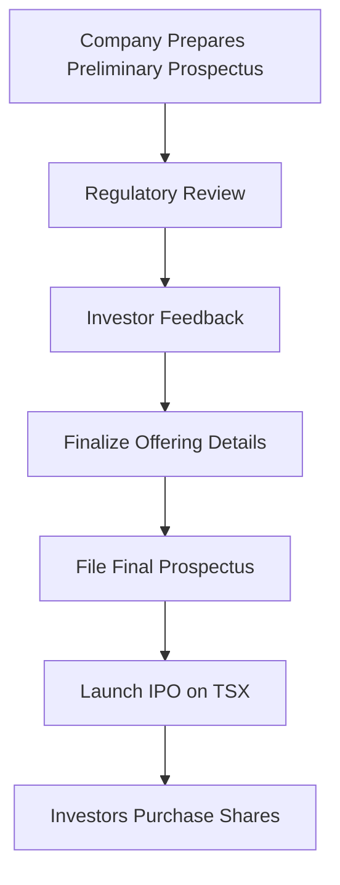

---

linkTitle: "12.3 Bringing Securities to the Market"
title: "Bringing Securities to the Market: A Comprehensive Guide to Issuing and Trading Securities"
description: "Explore the intricacies of bringing securities to the market, focusing on the prospectus system, issuance of new securities, and trading existing ones within the Canadian financial landscape."
categories:
- Finance
- Investment
- Securities
tags:
- Securities Market
- Prospectus
- Canadian Finance
- Investment Strategies
- Regulatory Compliance
date: 2024-10-25
type: docs
nav_weight: 1240000
canonical: "https://securitiesexamsmastery.ca/13/12/4"
license: "© 2023 Tokenizer Inc. CC BY-NC-SA 4.0"
---

## 12.3 Bringing Securities to the Market

Bringing securities to the market is a pivotal process in the financial ecosystem, facilitating capital formation and investment opportunities. This section delves into the intricacies of the prospectus system, the issuance of new securities, and the trading of existing ones, with a focus on the Canadian financial landscape.

### The Prospectus System: Ensuring Full Disclosure

The prospectus system is a cornerstone of securities regulation, designed to ensure full disclosure and protect investors. In Canada, the prospectus serves as a comprehensive document that provides potential investors with essential information about a security offering. This transparency is crucial for informed investment decisions and maintaining market integrity.

#### Key Components of the Prospectus System

1. **Full Disclosure:** The prospectus must disclose all material facts about the security and the issuer. This includes financial statements, management information, and details about the offering.

2. **Regulatory Oversight:** The Canadian Securities Administrators (CSA) oversee the prospectus system, ensuring compliance with securities laws and regulations.

3. **Investor Protection:** By mandating full disclosure, the prospectus system protects investors from fraudulent or misleading information.

### Issuing New Securities vs. Trading Existing Ones

The process of bringing securities to the market can be broadly categorized into two activities: issuing new securities and trading existing ones.

#### Issuing New Securities

Issuing new securities involves creating and selling new financial instruments to raise capital. This process is typically undertaken by companies seeking to expand operations, fund new projects, or refinance existing debt. The issuance of new securities can take several forms, including:

- **Initial Public Offerings (IPOs):** When a company offers its shares to the public for the first time.
- **Secondary Offerings:** Additional shares offered by a company that is already publicly traded.
- **Debt Issuances:** Companies may issue bonds or other debt instruments to raise funds.

The issuance process is governed by stringent regulatory requirements to ensure transparency and protect investors.

#### Trading Existing Securities

Once securities are issued, they can be traded on secondary markets. This trading provides liquidity, enabling investors to buy and sell securities with ease. Key aspects of trading existing securities include:

- **Stock Exchanges:** Platforms like the Toronto Stock Exchange (TSX) facilitate the trading of stocks and other securities.
- **Over-the-Counter (OTC) Markets:** Securities not listed on formal exchanges can be traded OTC, offering flexibility but often with less transparency.

### Preliminary and Final Prospectus Requirements

The prospectus process involves two critical stages: the preliminary prospectus and the final prospectus.

#### Preliminary Prospectus (Red Herring)

The preliminary prospectus, often referred to as a "red herring," is the initial document filed with securities regulators. It provides a broad overview of the offering but lacks final details such as pricing and the number of securities to be issued. Key features include:

- **Purpose:** To gauge investor interest and provide preliminary information.
- **Content:** Includes basic information about the issuer, the offering, and potential risks.
- **Regulatory Review:** Subject to review by securities regulators to ensure compliance with disclosure requirements.

#### Final Prospectus

The final prospectus is the completed document that contains all material facts about the offering. It is the definitive source of information for investors and includes:

- **Pricing Details:** Final pricing and the number of securities offered.
- **Comprehensive Disclosure:** Detailed financial information, management profiles, and risk factors.
- **Legal Compliance:** Must meet all regulatory requirements before securities can be sold to the public.

### Practical Example: A Canadian IPO

Consider a Canadian technology company, TechInnovate Inc., planning to go public. The company begins by preparing a preliminary prospectus, outlining its business model, financial performance, and growth prospects. After regulatory review and investor feedback, TechInnovate finalizes its offering details and files a final prospectus. The IPO is launched on the TSX, allowing investors to purchase shares and participate in the company's growth.

### Diagrams and Visual Aids

To enhance understanding, let's visualize the process of bringing securities to the market:

### Best Practices and Common Challenges

**Best Practices:**

- **Thorough Preparation:** Companies should ensure all material facts are accurately disclosed in the prospectus.
- **Engage Experienced Advisors:** Legal and financial advisors can provide valuable guidance throughout the process.
- **Maintain Transparency:** Clear communication with investors builds trust and enhances market reputation.

**Common Challenges:**

- **Regulatory Compliance:** Navigating complex regulations can be daunting for issuers.
- **Market Conditions:** Volatile market conditions can impact the success of an offering.
- **Investor Relations:** Managing investor expectations and communication is crucial for long-term success.

### Conclusion

Bringing securities to the market is a multifaceted process that requires careful planning, regulatory compliance, and strategic execution. By understanding the prospectus system and the nuances of issuing and trading securities, financial professionals can effectively navigate the Canadian securities landscape.

### **Ready to Test Your Knowledge?**

**Practice 10 Essential CSC Exam Questions to Master Your Certification**



### What is the primary purpose of the prospectus system?

- [x] To ensure full disclosure and protect investors
- [ ] To increase company profits
- [ ] To reduce regulatory oversight
- [ ] To limit market access

> **Explanation:** The prospectus system is designed to ensure full disclosure of material facts, thereby protecting investors.

### Which document is filed first in the securities issuance process?

- [x] Preliminary prospectus
- [ ] Final prospectus
- [ ] Financial statement
- [ ] Annual report

> **Explanation:** The preliminary prospectus, or "red herring," is filed first to provide initial information about the offering.

### What is the main difference between issuing new securities and trading existing ones?

- [x] Issuing involves creating new securities; trading involves buying and selling existing ones
- [ ] Issuing is less regulated than trading
- [ ] Trading is only for private companies
- [ ] Issuing is only for debt instruments

> **Explanation:** Issuing new securities involves creating and selling new financial instruments, while trading involves the exchange of existing securities.

### What is included in the final prospectus?

- [x] Pricing details and comprehensive disclosure
- [ ] Only basic company information
- [ ] Preliminary financial estimates
- [ ] Confidential company data

> **Explanation:** The final prospectus includes detailed information such as pricing, financials, and risk factors.

### What is a common challenge when bringing securities to the market?

- [x] Navigating regulatory compliance
- [ ] Finding investors
- [ ] Reducing company size
- [ ] Avoiding market exposure

> **Explanation:** Regulatory compliance is a common challenge due to the complexity of securities laws.

### What role do stock exchanges play in trading existing securities?

- [x] They facilitate the buying and selling of securities
- [ ] They create new securities
- [ ] They regulate company profits
- [ ] They limit investor access

> **Explanation:** Stock exchanges provide a platform for the trading of securities, offering liquidity and transparency.

### What is a "red herring"?

- [x] A preliminary prospectus
- [ ] A final prospectus
- [ ] A type of bond
- [ ] A stock exchange

> **Explanation:** A "red herring" is the term used for a preliminary prospectus filed before final details are determined.

### Why is transparency important in the prospectus system?

- [x] It builds investor trust and ensures informed decisions
- [ ] It increases company profits
- [ ] It reduces regulatory requirements
- [ ] It limits market competition

> **Explanation:** Transparency is crucial for building trust and enabling investors to make informed decisions.

### What is a secondary offering?

- [x] Additional shares offered by a publicly traded company
- [ ] The first sale of a company's stock to the public
- [ ] A type of bond issuance
- [ ] A private equity investment

> **Explanation:** A secondary offering involves a publicly traded company issuing additional shares to raise capital.

### True or False: The final prospectus is filed before the preliminary prospectus.

- [ ] True
- [x] False

> **Explanation:** The preliminary prospectus is filed first, followed by the final prospectus after finalizing offering details.


