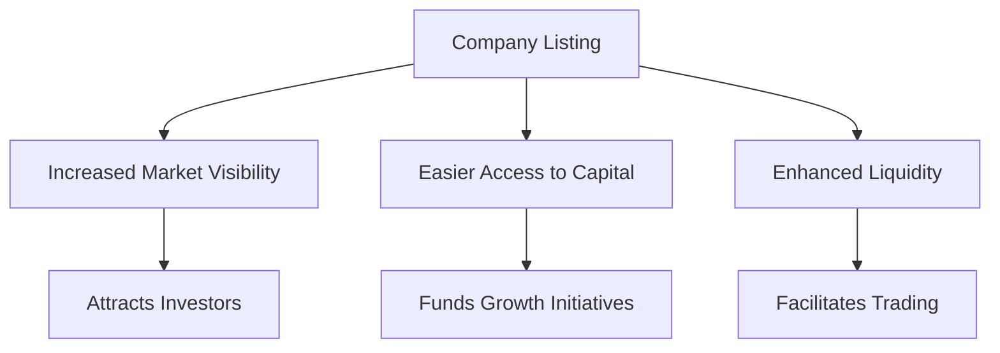

## 12.5.1 Advantages and Disadvantages of Listing

Listing a company on a stock exchange is a significant milestone that can offer numerous benefits but also presents several challenges. This section explores the advantages and disadvantages of listing securities, particularly within the Canadian context, providing insights into the strategic considerations companies must weigh.

### Benefits of Listing

#### Prestige and Market Visibility

One of the primary advantages of listing is the prestige and enhanced market visibility it confers. Being listed on a major exchange like the Toronto Stock Exchange (TSX) signals to investors, customers, and competitors that a company has reached a level of maturity and stability. This visibility can lead to increased media coverage and analyst attention, which can further enhance a company's reputation and attract potential investors.

#### Easier Access to Capital Markets

Listing provides companies with easier access to capital markets, enabling them to raise funds more efficiently through the issuance of new shares. This access is crucial for financing growth initiatives, such as expanding operations, investing in research and development, or acquiring other businesses. For example, Canadian companies like Shopify have leveraged their public listing to raise significant capital, fueling their expansion and innovation efforts.

#### Enhanced Liquidity for Shareholders

Liquidity refers to the ease with which a security can be bought or sold in the market without affecting its price. Listing on a stock exchange enhances liquidity for shareholders, providing them with the ability to easily buy or sell shares. This liquidity can attract a broader range of investors, including institutional investors who require liquid markets to manage their portfolios effectively.

### Challenges of Listing

#### Increased Regulatory Requirements

Listing on a stock exchange subjects a company to stringent regulatory requirements. In Canada, companies must comply with the rules set by the Canadian Securities Administrators (CSA) and the specific exchange on which they are listed. These regulations include regular financial reporting, disclosure of material information, and adherence to corporate governance standards. Compliance can be resource-intensive, requiring dedicated personnel and systems to ensure ongoing adherence.

#### Higher Costs of Compliance

The costs associated with maintaining a public listing can be substantial. These include fees for listing and maintaining the listing, costs related to regulatory compliance, and expenses for investor relations activities. Additionally, companies may incur costs for auditing, legal services, and financial advisory services. For smaller companies, these costs can be a significant burden, potentially outweighing the benefits of being listed.

#### Potential Loss of Managerial Control

Going public often results in a dilution of ownership, which can lead to a loss of managerial control. Shareholders, particularly institutional investors, may exert pressure on management to focus on short-term financial performance rather than long-term strategic goals. This pressure can lead to conflicts between management and shareholders, potentially impacting the company's strategic direction.

### Case Example

#### Success Story: Shopify

Shopify, a Canadian e-commerce company, is a prime example of a company that has benefited from listing. Since its initial public offering (IPO) on the TSX in 2015, Shopify has experienced significant growth, leveraging the capital raised to expand its platform and services globally. The increased market visibility and liquidity have attracted a diverse investor base, contributing to its robust market performance.

#### Challenges Faced: BlackBerry

Conversely, BlackBerry, once a leader in mobile technology, faced challenges post-listing. Despite the initial prestige and capital raised, BlackBerry struggled with increased competition and market shifts. The regulatory requirements and pressure from shareholders to deliver short-term results hindered its ability to pivot quickly, contributing to its decline in market share.

### Glossary

- **Liquidity:** The ease with which a security can be bought or sold in the market without affecting its price.
- **Market Visibility:** The degree to which a company’s securities are visible and recognized in the market.

### Conclusion

Listing a company on a stock exchange offers both significant advantages and notable challenges. While the prestige, market visibility, and access to capital can drive growth and expansion, the increased regulatory requirements, costs, and potential loss of control must be carefully managed. Companies considering listing must weigh these factors and develop strategies to maximize the benefits while mitigating the challenges.

## Quiz Time!



### What is one of the primary advantages of listing a company on a stock exchange?

- [x] Enhanced market visibility
- [ ] Reduced regulatory requirements
- [ ] Decreased operational costs
- [ ] Increased managerial control

> **Explanation:** Listing on a stock exchange enhances a company's market visibility, attracting investors and media attention.

### Which Canadian company is an example of benefiting from listing?

- [x] Shopify
- [ ] BlackBerry
- [ ] Nortel Networks
- [ ] Bombardier

> **Explanation:** Shopify has leveraged its public listing to raise capital and expand its operations globally.

### What is a potential disadvantage of listing a company?

- [x] Increased regulatory requirements
- [ ] Easier access to capital
- [ ] Enhanced liquidity
- [ ] Improved market visibility

> **Explanation:** Listing subjects a company to stringent regulatory requirements, which can be resource-intensive.

### What does liquidity refer to in the context of listing?

- [x] The ease with which a security can be bought or sold without affecting its price
- [ ] The ability to raise capital quickly
- [ ] The degree of market visibility
- [ ] The level of managerial control

> **Explanation:** Liquidity refers to how easily a security can be traded in the market without impacting its price.

### Which of the following is a cost associated with maintaining a public listing?

- [x] Regulatory compliance costs
- [ ] Reduced access to capital
- [ ] Decreased market visibility
- [ ] Increased managerial control

> **Explanation:** Maintaining a public listing involves costs related to regulatory compliance, auditing, and investor relations.

### What can listing on a stock exchange lead to in terms of managerial control?

- [x] Potential loss of managerial control
- [ ] Increased managerial control
- [ ] Reduced shareholder influence
- [ ] Enhanced strategic autonomy

> **Explanation:** Listing can dilute ownership, leading to potential loss of managerial control due to shareholder influence.

### What is one benefit of enhanced liquidity for shareholders?

- [x] Easier buying and selling of shares
- [ ] Increased regulatory requirements
- [ ] Higher compliance costs
- [ ] Reduced market visibility

> **Explanation:** Enhanced liquidity allows shareholders to buy and sell shares more easily in the market.

### Which company faced challenges post-listing due to market shifts?

- [x] BlackBerry
- [ ] Shopify
- [ ] Amazon
- [ ] Tesla

> **Explanation:** BlackBerry faced challenges due to increased competition and market shifts after listing.

### What is a key consideration for companies thinking about listing?

- [x] Balancing benefits and challenges
- [ ] Avoiding market visibility
- [ ] Reducing liquidity
- [ ] Eliminating regulatory compliance

> **Explanation:** Companies must weigh the benefits of listing against the challenges to make informed decisions.

### True or False: Listing a company guarantees long-term success.

- [ ] True
- [x] False

> **Explanation:** While listing offers benefits, it does not guarantee long-term success and requires careful management.


